# StableHLO

Official Documentation: <https://openxla.org/stablehlo>

<picture>
  <source media="(prefers-color-scheme: dark)" srcset="docs/images/assets/stablehlo_ecosystem_dark.svg">
  
</picture>

StableHLO is an operation set for high-level operations (HLO) in machine
learning (ML) models. Essentially, it's a portability layer between different
ML frameworks and ML compilers: ML frameworks that produce StableHLO programs
are compatible with ML compilers that consume StableHLO programs.

Our goal is to simplify and accelerate ML development by creating more
interoperability between various ML frameworks (such as TensorFlow, JAX and
PyTorch) and ML compilers (such as XLA and IREE).

StableHLO is based on the MHLO dialect and enhances it with additional
functionality, including serialization and versioning. We use MLIR bytecode
as [serialization format](docs/bytecode.md) and provide [backward and forward
compatibility](docs/compatibility.md) guarantees. This ensures compatibility
between frameworks and compilers, even as StableHLO continues to evolve.

This repository includes the [StableHLO specification](docs/spec.md)
along with an MLIR-based implementation in C++ and Python, which you can use to
define StableHLO programs for consumption by compilers such as XLA and IREE, as
well as on-device use via [Google AI Edge](https://github.com/google-ai-edge/).

## Build instructions

Here's how to build the StableHLO repo on Linux or macOS:

1. CMake is our primary build tool, so before you begin make sure that
   you have CMake and Ninja installed.

   If you're using Linux, we recommend installing `lld` as well - we have
   observed it to be noticeably faster than alternatives on our typical software
   and hardware configurations.

   ```sh
   # On Linux
   sudo apt install cmake ninja-build lld

   # On macOS
   brew install cmake ninja
   ```

2. Set the `LLVM_ENABLE_LLD` shell variable depending on your preferences. We
   recommend setting it to `ON` on Linux and to `OFF` on macOS.

   ```sh
   [[ "$(uname)" != "Darwin" ]] && LLVM_ENABLE_LLD="ON" || LLVM_ENABLE_LLD="OFF"
   ```

3. Clone the StableHLO repo and the LLVM repository:

   ```sh
   git clone https://github.com/openxla/stablehlo
   ```

   ```sh
   cd stablehlo && git clone https://github.com/llvm/llvm-project.git
   ```

   Cloning the LLVM repository may take a few minutes.

4. Make sure you check out the correct commit in the LLVM repository:

   ```sh
   (cd llvm-project && git fetch && git checkout $(cat ../build_tools/llvm_version.txt))
   ```

   You need to do this every time `llvm_version.txt` changes.

5. Configure and build MLIR:

   ```sh
   MLIR_ENABLE_BINDINGS_PYTHON=OFF build_tools/build_mlir.sh ${PWD}/llvm-project/ ${PWD}/llvm-build
   ```

   This will take a considerable amount of time. For example, on a MacBook Pro
   with an M1 Pro chip, building MLIR took around 10 minutes at the moment
   of writing.

   Again, you need to do this every time `llvm_version.txt` changes.

6. Build StableHLO as a standalone library:

   ```sh
   mkdir -p build && cd build

   cmake .. -GNinja \
     -DLLVM_ENABLE_LLD="$LLVM_ENABLE_LLD" \
     -DCMAKE_BUILD_TYPE=Release \
     -DLLVM_ENABLE_ASSERTIONS=ON \
     -DSTABLEHLO_ENABLE_BINDINGS_PYTHON=OFF \
     -DMLIR_DIR=${PWD}/../llvm-build/lib/cmake/mlir

   cmake --build .
   ```

   If you are actively developing StableHLO, you may want the following additional
   CMake settings:

   ```sh
   cmake .. -GNinja \
     -DSTABLEHLO_ENABLE_LLD=ON \
     -DCMAKE_BUILD_TYPE=RelWithDebInfo \
     -DLLVM_ENABLE_ASSERTIONS=ON \
     -DSTABLEHLO_ENABLE_BINDINGS_PYTHON=OFF \
     -DSTABLEHLO_ENABLE_SPLIT_DWARF=ON \
     -DCMAKE_CXX_COMPILER_LAUNCHER=ccache \
     -DCMAKE_C_COMPILER_LAUNCHER=ccache \
     -DCMAKE_EXPORT_COMPILE_COMMANDS=ON \
     -DSTABLEHLO_ENABLE_SANITIZER=address \
     -DMLIR_DIR=${PWD}/../llvm-build/lib/cmake/mlir

   cmake --build .
   ```

      This will enable debug symbols and ccache, which can speed up incremental
      builds. It also creates a GDB index file in the binary to speed up
      debugging.

      If you build MLIR using the script above it should also set by default
      `LLVM_USE_SPLIT_DWARF` which does the majority of the size saving for
      the binary and should also be set.

7. Now you can make sure it works by running some tests:

   ```sh
   ninja check-stablehlo-tests
   ```

   You should see results like this:

   ```txt
   Testing Time: 5.99s
     Passed: 47
   ```

   This runs all the tests in `stablehlo/tests/`.

## Python

If you'd like to build the Python bindings, you'll need to install a few
additional dependencies.

```sh
pip install -r ./llvm-project/mlir/python/requirements.txt
```

Then build StableHLO with python bindings enabled:

```sh
STABLEHLO_ENABLE_BINDINGS_PYTHON=ON ./build_tools/github_actions/ci_build_cmake.sh ${PWD}/llvm-build ${PWD}/build
```

After you have built the project you can import the Python bindings to begin
by modifying your Python path variable

```shell
$ PYTHONPATH="./build/python_packages/stablehlo" python3
Python 3.11.6 (main, Oct  8 2023, 05:06:43) [GCC 13.2.0] on linux
Type "help", "copyright", "credits" or "license" for more information.
>>> import mlir.dialects.stablehlo
>>> from mlir.ir import Context, Location
>>> import mlir.dialects.arith
```

You can also build a wheel yourself using the `setup.py` file.
We also make nightly wheels available on our GitHub Releases page.

```shell
pip install stablehlo -f https://github.com/openxla/stablehlo/releases/expanded_assets/dev-wheels
```

## StableHLO to TensorFlow SavedModel

This repository offers tooling for the conversion of a StableHLO program,
including its metadata (representing trained weights and biases), into a
TensorFlow SavedModel. Please refer to
[README.md](https://github.com/openxla/stablehlo/blob/main/stablehlo/integrations/python/stablehlo/savedmodel/README.md)
for details.

## Community

Building an amazing portability layer between ML frameworks and ML compilers
requires collaboration across the whole ML industry, so we're happy to have
your help on the StableHLO project.

We're using GitHub issues / pull requests to organize development and
[openxla-discuss](https://groups.google.com/a/openxla.org/g/openxla-discuss/)
to have longer discussions. We also have a `#stablehlo`
channel on [the OpenXLA Discord server](https://discord.gg/PeWUTaecrA).
