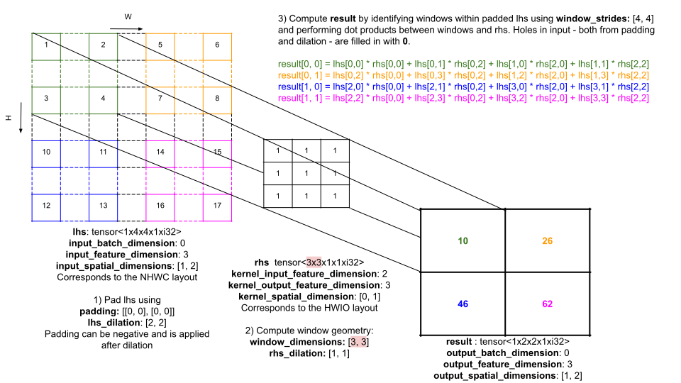
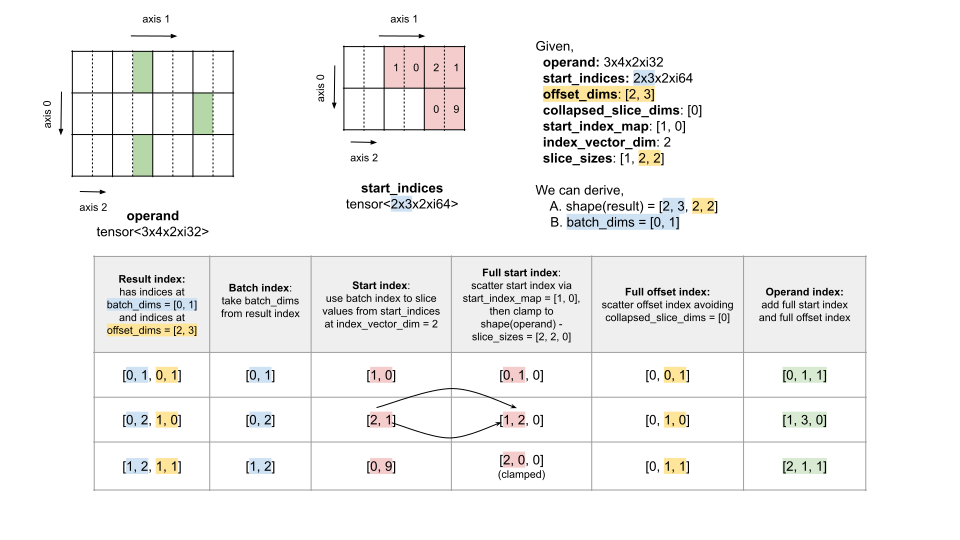
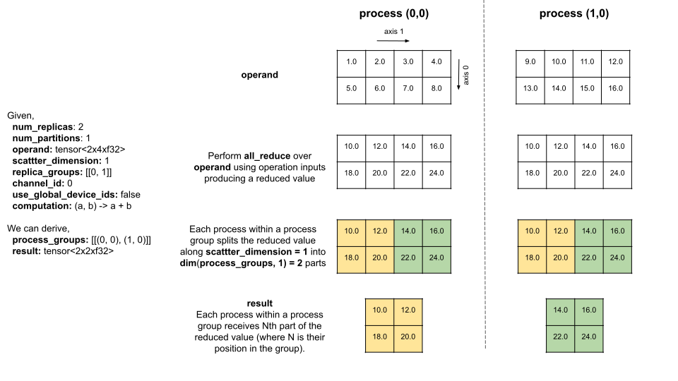
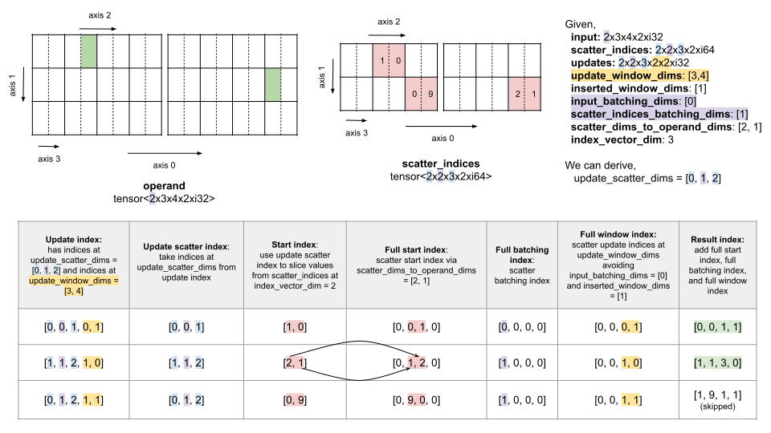

# StableHLO Specification

StableHLO is an operation set for high-level operations (HLO) in machine
learning (ML) models. StableHLO works as a portability layer between different
ML frameworks and ML compilers: ML frameworks that produce StableHLO programs
are compatible with ML compilers that consume StableHLO programs.

Our goal is to simplify and accelerate ML development by creating more
interoperability between various ML frameworks (such as TensorFlow, JAX and
PyTorch) and ML compilers (such as XLA and IREE). Towards that end, this
document provides a specification for the StableHLO programming language.

This specification contains three major sections. First, the "Programs" section
describes the structure of StableHLO programs which consist of StableHLO
functions which themselves consist of StableHLO ops. Within that structure, the
"Ops" section specifies semantics of individual ops. Finally, the "Execution"
section provides semantics for all these ops executing together within
a program.

## Programs

```ebnf
Program ::= {Func}
```

**StableHLO programs** consist of an arbitrary number of StableHLO functions.
Below is an example program with a function `@main` which has 3 inputs
(`%image`, `%weights` and `%bias`) and 1 output. The body of the function
has 6 ops.

```mlir
stablehlo.func @main(
  %image: tensor<28x28xf32>,
  %weights: tensor<784x10xf32>,
  %bias: tensor<1x10xf32>
) -> tensor<1x10xf32> {
  %0 = "stablehlo.reshape"(%image) : (tensor<28x28xf32>) -> tensor<1x784xf32>
  %1 = "stablehlo.dot"(%0, %weights) : (tensor<1x784xf32>, tensor<784x10xf32>) -> tensor<1x10xf32>
  %2 = "stablehlo.add"(%1, %bias) : (tensor<1x10xf32>, tensor<1x10xf32>) -> tensor<1x10xf32>
  %3 = "stablehlo.constant"() { value = dense<0.0> : tensor<1x10xf32> } : () -> tensor<1x10xf32>
  %4 = "stablehlo.maximum"(%2, %3) : (tensor<1x10xf32>, tensor<1x10xf32>) -> tensor<1x10xf32>
  "stablehlo.return"(%4): (tensor<1x10xf32>) -> ()
}
```

### Functions

```ebnf
Func        ::= 'stablehlo' '.' 'func' FuncId FuncInputs FuncOutputs '{' FuncBody '}'
FuncInputs  ::= '(' [FuncInput {',' FuncInput}] `)`
FuncInput   ::= '%' ValueId ':' ValueType
FuncOutputs ::= ['->' FuncOutput, {',' FuncOutput}]
FuncOutput  ::= ValueType
FuncBody    ::= {Op}
```

**StableHLO functions** (which are also called **named functions**) have
an identifier, inputs/outputs and a body. In the future, we are planning to
introduce additional metadata for functions to achieve better compatibility
with HLO ([#425](https://github.com/openxla/stablehlo/issues/425),
[#626](https://github.com/openxla/stablehlo/issues/626),
[#740](https://github.com/openxla/stablehlo/issues/740),
[#744](https://github.com/openxla/stablehlo/issues/744)).

### Identifiers

```ebnf
FuncId  ::= '@' letter {letter | digit}
ValueId ::= '%' digit {digit}
          | '%' letter {letter | digit}
letter  ::= 'a' | ... | 'z' | 'A' | ... | 'Z' | '_'
digit   ::= '0' | ... | '9'
```

**StableHLO identifiers** are similar to identifiers in many programming
languages, with two peculiarities: 1) all identifiers have sigils which
distinguish different kinds of identifiers, 2) value identifiers can be
completely numeric to simplify generation of StableHLO programs.

### Types

```ebnf
Type         ::= ValueType | NonValueType
ValueType    ::= TensorType | TokenType | TupleType
NonValueType ::= ElementType | FunctionType | StringType
```

**StableHLO types** are categorized into **value types** (which are also called
**first-class types**) which represent StableHLO values and **non-value types**
which describe other program elements. StableHLO types are similar to types in
many programming languages, with the main peculiarity being StableHLO's
domain-specific nature which results in some unusual outcomes (e.g. scalar types
are not value types).

```ebnf
TensorType    ::= 'tensor' '<' TensorShape ElementType '>'
TensorShape   ::= {DimensionSize 'x'}
DimensionSize ::= digit {digit}
```

**Tensor types** represent tensors, i.e. multidimensional arrays. They have a
**shape** and an **element type**, where a shape represents non-negative
**dimension sizes** in the ascending order of the corresponding **dimensions**
(which are also called **axes**) numbered from `0` to `R-1`. The number of
dimensions `R` is called **rank**. For example, `tensor<2x3xf32>` is a tensor
type with shape `2x3` and element type `f32`. It has two dimensions (or,
in other words, two axes) - 0th dimension and 1st dimension - whose sizes are
2 and 3. Its rank is 2.

This defines support for **static shapes** where dimension sizes are statically
known. In the future, we are planning to also introduce support for
**dynamic shapes** where dimension sizes are either partially or fully unknown
([#8](https://github.com/openxla/stablehlo/issues/8)). Furthermore, we are
planning to explore extending tensor types beyond dimension sizes and element
types, for example, to include layouts
([#629](https://github.com/openxla/stablehlo/issues/629)) and sparsity
([#1078](https://github.com/openxla/stablehlo/issues/1078)).

```ebnf
TokenType ::= 'token'
```

**Token types** represent tokens, i.e. opaque values produced and consumed
by some operations. Tokens are used for imposing execution order on operations
as described in the "Execution" section.

```ebnf
TupleType ::= 'tuple' '<' [ValueType {',' ValueType}] '>'
```

**Tuple types** represent tuples, i.e. heterogeneous lists. Tuples are a legacy
feature which only exists for compatibility with HLO. In HLO, tuples are
used to represent variadic inputs and outputs. In StableHLO, variadic inputs and
outputs are supported natively, and the only use of tuples in StableHLO is to
comprehensively represent HLO ABI where e.g. `T`, `tuple<T>` and
`tuple<tuple<T>>` may be materially different depending on a particular
implementation. In the future, we are planning to make changes to HLO ABI
which may allow us to remove tuple types from StableHLO
([#598](https://github.com/openxla/stablehlo/issues/598)).

```ebnf
ElementType ::= BooleanType | IntegerType | FloatType | ComplexType
BooleanType ::= 'i1'
IntegerType ::= 'si4' | 'si8' | 'si16' | 'si32' | 'si64'
              | 'ui4' | 'ui8' | 'ui16' | 'ui32' | 'ui64'
FloatType   ::= 'f8E4M3FN' | 'f8E5M2' | 'bf16' | 'f16' | 'f32' | 'f64'
ComplexType ::= 'complex' '<' ('f32' | 'f64') '>'
```

**Element types** represent elements of tensor types. Unlike in many programming
languages, these types are not first class in StableHLO. This means that
StableHLO programs cannot directly represent values of these types (as a result,
it is idiomatic to represent scalar values of type `T` with 0-dimensional tensor
values of type `tensor<T>`).

* **Boolean type** represents boolean values `true` and `false`.
* **Integer types** can be either signed (`si`) or unsigned (`ui`) and have
  one of the supported bit widths (`4`, `8`, `16`, `32` or `64`).
  Signed `siN` types represent integer values from `-2^(N-1)` to `2^(N-1)-1`
  inclusive, and unsigned `uiN` types represent integer values from `0` to
  `2^N-1` inclusive.
* **Floating-point types** can be one of the following:
  * `f8E4M3FN` and `f8E5M2` types corresponding to respectively the
    `E4M3` and `E5M2` encodings of the FP8 format described in
    [FP8 Formats for Deep Learning](https://arxiv.org/abs/2209.05433).
  * `bf16` type corresponding to the `bfloat16` format described in
    [BFloat16: The secret to high performance on Cloud TPUs](https://cloud.google.com/blog/products/ai-machine-learning/bfloat16-the-secret-to-high-performance-on-cloud-tpus).
  * `f16`, `f32` and `f64` types corresponding to respectively
    `binary16` ("half precision"), `binary32` ("single precision") and
    `binary64` ("double precision") formats described in
  [the IEEE 754 standard](https://ieeexplore.ieee.org/document/8766229).
* **Complex types** represent complex values that have a **real part**
  and an **imaginary part** of the same **element type**. Supported complex
  types are `complex<f32>` (both parts are of type `f32`) and `complex<f64>`
  (both parts are of type `f64`).
* In the future, we are also planning to introduce **quantized types** that
  represent integer values obtained via uniform quantization of floating-point
  values using given scales and zero points
  ([#588](https://github.com/openxla/stablehlo/issues/588)).

```ebnf
FunctionType ::= '(' [ValueType {',' ValueType}] ')' '->' '(' [ValueType {',' ValueType}] ')'
```

**Function types** represent both named and anonymous functions. They have
input types (the list of types on the left-hand side of `->`) and output types
(the list of types on the right-hand side of `->`). In many programming
languages, function types are first class, but not in StableHLO.

```ebnf
StringType ::= 'string'
```

**String type** represents sequences of bytes. Unlike in many programming
languages, string type is not first class in StableHLO and is only used to
specify static metadata for program elements.

### Operations

**StableHLO operations** (which are also called **ops**) represent a closed set
of high-level operations in machine learning models. As discussed above,
StableHLO syntax is heavily inspired by MLIR, which is not necessarily the most
ergonomic alternative, but is arguably the best fit for StableHLO's goal of
creating more interoperability between ML frameworks and ML compilers.

```ebnf
Op            ::= [OpOutputs] OpName OpInputs ':' OpSignature
OpName        ::= '"' 'stablehlo' '.' OpMnemonic '"'
OpMnemonic    ::= 'abs' | 'add' | ...
```

**StableHLO operations** (which are also called **ops**) have a name,
inputs/outputs and a signature. The name consists of the `stablehlo.` prefix and
a **mnemonic** which uniquely identifies one of the supported ops. See below for
a comprehensive list of all supported ops.

At the moment, StableHLO programs in the wild sometimes contain operations that
are not described in this document. In the future, we are planning to either
absorb these operations into the StableHLO opset or prohibit them from appearing
in StableHLO programs. In the meanwhile, here is the list of these operations:

* `builtin.module`, `func.func`, `func.call` and `func.return`
  ([#425](https://github.com/openxla/stablehlo/issues/425)).
* `chlo` operations ([#602](https://github.com/openxla/stablehlo/issues/602)).
* "Not in HLO" category of StableHLO operations - they were initially part of
  the StableHLO opset but have been later deemed to not fit it well:
  `broadcast`, `create_token`, `cross-replica-sum`, `dot`, `einsum`,
  `torch_index_select`, `unary_einsum`
  ([#3](https://github.com/openxla/stablehlo/issues/3)).
* "Dynamism" category of StableHLO operations - they were bootstrapped from
   MHLO, but we haven't specced them yet: `compute_reshape_shape`,
  `cstr_reshapable`, `dynamic_broadcast_in_dim`, `dynamic_conv`,
  `dynamic_gather`, `dynamic_iota`, `dynamic_pad`, `dynamic_reshape`,
  `real_dynamic_slice`, `set_dimension_size`
  ([#8](https://github.com/openxla/stablehlo/issues/8)).
* "Quantization" category of StableHLO operations - they were bootstrapped from
  MHLO, but we haven't specced them yet: `uniform_quantize`
  ([#531](https://github.com/openxla/stablehlo/issues/531)) and
  `uniform_dequantize`
  ([#530](https://github.com/openxla/stablehlo/issues/530)).
* Shape computations, including `arith`, `shape` and `tensor` operations
  ([#8](https://github.com/openxla/stablehlo/issues/8)).

```ebnf
OpInputs        ::= OpInputValues OpInputFuncs OpInputAttrs
OpInputValues   ::= '(' [OpInputValue {',' OpInputValue}] ')'
OpInputValue    ::= ValueId
OpInputFuncs    ::= ['(' OpInputFunc {',' OpInputFunc} ')']
OpInputAttrs    ::= ['{' OpInputAttr {',' OpInputAttr} '}']
OpOutputs       ::= [OpOutput {',' OpOutput} '=']
OpOutput        ::= ValueId
```

Ops consume **inputs** and produce **outputs**. Inputs are categorized into
input values (computed during execution), input functions (provided
statically, because in StableHLO functions are not first-class values) and
input attributes (also provided statically). The kind of inputs and outputs
consumed and produced by an op depends on its mnemonic. For example, the `add`
op consumes 2 input values and produces 1 output value. In comparison, the
`select_and_scatter` op consumes 3 input values, 2 input functions and
3 input attributes.

```ebnf
OpInputFunc ::= '{' Unused FuncInputs ':' FuncBody '}'
Unused      ::= '^' digit {digit}
              | '^' letter {letter | digit}
```

**Input functions** (which are also called **anonymous functions**) are very
similar to named functions except that: 1) they don't have an identifier (hence
the name "anonymous"), 2) they don't declare output types (output types are
inferred from the `return` op within the function).

The syntax for input functions includes a currently unused part (see the
`Unused` production above) which is there for compatibility with MLIR. In MLIR,
there is a more general concept of "regions" which can have multiple "blocks"
of ops connected together via jump ops. These blocks have ids which correspond
to the `Unused` production, so that they can be distinguished from each other.
StableHLO doesn't have jump ops, so the corresponding part of MLIR syntax is
unused (but is still there).

```ebnf
OpInputAttr      ::= OpInputAttrName '=' OpInputAttrValue
OpInputAttrName  ::= letter {letter | digit}
OpInputAttrValue ::= Constant
```

**Input attributes** have a name and a value which is one of the supported
constants. They are the primary way to specify static metadata for program
elements. For example, the `concatenate` op uses the attribute `dimension` to
specify the dimension along which its input values are concatenated. Similarly,
the `slice` op uses multiple attributes like `start_indices` and `limit_indices`
to specify the bounds that are used to slice the input value.

At the moment, StableHLO programs in the wild sometimes contain attributes
which are not described in this document. In the future, we are planning to
either absorb these attributes into the StableHLO opset or prohibit them from
appearing in StableHLO programs. In the meanwhile, here is the list of these
attributes:

* `layout` ([#629](https://github.com/openxla/stablehlo/issues/629)).
* `mhlo.frontend_attributes`
  ([#628](https://github.com/openxla/stablehlo/issues/628)).
* `mhlo.sharding` ([#619](https://github.com/openxla/stablehlo/issues/619)).
* `output_operand_aliases`
  ([#740](https://github.com/openxla/stablehlo/issues/740)).
* Location metadata ([#594](https://github.com/openxla/stablehlo/issues/594)).

```ebnf
OpSignature ::= '(' [ValueType {',' ValueType}] ')' '->' '(' [ValueType {',' ValueType}] ')'
```

**Op signature** consists of the types of all input values (the list of types on
the left-hand side of `->`) and the types of all output values (the list of
types on the right-hand side of `->`). Strictly speaking, input types are
redundant, and output types are almost always redundant as well (because for
most StableHLO ops, output types can be inferred from inputs). Nonetheless, op
signature is deliberately part of StableHLO syntax for compatibility with MLIR.

Below is an example op whose mnemonic is `select_and_scatter`. It consumes 3
input values (`%operand`, `%source` and `%init_value`), 2 input functions
and 3 input attributes (`window_dimensions`, `window_strides` and `padding`).
Note how the signature of the op only includes the types of its input values
(but not the types of input functions and attributes which are provided inline).

```mlir
%result = "stablehlo.select_and_scatter"(%operand, %source, %init_value) ({
  ^bb0(%arg0: tensor<i32>, %arg1: tensor<i32>):
    %0 = "stablehlo.compare"(%arg0, %arg1) {
      comparison_direction = #stablehlo<comparison_direction GE>
    } : (tensor<i32>, tensor<i32>) -> tensor<i1>
    "stablehlo.return"(%0) : (tensor<i1>) -> ()
}, {
  ^bb0(%arg0: tensor<i32>, %arg1: tensor<i32>):
    %0 = "stablehlo.add"(%arg0, %arg1) : (tensor<i32>, tensor<i32>) -> tensor<i32>
    "stablehlo.return"(%0) : (tensor<i32>) -> ()
}) {
  window_dimensions = dense<[3, 1]> : tensor<2xi64>,
  window_strides = dense<[2, 1]> : tensor<2xi64>,
  padding = dense<[[0, 1], [0, 0]]> : tensor<2x2xi64>
} : (tensor<4x2xi32>, tensor<2x2xi32>, tensor<i32>) -> tensor<4x2xi32>
```

### Constants

```ebnf
Constant ::= BooleanConstant
           | IntegerConstant
           | FloatConstant
           | ComplexConstant
           | TensorConstant
           | StringConstant
           | EnumConstant
```

**StableHLO constants** have a literal and a type which together represent
a StableHLO value. Generally, the type is part of the constant syntax, except
when it's unambiguous (e.g. a boolean constant unambiguously has type `i1`,
whereas an integer constant can have multiple possible types).

```ebnf
BooleanConstant ::= BooleanLiteral
BooleanLiteral  ::= 'true' | 'false'
```

**Boolean constants** represent boolean values `true` and `false`. Boolean
constants have type `i1`.

```ebnf
IntegerConstant   ::= IntegerLiteral ':' IntegerType
IntegerLiteral    ::= ['-' | '+'] DecimalDigits
                    | ['-' | '+'] '0x' HexadecimalDigits
DecimalDigits     ::= decimalDigit {decimalDigit}
HexadecimalDigits ::= hexadecimalDigit {hexadecimalDigit}
decimalDigit      ::= '0' | ... | '9'
hexadecimalDigit  ::= decimalDigit | 'a' | ... | 'f' | 'A' | ... | 'F'
```

**Integer constants** represent integer values via strings that use decimal or
hexadecimal notation. Other bases, e.g. binary or octal, are not supported.
Integer constants have the following constraints:

* (C1) `is_wellformed(literal, type)`, i.e. `literal` can be parsed as
  a value of type `type`.

```ebnf
FloatConstant  ::= FloatLiteral ':' FloatType
FloatLiteral   ::= SignPart IntegerPart FractionalPart ScientificPart
                 | '0x' [HexadecimalDigits]
SignPart       ::= ['-' | '+']
IntegerPart    ::= DecimalDigits
FractionalPart ::= ['.' [DecimalDigits]]
ScientificPart ::= [('e' | 'E') ['-' | '+'] DecimalDigits]
```

**Floating-point constants** represent floating-point values via strings that
use decimal or scientific notation. Additionally, hexadecimal notation can be
used to directly specify the underlying bits in the floating-point format of
the corresponding type. Floating-point constants have the following constraints:

* (C1) If non-hexadecimal notation is used, `is_wellformed(literal, type)`.
* (C2) If hexadecimal notation is used,
  `size(literal) = num_bits(type) / 4 + 2`.

```ebnf
ComplexConstant      ::= ComplexLiteral ':' ComplexType
ComplexLiteral       ::= '(' ComplexRealPart ',' ComplexImaginaryPart ')'
ComplexRealPart      ::= FloatLiteral
ComplexImaginaryPart ::= FloatLiteral
```

**Complex constants** represent complex values using lists of a real part
(comes first) and an imaginary part (comes second). For example,
`(1.0, 0.0) : complex<f32>` represents `1.0 + 0.0i`, and
`(0.0, 1.0) : complex<f32>` represents `0.0 + 1.0i`. The order in which these
parts are then stored in memory is implementation-defined. Complex constants
have the following constraints:

* (C1) `is_wellformed(literal[:], element_type(type))`.

```ebnf
TensorConstant ::= TensorLiteral ':' TensorType
TensorLiteral  ::= 'dense' '<' (DenseLiteral | ElementLiteral) '>'
DenseLiteral   ::= DenseDimension | DenseElements
DenseDimension ::= '[' [DenseLiteral {',' DenseLiteral}] ']'
DenseElements  ::= [ElementLiteral {',' ElementLiteral}]
ElementLiteral ::= BooleanLiteral | IntegerLiteral | FloatLiteral | ComplexLiteral
```

**Tensor constants** represent tensor values using nested lists specified via
NumPy notation. For example, `dense<[[1, 2, 3], [4, 5, 6]]> : tensor<2x3xi32>`
represents a tensor value with the following mapping from indices to elements:
`{0, 0} => 1`, `{0, 1} => 2`, `{0, 2} => 3`, `{1, 0} => 4`, `{1, 1} => 5`,
`{1, 2} => 6`. The order in which these elements are then stored in memory is
implementation-defined. Tensor constants have the following constraints:

* (C1) `is_wellformed(element, element_type(type))`
  for all `element` in `literal`.
* (C2) `has_shape(literal, shape(type))`, where:
  * `has_shape(literal: String, []) = true`.
  * `has_shape(literal: List, shape) = size(literal) == shape[0] and
    all(has_shape(literal[:], shape[1:]))`.
  * otherwise, `false`.

```ebnf
StringConstant  ::= StringLiteral
StringLiteral   ::= '"' {stringCharacter | escapeSequence} '"'
stringCharacter ::= all ASCII characters except '\00', '\01', ... '\1f' and '"'
escapeSequence  ::= '\' ('"' | '\' | 'n' | 't' | (hexadecimalDigit hexadecimalDigit))
```

**String literals** consist of bytes specified using ASCII characters and
escape sequences. They are encoding-agnostic, so the interpretation of these
bytes is implementation-defined. String literals have type `string`.

## Ops

### abs

#### Semantics

Performs element-wise abs operation on `operand` tensor and produces a `result`
tensor. Depending on the element type, does the following:

* For signed integers: integer modulus.
* For floats: `abs` from IEEE-754.
* For complex numbers: complex modulus.

#### Inputs

| Label | Name      | Type                                                      | Constraints |
|-------|-----------|-----------------------------------------------------------|-------------|
| (I1)  | `operand` | tensor of signed integer, floating-point, or complex type | (C1), (C2)  |

#### Outputs

| Name     | Type                                            | Constraints |
|----------|-------------------------------------------------|-------------|
| `result` | tensor of signed integer or floating-point type | (C1), (C2)  |

#### Constraints

* (C1)  `operand` and `result` have the same shape.
* (C2)  `operand` and `result` have the same element type, except when the
  element type of the `operand` is complex type, in which case the element type
  of the `result` is the element type of the complex type (e.g. the element type
  of the `result` is `f64` for operand type `complex<f64>`).

#### Examples

```mlir
// %operand: [-2, 0, 2]
%result = "stablehlo.abs"(%operand) : (tensor<3xi32>) -> tensor<3xi32>
// %result: [2, 0, 2]
```

&nbsp;[More Examples](../stablehlo/tests/interpret_abs.mlir)

### add

#### Semantics

Performs element-wise addition of two tensors `lhs` and `rhs` and produces a
`result` tensor. Depending on the element type, does the following:

* For booleans: logical OR.
* For integers: integer addition.
* For floats: `addition` from IEEE-754.
* For complex numbers: complex addition.

#### Inputs

| Label | Name  | Type   | Constraints |
|-------|-------|--------|-------------|
| (I1)  | `lhs` | tensor | (C1)        |
| (I2)  | `rhs` | tensor | (C1)        |

#### Outputs

| Name     | Type   | Constraints |
|----------|--------|-------------|
| `result` | tensor | (C1)        |

#### Constraints

* (C1) `lhs`, `rhs` and `result` have the same type.

#### Examples

```mlir
// %lhs: [[1, 2], [3, 4]]
// %rhs: [[5, 6], [7, 8]]
%result = "stablehlo.add"(%lhs, %rhs) : (tensor<2x2xi32>, tensor<2x2xi32>) -> tensor<2x2xi32>
// %result: [[6, 8], [10, 12]]
```

&nbsp;[More Examples](../stablehlo/tests/interpret_add.mlir)

### after_all

#### Semantics

Ensures that the operations producing the `inputs` are executed before any
operations that depend on `result`. Execution of this operation does nothing,
it only exists to establish data dependencies from `result` to `inputs`.

#### Inputs

| Label | Name     | Type                       |
|-------|----------|----------------------------|
| (I1)  | `inputs` | variadic number of `token` |

#### Outputs

| Name     | Type    |
|----------|---------|
| `result` | `token` |

#### Examples

```mlir
%result = "stablehlo.after_all"(%input0, %input1) : (!stablehlo.token, !stablehlo.token) -> !stablehlo.token
```

### all_gather

#### Semantics

Within each process group in the StableHLO process grid, concatenates the values
of the `operand` tensor from each process along `all_gather_dim` and produces a
`result` tensor.

The operation splits the StableHLO process grid into `process_groups` as
follows:

* `channel_id <= 0` and `use_global_device_ids = false`,
  `cross_replica(replica_groups)`.
* `channel_id > 0` and `use_global_device_ids = false`,
  `cross_replica_and_partition(replica_groups)`.
* `channel_id > 0` and `use_global_device_ids = true`,
  `flattened_ids(replica_groups)`.

Afterwards, within each `process_group`:

* `operands@receiver = [operand@sender for sender in process_group]` for all
  `receiver` in `process_group`.
* `result@process = concatenate(operands@process, all_gather_dim)` for all
  `process` in `process_group`.

#### Inputs

| Label | Name                    | Type                                         | Constraints |
|-------|-------------------------|----------------------------------------------|-------------|
| (I1)  | `operand`               | tensor                                       | (C1), (C6)  |
| (I2)  | `all_gather_dim`        | constant of type `si64`                      | (C1), (C6)  |
| (I3)  | `replica_groups`        | 2-dimensional tensor constant of type `si64` | (C2-C4)     |
| (I4)  | `channel_id`            | constant of type `si64`                      | (C5)        |
| (I5)  | `use_global_device_ids` | constant of type `i1`                        | (C5)        |

#### Outputs

| Name     | Type   | Constraints |
|----------|--------|-------------|
| `result` | tensor | (C6)        |

#### Constraints

* (C1) `all_gather_dim` $\in$ [0, rank(`operand`)).
* (C2) All values in `replica_groups` are unique.
* (C3) `size(replica_groups)` depends on the process grouping strategy:
  * If `cross_replica`, `num_replicas`.
  * If `cross_replica_and_partition`, `num_replicas`.
  * If `flattened_ids`, `num_processes`.
* (C4) $0 \le$ `replica_groups`[i] $\lt$ size(`replica_groups`) $\forall i$
       in `indices(replica_groups)`.
* (C5) If `use_global_device_ids = true`, then `channel_id > 0`.
* (C6)`type(result) = type(operand)` except:
  * `dim(result, all_gather_dim)` =
    `dim(operand, all_gather_dim) * dim(process_groups, 1)`.

#### Examples

```mlir
// num_replicas: 2
// num_partitions: 1
// %operand@(0, 0): [[1.0, 2.0], [3.0, 4.0]]
// %operand@(1, 0): [[5.0, 6.0], [7.0, 8.0]]
%result = "stablehlo.all_gather"(%operand) {
  all_gather_dim = 1 : i64,
  replica_groups = dense<[[0, 1]]> : tensor<1x2xi64>,
  // channel_id = 0
  channel_handle = #stablehlo.channel_handle<handle = 0, type = 0>
  // use_global_device_ids = false
} : (tensor<2x2xf32>) -> tensor<2x4xf32>
// %result@(0, 0): [[1.0, 2.0, 5.0, 6.0], [3.0, 4.0, 7.0, 8.0]]
// %result@(1, 0): [[1.0, 2.0, 5.0, 6.0], [3.0, 4.0, 7.0, 8.0]]
```

### all_reduce

#### Semantics

Within each process group in the StableHLO process grid, applies a reduction
function `computation` to the values of the `operand` tensor from each process
and produces a `result` tensor.

The operation splits the StableHLO process grid into process groups as follows:

* `channel_id <= 0` and `use_global_device_ids = false`,
  `cross_replica(replica_groups)`.
* `channel_id > 0` and `use_global_device_ids = false`,
  `cross_replica_and_partition(replica_groups)`.
* `channel_id > 0` and `use_global_device_ids = true`,
  `flattened_ids(replica_groups)`.

Afterwards, within each `process_group`:

* `operands@receiver = [operand@sender for sender in process_group]` for all
  `receiver` in `process_group`.
* &#32;

  ```mlir
  result@process[i0, i1, ..., iR-1] =
      reduce_without_init(
        inputs=operands@process[:][i0, i1, ..., iR-1],
        dimensions=[0],
        body=computation
      )
  ```

  where `reduce_without_init` works exactly like `reduce`, except that its
  `schedule` doesn't include init values.

#### Inputs

| Label | Name                    | Type                                                             | Constraints |
|-------|-------------------------|------------------------------------------------------------------|-------------|
| (I1)  | `operand`               | tensor                                                           | (C5), (C6)  |
| (I2)  | `replica_groups`        | variadic number of 1-dimensional tensor constants of type `si64` | (C1-C3)     |
| (I3)  | `channel_id`            | constant of type `si64`                                          | (C4)        |
| (I4)  | `use_global_device_ids` | constant of type `i1`                                            | (C4)        |
| (I5)  | `computation`           | function                                                         | (C5)        |

#### Outputs

| Name     | Type   | Constraints |
|----------|--------|-------------|
| `result` | tensor | (C6)        |

#### Constraints

* (C1) All values in `replica_groups` are unique.
* (C2) `size(replica_groups)` depends on the process grouping strategy:
  * If `cross_replica`, `num_replicas`.
  * If `cross_replica_and_partition`, `num_replicas`.
  * If `flattened_ids`, `num_processes`.
* (C3) $0 \le$ `replica_groups`[i] $\lt$ size(`replica_groups`) $\forall i$
       in `indices(replica_groups)`.
* (C4) If `use_global_device_ids = true`, then `channel_id > 0`.
* (C5) `computation` has type `(tensor<E>, tensor<E>) -> (tensor<E>)` where
       `E = element_type(operand)`.
* (C6) type(`result`) $=$ type(`operand`).

#### Examples

```mlir
// num_replicas: 2
// num_partitions: 1
// %operand@(0, 0): [1.0, 2.0, 3.0, 4.0]
// %operand@(1, 0): [5.0, 6.0, 7.0, 8.0]
%result = "stablehlo.all_reduce"(%operand) ({
  ^bb0(%arg0: tensor<f32>, %arg1: tensor<f32>):
    %0 = "stablehlo.add"(%arg0, %arg1) : (tensor<f32>, tensor<f32>) -> tensor<f32>
    "stablehlo.return"(%0) : (tensor<f32>) -> ()
}) {
  replica_groups = dense<[[0, 1]]> : tensor<1x2xi64>,
  // channel_id = 0
  channel_handle = #stablehlo.channel_handle<handle = 0, type = 0>
  // use_global_device_ids = false
} : (tensor<4xf32>) -> tensor<4xf32>
// %result@(0, 0): [6.0, 8.0, 10.0, 12.0]
// %result@(1, 0): [6.0, 8.0, 10.0, 12.0]
```

### all_to_all

#### Semantics


Within each process group in the StableHLO process grid, splits the values of
the `operand` tensor along `split_dimension` into parts, scatters the split
parts between the processes, concatenates the scattered parts along
`concat_dimension` and produces a `result` tensor.

The operation splits the StableHLO process grid into `process_groups` as
follows:

* `channel_id <= 0`,
  `cross_replica(replica_groups)`.
* `channel_id > 0`,
  `cross_partition(replica_groups)`.

Afterwards, within each `process_group`:

* &#32;

  ```mlir
  split_parts@sender = [
      slice(
        operand=operand@sender,
        start_indices=[s0, s1, ..., sR-1],
          # where
          #  - sj = 0 if j != split_dimension
          #  - sj = i * dim(operand, j) / split_count, if j == split_dimension
          #  - R = rank(operand)
        limit_indices=[l0, l1, ..., lR-1],
          # where
          #   - lj = dim(operand, j) if j != split_dimension
          #   - lj = (i + 1) * dim(operand, j) / split_count, if j == split_dimension
        strides=[1, ..., 1]
      ) for i in range(split_count)
   ]
  ```

  for all `sender` in `process_group`.
* `scattered_parts@receiver = [split_parts@sender[receiver_index] for
  sender in process_group]` where
  `receiver_index = index_of(receiver, process_group)`.
* `result@process = concatenate(scattered_parts@process, concat_dimension)`.

#### Inputs

| Label | Name               | Type                                         | Constraints      |
|-------|--------------------|----------------------------------------------|------------------|
| (I1)  | `operand`          | tensor                                       | (C1)             |
| (I2)  | `split_dimension`  | constant of type `si64`                      | (C1), (C2), (C8) |
| (I3)  | `concat_dimension` | constant of type `si64`                      | (C3), (C8)       |
| (I4)  | `split_count`      | constant of type `si64`                      | (C2), (C4), (C8) |
| (I5)  | `replica_groups`   | 2-dimensional tensor constant of type `si64` | (C7)             |
| (I6)  | `channel_id`       | constant of type `si64`                      |                  |

#### Outputs

| Name     | Type   | Constraints |
|----------|--------|-------------|
| `result` | tensor | (C8)        |

#### Constraints

* (C1) `split_dimension` $\in$ [0, rank(`operand`)).
* (C2) dim(`operand`, `split_dimension`) % `split_count` $=$ 0.
* (C3) `concat_dimension` $\in$ [0, rank(`operand`)).
* (C4) `split_count` $\gt$ 0.
* (C5) All values in `replica_groups` are unique.
* (C6) `size(replica_groups)` depends on the process grouping strategy:
  * If `cross_replica`, `num_replicas`.
  * If `cross_partition`, `num_partitions`.
* (C7) $0 \le$ `replica_groups`[i] $\lt$ size(`replica_groups`) $\forall i$
       in `indices(replica_groups)`.
* (C8) `type(result) = type(operand)` except:
  * `dim(result, split_dimension) =
    dim(operand, split_dimension) / split_count`.
  * `dim(result, concat_dimension) =
    dim(operand, concat_dimension) * split_count`.

#### Examples

```mlir
// num_replicas: 2
// num_partitions: 1
// %operand@(0, 0): [
//                   [1.0, 2.0, 3.0, 4.0],
//                   [5.0, 6.0, 7.0, 8.0]
//                  ]
// %operand@(1, 0): [
//                   [9.0, 10.0, 11.0, 12.0],
//                   [13.0, 14.0, 15.0, 16.0]
//                  ]
%result = "stablehlo.all_to_all"(%operand) {
  split_dimension = 1 : i64,
  concat_dimension = 0 : i64,
  split_count = 2 : i64,
  replica_groups = dense<[[0, 1]]> : tensor<1x2xi64>
} : (tensor<2x4xf32>) -> tensor<4x2xf32>
// %result@(0, 0): [
//                  [1.0, 2.0],
//                  [5.0, 6.0],
//                  [9.0, 10.0],
//                  [13.0, 14.0]
//                 ]
// %result@(1, 0): [
//                  [3.0, 4.0],
//                  [7.0, 8.0],
//                  [11.0, 12.0],
//                  [15.0, 16.0]
//                 ]
```

### and

#### Semantics

Performs element-wise AND of two tensors `lhs` and `rhs` and produces a `result`
tensor. Depending on the element type, does the following:

* For booleans: logical AND.
* For integers: bitwise AND.

#### Inputs

| Label | Name  | Type                              | Constraints |
|-------|-------|-----------------------------------|-------------|
| (I1)  | `lhs` | tensor of boolean or integer type | (C1)        |
| (I2)  | `rhs` | tensor of boolean or integer type | (C1)        |

#### Outputs

| Name     | Type                              | Constraints |
|----------|-----------------------------------|-------------|
| `result` | tensor of boolean or integer type | (C1)        |

#### Constraints

* (C1) `lhs`, `rhs` and `result` have the same type.

#### Examples

```mlir
// %lhs: [[1, 2], [3, 4]]
// %rhs: [[5, 6], [7, 8]]
%result = "stablehlo.and"(%lhs, %rhs) : (tensor<2x2xi32>, tensor<2x2xi32>) -> tensor<2x2xi32>
// %result: [[1, 2], [3, 0]]
```

### atan2

#### Semantics

Performs element-wise atan2 operation on `lhs` and `rhs` tensor and produces a
`result` tensor. Depending on the element type, does the following:

* For floats: `atan2` from IEEE-754.
* For complex numbers: complex atan2.

#### Inputs

| Label | Name  | Type                                     | Constraints |
|-------|-------|------------------------------------------|-------------|
| (I1)  | `lhs` | tensor of floating-point or complex type | (C1)        |
| (I2)  | `rhs` | tensor of floating-point or complex type | (C1)        |

#### Outputs

| Name     | Type                                     | Constraints |
|----------|------------------------------------------|-------------|
| `result` | tensor of floating-point or complex type | (C1)        |

#### Constraints

* (C1) `lhs`, `rhs`, and `result` have the same type.

#### Examples

```mlir
// %lhs: [0.0, 1.0, -1.0]
// %rhs: [0.0, 0.0, 0.0]
%result = "stablehlo.atan2"(%lhs, %rhs) : (tensor<3xf32>, tensor<3xf32>) -> tensor<3xf32>
// %result: [0.0, 1.57079637, -1.57079637] // [0.0, pi/2, -pi/2]
```

### batch_norm_grad

#### Semantics

Computes gradients of several inputs of `batch_norm_training` backpropagating
from `grad_output`, and produces `grad_operand`, `grad_scale` and `grad_offset`
tensors. More formally, this operation can be expressed as a decomposition to
existing StableHLO operations using Python-like syntax as follows:

```python
def compute_sum(operand, feature_index):
  (sum,) = reduce(
      inputs=[operand],
      init_values=[0.0],
      dimensions=[i for i in range(rank(operand)) if i != feature_index],
      body=lambda x, y: add(x, y))
  return sum

def compute_mean(operand, feature_index):
  sum = compute_sum(operand, feature_index)
  divisor = constant(num_elements(operand) / dim(operand, feature_index))
  divisor_bcast = broadcast_in_dim(divisor, [], shape(sum))
  return divide(sum, divisor_bcast)

def batch_norm_grad(operand, scale, mean, variance, grad_output, epsilon, feature_index):
  # Broadcast inputs to shape(operand)
  scale_bcast = broadcast_in_dim(scale, [feature_index], shape(operand))
  mean_bcast = broadcast_in_dim(mean, [feature_index], shape(operand))
  variance_bcast = broadcast_in_dim(variance, [feature_index], shape(operand))
  epsilon_bcast = broadcast_in_dim(constant(epsilon), [], shape(operand))

  # Perform normalization using the provided `mean` and `variance`
  # Intermediate values will be useful for computing gradients
  centered_operand = subtract(operand, mean_bcast)
  stddev = sqrt(add(variance_bcast, epsilon_bcast))
  normalized_operand = divide(centered_operand, stddev)

  # Use the implementation from batchnorm_expander.cc in XLA
  # Temporary variables have exactly the same names as in the C++ code
  elements_per_feature = constant(
    divide(size(operand), dim(operand, feature_index)))
  i1 = multiply(
    grad_output,
    broadcast_in_dim(elements_per_feature, [], shape(operand)))
  i2 = broadcast_in_dim(
    compute_sum(grad_output, feature_index),
    [feature_index], shape(operand))
  i3 = broadcast_in_dim(
    compute_sum(multiply(grad_output, centered_operand)),
    [feature_index], shape(operand))
  i4 = multiply(i3, centered_operand)
  i5 = divide(i4, add(variance_bcast, epsilon_bcast))
  grad_operand = multiply(
    divide(divide(scale_bcast, stddev), elements_per_feature),
    subtract(subtract(i1, i2), i5))
  grad_scale = compute_sum(
    multiply(grad_output, normalized_operand), feature_index)
  grad_offset = compute_sum(grad_output, feature_index)
  return grad_operand, grad_scale, grad_offset
```

#### Inputs

| Label | Name            | Type                                        | Constraints      |
|-------|-----------------|---------------------------------------------|------------------|
| (I1)  | `operand`       | tensor of floating-point type               | (C1-C3), (C5)    |
| (I2)  | `scale`         | 1-dimensional tensor of floating-point type | (C2), (C4), (C5) |
| (I3)  | `mean`          | 1-dimensional tensor of floating-point type | (C2), (C4)       |
| (I4)  | `variance`      | 1-dimensional tensor of floating-point type | (C2), (C4)       |
| (I5)  | `grad_output`   | tensor of floating-point type               | (C2), (C3)       |
| (I6)  | `epsilon`       | constant of type `f32`                      |                  |
| (I7)  | `feature_index` | constant of type `si64`                     | (C1), (C5)       |

#### Outputs

| Name           | Type                                        | Constraints |
|----------------|---------------------------------------------|-------------|
| `grad_operand` | tensor of floating-point type               | (C2), (C3)  |
| `grad_scale`   | 1-dimensional tensor of floating-point type | (C2), (C4)  |
| `grad_offset`  | 1-dimensional tensor of floating-point type | (C2), (C4)  |

#### Constraints

* (C1) 0 $\le$ `feature_index` $\lt$ rank(`operand`).
* (C2) `operand`, `scale`, `mean`, `variance`, `grad_output`, `grad_operand`
       `grad_scale` and `grad_offset` have the same element type.
* (C3) `operand`, `grad_output` and `grad_operand` have the same shape.
* (C4) `scale`, `mean`, `variance`, `grad_scale` and `grad_offset` have the
       same shape.
* (C5) size(`scale`) $=$ `dim(operand, feature_index)`.

#### Examples

```mlir
// %operand: [
//            [[1.0, 2.0], [3.0, 4.0]],
//            [[3.0, 4.0], [1.0, 2.0]]
//           ]
// %scale: [1.0, 1.0]
// %mean: [2.0, 3.0]
// %variance: [1.0, 1.0]
// %grad_output: [
//                [[0.1, 0.1], [0.1, 0.1]],
//                [[0.1, 0.1], [0.1, 0.1]]
//               ]
%grad_operand, %grad_scale, %grad_offset =
"stablehlo.batch_norm_grad"(%operand, %scale, %mean, %variance, %grad_output) {
  epsilon = 0.0 : f32,
  feature_index = 2 : i64
} : (tensor<2x2x2xf32>, tensor<2xf32>, tensor<2xf32>, tensor<2xf32>,
     tensor<2x2x2xf32>) -> (tensor<2x2x2xf32>, tensor<2xf32>, tensor<2xf32>)
// %grad_operand: [
//                 [[0.0, 0.0], [0.0, 0.0]],
//                 [[0.0, 0.0], [0.0, 0.0]]
//                ]
// %grad_scale:  [0.0, 0.0]
// %grad_offset: [0.4, 0.4]
```

### batch_norm_inference

#### Semantics

Normalizes the `operand` tensor across all dimensions except for the
`feature_index` dimension and produces a `result` tensor. More formally, this
operation can be expressed as a decomposition to existing StableHLO operations
using Python-like syntax as follows:

```python
def batch_norm_inference(operand, scale, offset, mean, variance, epsilon, feature_index):
  # Broadcast inputs to shape(operand)
  scale_bcast = broadcast_in_dim(scale, [feature_index], shape(operand))
  offset_bcast = broadcast_in_dim(offset, [feature_index], shape(operand))
  mean_bcast = broadcast_in_dim(mean, [feature_index], shape(operand))
  variance_bcast = broadcast_in_dim(variance, [feature_index], shape(operand))
  epsilon_bcast = broadcast_in_dim(constant(epsilon), [], shape(operand))

  # Perform normalization using the provided `mean` and `variance` instead of
  # computing them like `batch_norm_training` does.
  centered_operand = subtract(operand, mean_bcast)
  stddev = sqrt(add(variance_bcast, epsilon_bcast))
  normalized_operand = divide(centered_operand, stddev)
  return add(multiply(scale_bcast, normalized_operand), offset_bcast)
```

#### Inputs

| Label | Name            | Type                                        | Constraints   |
|-------|-----------------|---------------------------------------------|---------------|
| (I1)  | `operand`       | tensor of floating-point type               | (C1-C7)       |
| (I2)  | `scale`         | 1-dimensional tensor of floating-point type | (C2), (C3)    |
| (I3)  | `offset`        | 1-dimensional tensor of floating-point type | (C2), (C4)    |
| (I4)  | `mean`          | 1-dimensional tensor of floating-point type | (C5)          |
| (I5)  | `variance`      | 1-dimensional tensor of floating-point type | (C2), (C6)    |
| (I6)  | `epsilon`       | constant of type `f32`                      |               |
| (I7)  | `feature_index` | constant of type `si64`                     | (C1), (C3-C6) |

#### Outputs

| Name     | Type                          | Constraints |
|----------|-------------------------------|-------------|
| `result` | tensor of floating-point type | (C2), (C7)  |

#### Constraints

* (C1) 0 $\le$ `feature_index` $\lt$ rank(`operand`).
* (C2) `operand`, `scale`, `offset`, `mean`, `variance` and `result` have the
  same element type.
* (C3) size(`scale`) $=$ `dim(operand, feature_index)`.
* (C4) size(`offset`) $=$ `dim(operand, feature_index)`.
* (C5) size(`mean`) $=$ `dim(operand, feature_index)`.
* (C6) size(`variance`) $=$ `dim(operand, feature_index)`.
* (C7) `operand` and `result` have the same type.

#### Examples

```mlir
// %operand: [
//            [[1.0, 2.0], [3.0, 4.0]],
//            [[3.0, 4.0], [1.0, 2.0]]
//           ]
// %scale: [1.0, 1.0]
// %offset: [1.0, 1.0]
// %mean: [2.0, 3.0]
// %variance: [1.0, 1.0]
%result = "stablehlo.batch_norm_inference"(%operand, %scale, %offset, %mean, %variance) {
  epsilon = 0.0 : f32,
  feature_index = 2 : i64
} : (tensor<2x2x2xf32>, tensor<2xf32>, tensor<2xf32>, tensor<2xf32>, tensor<2xf32>) -> tensor<2x2x2xf32>
// %result: [
//           [[0.0, 0.0], [2.0, 2.0]],
//           [[2.0, 2.0], [0.0, 0.0]]
//          ]
```

### batch_norm_training

#### Semantics

Computes mean and variance across all dimensions except for the `feature_index`
dimension and normalizes the `operand` tensor producing `output`, `batch_mean`
and `batch_var` tensors. More formally, this operation can be expressed as a
decomposition to existing StableHLO operations using Python-like syntax as
follows:

```python
def compute_mean(operand, feature_index):
  (sum,) = reduce(
      inputs=[operand],
      init_values=[0.0],
      dimensions=[i for i in range(rank(operand)) if i != feature_index],
      body=lambda x, y: add(x, y))
  divisor = constant(num_elements(operand) / dim(operand, feature_index))
  divisor_bcast = broadcast_in_dim(divisor, [], shape(sum))
  return divide(sum, divisor_bcast)

def compute_variance(operand, feature_index):
  mean = compute_mean(operand, feature_index)
  mean_bcast = broadcast_in_dim(mean, [feature_index], shape(operand))
  centered_operand = subtract(operand, mean_bcast)
  return compute_mean(mul(centered_operand, centered_operand), feature_index)

def batch_norm_training(operand, scale, offset, epsilon, feature_index):
  mean = compute_mean(operand, feature_index)
  variance = compute_variance(operand, feature_index)
  return batch_norm_inference(operand, scale, offset, mean,
                              variance, epsilon, feature_index)
```

#### Inputs

| Label | Name            | Type                                        | Constraints   |
|-------|-----------------|---------------------------------------------|---------------|
| (I1)  | `operand`       | tensor of floating-point type               | (C1)          |
| (I2)  | `scale`         | 1-dimensional tensor of floating-point type | (C2), (C3)    |
| (I3)  | `offset`        | 1-dimensional tensor of floating-point type | (C2), (C4)    |
| (I4)  | `epsilon`       | constant of type `f32`                      | (C1), (C3-C6) |
| (I5)  | `feature_index` | constant of type `si64`                     | (C1), (C3-C6) |

#### Outputs

| Name         | Type                                        | Constraints |
|--------------|---------------------------------------------|-------------|
| `output`     | tensor of floating-point type               | (C7)        |
| `batch_mean` | 1-dimensional tensor of floating-point type | (C2), (C5)  |
| `batch_var`  | 1-dimensional tensor of floating-point type | (C2), (C6)  |

#### Constraints

* (C1) 0 $\le$ `feature_index` $\lt$ rank(`operand`).
* (C2) `operand`, `scale`, `offset`, `result`, `batch_mean` and `batch_var`
       have the same element type.
* (C3) size(`scale`) $=$ `dim(operand, feature_index)`.
* (C4) size(`offset`) $=$ `dim(operand, feature_index)`.
* (C5) size(`batch_mean`) $=$ `dim(operand, feature_index)`.
* (C6) size(`batch_var`) $=$ `dim(operand, feature_index)`.
* (C7) `operand` and `output` have the same type.

#### Examples

```mlir
// %operand: [
//            [[1.0, 2.0], [3.0, 4.0]],
//            [[3.0, 4.0], [1.0, 2.0]]
//           ]
// %scale: [1.0, 1.0]
// %offset: [1.0, 1.0]
%output, %batch_mean, %batch_var = "stablehlo.batch_norm_training"(%operand, %scale, %offset) {
  epsilon = 0.0 : f32,
  feature_index = 2 : i64
} : (tensor<2x2x2xf32>, tensor<2xf32>, tensor<2xf32>) -> (tensor<2x2x2xf32>, tensor<2xf32>, tensor<2xf32>)
// %output: [
//           [[0.0, 0.0], [2.0, 2.0]],
//           [[2.0, 2.0], [0.0, 0.0]]
//          ]
// %batch_mean: [2.0, 3.0]
// %batch_var: [1.0, 1.0]
```

### bitcast_convert

#### Semantics

Performs a bitcast operation on `operand` tensor and produces a `result` tensor
where the bits of the entire `operand` tensor are reinterpreted using the
type of the `result` tensor.

Let `E` and `E'` be the `operand` and `result` element type respectively, and
`R = rank(operand)`:

* If `num_bits(E')` $=$ `num_bits(E)`,
  `bits(result[i0, ..., iR-1]) = bits(operand[i0, ..., iR-1])`.
* If `num_bits(E')` $\lt$ `num_bits(E)`,
  `bits(result[i0, ..., iR-1, :]) = bits(operand[i0, ..., iR-1])`.
* If `num_bits(E')` $\gt$ `num_bits(E)`,
  `bits(result[i0, ..., iR-2]) = bits(operand[i0, ..., iR-2, :])`.

The behavior of `bits` is implementation-defined because the exact
representation of tensors is implementation-defined, and the exact
representation of element types is implementation-defined as well.

#### Inputs

| Label | Name      | Type   | Constraints |
|-------|-----------|--------|-------------|
| (I1)  | `operand` | tensor | (C1), (C2)  |

#### Outputs

| Name     | Type   | Constraints |
|----------|--------|-------------|
| `result` | tensor | (C1), (C2)  |

#### Constraints

* (C1) Let `E` and `E'` be the `operand` and `result` element type,
  respectively and `R = rank(operand)`:
  * If `num_bits(E')` $=$ `num_bits(E)`, shape(`result`) $=$ shape(`operand`).
  * If `num_bits(E')` $\lt$ `num_bits(E)`:
    * `rank(result) = R+1`.
    * dim(`result`, `i`) $=$ dim(`operand`, `i`) for all `i` $\in$ [0, `R`-1].
    * `dim(result, R) = num_bits(E)/num_bits(E')`.
  * If `num_bits(E')` $\gt$ `num_bits(E)`:
    * `rank(result) = R-1`.
    * dim(`result`, `i`) $=$ dim(`operand`, `i`) for all `i` $\in$ [0, `R`-1).
    * `dim(operand, R-1) = num_bits(E')/num_bits(E)`.
* (C2) Conversion between complex and non-complex types is not permitted.

#### Examples

```mlir
// %operand: [0.0, 1.0]
%result = "stablehlo.bitcast_convert"(%operand) : (tensor<2xf32>) -> tensor<2x4xi8>
// %result: [
//           [0, 0, 0, 0],
//           [0, 0, -128, 63] // little-endian representation of 1.0
//          ]
```

### broadcast_in_dim

#### Semantics

Expands the dimensions and/or rank of an input tensor by duplicating the data
in the `operand` tensor and produces a `result` tensor. Formally,
`result[i0, i1, ..., iR-1]` $=$ `operand[j0, j1, ..., jR'-1]` such that
`jk` $=$ `dim(operand, k) == 1 ? 0 : i[broadcast_dimensions[k]]` for all
dimensions `k` in `operand`.

#### Inputs

| Label | Name                   | Type                                         | Constraints   |
|-------|------------------------|----------------------------------------------|---------------|
| (I1)  | `operand`              | tensor                                       | (C1-C3), (C5) |
| (I2)  | `broadcast_dimensions` | 1-dimensional tensor constant of type `si64` | (C2-C5)       |

#### Outputs

| Name     | Type   | Constraints      |
|----------|--------|------------------|
| `result` | tensor | (C1), (C3), (C5) |

#### Constraints

* (C1) `operand` and `result` have the same element type.
* (C2) size(`broadcast_dimensions`) $=$ rank(`operand`).
* (C3) $0 \le$ `broadcast_dimensions[i]` $\lt$ rank(`result`) for all
       dimensions i in `operand`.
* (C4) All dimensions in `broadcast_dimensions` are unique.
* (C5) For all dimensions `j` in `operand`:
  * `dim(operand, j) = 1` or
  * `dim(operand, j) = dim(result, i)` where `i = broadcast_dimensions[j]`.

#### Examples

```mlir
// %operand: [
//            [1, 2, 3]
//           ]
%result = "stablehlo.broadcast_in_dim"(%operand) {
  broadcast_dimensions = dense<[2, 1]>: tensor<2xi64>
} : (tensor<1x3xi32>) -> tensor<2x3x2xi32>
// %result: [
//            [
//             [1, 1],
//             [2, 2],
//             [3, 3]
//            ],
//            [
//             [1, 1],
//             [2, 2],
//             [3, 3]
//            ]
//          ]
```

&nbsp;[More Examples](../stablehlo/tests/interpret_broadcast_in_dim.mlir)

### case

#### Semantics

Produces the output from executing exactly one function from `branches`
depending on the value of `index`. Formally, if $0 \le$ `index` $\lt$ `N-1`,
output of `branches[index]` is returned, else, output of `branches[N-1]` is
returned.

#### Inputs

| Label | Name       | Type                                | Constraints |
|-------|------------|-------------------------------------|-------------|
| (I1)  | `index`    | 0-dimensional tensor of type `si32` |             |
| (I2)  | `branches` | variadic number of functions        | (C1-C4)     |

#### Outputs

| Name      | Type                                 | Constraints |
|-----------|--------------------------------------|-------------|
| `results` | variadic number of tensors or tokens | (C4)        |

#### Constraints

* (C1) `branches` have at least one function.
* (C2) All functions in `branches` have 0 inputs.
* (C3) All functions in `branches` have the same output types.
* (C4) For all `i`, `type(results[i]) = type(branches[0]).outputs[i]`.

#### Examples

```mlir
// %index: -1
// %result_branch0: [0, 0]
// %result_branch1: [1, 1]
%result0, %result1 = "stablehlo.case"(%index) ({
  "stablehlo.return"(%result_branch0, %result_branch0) : (tensor<2xi64>, tensor<2xi64>) -> ()
}, {
  "stablehlo.return"(%result_branch1, %result_branch1) : (tensor<2xi64>, tensor<2xi64>) -> ()
}) : (tensor<i32>) -> (tensor<2xi64>, tensor<2xi64>)
// %result0: [1, 1]
// %result1: [1, 1]
```

&nbsp;[More Examples](../stablehlo/tests/interpret_case.mlir)

### cbrt

#### Semantics

Performs element-wise cubic root operation on `operand` tensor and produces a
`result` tensor. Depending on the element type, does the following:

* For floats: `rootn(x, 3)` from IEEE-754.
* For complex numbers: complex cubic root.

#### Inputs

| Label | Name      | Type                                     | Constraints |
|-------|-----------|------------------------------------------|-------------|
| (I1)  | `operand` | tensor of floating-point or complex type | (C1)        |

#### Outputs

| Name     | Type                                     | Constraints |
|----------|------------------------------------------|-------------|
| `result` | tensor of floating-point or complex type | (C1)        |

#### Constraints

* (C1) `operand` and `result` have the same type.

#### Examples

```mlir
// %operand: [0.0, 1.0, 8.0, 27.0]
%result = "stablehlo.cbrt"(%operand) : (tensor<4xf32>) -> tensor<4xf32>
// %result: [0.0, 1.0, 2.0, 3.0]
```

### ceil

#### Semantics

Performs element-wise ceil of `operand` tensor and produces a `result` tensor.
Implements the `roundToIntegralTowardPositive` operation from the IEEE-754
specification.

#### Inputs

| Label | Name      | Type                          | Constraints |
|-------|-----------|-------------------------------|-------------|
| (I1)  | `operand` | tensor of floating-point type | (C1)        |

#### Outputs

| Name     | Type                          | Constraints |
|----------|-------------------------------|-------------|
| `result` | tensor of floating-point type | (C1)        |

#### Constraints

* (C1) `operand` and `result` have the same type.

#### Examples

```mlir
// %operand: [-0.8166, -0.2530, 0.2530, 0.8166, 2.0]
%result = "stablehlo.ceil"(%operand) : (tensor<5xf32>) -> tensor<5xf32>
// %result: [-0.0, -0.0, 1.0, 1.0, 2.0]
```

&nbsp;[More Examples](../stablehlo/tests/interpret_ceil.mlir)

### cholesky

#### Semantics

Computes the Cholesky decomposition of a batch of matrices.

More formally, for all `i`, `result[i0, ..., iR-3, :, :]` is a Cholesky
decomposition of `a[i0, ..., iR-3, :, :]`, in the form of either of a
lower-triangular (if `lower` is `true`) or upper-triangular (if `lower` is
`false`) matrix. The output values in the opposite triangle, i.e. the strict
upper triangle or strict lower triangle correspondingly, are
implementation-defined.

If there exists `i` where the input matrix is not an Hermitian positive-definite
matrix, then the behavior is undefined.

#### Inputs

| Label | Name    | Type                                       | Constraints |
|-------|---------|--------------------------------------------|-------------|
| (I1)  | `a`     | tensor of floating-point or complex type   | (C1-C3)     |
| (I2)  | `lower` | 0-dimensional tensor constant of type `i1` |             |

#### Outputs

| Name     | Type                                     | Constraints |
|----------|------------------------------------------|-------------|
| `result` | tensor of floating-point or complex type | (C1)        |

#### Constraints

* (C1) `a` and `result` have the same type.
* (C2) rank(`a`) >= 2.
* (C3) dim(`a`, -2) = dim(`a`, -1).

#### Examples

```mlir
// %a: [
//      [1.0, 2.0, 3.0],
//      [2.0, 20.0, 26.0],
//      [3.0, 26.0, 70.0]
//     ]
%result = "stablehlo.cholesky"(%a) {
  lower = true
} : (tensor<3x3xf32>) -> tensor<3x3xf32>
// %result: [
//           [1.0, 0.0, 0.0],
//           [2.0, 4.0, 0.0],
//           [3.0, 5.0, 6.0]
//          ]
```

### clamp

#### Semantics

Clamps every element of the `operand` tensor between a minimum and maximum
value and produces a `result` tensor. More formally, `result[i0, ..., iR-1]` =
`minimum(maximum(operand[i0, ..., iR-1], min_val), max_val)`,
where `min_val = rank(min) == 0 ? min : min[i0, ..., iR-1]`,
`max_val = rank(max) == 0 ? max : max[i0, ..., iR-1]`.

Imposing an ordering on complex numbers involves surprising semantics,
so in the future we are planning to remove support for complex numbers
for this operation ([#560](https://github.com/openxla/stablehlo/issues/560)).

#### Inputs

| Label | Name      | Type   | Constraints |
|-------|-----------|--------|-------------|
| (I1)  | `min`     | tensor | (C1), (C3)  |
| (I2)  | `operand` | tensor | (C1-C4)     |
| (I3)  | `max`     | tensor | (C2), (C3)  |

#### Outputs

| Name     | Type   | Constraints |
|----------|--------|-------------|
| `result` | tensor | (C4)        |

#### Constraints

* (C1) Either `rank(min)` $=$ `0` or `shape(min)` $=$ `shape(operand)`.
* (C2) Either `rank(max)` $=$ `0` or `shape(max)` $=$ `shape(operand)`.
* (C3) `min`, `operand`, and `max` have the same element type.
* (C4) `operand` and `result` have the same type.

#### Examples

```mlir
// %min: [5, 10, 15]
// %operand: [3, 13, 23]
// %max: [10, 15, 20]
%result = "stablehlo.clamp"(%min, %operand, %max) : (tensor<3xi32>, tensor<3xi32>, tensor<3xi32>) -> tensor<3xi32>
// %result: [5, 13, 20]
```

&nbsp;[More Examples](../stablehlo/tests/interpret_clamp.mlir)

### collective_permute

#### Semantics

Within each process group in the StableHLO process grid, sends the value of the
`operand` tensor from the source process to the target process and produces a
`result` tensor.

The operation splits the StableHLO process grid into `process_groups` as
follows:

* `channel_id <= 0`,
  `cross_replica(replica_groups)`.
* `channel_id > 0`,
  `cross_partition(replica_groups)`.

Afterwards, `result@process` is given by:

* `operand@process_groups[i, 0]`, if there exists an `i` such that
  `process_groups[i, 1] = process`.
* `broadcast_in_dim(0, [], shape(result))`, otherwise.

#### Inputs

| Label | Name                  | Type                                         | Constraints |
|-------|-----------------------|----------------------------------------------|-------------|
| (I1)  | `operand`             | tensor                                       | (C5)        |
| (I2)  | `source_target_pairs` | 2-dimensional tensor constant of type `si64` | (C1-C4)     |
| (I3)  | `channel_id`          | constant of type `si64`                      |             |

#### Outputs

| Name     | Type   | Constraints |
|----------|--------|-------------|
| `result` | tensor | (C1)        |

#### Constraints

* (C1) dim(`source_target_pairs`, 1) $=$ 2.
* (C2) All values in `source_target_pairs[:, 0]` are unique.
* (C3) All values in `source_target_pairs[:, 1]` are unique.
* (C4) $0 \le$ source_target_pairs[i][0], source_target_pairs[i][1] $\lt N$,
       where $N$ depends on the process grouping strategy:
  * If `cross_replica`, `num_replicas`.
  * If `cross_partition`, `num_partitions`.
* (C5) type(`result`) $=$ type(`operand`).

#### Examples

```mlir
// num_replicas: 2
// num_partitions: 1
// %operand@(0, 0): [[1, 2], [3, 4]]
// %operand@(1, 0): [[5, 6], [7, 8]]
%result = "stablehlo.collective_permute"(%operand) {
  source_target_pairs = dense<[[0, 1]]> : tensor<2x2xi64>,
  // channel_id = 0
  channel_handle = #stablehlo.channel_handle<handle = 0, type = 0>
} : (tensor<2x2xf32>) -> tensor<2x2xf32>
//
// %result@(0, 0): [[0, 0], [0, 0]]
// %result@(1, 0): [[1, 2], [3, 4]]
```

### compare

#### Semantics

Performs element-wise comparison of `lhs` and `rhs` tensors according to
`comparison_direction` and `compare_type`, and produces a `result` tensor.

The values of `comparison_direction` and `compare_type` have the following
semantics:

For boolean and integer element types:

* `EQ`: `lhs` $=$ `rhs`.
* `NE`: `lhs` $\ne$ `rhs`.
* `GE`: `lhs` $\ge$ `rhs`.
* `GT`: `lhs` $\gt$ `rhs`.
* `LE`: `lhs` $\le$ `rhs`.
* `LT`: `lhs` $\lt$ `rhs`.

For floating-point element types with `compare_type = FLOAT`, the op implements
the following IEEE-754 operations:

* `EQ`: `compareQuietEqual`.
* `NE`: `compareQuietNotEqual`.
* `GE`: `compareQuietGreaterEqual`.
* `GT`: `compareQuietGreater`.
* `LE`: `compareQuietLessEqual`.
* `LT`: `compareQuietLess`.

For floating-point element types with `compare_type = TOTALORDER`, the op
uses the combination of `totalOrder` and `compareQuietEqual` operations from
IEEE-754. This feature appears to be unused, so in the future, we are planning
to remove it ([#584](https://github.com/openxla/stablehlo/issues/584)).

For complex element types, lexicographic comparison of `(real, imag)` pairs is
performed using the provided `comparison_direction` and `compare_type`.
Imposing an ordering on complex numbers involves surprising semantics,
so in the future we are planning to remove support for complex numbers
when `comparison_direction` is `GE`, `GT`, `LE` or `LT`
([#560](https://github.com/openxla/stablehlo/issues/560)).

#### Inputs

| Label | Name                   | Type                                                    | Constraints |
|-------|------------------------|---------------------------------------------------------|-------------|
| (I1)  | `lhs`                  | tensor                                                  | (C1-C3)     |
| (I2)  | `rhs`                  | tensor                                                  | (C1), (C2)  |
| (I3)  | `comparison_direction` | enum of `EQ`, `NE`, `GE`, `GT`, `LE`, and `LT`          |             |
| (I4)  | `compare_type`         | enum of `FLOAT`, `TOTALORDER`, `SIGNED`, and `UNSIGNED` | (C3)        |

#### Outputs

| Name     | Type                   | Constraints |
|----------|------------------------|-------------|
| `result` | tensor of boolean type | (C2)        |

#### Constraints

* (C1) `lhs` and `rhs` have the same element type.
* (C2) `lhs`, `rhs`, and `result` have the same shape.
* (C3) Given `E` is the `lhs` element type, the following are legal values of
       `compare_type`:
  * If `E` is signed integer type, `compare_type` = `SIGNED`.
  * If `E` is unsigned integer or boolean type, `compare_type` = `UNSIGNED`.
  * If `E` is floating-point type,
    `compare_type` $\in$ {`FLOAT`, `TOTALORDER`}.
  * If `E` is complex type, `compare_type` = `FLOAT`.

#### Examples

```mlir
// %lhs: [1.0, 3.0]
// %rhs: [1.1, 2.9]
%result = "stablehlo.compare"(%lhs, %rhs) {
  comparison_direction = #stablehlo<comparison_direction LT>,
  compare_type = #stablehlo<comparison_type FLOAT>
} : (tensor<2xf32>, tensor<2xf32>) -> tensor<2xi1>
// %result: [true, false]
```

&nbsp;[More Examples](../stablehlo/tests/interpret_compare.mlir)

### complex

#### Semantics

Performs element-wise conversion to a complex value from a pair of real and
imaginary values, `lhs` and `rhs`, and produces a `result` tensor.

#### Inputs

| Label | Name  | Type                          | Constraints |
|-------|-------|-------------------------------|-------------|
| (I1)  | `lhs` | tensor of type `f32` or `f64` | (C1-C3)     |
| (I2)  | `rhs` | tensor of type `f32` or `f64` | (C1)        |

#### Outputs

| Name     | Type                   | Constraints |
|----------|------------------------|-------------|
| `result` | tensor of complex type | (C2), (C3)  |

#### Constraints

* (C1) `lhs` and `rhs` have the same type.
* (C2) shape(`result`) $=$ shape(`lhs`).
* (C3) element_type(`result`) = complex_type(element_type(`lhs`)).

#### Examples

```mlir
// %lhs: [1.0, 3.0]
// %rhs: [2.0, 4.0]
%result = "stablehlo.complex"(%lhs, %rhs) : (tensor<2xf32>, tensor<2xf32>) -> tensor<2xcomplex<f32>>
// %result: [(1.0, 2.0), (3.0, 4.0)]
```

### concatenate

#### Semantics

Concatenates a variadic number of tensors in `inputs` along `dimension`
dimension in the same order as the given arguments and produces a `result`
tensor. More formally,
`result[i0, ..., id, ..., iR-1] = inputs[k][i0, ..., kd, ..., iR-1]`, where:

1. `id = d0 + ... + dk-1 + kd`.
1. `d` is equal to `dimension`, and `d0`, ... are `d`th dimension sizes
   of `inputs`.

#### Inputs

| Label | Name        | Type                       | Constraints      |
|-------|-------------|----------------------------|------------------|
| (I1)  | `inputs`    | variadic number of tensors | (C1-C6)          |
| (I2)  | `dimension` | constant of type `si64`    | (C2), (C4), (C6) |

#### Outputs

| Name     | Type   | Constraints |
|----------|--------|-------------|
| `result` | tensor | (C5), (C6)  |

#### Constraints

* (C1) All tensors in `inputs` have the same element type.
* (C2) All tensors in `inputs` have the same shape except for the size of the
  `dimension`th dimension.
* (C3) `inputs` have N tensors where N >= 1.
* (C4) 0 $\le$ `dimension` $\lt$ `rank(inputs[0])`.
* (C5) `result` has the same element type as the tensors in `inputs`.
* (C6) `result` has the same shape as the tensors in `inputs` except for the
  size of the `dimension`th dimension, which is calculated as a sum of the size
  of `inputs[k][dimension]` for all `k` in `inputs`.

#### Examples

```mlir
// %input0: [[1, 2], [3, 4], [5, 6]]
// %input1: [[7, 8]]
%result = "stablehlo.concatenate"(%input0, %input1) {
  dimension = 0 : i64
} : (tensor<3x2xi64>, tensor<1x2xi64>) -> tensor<4x2xi64>
// %result: [[1, 2], [3, 4], [5, 6], [7, 8]]
```

&nbsp;[More Examples](../stablehlo/tests/interpret_concatenate.mlir)

### constant

#### Semantics

Produces an `output` tensor from a constant `value`.

#### Inputs

| Label | Name    | Type     | Constraints |
|-------|---------|----------|-------------|
| (I1)  | `value` | constant | (C1)        |

#### Outputs

| Name     | Type   | Constraints |
|----------|--------|-------------|
| `output` | tensor | (C1)        |

#### Constraints

* (C1) `value` and `output` have the same type.

#### Examples

```mlir
%output = "stablehlo.constant"() {
  value = dense<[[0.0, 1.0], [2.0, 3.0]]> : tensor<2x2xf32>
} : () -> tensor<2x2xf32>
// %output: [[0.0, 1.0], [2.0, 3.0]]
```

&nbsp;[More Examples](../stablehlo/tests/interpret_constant.mlir)

### convert

#### Semantics

Performs an element-wise conversion from one element type to another on
`operand` tensor and produces a `result` tensor.

For conversions involving **integer-to-integer**, if there is an unsigned/signed
overflow, the result is implementation-defined and one of the following:

* mathematical result modulo $2^n$, where n is the bit width of the result,
  for unsigned overflow. For signed integer overflow, wraps the result around
  the representable range $[-2^{n-1},\ 2^{n-1} - 1]$.
* saturation to $2^{n-1} - 1$ (or $-2^{n-1}$) for signed overflow and
  saturation to $2^n - 1$ (or $0$) for unsigned overflow.

For conversions involving **floating-point-to-floating-point** or
**integer-to-floating-point**, if the source value can be exactly represented in
the destination type, the result value is that exact representation. Otherwise,
the behavior is TBD ([#180](https://github.com/openxla/stablehlo/issues/180)).

Conversion involving **complex-to-complex** follows the same behavior of
**floating-point-to-floating-point** conversions for converting real and
imaginary parts.

For conversions involving **floating-point-to-complex** or
**complex-to-floating-point**, the destination imaginary value is zeroed or the
source imaginary value is ignored, respectively. The conversion of the real part
follows the **floating-point-to-floating-point** conversion.

Conversions involving **integer-to-complex** follows the same behavior as
**integer-to-floating-point** conversion while converting the source integer to
destination real part. The destination imaginary part is zeroed.

For conversions involving **floating-point-to-integer**, the fractional part is
truncated. If the truncated value cannot be represented in the destination type,
the behavior is TBD ([#180](https://github.com/openxla/stablehlo/issues/180)).
Conversions involving **complex-to-integer** follows the same behavior while
converting the source real part to destination integer. The source imaginary
part is ignored.

For **boolean-to-any-supported-type** conversions, the value `false` is
converted to zero, and the value `true` is converted to one. For
**any-supported-type-to-boolean** conversions, a zero value is converted to
`false` and any non-zero value is converted to `true`.

#### Inputs

| Label | Name      | Type   | Constraints |
|-------|-----------|--------|-------------|
| (I1)  | `operand` | tensor | (C1)        |

#### Outputs

| Name     | Type   | Constraints |
|----------|--------|-------------|
| `result` | tensor | (C1)        |

#### Constraints

* (C1) `operand` and `result` have the same shape.

#### Examples

```mlir
// %operand: [1, 2, 3]
%result = "stablehlo.convert"(%operand) : (tensor<3xi32>) -> tensor<3xcomplex<f32>>
// %result: [(1.0, 0.0), (2.0, 0.0), (3.0, 0.0)]
```

### convolution

#### Semantics

Computes dot products between windows of `lhs` and slices of `rhs` and produces
`result`. The following diagram shows how elements in `result` are computed from
`lhs` and `rhs` using a concrete example.



More formally, consider the following reframing of the inputs in terms of `lhs`
in order to be able to express windows of `lhs`:

<!-- markdownlint-disable line-length -->
* `lhs_window_dimensions = lhs_shape(dim(lhs, input_batch_dimension), dim(rhs, kernel_spatial_dimensions), dim(lhs, input_feature_dimension))`.
* `lhs_window_strides = lhs_shape(1, window_strides, 1)`.
* `lhs_padding = lhs_shape([0, 0], padding, [0, 0])`.
* `lhs_base_dilations = lhs_shape(1, lhs_dilation, 1)`.
* `lhs_window_dilations = lhs_shape(1, rhs_dilation, 1)`.

This reframing uses the following helper functions:

* `lhs_shape(n, hw, c) = permute([n] + hw + [c], [input_batch_dimension] + input_spatial_dimensions + [input_feature_dimension])`.
* `result_shape(n1, hw, c1) = permute([n1] + hw + [c1], [output_batch_dimension] + output_spatial_dimensions + [output_feature_dimension])`.

If `feature_group_count = 1` and `batch_group_count = 1`, then for all
`output_spatial_index` in the index space of `dim(result, output_spatial_dimensions)`,
`result[result_shape(:, output_spatial_index, :)] = dot_product` where:

* `padded_lhs = pad(lhs, 0, lhs_padding[:, 0], lhs_padding[:, 1], lhs_base_dilations[:] - 1)`.
* `lhs_window_start = lhs_shape(0, output_spatial_index, 0) * lhs_window_strides`.
* `lhs_window = slice(padded_lhs, lhs_window_start, lhs_window_start + lhs_window_dimensions, lhs_window_dilations)`.
* `reversed_lhs_window = reverse(lhs_window, [input_spatial_dimensions[dim] for dim in [0, size(window_reversal) and window_reversal[dim] = true])`.
  This feature appears to be unused, so in the future we are planning to remove
  it ([#1181](https://github.com/openxla/stablehlo/issues/1181)).
* `dot_product = dot_general(reversed_lhs_window, rhs,
    lhs_batching_dimensions=[],
    lhs_contracting_dimensions=input_spatial_dimensions + [input_feature_dimension],
    rhs_batching_dimensions=[],
    rhs_contracting_dimensions=kernel_spatial_dimensions + [kernel_input_feature_dimension])`.

If `feature_group_count > 1`:

* `lhses = split(lhs, feature_group_count, input_feature_dimension)`.
* `rhses = split(rhs, feature_group_count, kernel_output_feature_dimension)`.
* `results[:] = convolution(lhses[:], rhses[:], ..., feature_group_count=1, ...)`.
* `result = concatenate(results, output_feature_dimension)`.

If `batch_group_count > 1`:

* `lhses = split(lhs, batch_group_count, input_batch_dimension)`.
* `rhses = split(rhs, batch_group_count, kernel_output_feature_dimension)`.
* `results[:] = convolution(lhses[:], rhses[:], ..., batch_group_count=1, ...)`.
* `result = concatenate(results, output_feature_dimension)`.
<!-- markdownlint-enable line-length -->

#### Inputs

| Label | Name                              | Type                                                         | Constraints                                  |
|-------|-----------------------------------|--------------------------------------------------------------|----------------------------------------------|
| (I1)  | `lhs`                             | tensor                                                       | (C1), (C2), (C11), (C12), (C15) (C26), (C27) |
| (I2)  | `rhs`                             | tensor                                                       | (C1), (C2), (C15-C17), (C26)                 |
| (I3)  | `window_strides`                  | 1-dimensional tensor constant of type `si64`                 | (C3), (C4), (C26)                            |
| (I4)  | `padding`                         | 2-dimensional tensor constant of type `si64`                 | (C5), (C26)                                  |
| (I5)  | `lhs_dilation`                    | 1-dimensional tensor constant of type `si64`                 | (C6), (C7), (C26)                            |
| (I6)  | `rhs_dilation`                    | 1-dimensional tensor constant of type `si64`                 | (C8), (C9), (C26)                            |
| (I7)  | `window_reversal`                 | 1-dimensional tensor constant of type `i1`                   | (C10)                                        |
| (I8)  | `input_batch_dimension`           | constant of type `si64`                                      | (C11), (C14), (C26)                          |
| (I9)  | `input_feature_dimension`         | constant of type `si64`                                      | (C12), (C14), (C15)                          |
| (I10) | `input_spatial_dimensions`        | 1-dimensional tensor constant of type `si64`                 | (C13), (C14), (C26)                          |
| (I11) | `kernel_input_feature_dimension`  | constant of type `si64`                                      | (C15), (C19)                                 |
| (I12) | `kernel_output_feature_dimension` | constant of type `si64`                                      | (C16), (C17), (C19), (C26)                   |
| (I13) | `kernel_spatial_dimensions`       | 1-dimensional tensor constant of type `si64`                 | (C18), (C19), (C26)                          |
| (I14) | `output_batch_dimension`          | constant of type `si64`                                      | (C21), (C26)                                 |
| (I15) | `output_feature_dimension`        | constant of type `si64`                                      | (C21), (C26)                                 |
| (I16) | `output_spatial_dimensions`       | 1-dimensional tensor constant of type `si64`                 | (C20), (C21), (C26)                          |
| (I17) | `feature_group_count`             | constant of type `si64`                                      | (C12), (C15), (C17), (C22), (C24)            |
| (I18) | `batch_group_count`               | constant of type `si64`                                      | (C11), (C16), (C23), (C24), (C26)            |
| (I19) | `precision_config`                | variadic number of enums of `DEFAULT`, `HIGH`, and `HIGHEST` | (C25)                                        |

#### Outputs

| Name     | Type   | Constraints |
|----------|--------|-------------|
| `result` | tensor | (C26-C28)   |

#### Constraints

<!-- markdownlint-disable line-length -->
* (C1) $N =$ rank(`lhs`) $=$ rank(`rhs`).
* (C2) element_type(`lhs`) $=$ element_type(`rhs`).
* (C3) size(`window_strides`) $= N - 2$ .
* (C4) `window_strides[i]` $\gt 0$  for all i $\in$ [0, size(`window_strides`)).
* (C5) dim(`padding`, 0) $= N - 2$ and dim(`padding`, 1) = 2.
* (C6) size(`lhs_dilation`) $= N - 2$.
* (C7) `lhs_dilation[i]` $\gt 0$ for all i $\in$ [0, size(`lhs_dilation`)).
* (C8) size(`rhs_dilation`) $= N - 2$.
* (C9) `rhs_dilation[i]` $\gt 0$ for all i $\in$ [0, size(`rhs_dilation`)).
* (C10) size(`window_reversal`) $= N - 2$.
* (C11) `dim(lhs, input_batch_dimension) % batch_group_count = 0`.
* (C12) `dim(lhs, input_feature_dimension) % feature_group_count = 0.
* (C13) size(`input_spatial_dimensions`) $= N - 2$.
* (C14) Given `input_dimensions = [input_batch_dimension] +
       input_spatial_dimensions + [input_feature_dimension]`.
  * All dimensions in `input_dimensions` are unique.
  * For any i $\in$ `input_dimensions`, 0 $\le$ i $\lt$ N.
* (C15) `dim(rhs, kernel_input_feature_dimension = dim(lhs, input_feature_dimension) / feature_group_count`.
* (C16) `dim(rhs, kernel_output_feature_dimension) % batch_group_count = 0`.
* (C17) `dim(rhs, kernel_output_feature_dimension) % feature_group_count = 0`.
* (C18) size(`kernel_spatial_dimensions`) $= N - 2$.
* (C19) Given `kernel_dimensions = kernel_spatial_dimensions +
        [kernel_input_feature_dimension] + [kernel_output_feature_dimension]`.
  * All dimensions in `kernel_dimensions` are unique.
  * For any i $\in$ `kernel_dimensions`, 0 $\le$ i $\lt$ N.
* (C20) size(`output_spatial_dimensions`) $= N - 2$.
* (C21) Given `output_dimensions = [output_batch_dimension] +
        output_spatial_dimensions + [output_feature_dimension]`.
  * All dimensions in `output_dimensions` are unique.
  * For any i $\in$ `output_dimensions`, 0 $\le$ i $\lt$ N.
* (C22) `feature_group_count > 0`.
* (C23) `batch_group_count > 0`.
* (C24) `feature_group_count` $= 1$ OR  `batch_group_count` $= 1$.
* (C25) size(`precision_config`) $=$ 2.
* (C26) For result_dim $\in$ [0, N), `dim(result, result_dim)` is given by
  * `dim(lhs, input_batch_dimension) / batch_group_count`, if `result_dim = output_batch_dimension`.
  * `dim(rhs, kernel_output_feature_dimension)`, if `result_dim = output_feature_dimension`.
  * `num_windows` otherwise, where:
    * `output_spatial_dimensions[spatial_dim] = result_dim`.
    * `lhs_dim = input_spatial_dimensions[spatial_dim]`.
    * `rhs_dim = kernel_spatial_dimensions[spatial_dim]`.
    * `dilated_input_shape[lhs_dim] = dim(lhs, lhs_dim) == 0 ? 0 : (dim(lhs, lhs_dim) - 1) * lhs_dilation[spatial_dim] + 1`.
    * `padded_input_shape[lhs_dim] = padding[spatial_dim, 0] + dilated_input_shape[lhs_dim] + padding[spatial_dim, 1]`.
    * `dilated_window_shape[lhs_dim] = dim(rhs, rhs_dim) == 0 ? 0 : (dim(rhs, rhs_dim) - 1) * rhs_dilation[spatial_dim] + 1`.
    * `num_windows = (padded_input_shape[lhs_dim] == 0 || dilated_window_shape[lhs_dim] > padded_input_shape[lhs_dim]) ? 0 : floor((padded_input_shape[lhs_dim] - dilated_window_shape[lhs_dim]) / window_strides[spatial_dim]) + 1`.
* (C27) element_type(`result`) $=$ element_type(`lhs`).
* (C28) rank(`result`) $= N$.
<!-- markdownlint-enable line-length -->

#### Examples

```mlir
// %lhs: [[
//        [
//          [1], [2], [5], [6]
//        ],
//        [
//          [3], [4], [7], [8]
//        ],
//        [
//          [10], [11], [14], [15]
//        ],
//        [
//          [12], [13], [16], [17]
//        ]
//      ]]
//
// %rhs : [
//         [[[1]], [[1]], [[1]]],
//         [[[1]], [[1]], [[1]]],
//         [[[1]], [[1]], [[1]]]
//        ]
%result = "stablehlo.convolution"(%lhs, %rhs) {
  window_strides = dense<4> : tensor<2xi64>,
  padding = dense<0> : tensor<2x2xi64>,
  lhs_dilation = dense<2> : tensor<2xi64>,
  rhs_dilation = dense<1> : tensor<2xi64>,
  window_reversal = dense<false> : tensor<2xi1>,
  // In the StableHLO dialect, dimension numbers are encoded via:
  // `[<input dimensions>]x[<kernel dimensions>]->[output dimensions]`.
  // "b" is batch dimenion, "f" is feature dimension,
  // "i" is input feature dimension, "o" is output feature dimension,
  // "0/1/etc" are spatial dimensions.
  dimension_numbers = #stablehlo.conv<[b, 0, 1, f]x[0, 1, i, o]->[b, 0, 1, f]>,
  feature_group_count = 1 : i64,
  batch_group_count = 1 : i64,
  precision_config = [#stablehlo<precision DEFAULT>, #stablehlo<precision DEFAULT>]
} : (tensor<1x4x4x1xi32>, tensor<3x3x1x1xi32>) -> tensor<1x2x2x1xi32>
// %result: [[
//            [[10], [26]],
//            [[46], [62]]
//          ]]
```

### cosine

#### Semantics

Performs element-wise cosine operation on `operand` tensor and produces a
`result` tensor. Depending on the element type, does the following:

* For floats: `cos` from IEEE-754.
* For complex numbers: complex cosine.

#### Inputs

| Label | Name      | Type                                     | Constraints |
|-------|-----------|------------------------------------------|-------------|
| (I1)  | `operand` | tensor of floating-point or complex type | (C1)        |

#### Outputs

| Name     | Type                                     | Constraints |
|----------|------------------------------------------|-------------|
| `result` | tensor of floating-point or complex type | (C1)        |

#### Constraints

* (C1) `operand` and `result` have the same type.

#### Examples

```mlir
// %operand: [
//            [0.0, 1.57079632],       // [0, pi/2]
//            [3.14159265, 4.71238898] // [pi, 3pi/2]
//           ]
%result = "stablehlo.cosine"(%operand) : (tensor<2x2xf32>) -> tensor<2x2xf32>
// %result: [[1.0, 0.0], [-1.0, 0.0]]
```

&nbsp;[More Examples](../stablehlo/tests/interpret_cosine.mlir)

### count_leading_zeros

#### Semantics

Performs element-wise count of the number of leading zero bits in the `operand`
tensor and produces a `result` tensor.

#### Inputs

| Label | Name      | Type                   | Constraints |
|-------|-----------|------------------------|-------------|
| (I1)  | `operand` | tensor of integer type | (C1)        |

#### Outputs

| Name     | Type                   | Constraints |
|----------|------------------------|-------------|
| `result` | tensor of integer type | (C1)        |

#### Constraints

* (C1) `operand` and `result` have the same type.

#### Examples

```mlir
// %operand: [[0, 1], [127, -1]]
%result = "stablehlo.count_leading_zeros"(%operand) : (tensor<2x2xi8>) -> tensor<2x2xi8>
// %result: [[8, 7], [1, 0]]
```

### custom_call

#### Semantics

Encapsulates an implementation-defined operation `call_target_name` that takes
`inputs` and `called_computations` and produces `results`. `has_side_effect`,
`backend_config` and `api_version` may be used to provide additional
implementation-defined metadata.

At the moment, this operation contains a fairly disorganized collection of
metadata which reflects organic evolution of its counterpart operation in
the XLA compiler. In the future, we are planning to unify this metadata
([#741](https://github.com/openxla/stablehlo/issues/741)).

#### Inputs

| Label | Name                  | Type                                          |
|-------|-----------------------|-----------------------------------------------|
| (I1)  | `inputs`              | variadic number of values                     |
| (I2)  | `call_target_name`    | constant of type `string`                     |
| (I3)  | `has_side_effect`     | constant of type `i1`                         |
| (I4)  | `backend_config`      | constant of type `string`                     |
| (I5)  | `api_version`         | constant of type `si32`                       |
| (I6)  | `called_computations` | variadic number of constants of type `string` |

#### Outputs

| Name      | Type                      |
|-----------|---------------------------|
| `results` | variadic number of values |

#### Examples

```mlir
%results = "stablehlo.custom_call"(%input0) {
  call_target_name = "foo",
  has_side_effect = false,
  backend_config = "bar",
  api_version = 1 : i32,
  called_computations = [@foo]
} : (tensor<f32>) -> tensor<f32>
```

### divide

#### Semantics

Performs element-wise division of dividend `lhs` and divisor `rhs` tensors and
produces a `result` tensor. Depending on the element type, does the following:

* For integers: integer division.
* For floats: `division` from IEEE-754.
* For complex numbers: complex division.

#### Inputs

| Label | Name  | Type                                              | Constraints |
|-------|-------|---------------------------------------------------|-------------|
| (I1)  | `lhs` | tensor of integer, floating-point or complex type | (C1)        |
| (I2)  | `rhs` | tensor of integer, floating-point or complex type | (C1)        |

#### Outputs

| Name     | Type                                              | Constraints |
|----------|---------------------------------------------------|-------------|
| `result` | tensor of integer, floating-point or complex type | (C1)        |

#### Constraints

* (C1) `lhs`, `rhs` and `result` have the same type.

#### Examples

```mlir
// %lhs: [17.1, -17.1, 17.1, -17.1]
// %rhs: [3.0, 3.0, -3.0, -3.0]
%result = "stablehlo.divide"(%lhs, %rhs) : (tensor<4xf32>, tensor<4xf32>) -> tensor<4xf32>
// %result: [5.66666651, -5.66666651, -5.66666651, 5.66666651]
```

&nbsp;[More Examples](../stablehlo/tests/interpret_divide.mlir)

### dot_general

#### Semantics

Computes dot products between slices of `lhs` and slices of `rhs` and produces a
`result` tensor.

More formally, `result[result_index] = dot_product`, where:

<!-- markdownlint-disable line-length -->
* `lhs_result_dimensions = [d for d in axes(lhs) and d not in lhs_batching_dimensions and d not in lhs_contracting_dimensions]`.
* `rhs_result_dimensions = [d for d in axes(rhs) and d not in rhs_batching_dimensions and d not in rhs_contracting_dimensions]`.
* `result_batching_index + result_lhs_index + result_rhs_index = result_index`
  where `size(result_batching_index) = size(lhs_batching_dimensions)`,
  `size(result_lhs_index) = size(lhs_result_dimensions)` and
  `size(result_rhs_index) = size(rhs_result_dimensions)`.
* `transposed_lhs = transpose(lhs, lhs_batching_dimensions + lhs_result_dimensions + lhs_contracting_dimensions)`.
* `transposed_lhs_slice = slice(result_batching_index + result_lhs_index + [:, ..., :])`.
* `reshaped_lhs_slice = reshape(transposed_lhs_slice, dims(lhs, lhs_contracting_dimensions))`.
* `transposed_rhs = transpose(rhs, rhs_batching_dimensions + rhs_result_dimensions + rhs_contracting_dimensions)`.
* `transposed_rhs_slice = slice(result_batching_index + result_rhs_index + [:, ..., :])`.
* `reshaped_rhs_slice = reshape(transposed_rhs_slice, dims(rhs, rhs_contracting_dimensions))`.
* `dot_product = reduce(
  inputs=[multiply(reshaped_lhs_slice, reshaped_rhs_slice)],
  init_values=[0],
  dimensions=[0, ..., size(lhs_contracting_dimensions) - 1],
  body=lambda x, y: add(x, y))`.
<!-- markdownlint-enable line-length -->

`precision_config` controls the tradeoff between speed and accuracy for
computations on accelerator backends. This can be one of the following (at the
moment, the semantics of these enum values is underspecified, but we are
planning to address this in
[#755](https://github.com/openxla/stablehlo/issues/755)):

* `DEFAULT`: Fastest calculation, but least accurate approximation to the
  original number.
* `HIGH`: Slower calculation, but more accurate approximation to the
  original number.
* `HIGHEST`: Slowest calculation, but most accurate approximation to the
  original number.

#### Inputs

| Label | Name                         | Type                                                         | Constraints                           |
|-------|------------------------------|--------------------------------------------------------------|---------------------------------------|
| (I1)  | `lhs`                        | tensor                                                       | (C1), (C6), (C7), (C10), (C11), (C13) |
| (I2)  | `rhs`                        | tensor                                                       | (C1), (C8), (C9), (C10), (C11), (C13) |
| (I3)  | `lhs_batching_dimensions`    | 1-dimensional tensor constant of type `si64`                 | (C2), (C4), (C6), (C10), (C13)        |
| (I4)  | `rhs_batching_dimensions`    | 1-dimensional tensor constant of type `si64`                 | (C2), (C5), (C8), (C10)               |
| (I5)  | `lhs_contracting_dimensions` | 1-dimensional tensor constant of type `si64`                 | (C3), (C4), (C7), (C11)               |
| (I6)  | `rhs_contracting_dimensions` | 1-dimensional tensor constant of type `si64`                 | (C3), (C5), (C9), (C11)               |
| (I7)  | `precision_config`           | variadic number of enums of `DEFAULT`, `HIGH`, and `HIGHEST` | (C12)                                 |

#### Outputs

| Name     | Type   | Constraints |
|----------|--------|-------------|
| `result` | tensor | (C13)       |

#### Constraints

* (C1) `lhs` and `rhs` have the same element type.
* (C2) size(`lhs_batching_dimensions`) $=$ size(`rhs_batching_dimensions`).
* (C3) size(`lhs_contracting_dimensions`) $=$
  size(`rhs_contracting_dimensions`).
* (C4) `lhs_batching_dimensions` and `lhs_contracting_dimensions` combined are
  unique.
* (C5) `rhs_batching_dimensions` and `rhs_contracting_dimensions` combined are
  unique.
* (C6) 0 $\le$ `lhs_batching_dimensions[i]` $\lt$ rank(`lhs`) for all `i`
  $\in$ [0, size(`lhs_batching_dimensions`)).
* (C7) 0 $\le$ `lhs_contracting_dimensions[i]` $\lt$ rank(`lhs`) for all `i`
  $\in$ [0, size(`lhs_contracting_dimensions`)).
* (C8) 0 $\le$ `rhs_batching_dimensions[d]` $\lt$ rank(`rhs`) for all `i`
  $\in$ [0, size(`rhs_batching_dimensions`)).
* (C9) 0 $\le$ `rhs_contracting_dimensions[d]` $\lt$ rank(`rhs`) for all `i`
  $\in$ [0, size(`rhs_contracting_dimensions`)).
* (C10) dim(`lhs`, `lhs_batching_dimensions[i]`) $=$
  dim(`rhs`, `rhs_batching_dimensions[i]`) for all `i` $\in$ [0,
  size(`lhs_batching_dimensions`)).
* (C11) dim(`lhs`, `lhs_contracting_dimensions[i]`) $=$
  dim(`rhs`, `rhs_contracting_dimensions[i]`) for all `i` $\in$ [0,
  size(`lhs_contracting_dimensions`)).
* (C12) size(`precision_config`) $=$ 2.
* (C13) shape(`result`) $=$ dim(`lhs`, `lhs_batching_dimensions`) +
  dim(`lhs`, `lhs_result_dimensions`) + dim(`rhs`, `rhs_result_dimensions`).

#### Examples

```mlir
// %lhs: [
//        [[1, 2],
//         [3, 4]],
//        [[5, 6],
//         [7, 8]]
//       ]
// %rhs: [
//        [[1, 0],
//         [0, 1]],
//        [[1, 0],
//         [0, 1]]
//       ]
%result = "stablehlo.dot_general"(%lhs, %rhs) {
  dot_dimension_numbers = #stablehlo.dot<
    lhs_batching_dimensions = [0],
    rhs_batching_dimensions = [0],
    lhs_contracting_dimensions = [2],
    rhs_contracting_dimensions = [1]
  >,
  precision_config = [#stablehlo<precision DEFAULT>, #stablehlo<precision DEFAULT>]
} : (tensor<2x2x2xi32>, tensor<2x2x2xi32>) -> tensor<2x2x2xi32>
// %result: [
//           [[1, 2],
//            [3, 4]],
//           [[5, 6],
//            [7, 8]]
//          ]
```

&nbsp;[More Examples](../stablehlo/tests/interpret_dot_general.mlir)

### dynamic_slice

#### Semantics

Extracts a slice from the `operand` using dynamically-computed starting indices
and produces a `result` tensor. `start_indices` contain the starting indices of
the slice for each dimension subject to potential adjustment, and `slice_sizes`
contain the sizes of the slice for each dimension.

More formally, `result[i0, ..., iR-1] = operand[j0, ..., jR-1]` where:

* `jd = adjusted_start_indices[d][] + id`.
* `adjusted_start_indices = clamp(0, start_indices, shape(operand) -`
  `slice_sizes)`.

#### Inputs

| Label | Name            | Type                                                     | Constraints      |
|-------|-----------------|----------------------------------------------------------|------------------|
| (I1)  | `operand`       | tensor                                                   | (C1), (C2), (C4) |
| (I2)  | `start_indices` | variadic number of 0-dimensional tensors of integer type | (C2), (C3)       |
| (I3)  | `slice_sizes`   | 1-dimensional tensor constant of type `si64`             | (C2), (C4), (C5) |

#### Outputs

| Name     | Type   | Constraints |
|----------|--------|-------------|
| `result` | tensor | (C1), (C5)  |

#### Constraints

* (C1) `operand` and `result` have the same element type.
* (C2) size(`start_indices`) $=$ size(`slice_sizes`) $=$ rank(`operand`).
* (C3) All `start_indices` have the same type.
* (C4) `slice_sizes[k]` $\in$ [0, dim(`operand`, `k`)] for all `k` $\in$ [0,
  rank(`operand`)).
* (C5) shape(`result`) $=$ `slice_sizes`.

#### Examples

```mlir
// %operand: [
//            [0, 0, 1, 1],
//            [0, 0, 1, 1],
//            [0, 0, 0, 0],
//            [0, 0, 0, 0]
//           ]
// %start_indices0: -1
// %start_indices1: 3
%result = "stablehlo.dynamic_slice"(%operand, %start_indices0, %start_indices1) {
  slice_sizes = dense<[2, 2]> : tensor<2xi64>
} : (tensor<4x4xi32>, tensor<i64>, tensor<i64>) -> tensor<2x2xi32>
// %result: [
//           [1, 1],
//           [1, 1]
//          ]
```

&nbsp;[More Examples](../stablehlo/tests/interpret_dynamic_slice.mlir)

### dynamic_update_slice

#### Semantics

Produces a `result` tensor which is equal to the `operand` tensor except that
the slice starting at `start_indices` is updated with the values in `update`.

More formally, `result[i0, ..., iR-1]` is defined as:

* `update[j0, ..., jR-1]` if `id = adjusted_start_indices[d][] + jd` where
  `adjusted_start_indices =
  clamp(0, start_indices, shape(operand) - shape(update))`.
* `operand[i0, ..., iR-1]` otherwise.

#### Inputs

| Label | Name            | Type                                                     | Constraints      |
|-------|-----------------|----------------------------------------------------------|------------------|
| (I1)  | `operand`       | tensor                                                   | (C1-C4), (C6)    |
| (I2)  | `update`        | tensor                                                   | (C3), (C3), (C6) |
| (I3)  | `start_indices` | variadic number of 0-dimensional tensors of integer type | (C4), (C5)       |

#### Outputs

| Name     | Type   | Constraints |
|----------|--------|-------------|
| `result` | tensor | (C1)        |

#### Constraints

* (C1) `operand` and `result` have the same type.
* (C2) element_type(`update`) $=$ element_type(`operand`).
* (C3) rank(`update`) $=$ rank(`operand`).
* (C4) size(`start_indices`) $=$ rank(`operand`).
* (C5) All `start_indices` have the same type.
* (C6) dim(`update`, `k`) $\in$ [0, dim(`operand`, `k`)] for all `k` $\in$
  [0, rank(`operand`)).

#### Examples

```mlir
// %operand: [
//            [1, 1, 0, 0],
//            [1, 1, 0, 0],
//            [1, 1, 1, 1],
//            [1, 1, 1, 1]
//           ]
// %update: [
//           [1, 1],
//           [1, 1]
//          ]
// %start_indices0: -1
// %start_indices1: 3
%result = "stablehlo.dynamic_update_slice"(%operand, %update, %start_indices0, %start_indices1)
  : (tensor<4x4xi32>, tensor<2x2xi32>, tensor<i64>, tensor<i64>) -> tensor<4x4xi32>
// %result: [
//           [1, 1, 1, 1],
//           [1, 1, 1, 1],
//           [1, 1, 1, 1],
//           [1, 1, 1, 1]
//          ]
```

&nbsp;[More Examples](../stablehlo/tests/interpret_dynamic_update_slice.mlir)

### exponential

#### Semantics

Performs element-wise exponential operation on `operand` tensor and produces a
`result` tensor. Depending on the element type, does the following:

* For floats: `exp` from IEEE-754.
* For complex numbers: complex exponential.

#### Inputs

| Label | Name      | Type                                     | Constraints |
|-------|-----------|------------------------------------------|-------------|
| (I1)  | `operand` | tensor of floating-point or complex type | (C1)        |

#### Outputs

| Name     | Type                                     | Constraints |
|----------|------------------------------------------|-------------|
| `result` | tensor of floating-point or complex type | (C1)        |

#### Constraints

* (C1) `operand` and `result` have the same type.

#### Examples

```mlir
// %operand: [[0.0, 1.0], [2.0, 3.0]]
%result = "stablehlo.exponential"(%operand) : (tensor<2x2xf64>) -> tensor<2x2xf64>
// %result: [[1.0, 2.7182818284590451], [7.3890560989306504, 20.085536923187668]]
```

&nbsp;[More Examples](../stablehlo/tests/interpret_exponential.mlir)

### exponential_minus_one

#### Semantics

Performs element-wise exponential minus one operation on `operand` tensor and
produces a `result` tensor. Depending on the element type, does the following:

* For floats: `expm1` from IEEE-754.
* For complex numbers: complex exponential minus one.

#### Inputs

| Label | Name      | Type                                     | Constraints |
|-------|-----------|------------------------------------------|-------------|
| (I1)  | `operand` | tensor of floating-point or complex type | (C1)        |

#### Outputs

| Name     | Type                                     | Constraints |
|----------|------------------------------------------|-------------|
| `result` | tensor of floating-point or complex type | (C1)        |

#### Constraints

* (C1) `operand` and `result` have the same type.

#### Examples

```mlir
// %operand: [0.0, 1.0]
%result = "stablehlo.exponential_minus_one"(%operand) : (tensor<2xf32>) -> tensor<2xf32>
// %result: [0.0, 1.71828187]
```

### fft

#### Semantics

Performs the forward and inverse Fourier transforms for real and complex
inputs/outputs.

`fft_type` is one of the following:

* `FFT`: Forward complex-to-complex FFT.
* `IFFT`: Inverse complex-to-complex FFT.
* `RFFT`: Forward real-to-complex FFT.
* `IRFFT`: Inverse real-to-complex FFT (i.e. takes complex, returns real).

More formally, given the function `fft` which takes 1-dimensional tensors of
complex types as input, produces 1-dimensional tensors of same types as
output and computes the discrete Fourier transform:

For `fft_type = FFT`, `result` is defined as the final result of a series of L
computations where `L = size(fft_length)`. For example, for `L = 3`:

* `result1[i0, ..., :]` = `fft(operand[i0, ..., :])` for all `i`.
* `result2[i0, ..., :, iR-1]` = `fft(result1[i0, ..., :, iR-1])` for all `i`.
* `result[i0, ..., :, iR-2, iR-1]` = `fft(result2[i0, ..., :, iR-2, iR-1])`
  for all `i`.

Furthermore, given the function `ifft` which has the same type signature and
computes the inverse of `fft`:

For `fft_type = IFFT`, `result` is defined as the inverse of the computations
for `fft_type = FFT`. For example, for `L = 3`:

* `result1[i0, ..., :, iR-2, iR-1]` = `ifft(operand[i0, ..., :, iR-2, iR-1])`
  for all `i`.
* `result2[i0, ..., :, iR-1]` = `ifft(result1[i0, ..., :, iR-1])` for all `i`.
* `result[i0, ..., :]` = `ifft(result2[i0, ..., :])` for all `i`.

Furthermore, given the function `rfft` which takes 1-dimensional tensors of
floating-point types, produces 1-dimensional tensors of complex types of the
same floating-point semantics and works as follows:

* `rfft(real_operand) = truncated_result` where
* `complex_operand[i] = (real_operand, 0)` for all `i`.
* `complex_result = fft(complex_operand)`.
* `truncated_result = complex_result[:(rank(complex_result) / 2 + 1)]`.

(When the discrete Fourier transform is computed for real operands, the first
`N/2 + 1` elements of the result unambiguously define the rest of the result,
so the result of `rfft` is truncated to avoid computing redundant elements).

For `fft_type = RFFT`, `result` is defined as the final result of a series of L
computations where `L = size(fft_length)`. For example, for `L = 3`:

* `result1[i0, ..., :]` = `rfft(operand[i0, ..., :])` for all `i`.
* `result2[i0, ..., :, iR-1]` = `fft(result1[i0, ..., :, iR-1])` for all `i`.
* `result[i0, ..., :, iR-2, iR-1]` = `fft(result2[i0, ..., :, iR-2, iR-1])`
  for all `i`.

Finally, given the function `irfft` which has the same type signature and
computes the inverse of `rfft`:

For `fft_type = IRFFT`, `result` is defined as the inverse of the computations
for `fft_type = RFFT`. For example, for `L = 3`:

* `result1[i0, ..., :, iR-2, iR-1]` = `ifft(operand[i0, ..., :, iR-2, iR-1])`
  for all `i`.
* `result2[i0, ..., :, iR-1]` = `ifft(result1[i0, ..., :, iR-1])` for all `i`.
* `result[i0, ..., :]` = `irfft(result2[i0, ..., :])` for all `i`.

#### Inputs

| Label | Name         | Type                                         | Constraints            |
|-------|--------------|----------------------------------------------|------------------------|
| (I1)  | `operand`    | tensor of floating-point or complex type     | (C1), (C2), (C4), (C5) |
| (I2)  | `fft_type`   | enum of `FFT`, `IFFT`, `RFFT`, and `IRFFT`   | (C2), (C5)             |
| (I3)  | `fft_length` | 1-dimensional tensor constant of type `si64` | (C1), (C3), (C4)       |

#### Outputs

| Name     | Type                                     | Constraints      |
|----------|------------------------------------------|------------------|
| `result` | tensor of floating-point or complex type | (C2), (C4), (C5) |

#### Constraints

* (C1) `rank(operand)` $\ge$ `size(fft_length)`.
* (C2) The relationship between `operand` and `result` element types varies:
  * If `fft_type = FFT`, `element_type(operand)` and `element_type(result)`
    have the same complex type.
  * If `fft_type = IFFT`, `element_type(operand)` and `element_type(result)`
    have the same complex type.
  * If `fft_type = RFFT`, `element_type(operand)` is a floating-point type and
    `element_type(result)` is a complex type of the same floating-point
    semantics.
  * If `fft_type = IRFFT`, `element_type(operand)` is a complex type and
    `element_type(result)` is a floating-point type of the same floating-point
    semantics.
* (C3) 1 $\le$ `size(fft_length)` $\le$ 3.
* (C4) If among `operand` and `result`, there is a tensor `real` of a
floating-point type, then `dims(real)[-size(fft_length):] = fft_length`.
* (C5) `dim(result, d) = dim(operand, d)` for all `d`, except for:
  * If `fft_type = RFFT`,
    `dim(result, -1) = dim(operand, -1) == 0 ? 0 : dim(operand, -1) / 2 + 1`.
  * If `fft_type = IRFFT`,
    `dim(operand, -1) = dim(result, -1) == 0 ? 0 : dim(result, -1) / 2 + 1`.

#### Examples

```mlir
// %operand: [(1.0, 0.0), (0.0, 0.0), (0.0, 0.0), (0.0, 0.0)]
%result = "stablehlo.fft"(%operand) {
  fft_type = #stablehlo<fft_type FFT>,
  fft_length = dense<4> : tensor<1xi64>
} : (tensor<4xcomplex<f32>>) -> tensor<4xcomplex<f32>>
// %result: [(1.0, 0.0), (1.0, 0.0), (1.0, 0.0), (1.0, 0.0)]
```

### floor

#### Semantics

Performs element-wise floor of `operand` tensor and produces a `result` tensor.
Implements the `roundToIntegralTowardNegative` operation from the IEEE-754
specification.

#### Inputs

| Label | Name      | Type                          | Constraints |
|-------|-----------|-------------------------------|-------------|
| (I1)  | `operand` | tensor of floating-point type | (C1)        |

#### Outputs

| Name     | Type                          | Constraints |
|----------|-------------------------------|-------------|
| `result` | tensor of floating-point type | (C1)        |

#### Constraints

* (C1) `operand` and `result` have the same type.

#### Examples

```mlir
// %operand: [-0.8166, -0.2530, 0.2530, 0.8166, 2.0]
%result = "stablehlo.floor"(%operand) : (tensor<5xf32>) -> tensor<5xf32>
// %result: [-1.0, -1.0, 0.0, 0.0, 2.0]
```

&nbsp;[More Examples](../stablehlo/tests/interpret_floor.mlir)

### gather

#### Semantics

Gathers slices from `operand` tensor from offsets specified in `start_indices`
and produces a `result` tensor.

The following diagram shows how elements in `result` map on elements in
`operand` using a concrete example. The diagram picks a few example `result`
indices and explains in detail which `operand` indices they correspond to.



More formally, `result[result_index] = operand[operand_index]` where:

* `batch_dims` = [`d` for `d` in `axes(result)` and `d` not in `offset_dims`].
* `batch_index` = [`result_index[d]` for `d` in `batch_dims`].
* `start_index` =
  * `start_indices[bi0, ..., :, ..., biN]` where `bi` are individual
      elements in `batch_index` and `:` is inserted at the `index_vector_dim`
      index, if `index_vector_dim` < `rank(start_indices)`.
  * `[start_indices[batch_index]]` otherwise.
* For `do` in `axes(operand)`,
  * `full_start_index[do]` = `start_index[ds]` if `do = start_index_map[ds]`.
  * `full_start_index[do]` = `0` otherwise.
* `offset_index` = [`result_index[d]` for `d` in `offset_dims`].
* `full_offset_index` = `[oi0, ..., 0, ..., oiN]` where `oi` are individual
  elements in `offset_index`, and `0` is inserted at indices from
  `collapsed_slice_dims`.
* `operand_index` = `add(full_start_index, full_offset_index)`.
  If `operand_index` is out of bounds for `operand`, then the behavior is
  implementation-defined.

If `indices_are_sorted` is `true` then the implementation can assume that
`start_indices` are sorted with respect to `start_index_map`, otherwise the
behavior is undefined. More formally, for all `id < jd` from `indices(result)`,
`full_start_index(id)` <= `full_start_index(jd)`.

#### Inputs

| Label | Name                   | Type                                         | Constraints                   |
|-------|------------------------|----------------------------------------------|-------------------------------|
| (I1)  | `operand`              | tensor                                       | (C1), (C10-C12), (C15)        |
| (I2)  | `start_indices`        | tensor of integer type                       | (C2), (C3), (C13)             |
| (I3)  | `offset_dims`          | 1-dimensional tensor constant of type `si64` | (C1), (C4), (C5), (C13)       |
| (I4)  | `collapsed_slice_dims` | 1-dimensional tensor constant of type `si64` | (C1), (C6), (C7), (C8), (C13) |
| (I5)  | `start_index_map`      | 1-dimensional tensor constant of type `si64` | (C3), (C9), (C10)             |
| (I6)  | `index_vector_dim`     | constant of type `si64`                      | (C2), (C3), (C13)             |
| (I7)  | `slice_sizes`          | 1-dimensional tensor constant of type `si64` | (C7), (C8), (C11-C13)         |
| (I8)  | `indices_are_sorted`   | constant of type `i1`                        |                               |

#### Outputs

| Name     | Type   | Constraints        |
|----------|--------|--------------------|
| `result` | tensor | (C5), (C13), (C15) |

#### Constraints

* (C1) rank(`operand`) $=$ size(`offset_dims`) $+$
       size(`collapsed_slice_dims`).
* (C2) $0 \le$ `index_vector_dim` $\le$ rank(`start_indices`).
* (C3) size(`start_index_map`) $=$
       `index_vector_dim` $\lt$ rank(`start_indices`) ?
       dim(`start_indices`, `index_vector_dim`) : 1.
* (C4) All dimensions in `offset_dims` are unique and sorted in ascending
       order.
* (C5) $0 \le$ `offset_dims`[i] $\lt$ rank(`result`) $\forall i$
       such that $0 \le$ i $\lt$ size(`offset_dims`).
* (C6) All dimensions in `collapsed_slice_dims` are unique and sorted in
       ascending order.
* (C7) $0 \le$ `collapsed_slice_dims`[i] $\lt$ size(`slice_sizes`)
        $\forall i$ such that $0 \le$ i $\lt$ size(`collapsed_slice_dims`).
* (C8) `slice_sizes`[i] $\le$ 1 $\forall i \in$ `collapsed_slice_dims`.
* (C9) All dimensions in `start_index_map` are unique.
* (C10) $0 \le$ `start_index_map`[i] $\lt$ rank(`operand`) $\forall i$
       such that $0 \le$ i $\lt$ size(`start_index_map`).
* (C11) size(`slice_sizes`) $=$ rank(`operand`).
* (C12) $0 \le$ `slice_sizes`[i] $\le$ dim(`operand`, i) $\forall i$
        such that $0 \le$ i $\lt$ size(`slice_sizes`).
* (C13) `shape(result)` $=$ `combine(batch_dim_sizes, offset_dim_sizes)`
        where:
  * `batch_dim_sizes` = `shape(start_indices)` except that the dimension size
    of `start_indices` corresponding to `index_vector_dim` is not included.
  * `offset_dim_sizes` = `shape(slice_sizes)` except that the dimension sizes
    in `slice_sizes` corresponding to `collapsed_slice_dims` are not included.
  * `combine` puts `batch_dim_sizes` at axes corresponding to `batch_dims` and
   `offset_dim_sizes` at axes corresponding to `offset_dims`.
* (C15) `operand` and `result` have the same element type.

#### Examples

```mlir
// %operand: [
//            [[1, 2], [3, 4], [5, 6], [7, 8]],
//            [[9, 10],[11, 12], [13, 14], [15, 16]],
//            [[17, 18], [19, 20], [21, 22], [23, 24]]
//           ]
// %start_indices: [
//                  [[0, 0], [1, 0], [2, 1]],
//                  [[0, 1], [1, 1], [0, 2]]
//                 ]
%result = "stablehlo.gather"(%operand, %start_indices) {
  dimension_numbers = #stablehlo.gather<
    offset_dims = [2, 3],
    collapsed_slice_dims = [0],
    start_index_map = [1, 0],
    index_vector_dim = 2>,
  slice_sizes = dense<[1, 2, 2]> : tensor<3xi64>,
  indices_are_sorted = false
} : (tensor<3x4x2xi32>, tensor<2x3x2xi64>) -> tensor<2x3x2x2xi32>
// %result: [
//            [
//              [[1, 2], [3, 4]],
//              [[3, 4], [5, 6]],
//              [[13, 14], [15, 16]]
//            ],
//            [
//              [[9, 10], [11, 12]],
//              [[11, 12], [13, 14]],
//              [[17, 18], [19, 20]]
//            ]
//          ]
```

### get_dimension_size

#### Semantics

Produces the size of the given `dimension` of the `operand`.

#### Inputs

| Label | Name        | Type                    | Constraints |
|-------|-------------|-------------------------|-------------|
| (I1)  | `operand`   | tensor                  | (C1)        |
| (I2)  | `dimension` | constant of type `si64` | (C1)        |

#### Outputs

| Name     | Type                                |
|----------|-------------------------------------|
| `result` | 0-dimensional tensor of type `si32` |

#### Constraints

* (C1) 0 $\le$ `dimension` $\lt$ `rank(operand)`.

#### Examples

```mlir
// %operand: [[1, 2, 3], [4, 5, 6]]
%result = "stablehlo.get_dimension_size"(%operand) {
  dimension = 1 : i64
} : (tensor<2x3xf32>) -> tensor<i32>
// %result: 3
```

### get_tuple_element

#### Semantics

Extracts element at `index` position of the `operand` tuple and produces a
`result`.

#### Inputs

| Label | Name      | Type                    | Constraints |
|-------|-----------|-------------------------|-------------|
| (I1)  | `operand` | tuple                   | (C1), (C2)  |
| (I2)  | `index`   | constant of type `si32` | (C1), (C2)  |

#### Outputs

| Name     | Type               | Constraints |
|----------|--------------------|-------------|
| `result` | any supported type | (C2)        |

#### Constraints

* (C1) 0 $\le$ `index` $\lt$ size(`operand`).
* (C2) type(`operand[index]`) $=$ type(`result`).

#### Examples

```mlir
// %operand: ([1.0, 2.0], (3))
%result = "stablehlo.get_tuple_element"(%operand) {
  index = 0 : i32
} : (tuple<tensor<2xf32>, tuple<tensor<i32>>>) -> tensor<2xf32>
// %result: [1.0, 2.0]
```

### if

#### Semantics

Produces the output from executing exactly one function from `true_branch` or
`false_branch` depending on the value of `pred`. Formally, if `pred` is `true`,
output of `true_branch` is returned, else if pred is `false`, output of
`false_branch` is returned.

#### Inputs

| Label | Name           | Type                              | Constraints |
|-------|----------------|-----------------------------------|-------------|
| (I1)  | `pred`         | 0-dimensional tensor of type `i1` |             |
| (I2)  | `true_branch`  | function                          | (C1-C3)     |
| (I3)  | `false_branch` | function                          | (C1), (C2)  |

#### Outputs

| Name      | Type                                 | Constraints |
|-----------|--------------------------------------|-------------|
| `results` | variadic number of tensors or tokens | (C3)        |

#### Constraints

* (C1) `true_branch` and `false_branch` have 0 inputs.
* (C2) `true_branch` and `false_branch` have the same output types.
* (C3) For all `i`, `type(results[i]) = type(true_branch).outputs[i]`.

#### Examples

```mlir
// %result_true_branch: 10
// %result_false_branch: 11
// %pred: true
%result = "stablehlo.if"(%pred) ({
  "stablehlo.return"(%result_true_branch) : (tensor<i32>) -> ()
}, {
  "stablehlo.return"(%result_false_branch) : (tensor<i32>) -> ()
}) : (tensor<i1>) -> tensor<i32>
// %result: 10
```

&nbsp;[More Examples](../stablehlo/tests/interpret_if.mlir)

### imag

#### Semantics

Extracts the imaginary part, element-wise, from the `operand` and produces a
`result` tensor. More formally, for each element `x`:
`imag(x) = is_complex(x) ? x.imag : 0.0`.

#### Inputs

| Label | Name      | Type                                     | Constraints |
|-------|-----------|------------------------------------------|-------------|
| (I1)  | `operand` | tensor of floating-point or complex type | (C1), (C2)  |

#### Outputs

| Name     | Type                          | Constraints |
|----------|-------------------------------|-------------|
| `result` | tensor of floating-point type | (C1), (C2)  |

#### Constraints

* (C1) shape(`result`) = shape(`operand`).
* (C2) element_type(`result`) $=$
  * element_type(`operand`) if it's a floating-point type.
  * real_type(element_type(`operand`)) otherwise.

#### Examples

```mlir
// %operand: [(1.0, 2.0), (3.0, 4.0)]
%result = "stablehlo.imag"(%operand) : (tensor<2xcomplex<f32>>) -> tensor<2xf32>
// %result: [2.0, 4.0]
```

&nbsp;[More Examples](../stablehlo/tests/interpret_imag.mlir)

### infeed

#### Semantics

Reads data from the infeed and produces `results`.

Semantics of `infeed_config` is implementation-defined.

`results` consist of payload values which come first and a token which comes
last. The operation produces a token to reify the side effect of this operation
as a value that other operations can take a data dependency on. In the future,
we are planning to split the payload and the token into two separate outputs
to improve clarity ([#670](https://github.com/openxla/stablehlo/issues/670)).

#### Inputs

| Label | Name            | Type                      | Constraints |
|-------|-----------------|---------------------------|-------------|
| (I1)  | `token`         | `token`                   | (C2)        |
| (I2)  | `infeed_config` | constant of type `string` |             |

#### Outputs

| Name      | Type                                 | Constraints |
|-----------|--------------------------------------|-------------|
| `results` | variadic number of tensors or tokens | (C1), (C2)  |

#### Constraints

* (C1) size(`results`) $\ge$ 1.
* (C2) type(`results`[-1]) $=$ `token`.

#### Examples

```mlir
%results0, %results1 = "stablehlo.infeed"(%token) {
  infeed_config = ""
} : (!stablehlo.token) -> (tensor<3x3x3xi32>, !stablehlo.token)
```

### iota

#### Semantics

Fills an `output` tensor with values in increasing order starting from zero
along the `iota_dimension` dimension. More formally,
`output[i0, ..., id, ..., iR-1] = id`, where `d` is equal to `iota_dimension`.

#### Inputs

| Label | Name             | Type   | Constraints |
|-------|------------------|--------|-------------|
| (I1)  | `iota_dimension` | `si64` | (C1)        |

#### Outputs

| Name     | Type                                              | Constraints |
|----------|---------------------------------------------------|-------------|
| `output` | tensor of integer, floating-point or complex type | (C1)        |

#### Constraints

* (C1) 0 $\le$ `iota_dimension` $\lt$ `rank(output)`.

#### Examples

```mlir
%output = "stablehlo.iota"() {
  iota_dimension = 0 : i64
} : () -> tensor<4x5xi32>
// %output: [
//           [0, 0, 0, 0, 0],
//           [1, 1, 1, 1, 1],
//           [2, 2, 2, 2, 2],
//           [3, 3, 3, 3, 3]
//          ]

%output = "stablehlo.iota"() {
  iota_dimension = 1 : i64
} : () -> tensor<4x5xi32>
// %output: [
//           [0, 1, 2, 3, 4],
//           [0, 1, 2, 3, 4],
//           [0, 1, 2, 3, 4],
//           [0, 1, 2, 3, 4]
//          ]
```

&nbsp;[More Examples](../stablehlo/tests/interpret_iota.mlir)

### is_finite

#### Semantics

Performs element-wise check whether the value in `x` is finite (i.e. is neither
+Inf, -Inf, nor NaN) and produces a `y` tensor. Implements the `isFinite`
operation from the IEEE-754 specification.

#### Inputs

| Label | Name | Type                          | Constraints |
|-------|------|-------------------------------|-------------|
| (I1)  | `x`  | tensor of floating-point type | (C1)        |

#### Outputs

| Name | Type                   | Constraints |
|------|------------------------|-------------|
| `y`  | tensor of boolean type | (C1)        |

#### Constraints

* (C1) `x` and `y` have the same shape.

#### Examples

```mlir
// Logical values: -Inf, +Inf, NaN, ...
// %x: [0xFF800000, 0x7F800000, 0x7FFFFFFF, -10.0, -0.0, 0.0, 10.0]
%y = "stablehlo.is_finite"(%x) : (tensor<7xf32>) -> tensor<7xi1>
// %y: [false, false, false, true, true, true, true]
```

### log

#### Semantics

Performs element-wise logarithm operation on `operand` tensor and produces a
`result` tensor. Depending on the element type, does the following:

* For floats: `log` from IEEE-754.
* For complex numbers: complex logarithm.

#### Inputs

| Label | Name      | Type                                     | Constraints |
|-------|-----------|------------------------------------------|-------------|
| (I1)  | `operand` | tensor of floating-point or complex type | (C1)        |

#### Outputs

| Name     | Type                                     | Constraints |
|----------|------------------------------------------|-------------|
| `result` | tensor of floating-point or complex type | (C1)        |

#### Constraints

* (C1) `operand` and `result` have the same type.

#### Examples

```mlir
// %operand: [[1.0, 2.0], [3.0, 4.0]]
%result = "stablehlo.log"(%operand) : (tensor<2x2xf64>) -> tensor<2x2xf64>
// %result: [[0.0, 0.69314718055994529], [1.0986122886681098, 1.3862943611198906]]
```

&nbsp;[More Examples](../stablehlo/tests/interpret_log.mlir)

### log_plus_one

#### Semantics

Performs element-wise logarithm plus one operation on `operand` tensor and
produces a `result` tensor. Depending on the element type, does the following:

* For floats: `logp1` from IEEE-754.
* For complex numbers: complex logarithm plus one.

#### Inputs

| Label | Name      | Type                                     | Constraints |
|-------|-----------|------------------------------------------|-------------|
| (I1)  | `operand` | tensor of floating-point or complex type | (C1)        |

#### Outputs

| Name     | Type                                     | Constraints |
|----------|------------------------------------------|-------------|
| `result` | tensor of floating-point or complex type | (C1)        |

#### Constraints

* (C1) `operand` and `result` have the same type.

#### Examples

```mlir
// %operand: [-2.0, -0.0, -0.999, 7.0, 6.38905621, 15.0]
%result = "stablehlo.log_plus_one"(%operand) : (tensor<6xf32>) -> tensor<6xf32>
// %result: [-nan, 0.0, -6.90776825, 2.07944155, 2.0, 2.77258873]
```

### logistic

#### Semantics

Performs element-wise logistic operation on `operand` tensor and produces a
`result` tensor. Depending on the element type, does the following:

* For floats: `division(1, addition(1, exp(-x)))` from IEEE-754.
* For complex numbers: complex logistic.

#### Inputs

| Label | Name      | Type                                     | Constraints |
|-------|-----------|------------------------------------------|-------------|
| (I1)  | `operand` | tensor of floating-point or complex type | (C1)        |

#### Outputs

| Name     | Type                                     | Constraints |
|----------|------------------------------------------|-------------|
| `result` | tensor of floating-point or complex type | (C1)        |

#### Constraints

* (C1) `operand` and `result` have the same type.

#### Examples

```mlir
// %operand: [[0.0, 1.0], [2.0, 3.0]]
%result = "stablehlo.logistic"(%operand) : (tensor<2x2xf64>) -> tensor<2x2xf64>
// %result: [[0.5, 0.73105858], [0.88079708, 0.95257413]]
```

&nbsp;[More Examples](../stablehlo/tests/interpret_logistic.mlir)

### map

#### Semantics

Applies a map function `computation` to `inputs` along the `dimensions` and
produces a `result` tensor.

More formally, `result[i0, ..., iR-1] = computation(inputs[0][i0, ..., iR-1],`
`..., inputs[N-1][i0, ..., iR-1])`. Note that `dimensions` are currently unused
and will likely be removed in the future
([#487](https://github.com/openxla/stablehlo/issues/487)).

#### Inputs

| Label | Name          | Type                                         | Constraints |
|-------|---------------|----------------------------------------------|-------------|
| (I1)  | `inputs`      | variadic number of tensors                   | (C1-C4)     |
| (I2)  | `dimensions`  | 1-dimensional tensor constant of type `si64` | (C3)        |
| (I3)  | `computation` | function                                     | (C4)        |

#### Outputs

| Name     | Type   | Constraints |
|----------|--------|-------------|
| `result` | tensor | (C1), (C4)  |

#### Constraints

* (C1) All `inputs` and `result` have the same shape.
* (C2) size(`inputs`) $=$ N $\ge$ 1.
* (C3) `dimensions = [0, ..., R-1]`, where `R` $=$ rank(`inputs[0]`).
* (C4) `computation` has type `(tensor<E0>, ..., tensor<EN-1>) -> tensor<E'>`
  where `Ek` $=$ element_type(`inputs[k]`) and `E'` $=$
  element_type(`result`).

#### Examples

```mlir
// %input0: [[0, 1], [2, 3]]
// %input1: [[4, 5], [6, 7]]
%result = "stablehlo.map"(%input0, %input1) ({
  ^bb0(%arg0: tensor<i32>, %arg1: tensor<i32>):
    %0 = stablehlo.multiply %arg0, %arg1 : tensor<i32>
    stablehlo.return %0 : tensor<i32>
}) {
  dimensions = dense<[0, 1]> : tensor<2xi64>
} : (tensor<2x2xi32>, tensor<2x2xi32>) -> tensor<2x2xi32>
// %result: [[0, 5], [12, 21]]
```

### maximum

#### Semantics

Performs element-wise max operation on tensors `lhs` and `rhs` and produces a
`result` tensor. Depending on the element type, does the following:

* For booleans: logical OR.
* For integers: integer maximum.
* For floats: `maximum` from IEEE-754.
* For complex numbers: lexicographic maximum for the `(real, imaginary)` pair.
  Imposing an ordering on complex numbers involves surprising semantics,
  so in the future we are planning to remove support for complex numbers
  for this operation ([#560](https://github.com/openxla/stablehlo/issues/560)).

#### Inputs

| Label | Name  | Type   | Constraints |
|-------|-------|--------|-------------|
| (I1)  | `lhs` | tensor | (C1)        |
| (I2)  | `rhs` | tensor | (C1)        |

#### Outputs

| Name     | Type   | Constraints |
|----------|--------|-------------|
| `result` | tensor | (C1)        |

#### Constraints

* (C1) `lhs`, `rhs` and `result` have the same type.

#### Examples

```mlir
// %lhs: [[1, 2], [7, 8]]
// %rhs: [[5, 6], [3, 4]]
%result = "stablehlo.maximum"(%lhs, %rhs) : (tensor<2x2xi32>, tensor<2x2xi32>) -> tensor<2x2xi32>
// %result: [[5, 6], [7, 8]]
```

&nbsp;[More Examples](../stablehlo/tests/interpret_maximum.mlir)

### minimum

#### Semantics

Performs element-wise min operation on tensors `lhs` and `rhs` and produces a
`result` tensor. Depending on the element type, does the following:

* For booleans: logical AND.
* For integers: integer minimum.
* For floats: `minimum` from IEEE-754.
* For complex numbers: lexicographic minimum for the `(real, imaginary)` pair.
  Imposing an ordering on complex numbers involves surprising semantics,
  so in the future we are planning to remove support for complex numbers
  for this operation ([#560](https://github.com/openxla/stablehlo/issues/560)).

#### Inputs

| Label | Name  | Type   | Constraints |
|-------|-------|--------|-------------|
| (I1)  | `lhs` | tensor | (C1)        |
| (I2)  | `rhs` | tensor | (C1)        |

#### Outputs

| Name     | Type   | Constraints |
|----------|--------|-------------|
| `result` | tensor | (C1)        |

#### Constraints

* (C1) `lhs`, `rhs` and `result` have the same type.

#### Examples

```mlir
// %lhs: [[1, 2], [7, 8]]
// %rhs: [[5, 6], [3, 4]]
%result = "stablehlo.minimum"(%lhs, %rhs) : (tensor<2x2xi32>, tensor<2x2xi32>) -> tensor<2x2xi32>
// %result: [[1, 2], [3, 4]]
```

&nbsp;[More Examples](../stablehlo/tests/interpret_minimum.mlir)

### multiply

#### Semantics

Performs element-wise product of two tensors `lhs` and `rhs` and produces a
`result` tensor. Depending on the element type, does the following:

* For booleans: logical AND.
* For integers: integer multiplication.
* For floats: `multiplication` from IEEE-754.
* For complex numbers: complex multiplication.

#### Inputs

| Label | Name  | Type   | Constraints |
|-------|-------|--------|-------------|
| (I1)  | `lhs` | tensor | (C1)        |
| (I2)  | `rhs` | tensor | (C1)        |

#### Outputs

| Name     | Type   | Constraints |
|----------|--------|-------------|
| `result` | tensor | (C1)        |

#### Constraints

* (C1) `lhs`, `rhs` and `result` have the same type.

#### Examples

```mlir
// %lhs: [[1, 2], [3, 4]]
// %rhs: [[5, 6], [7, 8]]
%result = "stablehlo.multiply"(%lhs, %rhs) : (tensor<2x2xi32>, tensor<2x2xi32>) -> tensor<2x2xi32>
// %result: [[5, 12], [21, 32]]
```

&nbsp;[More Examples](../stablehlo/tests/interpret_multiply.mlir)

### negate

#### Semantics

Performs element-wise negation of `operand` tensor and produces a `result`
tensor. Depending on the element type, does the following:

* For signed integers: integer negation.
* For unsigned integers: bitcast to signed integer, integer negation, bitcast
  back to unsigned integer.
* For floats: `negate` from IEEE-754.
* For complex numbers: complex negation.

#### Inputs

| Label | Name      | Type                                               | Constraints |
|-------|-----------|----------------------------------------------------|-------------|
| (I1)  | `operand` | tensor of integer, floating-point, or complex type | (C1)        |

#### Outputs

| Name     | Type                                               | Constraints |
|----------|----------------------------------------------------|-------------|
| `result` | tensor of integer, floating-point, or complex type | (C1)        |

#### Constraints

* (C1) `operand` and `result` have the same type.

#### Examples

```mlir
// Negation operation with integer Tensors
// %operand: [0, -2]
%result = "stablehlo.negate"(%operand) : (tensor<2xi32>) -> tensor<2xi32>
// %result: [0, 2]

// Negation operation with with complex tensors
// %operand: (2.5, 0.0)
%result = "stablehlo.negate"(%operand) : (tensor<1xcomplex<f32>>) -> tensor<1xcomplex<f32>>
// %result: [-2.5, -0.0]
```

&nbsp;[More Examples](../stablehlo/tests/interpret_negate.mlir)

### not

#### Semantics

Performs element-wise NOT of tensor `operand` and produces a `result` tensor.
Depending on the element type, does the following:

* For booleans: logical NOT.
* For integers: bitwise NOT.

#### Arguments

| Name      | Type                              | Constraints |
|-----------|-----------------------------------|-------------|
| `operand` | tensor of boolean or integer type | (C1)        |

#### Outputs

| Name     | Type                              | Constraints |
|----------|-----------------------------------|-------------|
| `result` | tensor of boolean or integer type | (C1)        |

#### Constraints

* (C1) `operand` and `result` have the same type.

#### Examples

```mlir
// Bitwise operation with with integer tensors
// %operand: [[1, 2], [3, 4]]
%result = "stablehlo.not"(%operand) : (tensor<2x2xi32>) -> tensor<2x2xi32>
// %result: [[-2, -3], [-4, -5]]

// Bitwise operation with with boolean tensors
// %operand: [true, false]
%result = "stablehlo.not"(%operand) : (tensor<2xi1>) -> tensor<2xi1>
// %result: [false, true]
```

### optimization_barrier

#### Semantics

Ensures that the operations that produce the `operand` are executed before any
operations that depend on the `result` and prevents compiler transformations
from moving operations across the barrier. Other than that, the operation is
an identity, i.e. `result` = `operand`.

#### Arguments

| Name      | Type                                 | Constraints |
|-----------|--------------------------------------|-------------|
| `operand` | variadic number of tensors or tokens | (C1), (C2)  |

#### Outputs

| Name     | Type                                 | Constraints |
|----------|--------------------------------------|-------------|
| `result` | variadic number of tensors or tokens | (C1), (C2)  |

#### Constraints

* (C1) size(`operand`) $=$ size(`result`).
* (C2) type(`operand[i]`) $=$ type(`result[i]`) for all i.

#### Examples

```mlir
// %operand0: 0.0
// %operand1: 1.0
%result0, %result1 = "stablehlo.optimization_barrier"(%operand0, %operand1) : (tensor<f32>, tensor<f32>) -> (tensor<f32>, tensor<f32>)
// %result0: 0.0
// %result1: 1.0
```

### or

#### Semantics

Performs element-wise OR of two tensors `lhs` and `rhs` and produces a `result`
tensor. Depending on the element type, does the following:

* For booleans: logical OR.
* For integers: bitwise OR.

#### Inputs

| Label | Name  | Type                              | Constraints |
|-------|-------|-----------------------------------|-------------|
| (I1)  | `lhs` | tensor of integer or boolean type | (C1)        |
| (I2)  | `rhs` | tensor of integer or boolean type | (C1)        |

#### Outputs

| Name     | Type                              | Constraints |
|----------|-----------------------------------|-------------|
| `result` | tensor of integer or boolean type | (C1)        |

#### Constraints

* (C1) `lhs`, `rhs`, and `result` have the same type.

#### Examples

```mlir
// Bitwise operation with with integer tensors
// %lhs: [[1, 2], [3, 4]]
// %rhs: [[5, 6], [7, 8]]
%result = "stablehlo.or"(%lhs, %rhs) : (tensor<2x2xi32>, tensor<2x2xi32>) -> tensor<2x2xi32>
// %result: [[5, 6], [7, 12]]

// Logical operation with with boolean tensors
// %lhs: [[false, false], [true, true]]
// %rhs: [[false, true], [false, true]]
%result = "stablehlo.or"(%lhs, %rhs) : (tensor<2x2xi1>, tensor<2x2xi1>) -> tensor<2x2xi1>
// %result: [[false, true], [true, true]]
```

### outfeed

#### Semantics

Writes `inputs` to the outfeed and produces a `result` token.

Semantics of `outfeed_config` is implementation-defined.

The operation takes a token and produces a token to reify its side effects
as a value that other operations can take a data dependency on.

#### Inputs

| Label | Name             | Type                       |
|-------|------------------|----------------------------|
| (I1)  | `inputs`         | variadic number of tensors |
| (I2)  | `token`          | `token`                    |
| (I3)  | `outfeed_config` | constant of type `string`  |

#### Outputs

| Name     | Type    |
|----------|---------|
| `result` | `token` |

#### Examples

```mlir
%result = "stablehlo.outfeed"(%input0, %token) {
  outfeed_config = ""
} : (tensor<3x3x3xi32>, !stablehlo.token) -> !stablehlo.token
```

### pad

#### Semantics

Expands `operand` by padding around the tensor as well as between the elements
of the tensor with the given `padding_value`.

`edge_padding_low` and `edge_padding_high` specify the amount of padding added
at the low-end (next to index 0) and the high-end (next to the highest index) of
each dimension respectively. The amount of padding can be negative, where the
absolute value of negative padding indicates the number of elements to remove
from the specified dimension.

`interior_padding` specifies the amount of padding added between any two
elements in each dimension which may not be negative. Interior padding occurs
before edge padding such that negative edge padding will remove elements from
the interior-padded operand.

More formally, `result[i0, ..., iR-1]` is equal to:

* `operand[j0, ..., jR-1]` if
  `id = edge_padding_low[d] + jd * (interior_padding[d] + 1)`.
* `padding_value[]` otherwise.

#### Inputs

| Label | Name                | Type                                         | Constraints      |
|-------|---------------------|----------------------------------------------|------------------|
| (I1)  | `operand`           | tensor                                       | (C1), (C2), (C4) |
| (I2)  | `padding_value`     | 0-dimensional tensor                         | (C1)             |
| (I3)  | `edge_padding_low`  | 1-dimensional tensor constant of type `si64` | (C2), (C4)       |
| (I4)  | `edge_padding_high` | 1-dimensional tensor constant of type `si64` | (C2), (C4)       |
| (I5)  | `interior_padding`  | 1-dimensional tensor constant of type `si64` | (C2-C4)          |

#### Outputs

| Name     | Type   | Constraints |
|----------|--------|-------------|
| `result` | tensor | (C1)        |

#### Constraints

<!-- markdownlint-disable line-length -->
* (C1) `operand`, `padding_value`, `result` have the same element type.
* (C2) `edge_padding_low`, `edge_padding_high`, `interior_padding` have the
size equal to `operand`'s rank.
* (C3) 0 $\le$ `interior_padding[i]` for all `i` values in `interior_padding`.
* (C4) 0 $\le$ `dim(result, i)` for all `i`th dimension of `operand`, where
`dim(result, i) = di + max(di - 1, 0) * interior_padding[i] + edge_padding_low[i] + edge_padding_high[i]`
and `di = dim(operand, i)`.
<!-- markdownlint-enable line-length -->

#### Examples

```mlir
// %operand: [
//            [1, 2, 3],
//            [4, 5, 6]
//           ]
// %padding_value: 0
%result = "stablehlo.pad"(%operand, %padding_value) {
  edge_padding_low = dense<[0, 1]> : tensor<2xi64>,
  edge_padding_high = dense<[2, 1]> : tensor<2xi64>,
  interior_padding = dense<[1, 2]> : tensor<2xi64>
} : (tensor<2x3xi32>, tensor<i32>) -> tensor<5x9xi32>
// %result: [
//           [0, 1, 0, 0, 2, 0, 0, 3, 0],
//           [0, 0, 0, 0, 0, 0, 0, 0, 0],
//           [0, 4, 0, 0, 5, 0, 0, 6, 0],
//           [0, 0, 0, 0, 0, 0, 0, 0, 0],
//           [0, 0, 0, 0, 0, 0, 0, 0, 0]
//          ]
```

&nbsp;[More Examples](../stablehlo/tests/interpret_pad.mlir)

### partition_id

#### Semantics

Produces `partition_id` of the current process.

#### Outputs

| Name     | Type                                |
|----------|-------------------------------------|
| `result` | 0-dimensional tensor of type `ui32` |

#### Examples

```mlir
%result = "stablehlo.partition_id"() : () -> tensor<ui32>
```

### popcnt

#### Semantics

Performs element-wise count of the number of bits set in the `operand` tensor
and produces a `result` tensor.

#### Inputs

| Label | Name      | Type                   | Constraints |
|-------|-----------|------------------------|-------------|
| (I1)  | `operand` | tensor of integer type | (C1)        |

#### Outputs

| Name     | Type                   | Constraints |
|----------|------------------------|-------------|
| `result` | tensor of integer type | (C1)        |

#### Constraints

* (C1) `operand` and `result` have the same type.

#### Examples

```mlir
// %operand: [0, 1, 2, 127]
%result = "stablehlo.popcnt"(%operand) : (tensor<4xi8>) -> tensor<4xi8>
// %result: [0, 1, 1, 7]
```

### power

#### Semantics

Performs element-wise exponentiation of `lhs` tensor by `rhs` tensor and
produces a `result` tensor. Depending on the element type, does the following:

* For integers: integer exponentiation.
* For floats: `pow` from IEEE-754.
* For complex numbers: complex exponentiation.

#### Inputs

| Label | Name  | Type                                               | Constraints |
|-------|-------|----------------------------------------------------|-------------|
| (I1)  | `lhs` | tensor of integer, floating-point, or complex type | (C1)        |
| (I2)  | `rhs` | tensor of integer, floating-point, or complex type | (C1)        |

#### Outputs

| Name     | Type                                               | Constraints |
|----------|----------------------------------------------------|-------------|
| `result` | tensor of integer, floating-point, or complex type | (C1)        |

#### Constraints

* (C1) `lhs`, `rhs`, and `result` have the same type.

#### Examples

```mlir
// %lhs: [-2.0, -0.0, -36.0, 5.0, 3.0, 10000.0]
// %rhs: [2.0, 2.0, 1.1, 2.0, -1.0, 10.0]
%result = "stablehlo.power"(%lhs, %rhs) : (tensor<6xf64>, tensor<6xf64>) -> tensor<6xf64>
// %result: [4.0, 0.0, -nan, 25.0, 0.333333343, inf]
```

&nbsp;[More Examples](../stablehlo/tests/interpret_power.mlir)

### real

#### Semantics

Extracts the real part, element-wise, from the `operand` and produces a `result`
tensor. More formally, for each element `x`:
`real(x) = is_complex(x) ? x.real : x`.

#### Inputs

| Label | Name      | Type                                     | Constraints |
|-------|-----------|------------------------------------------|-------------|
| (I1)  | `operand` | tensor of floating-point or complex type | (C1), (C2)  |

#### Outputs

| Name     | Type                          | Constraints |
|----------|-------------------------------|-------------|
| `result` | tensor of floating-point type | (C1), (C2)  |

#### Constraints

* (C1) shape(`result`) = shape(`operand`).
* (C2) element_type(`result`) $=$
  * element_type(`operand`) if it's a floating-point type.
  * real_type(element_type(`operand`)) otherwise.

#### Examples

```mlir
// %operand: [(1.0, 2.0), (3.0, 4.0)]
%result = "stablehlo.real"(%operand) : (tensor<2xcomplex<f32>>) -> tensor<2xf32>
// %result: [1.0, 3.0]
```

&nbsp;[More Examples](../stablehlo/tests/interpret_real.mlir)

### recv

#### Semantics

Receives data from a channel with `channel_id` and produces `results`.

If `is_host_transfer` is `true`, then the operation transfers data from the
host. Otherwise, it transfers data from another device. What this means is
implementation-defined. This flag duplicates the information provided in
`channel_type`, so in the future we are planning to only keep one of them
([#666](https://github.com/openxla/stablehlo/issues/666)).

`results` consist of payload values which come first and a token which comes
last. The operation produces a token to reify its side effects as a value that
other operations can take a data dependency on. In the future, we are planning
to split the payload and the token into two separate outputs to improve clarity
([#670](https://github.com/openxla/stablehlo/issues/670)).

#### Inputs

| Label | Name               | Type                                            | Constraints |
|-------|--------------------|-------------------------------------------------|-------------|
| (I1)  | `token`            | `token`                                         | (C3)        |
| (I2)  | `channel_id`       | constant of type `si64`                         |             |
| (I3)  | `channel_type`     | enum of `DEVICE_TO_DEVICE` and `HOST_TO_DEVICE` | (C1)        |
| (I4)  | `is_host_transfer` | constant of type `i1`                           | (C1)        |

#### Outputs

| Name      | Type                                 | Constraints |
|-----------|--------------------------------------|-------------|
| `results` | variadic number of tensors or tokens | (C2), (C3)  |

#### Constraints

* (C1) `channel_type` must be
  * `HOST_TO_DEVICE`, if `is_host_transfer` $=$ `true`,
  * `DEVICE_TO_DEVICE`, otherwise.
* (C2) size(`results`) $\ge$ 1.
* (C3) type(`results`[-1]) $=$ `token`.

#### Examples

```mlir
%results0, %results1 = "stablehlo.recv"(%token) {
  // channel_id = 5 : i64,
  // channel_type = #stablehlo<channel_type HOST_TO_DEVICE>,
  channel_handle = #stablehlo.channel_handle<handle = 5, type = 3>,
  is_host_transfer = true
} : (!stablehlo.token) -> (tensor<3x4xi32>, !stablehlo.token)
```

### reduce

#### Semantics

Applies a reduction function `body` to `inputs` and `init_values` along the
`dimensions` and produces `results` tensors.

The order of reductions is implementation-defined, which means that `body` and
`init_values` must form a monoid to guarantee that the operation produces the
same results for all inputs on all implementations. However, this condition
doesn't hold for many popular reductions. E.g. floating-point addition for
`body` and zero for `init_values` don't actually form a monoid because
floating-point addition is not associative.

More formally, `results[:][j0, ..., jR-1] = reduce(input_slices)` where:

* `input_slices` = `inputs[:][j0, ..., :, ..., jR-1]`, where `:` are inserted
  at `dimensions`.
* `reduce(input_slices)` = `exec(schedule)` for some binary tree `schedule`
  where:
  * `exec(node)` = `body(exec(node.left), exec(node.right))`.
  * `exec(leaf)` = `leaf.value`.
* `schedule` is an implementation-defined full binary tree whose in-order
  traversal consists of:
  * `input_slices[:][index]` values, for all `index` in the index space
    of `input_slices`, in the ascending lexicographic order of `index`.
  * Interspersed with an implementation-defined amount of `init_values`
    at implementation-defined positions.

#### Inputs

| Label | Name          | Type                                         | Constraints         |
|-------|---------------|----------------------------------------------|---------------------|
| (I1)  | `inputs`      | variadic number of tensors                   | (C1-C4), (C6), (C7) |
| (I2)  | `init_values` | variadic number of 0-dimensional tensors     | (C2), (C3)          |
| (I3)  | `dimensions`  | 1-dimensional tensor constant of type `si64` | (C4), (C5), (C7)    |
| (I4)  | `body`        | function                                     | (C6)                |

#### Outputs

| Name      | Type                       | Constraints      |
|-----------|----------------------------|------------------|
| `results` | variadic number of tensors | (C2), (C3), (C7) |

#### Constraints

* (C1) All `inputs` have the same shape.
* (C2) element_type(`inputs[k]`) $=$ element_type(`init_values[k]`) $=$
element_type(`results[k]`) for all `k` $\in$ [0, N).
* (C3) size(`inputs`) $=$ size(`init_values`) $=$ size(`results`) $=$ N where
N >= 1.
* (C4) 0 $\le$ `dimensions[d]` $\lt$ rank(`inputs[0][d]`) for all dimension
`d`.
* (C5) All dimensions in `dimensions` are unique.
* (C6) `body` has type `(tensor<E0>, ..., tensor<EN-1>, tensor<E0>, ...,`
`tensor<EN-1>) -> (tensor<E0>, ..., tensor<EN-1>)` where
`Ek = element_type(inputs[k])`.
* (C7) shape(`results[k]`) $=$ shape(`inputs[k]`) except that the dimension
sizes of `inputs[k]` corresponding to `dimensions` are not included.

#### Examples

```mlir
// %input = [[0, 1, 2, 3, 4, 5]]
// %init_value = 0
%result = "stablehlo.reduce"(%input, %init_value) ({
  ^bb0(%arg0: tensor<i32>, %arg1: tensor<i32>):
    %0 = "stablehlo.add"(%arg0, %arg1) : (tensor<i32>, tensor<i32>) -> tensor<i32>
    "stablehlo.return"(%0) : (tensor<i32>) -> ()
}) {
  dimensions = dense<1> : tensor<1xi64>
} : (tensor<1x6xi32>, tensor<i32>) -> tensor<1xi32>
// %result = [15]
```

### reduce_precision

#### Semantics

Performs element-wise conversion of `operand` to another floating-point type
that uses `exponent_bits` and `mantissa_bits` and back to the original
floating-point type and produces an `output` tensor.

More formally:

* The mantissa bits of the original value are updated to round the original
  value to the nearest value representable with `mantissa_bits` using
  `roundToIntegralTiesToEven` semantics.
* Then, if `mantissa_bits` are smaller than the number of mantissa bits of
  the original value, the mantissa bits are truncated to `mantissa_bits`.
* Then, if the exponent bits of the intermediate result don't fit into the
  range provided by `exponent_bits`, the intermediate result overflows to
  infinity using the original sign or underflows to zero using the
  original sign.

#### Inputs

| Label | Name            | Type                          | Constraints |
|-------|-----------------|-------------------------------|-------------|
| (I1)  | `operand`       | tensor of floating-point type | (C1)        |
| (I2)  | `exponent_bits` | constant of type `si32`       | (C2)        |
| (I3)  | `mantissa_bits` | constant of type `si32`       | (C3)        |

#### Outputs

| Name     | Type                          | Constraints |
|----------|-------------------------------|-------------|
| `output` | tensor of floating-point type | (C1)        |

#### Constraints

* (C1) `operand` and `output` have the same type.
* (C2) `exponent_bits` $\ge$ 1.
* (C3) `mantissa_bits` $\ge$ 0.

#### Examples

```mlir
// Logical values: -Inf, +Inf, NaN, ...
// %operand: [0xFF800000, 0x7F800000, 0x7FFFFFFF, 0.0, 1000.0, 1000000.0]
%output = "stablehlo.reduce_precision"(%operand) {
  exponent_bits = 5 : i32,
  mantissa_bits = 2 : i32
} : (tensor<6xf32>) -> tensor<6xf32>
// Logical values: -Inf, +Inf, NaN, NaN, 0.0, 1024.0, +Inf
// %output: [0xFF800000, 0x7F800000, 0x7FFFFFFF, 0.0, 1024.0, 0x7F800000]
```

### reduce_scatter

#### Semantics



Within each process group in the StableHLO process grid, performs reduction,
using `computations`, over the values of the `operand` tensor from each process,
splits the reduction result along `scatter_dimension` into parts, and scatters
the split parts between the processes to produce the `result`.

The operation splits the StableHLO process grid into `process_groups` as
follows:

* `channel_id <= 0` and `use_global_device_ids = false`,
  `cross_replica(replica_groups)`.
* `channel_id > 0` and `use_global_device_ids = false`,
  `cross_replica_and_partition(replica_groups)`.
* `channel_id > 0` and `use_global_device_ids = true`,
  `flattened_ids(replica_groups)`.

Afterwards, within each `process_group`:

<!-- markdownlint-disable line-length -->
* `reduced_value = all_reduce(operand, replica_groups, channel_id, use_global_device_ids, computation)`.
* `parts@sender = split(reduced_value@sender, dim(process_groups, 1), split_dimension)`.
* `result@receiver = parts@sender[receiver_index]` for any sender in process_group,
  where `receiver_index = index_of(receiver, process_group)`.
<!-- markdownlint-enable line-length -->

#### Inputs

| Label | Name                    | Type                                         | Constraints            |
|-------|-------------------------|----------------------------------------------|------------------------|
| (I1)  | `operand`               | tensor                                       | (C1), (C2), (C7), (C8) |
| (I2)  | `scatter_dimension`     | constant of type `si64`                      | (C1), (C2), (C8)       |
| (I3)  | `replica_groups`        | 2-dimensional tensor constant of type `si64` | (C3-C5)                |
| (I4)  | `channel_id`            | constant of type `si64`                      | (C6)                   |
| (I5)  | `use_global_device_ids` | constant of type `i1`                        | (C6)                   |
| (I6)  | `computation`           | function                                     | (C7)                   |

#### Outputs

| Name     | Type   | Constraints |
|----------|--------|-------------|
| `result` | tensor | (C8)        |

#### Constraints

<!-- markdownlint-disable line-length -->
* (C1) dim(`operand`, `scatter_dimension`) % dim(`process_groups`, 1) $=$ 0.
* (C2) `scatter_dimension` $\in$ [0, rank(`operand`)).
* (C3) All values in `replica_groups` are unique.
* (C4) `size(replica_groups)` depends on the process grouping strategy:
  * If `cross_replica`, `num_replicas`.
  * If `cross_replica_and_partition`, `num_replicas`.
  * If `flattened_ids`, `num_processes`.
* (C5) $0 \le$ `replica_groups[i]` $\lt$ size(`replica_groups`) $\forall i$
       in `indices(replica_groups)`.
* (C6) If `use_global_device_ids = true`, then `channel_id > 0`.
* (C7) `computation` has type `(tensor<E>, tensor<E>) -> (tensor<E>)` where
       `E = element_type(operand)`.
* (C8) `type(result) = type(operand)` except:
  * `dim(result, scatter_dimension) = dim(operand, scatter_dimension) / dim(process_groups, 1)`.
<!-- markdownlint-enable line-length -->

#### Examples

```mlir
// num_replicas: 2
// num_partitions: 1
// %operand@(0, 0): [
//                   [1.0, 2.0, 3.0, 4.0],
//                   [5.0, 6.0, 7.0, 8.0]
//                  ]
// %operand@(1, 0): [
//                   [9.0, 10.0, 11.0, 12.0],
//                   [13.0, 14.0, 15.0, 16.0]
//                  ]
%result = "stablehlo.reduce_scatter"(%operand) ({
  ^bb0(%arg0: tensor<f32>, %arg1: tensor<f32>):
  %0 = "stablehlo.add"(%arg0, %arg1) : (tensor<f32>, tensor<f32>) -> tensor<f32>
  "stablehlo.return"(%0) : (tensor<f32>) -> ()
}) {
  scatter_dimension = 1 : i64,
  replica_groups = dense<[[0, 1]]> : tensor<1x2xi64>,
  // channel_id = 0
  channel_handle = #stablehlo.channel_handle<handle = 0, type = 0>
  // use_global_device_ids = false
} : (tensor<2x4xf32>) -> tensor<2x2xf32>
//
// %result@(0, 0): [
//                  [10.0, 12.0],
//                  [18.0, 20.0]
//                 ]
// %result@(1, 0): [
//                  [14.0, 16.0],
//                  [22.0, 24.0]
//                 ]
```

### reduce_window

#### Semantics

Applies a reduction function `body` to windows of `inputs` and `init_values`
and produces `results`.

The following diagram shows how elements in `results[k]` are computed from
`inputs[k]` using a concrete example.


More formally,
`results[:][result_index] = reduce(windows, init_values, axes(inputs[:]), body)`
where:

<!-- markdownlint-disable line-length -->
* `padded_inputs = pad(inputs[:], init_values[:], padding[:, 0], padding[:, 1], base_dilations[:] - 1)`.
* `window_start = result_index * window_strides`.
* `windows = slice(padded_inputs[:], window_start, window_start + window_dimensions, window_dilations)`.
<!-- markdownlint-enable line-length -->

#### Inputs

| Label | Name                | Type                                         | Constraints                                     |
|-------|---------------------|----------------------------------------------|-------------------------------------------------|
| (I1)  | `inputs`            | variadic number of tensors                   | (C1-C4), (C6), (C8), (C10), (C12), (C13), (C15) |
| (I2)  | `init_values`       | variadic number of 0-dimensional tensors     | (C1), (C13), (C16)                              |
| (I3)  | `window_dimensions` | 1-dimensional tensor constant of type `si64` | (C4), (C5), (C15)                               |
| (I4)  | `window_strides`    | 1-dimensional tensor constant of type `si64` | (C6), (C7), (C15)                               |
| (I5)  | `base_dilations`    | 1-dimensional tensor constant of type `si64` | (C8), (C9), (C15)                               |
| (I6)  | `window_dilations`  | 1-dimensional tensor constant of type `si64` | (C10), (C11), (C15)                             |
| (I7)  | `padding`           | 2-dimensional tensor constant of type `si64` | (C12), (C15)                                    |
| (I8)  | `body`              | function                                     | (C13)                                           |

#### Outputs

| Name      | Type                       | Constraints     |
|-----------|----------------------------|-----------------|
| `results` | variadic number of tensors | (C1), (C14-C16) |

#### Constraints

<!-- markdownlint-disable line-length -->
* (C1) size(`inputs`) $=$ size(`init_values`) $=$ size(`results`) $=$ N and
       N $\ge$ 1.
* (C2) All `inputs` have the same shape.
* (C3) `element_type(inputs[k]) = element_type(init_values[k])` for any k
    $\in$ [0, N).
* (C4) size(`window_dimensions`) $=$ rank(`inputs[0]`).
* (C5) `window_dimensions[i]` $\gt 0$ for all i $\in$ [0, size(`window_dimensions`)).
* (C6) size(`window_strides`) $=$ rank(`inputs[0]`).
* (C7) `window_strides[i]` $\gt 0$ for all i $\in$ [0, size(`window_strides`)).
* (C8) size(`base_dilations`) $=$ rank(`inputs[0]`).
* (C9) `base_dilations[i]` $\gt 0$ for all i $\in$ [0, size(`base_dilations`)).
* (C10) size(`window_dilations`) $=$ rank(`inputs[0]`).
* (C11) `window_dilations[i]` $\gt 0$ for all i $\in$ [0, size(`window_dilations`)).
* (C12) dim(`padding`, 0) $=$ rank(`inputs[0]`) and dim(`padding`, 1) = 2.
* (C13) `body` has type `(tensor<E0>, ..., tensor<EN-1>, tensor<E0>, ..., tensor<EN-1>) -> (tensor<E0>, ..., tensor<EN-1>)`
        where `Ek = element_type(inputs[0])`.
* (C14) All `results` have the same shape.
* (C15) `shape(results[0]) = num_windows`
  * `dilated_input_shape = shape(inputs[0]) == 0 ? 0 : (shape(inputs[0]) - 1) * base_dilations + 1`.
  * `padded_input_shape = padding[:, 0] + dilated_input_shape + padding[:, 1]`.
  * `dilated_window_shape = window_dimensions == 0 ? 0 : (window_dimensions - 1) * window_dilations + 1`.
  * `num_windows = (padded_input_shape == 0 || dilated_window_shape > padded_input_shape) ? 0 : floor((padded_input_shape - dilated_window_shape) / window_strides) + 1`.
* (C16) `element_type(results[k]) = element_type(init_values[k])` for any k
    $\in$ [0, N).
<!-- markdownlint-enable line-length -->

#### Examples

```mlir
// %input = [[1, 2], [3, 4], [5, 6]]
// %init_value = 0
%result = "stablehlo.reduce_window"(%input, %init_value) ({
  ^bb0(%arg0: tensor<i32>, %arg1: tensor<i32>):
    %0 = "stablehlo.add"(%arg0, %arg1) : (tensor<i32>, tensor<i32>) -> tensor<i32>
    "stablehlo.return"(%0) : (tensor<i32>) -> ()
}) {
  window_dimensions = dense<[2, 1]> : tensor<2xi64>,
  window_strides = dense<[4, 1]> : tensor<2xi64>,
  base_dilations = dense<[2, 1]> : tensor<2xi64>,
  window_dilations = dense<[3, 1]> : tensor<2xi64>,
  padding = dense<[[2, 1], [0, 0]]> : tensor<2x2xi64>
} : (tensor<3x2xi32>, tensor<i32>) -> tensor<2x2xi32>
// %result = [[0, 0], [3, 4]]
```

### remainder

#### Semantics

Performs element-wise remainder of dividend `lhs` and divisor `rhs` tensors and
produces a `result` tensor.

More formally, the sign of the result is taken from the dividend, and the
absolute value of the result is always less than the divisor's absolute value.
The remainder is calculated as `lhs - d * rhs`, where `d` is given by:

* For integers: `stablehlo.divide(lhs, rhs)`.
* For floats: `division(lhs, rhs)` from IEEE-754 with rounding attribute
  `roundTowardZero`.
* For complex numbers: TBD
  ([#997](https://github.com/openxla/stablehlo/issues/997)).

For floating-point element types, this operation is in contrast with the
`remainder` operation from IEEE-754 specification where `d` is an integral value
nearest to the exact value of `lhs/rhs` with ties to even.

#### Inputs

| Label | Name  | Type                                              | Constraints |
|-------|-------|---------------------------------------------------|-------------|
| (I1)  | `lhs` | tensor of integer, floating-point or complex type | (C1)        |
| (I2)  | `rhs` | tensor of integer, floating-point or complex type | (C1)        |

#### Outputs

| Name     | Type                                              | Constraints |
|----------|---------------------------------------------------|-------------|
| `result` | tensor of integer, floating-point or complex type | (C1)        |

#### Constraints

* (C1) `lhs`, `rhs` and `result` have the same type.

#### Examples

```mlir
// %lhs: [17, -17, 17, -17]
// %rhs: [3, 3, -3, -3]
%result = "stablehlo.remainder"(%lhs, %rhs) : (tensor<4xi64>, tensor<4xi64>) -> tensor<4xi64>
// %result: [2, -2, 2, -2]
```

&nbsp;[More Examples](../stablehlo/tests/interpret_rem.mlir)

### replica_id

#### Semantics

Produces `replica_id` of the current process.

#### Outputs

| Name     | Type                                |
|----------|-------------------------------------|
| `result` | 0-dimensional tensor of type `ui32` |

#### Examples

```mlir
%result = "stablehlo.replica_id"() : () -> tensor<ui32>
```

### reshape

#### Semantics

Performs reshape of `operand` tensor to a `result` tensor. Conceptually, it
amounts to keeping the same canonical representation but potentially changing
the shape, e.g. from `tensor<2x3xf32>` to `tensor<3x2xf32>` or `tensor<6xf32>`.

More formally, `result[i0, ..., iR-1] = operand[j0, ..., jR'-1]` where
`i` and `j` have the same position in the lexicographic ordering of the index
spaces of `result` and `operand`.

#### Inputs

| Label | Name      | Type   | Constraints |
|-------|-----------|--------|-------------|
| (I1)  | `operand` | tensor | (C1), (C2)  |

#### Outputs

| Name     | Type   | Constraints |
|----------|--------|-------------|
| `result` | tensor | (C1), (C2)  |

#### Constraints

* (C1) `operand` and `result` have the same element type.
* (C2) `operand` and `result` have the same number of elements.

#### Examples

```mlir
// %operand: [[1, 2, 3], [4, 5, 6]]]
%result = "stablehlo.reshape"(%operand) : (tensor<2x3xi32>) -> tensor<3x2xi32>
// %result: [[1, 2], [3, 4], [5, 6]]
```

&nbsp;[More Examples](../stablehlo/tests/interpret_reshape.mlir)

### reverse

#### Semantics

Reverses the order of elements in the `operand` along the specified `dimensions`
and produces a `result` tensor. More formally,
`result[i0, ..., ik,..., iR-1] = operand[i0, ..., ik',..., iR-1]` where
`ik + ik' = dk - 1` for all dimensions `k` in `dimensions`.

#### Inputs

| Label | Name         | Type                                         | Constraints |
|-------|--------------|----------------------------------------------|-------------|
| (I1)  | `operand`    | tensor                                       | (C1)        |
| (I2)  | `dimensions` | 1-dimensional tensor constant of type `si64` | (C2), (C3)  |

#### Outputs

| Name     | Type   | Constraints |
|----------|--------|-------------|
| `result` | tensor | (C1), (C3)  |

#### Constraints

* (C1) `operand` and `result` have the same type.
* (C2) All dimensions in `dimensions` are unique.
* (C3) For all dimensions `k` in `dimensions`, 0 $\le$ `dimensions[k]` $\lt$
`rank(result)`.

#### Examples

```mlir
// %operand = [[1, 2], [3, 4], [5, 6]]
%result = "stablehlo.reverse"(%operand) {
  dimensions = dense<1> : tensor<1xi64>
} : (tensor<3x2xi32>) -> tensor<3x2xi32>
// %result: [[2, 1], [4, 3], [6, 5]]
```

&nbsp;[More Examples](../stablehlo/tests/interpret_reverse.mlir)

### rng

#### Semantics

Generates random numbers using the `rng_distribution` algorithm and produces a
`result` tensor of a given shape `shape`.

If `rng_distribution` $=$ `UNIFORM`, then the random numbers are generated
following the uniform distribution over the interval [`a`, `b`). If `a` $\ge$
`b`, the behavior is undefined.

If `rng_distribution` $=$ `NORMAL`, then the random numbers are generated
following the normal distribution with mean = `a` and standard deviation = `b`.
If `b` $\lt$ 0, the behavior is undefined.

The exact way how random numbers are generated is implementation-defined. For
example, they may or may not be deterministic, and they may or may not use
hidden state.

In conversations with many stakeholders, this op has come up as effectively
deprecated, so in the future we are planning to explore removing it
([#597](https://github.com/openxla/stablehlo/issues/597)).

#### Inputs

| Label | Name               | Type                                                             | Constraints |
|-------|--------------------|------------------------------------------------------------------|-------------|
| (I1)  | `a`                | 0-dimensional tensor of integer, boolean, or floating-point type | (C1), (C2)  |
| (I2)  | `b`                | 0-dimensional tensor of integer, boolean, or floating-point type | (C1), (C2)  |
| (I3)  | `shape`            | 1-dimensional tensor constant of type `si64`                     | (C3)        |
| (I4)  | `rng_distribution` | enum of `UNIFORM` and `NORMAL`                                   | (C2)        |

#### Outputs

| Name     | Type                                               | Constraints |
|----------|----------------------------------------------------|-------------|
| `result` | tensor of integer, boolean, or floating-point type | (C1-C3)     |

#### Constraints

* (C1) `a`, `b`, and `result` have the same element type.
* (C2) If `rng_distribution = NORMAL`, `a`, `b`, and `result` have the same
  floating-point element type.
* (C3) shape(`result`) = `shape`.

#### Examples

```mlir
// %a = 0
// %b = 2
// %shape = [3, 3]
%result = "stablehlo.rng"(%a, %b, %shape) {
  rng_distribution = #stablehlo<rng_distribution UNIFORM>
} : (tensor<i32>, tensor<i32>, tensor<2xi64>) -> tensor<3x3xi32>
// %result: [
//           [1, 0, 1],
//           [1, 1, 1],
//           [0, 0, 0]
//          ]
```

### rng_bit_generator

#### Semantics

Returns an `output` filled with uniform random bits and an updated output state
`output_state` using the pseudorandom number generator algorithm `rng_algorithm`
given an initial state `initial_state`. The output is guaranteed to be
deterministic function of `initial_state`, but it is not guaranteed to be
deterministic between implementations.

`rng_algorithm` is one of the following:

* `DEFAULT`: Implementation-defined algorithm.
* `THREE_FRY`: Implementation-defined variant of the Threefry algorithm.*
* `PHILOX`: Implementation-defined variant of the Philox algorithm.*

\* See: [Salmon et al. SC 2011. Parallel random numbers: as easy as 1, 2, 3.
](http://www.thesalmons.org/john/random123/papers/random123sc11.pdf)

#### Inputs

| Label | Name            | Type                                         | Constraints |
|-------|-----------------|----------------------------------------------|-------------|
| (I1)  | `rng_algorithm` | enum of `DEFAULT`, `THREE_FRY`, and `PHILOX` | (C2)        |
| (I2)  | `initial_state` | 1-dimensional tensor of type `ui64`          | (C1), (C2)  |

#### Outputs

| Name           | Type                                     | Constraints |
|----------------|------------------------------------------|-------------|
| `output_state` | 1-dimensional tensor of type `ui64`      | (C1)        |
| `output`       | tensor of integer or floating-point type |             |

#### Constraints

* (C1) type(`initial_state`) $=$ type(`output_state`).
* (C2) size(`initial_state`) depends on `rng_algorithm`:
  * `DEFAULT`: implementation-defined.
  * `THREE_FRY`: `2`.
  * `PHILOX`: `2` or `3`.

#### Examples

```mlir
// %initial_state: [1, 2]
%output_state, %output = "stablehlo.rng_bit_generator"(%initial_state) {
  rng_algorithm = #stablehlo<rng_algorithm THREE_FRY>
} : (tensor<2xui64>) -> (tensor<2xui64>, tensor<2x2xui64>)
// %output_state: [1, 6]
// %output: [
//           [9236835810183407956, 16087790271692313299],
//           [18212823393184779219, 2658481902456610144]
//          ]
```

### round_nearest_afz

#### Semantics

Performs element-wise rounding towards the nearest integer, breaking ties away
from zero, on the `operand` tensor and produces a `result` tensor. Implements
the `roundToIntegralTiesToAway` operation from the IEEE-754 specification.

#### Inputs

| Label | Name      | Type                          | Constraints |
|-------|-----------|-------------------------------|-------------|
| (I1)  | `operand` | tensor of floating-point type | (C1)        |

#### Outputs

| Name     | Type                          | Constraints |
|----------|-------------------------------|-------------|
| `result` | tensor of floating-point type | (C1)        |

#### Constraints

* (C1) `operand` and `result` have the same type.

#### Examples

```mlir
// %operand = [-2.5, 0.4, 0.5, 0.6, 2.5]
%result = "stablehlo.round_nearest_afz"(%operand) : (tensor<5xf32>) -> tensor<5xf32>
// %result: [-3.0, 0.0, 1.0, 1.0, 3.0]
```

### round_nearest_even

#### Semantics

Performs element-wise rounding towards the nearest integer, breaking ties
towards the even integer, on the `operand` tensor and produces a `result`
tensor. Implements the `roundToIntegralTiesToEven` operation from the IEEE-754
specification.

#### Inputs

| Label | Name      | Type                          | Constraints |
|-------|-----------|-------------------------------|-------------|
| (I1)  | `operand` | tensor of floating-point type | (C1)        |

#### Outputs

| Name     | Type                          | Constraints |
|----------|-------------------------------|-------------|
| `result` | tensor of floating-point type | (C1)        |

#### Constraints

* (C1) `operand` and `result` have the same type.

#### Examples

```mlir
// %operand = [-2.5, 0.4, 0.5, 0.6, 2.5]
%result = "stablehlo.round_nearest_even"(%operand) : (tensor<5xf32>) -> tensor<5xf32>
// %result: [-2.0, 0.0, 0.0, 1.0, 2.0]
```

### rsqrt

#### Semantics

Performs element-wise reciprocal square root operation on `operand` tensor and
produces a `result` tensor. Depending on the element type, does the following:

* For floats: `rSqrt` from IEEE-754.
* For complex numbers: complex reciprocal square root.

#### Inputs

| Label | Name      | Type                                     | Constraints |
|-------|-----------|------------------------------------------|-------------|
| (I1)  | `operand` | tensor of floating-point or complex type | (C1)        |

#### Outputs

| Name     | Type                                     | Constraints |
|----------|------------------------------------------|-------------|
| `result` | tensor of floating-point or complex type | (C1)        |

#### Constraints

* (C1) `operand` and `result` have the same type.

#### Examples

```mlir
// %operand: [[1.0, 4.0], [9.0, 25.0]]
%result = "stablehlo.rsqrt"(%operand) : (tensor<2x2xf32>) -> tensor<2x2xf32>
// %result: [[1.0, 0.5], [0.33333343, 0.2]]
```

&nbsp;[More Examples](../stablehlo/tests/interpret_rsqrt.mlir)

### scatter

#### Semantics

Produces `results` tensors which are equal to `inputs` tensors except that
several slices specified by `scatter_indices` are updated with the values
`updates` using `update_computation`.

The following diagram shows how elements in `updates[k]` map on elements in
`results[k]` using a concrete example. The diagram picks a few example
`updates[k]` indices and explains in detail which `results[k]` indices they
correspond to.



More formally, for all `update_index` from the index space of `updates[0]`:

* `update_scatter_dims` = [`d` for `d` in `axes(updates[0])` and `d` not in
  `update_window_dims`].
* `update_scatter_index` = [`update_index[d]` for `d` in
  `update_scatter_dims`].
* `start_index` =
  * `scatter_indices[si0, ..., :, ..., siN]` where `si` are individual
      elements in `update_scatter_index` and `:` is inserted at the
      `index_vector_dim` index, if `index_vector_dim` <
      `rank(scatter_indices)`.
  * `[scatter_indices[update_scatter_index]]` otherwise.
* For `do` in `axes(inputs[0])`,
  * `full_start_index[do]` = `start_index[ds]` if
      `do = scatter_dims_to_operand_dims[ds]`.
  * `full_start_index[do]` = `0` otherwise.
* `update_window_index` = [`update_index[d]` for `d` in `update_window_dims`].
* `full_window_index` = `[oi0, ..., 0, ..., oiN]` where `oi` are individual
  elements in `update_window_index`, and `0` is inserted at indices from
  `inserted_window_dims`.
* `result_index` = `add(full_start_index, full_window_index)`.

Given that, `results = exec(schedule, inputs)`, where:

* `schedule` is an implementation-defined permutation of the index space
  of `updates[0]`.
* `exec([update_index, ...], results) = exec([...], updated_results)` where:
  * `updated_values =
    update_computation(results[:][result_index], updates[:][update_index])`.
  * `updated_results` is a copy of `results` with `results[:][result_index]`
    set to `updated_values[:]`.
  * If `result_index` is out of bounds for `shape(results[:])`, the behavior
    is implementation-defined.
* `exec([], results) = results`.

If `indices_are_sorted` is `true` then the implementation can assume that
`scatter_indices` are sorted with respect to `scatter_dims_to_operand_dims`,
otherwise the behavior is undefined. More formally, for all `id < jd` from
`indices(result)`, `full_start_index(id)` <= `full_start_index(jd)`.

If `unique_indices` is `true` then the implementation can assume that all
`result_index` indices being scattered to are unique. If `unique_indices` is
`true` but the indices being scattered to are not unique then the behavior is
undefined.

#### Inputs

| Label | Name                           | Type                                         | Constraints                                     |
|-------|--------------------------------|----------------------------------------------|-------------------------------------------------|
| (I1)  | `inputs`                       | variadic number of tensors                   | (C1), (C2), (C4-C6), (C10), (C13), (C15), (C16) |
| (I2)  | `scatter_indices`              | tensor of integer type                       | (C4), (C11), (C14)                              |
| (I3)  | `updates`                      | variadic number of tensors                   | (C3-C6), (C8)                                   |
| (I4)  | `update_window_dims`           | 1-dimensional tensor constant of type `si64` | (C2), (C4), (C7), (C8)                          |
| (I5)  | `inserted_window_dims`         | 1-dimensional tensor constant of type `si64` | (C2), (C4), (C9), (C10)                         |
| (I6)  | `scatter_dims_to_operand_dims` | 1-dimensional tensor constant of type `si64` | (C11-C13)                                       |
| (I7)  | `index_vector_dim`             | constant of type `si64`                      | (C4), (C11), (C14)                              |
| (I8)  | `indices_are_sorted`           | constant of type `i1`                        |                                                 |
| (I9)  | `unique_indices`               | constant of type `i1`                        |                                                 |
| (I10) | `update_computation`           | function                                     | (C15)                                           |

#### Outputs

| Name      | Type                       |
|-----------|----------------------------|
| `results` | variadic number of tensors |

#### Constraints

<!-- markdownlint-disable line-length -->
* (C1) All `inputs` have the same shape.
* (C2) rank(`inputs`[0]) = size(`update_window_dims`) +
       size(`inserted_window_dims`).
* (C3) All `updates` have the same shape.
* (C4) `shape(updates[0])` $=$
        `combine(update_scatter_dim_sizes, update_window_dim_sizes)` where:
  * `update_scatter_dim_sizes` = `shape(scatter_indices)` except that
    the dimension size of `scatter_indices` corresponding to
    `index_vector_dim` is not included.
  * `update_window_dim_sizes` $\le$ `shape(inputs[0])` except that
    the dimension sizes in `inputs[0]` corresponding to `inserted_window_dims`
    are not included.
  * `combine` puts `update_scatter_dim_sizes` at axes corresponding to
   `update_scatter_dims` and `update_window_dim_sizes` at axes corresponding
   to `update_window_dims`.
* (C5) N $=$ size(`inputs`) = size(`updates`) and N $\ge$ 1.
* (C6) `element_type(updates[k]) = element_type(inputs[k])` for any k $\in$
       [0, N).
* (C7) All dimensions in `update_window_dims` are unique and sorted.
* (C8) For all i $\in$ [0, size(`update_window_dims`)), $0 \le$
  `update_window_dims`[i] $\lt$ rank(`updates`[0]).
* (C9) All dimensions in `inserted_window_dims` are unique and sorted.
* (C10) For all i $\in$ [0, size(`inserted_window_dims`)), $0 \le$
  `inserted_window_dims`[i] $\lt$ rank(`inputs`[0]).
* (C11) size(`scatter_dims_to_operand_dims`) $=$
       `index_vector_dim` $\lt$ rank(`scatter_indices`) ?
       dim(`scatter_indices`, `index_vector_dim`) : 1.
* (C12) All dimensions in `scatter_dims_to_operand_dims` are unique.
* (C13) For all i $\in$ [0, size(`scatter_dims_to_operand_dims`)), $0 \le$
      `scatter_dims_to_operand_dims`[i] $\lt$ rank(`inputs`[0]).
* (C14) $0 \le$ `index_vector_dim` $\le$ rank(`scatter_indices`).
* (C15) `update_computation` has type `(tensor<E0>, ..., tensor<EN-1>, tensor<E0>, ..., tensor<EN-1>) -> (tensor<E0>, ..., tensor<EN-1>)`
        where `Ek = element_type(inputs[k])` for any k $\in$ [0, N).
* (C16) `inputs[k]` and `result[k]` have the same type for any k $\in$ [0, N).
<!-- markdownlint-enable line-length -->

#### Examples

```mlir
// %input: [
//          [[1, 2], [3, 4], [5, 6], [7, 8]],
//          [[9, 10], [11, 12], [13, 14], [15, 16]],
//          [[17, 18], [19, 20], [21, 22], [23, 24]]
//         ]
// %scatter_indices: [[[0, 2], [1, 0], [2, 1]], [[0, 1], [1, 0], [2, 0]]]
// %update: [
//           [[[1, 1], [1, 1]], [[1, 1], [1, 1]], [[1, 1], [1, 1]]],
//           [[[1, 1], [1, 1]], [[1, 1], [1, 1]], [[1, 1], [1, 1]]]
//          ]
%result = "stablehlo.scatter"(%input, %scatter_indices, %update) ({
  ^bb0(%arg0: tensor<i32>, %arg1: tensor<i32>):
    %0 = "stablehlo.add"(%arg0, %arg1) : (tensor<i32>, tensor<i32>) -> tensor<i32>
    "stablehlo.return"(%0) : (tensor<i32>) -> ()
}) {
  scatter_dimension_numbers = #stablehlo.scatter<
    update_window_dims = [2,3],
    inserted_window_dims = [0],
    scatter_dims_to_operand_dims = [1, 0],
    index_vector_dim = 2>,
  indices_are_sorted = false,
  unique_indices = false
} : (tensor<3x4x2xi32>, tensor<2x3x2xi64>, tensor<2x3x2x2xi32>) -> tensor<3x4x2xi32>
// %result: [
//           [[1, 2], [5, 6], [8, 9], [8, 9]],
//           [[10, 11], [12, 13], [14, 15], [16, 17]],
//           [[18, 19], [20, 21], [21, 22], [23, 24]]
//          ]
```

### select

#### Semantics

<!-- markdownlint-disable line-length -->
Produces a `result` tensor where each element is selected from `on_true` or
`on_false` tensor based on the value of the corresponding element of `pred`.
More formally,
`result[i0, ..., iR-1] = pred_val ? on_true[i0, ..., iR-1] : on_false[i0, ..., iR-1]`,
where `pred_val = rank(pred) == 0 ? pred : pred[i0, ..., iR-1]`.
<!-- markdownlint-enable line-length -->

#### Inputs

| Label | Name       | Type                | Constraints |
|-------|------------|---------------------|-------------|
| (I1)  | `pred`     | tensor of type `i1` | (C1)        |
| (I2)  | `on_true`  | tensor              | (C1), (C2)  |
| (I3)  | `on_false` | tensor              | (C2)        |

#### Outputs

| Name     | Type   | Constraints |
|----------|--------|-------------|
| `result` | tensor | (C2)        |

#### Constraints

* (C1) Either `rank(pred)` $=$ `0` or `shape(pred)` $=$ `shape(on_true)`.
* (C2) `on_true`, `on_false` and `result` have same type.

#### Examples

```mlir
// %pred: [[false, true], [true, false]]
// %on_true: [[1, 2], [3, 4]]
// %on_false: [[5, 6], [7, 8]]
%result = "stablehlo.select"(%pred, %on_true, %on_false) : (tensor<2x2xi1>, tensor<2x2xi32>, tensor<2x2xi32>) -> tensor<2x2xi32>
// %result: [[5, 2], [3, 8]]
```

&nbsp;[More Examples](../stablehlo/tests/interpret_select.mlir)

### select_and_scatter

#### Semantics

Scatters the values from the `source` tensor using `scatter` based on the
outcome of `reduce_window` of the `input` tensor using `select` and produces
a `result` tensor.

The following diagram shows how elements in `result` are computed from
`operand` and `source` using a concrete example.


More formally:

* `selected_values = reduce_window_without_init(...)` with the following inputs:
  * `inputs` $=$ [ `operand` ].
  * `window_dimensions`, `window_strides`, and `padding` which are used as is.
  * `base_dilations` $=$ `windows_dilations` $=$ `[1, ..., 1]`.
  * `body` defined as:

   ```C++
   (tensor<E> arg0, tensor<E> arg1) -> tensor<E> {
    return select(arg0, arg1) ? arg0 : arg1;
   }
   ```

   where `E = element_type(operand)`, and `reduce_window_without_init` works
   exactly like `reduce_window`, except that the `schedule` of the underlying
   `reduce` doesn't include init values. It is currently unspecified what
   happens if the corresponding window doesn't have values
   ([#731](https://github.com/openxla/stablehlo/issues/731)).
* `result[result_index] = reduce([source_values], [init_value], [0], scatter)`
 where:
  * `source_values` $=$ [`source[source_index]` for `source_index` in
   `source_indices`].
  * `source_indices` $=$ [`source_index` for `source_index` in
   `indices(source)` if `selected_index(source_index) = result_index`].
  * `selected_index(source_index) = operand_index` if
   `selected_values[source_index]` has the `operand` element
   from `operand_index`.

#### Inputs

| Label | Name                | Type                                         | Constraints             |
|-------|---------------------|----------------------------------------------|-------------------------|
| (I1)  | `operand`           | tensor                                       | (C1-C5), (C7), (C9-C12) |
| (I2)  | `source`            | tensor                                       | (C2), (C3)              |
| (I3)  | `init_value`        | 0-dimensional tensor                         | (C4)                    |
| (I4)  | `window_dimensions` | 1-dimensional tensor constant of type `si64` | (C1), (C3), (C5), (C6)  |
| (I5)  | `window_strides`    | 1-dimensional tensor constant of type `si64` | (C3), (C7), (C8)        |
| (I6)  | `padding`           | 2-dimensional tensor constant of type `si64` | (C3), (C9)              |
| (I7)  | `select`            | function                                     | (C10)                   |
| (I8)  | `scatter`           | function                                     | (C11)                   |

#### Outputs

| Name     | Type   | Constraints |
|----------|--------|-------------|
| `result` | tensor | (C12)       |

#### Constraints

<!-- markdownlint-disable line-length -->
* (C1) rank(`operand`) $=$ size(`window_dimensions`).
* (C2) `operand` and `source` have the same element type.
* (C3) `shape(source) = (padded_operand_shape == 0 || window_dimensions > padded_operand_shape) ? 0 : floor((padded_operand_shape - window_dimensions) / window_strides) + 1:`
  * `padded_operand_shape = padding[:, 0] + shape(operand) + padding[:, 1]`.
* (C4) element_type(`init_value`) $=$ element_type(`operand`).
* (C5) size(`window_dimensions`) $=$ rank(`operand`).
* (C6) `window_dimensions[i]` $\gt 0$ for all i $\in$ [0, size(window_dimensions)).
* (C7) size(`window_strides`) $=$ rank(`operand`).
* (C8) `window_strides[i]` $\gt 0$ for all i $\in$ [0, size(window_strides)).
* (C9) dim(`padding`, 0) $=$ rank(`operand`) and dim(`padding`, 1) = 2.
* (C10) `select` has type `(tensor<E>, tensor<E>) -> tensor<i1>` where
        `E = element_type(operand)`.
* (C11) `scatter` has type `(tensor<E>, tensor<E>) -> tensor<E>` where
        `E = element_type(operand)`.
* (C12) type(`operand`) $=$ type(`result`).
<!-- markdownlint-enable line-length -->

#### Examples

```mlir
// %operand: [[1, 5], [2, 5], [3, 6], [4, 4]]
// %source: [[5, 6], [7, 8]]
// %init_value: 0
%result = "stablehlo.select_and_scatter"(%operand, %source, %init_value) ({
  ^bb0(%arg0: tensor<i32>, %arg1: tensor<i32>):
    %0 = "stablehlo.compare"(%arg0, %arg1) {
      comparison_direction = #stablehlo<comparison_direction GE>
    } : (tensor<i32>, tensor<i32>) -> tensor<i1>
    "stablehlo.return"(%0) : (tensor<i1>) -> ()
}, {
  ^bb0(%arg0: tensor<i32>, %arg1: tensor<i32>):
    %0 = "stablehlo.add"(%arg0, %arg1) : (tensor<i32>, tensor<i32>) -> tensor<i32>
    "stablehlo.return"(%0) : (tensor<i32>) -> ()
}) {
  window_dimensions = dense<[3, 1]> : tensor<2xi64>,
  window_strides = dense<[2, 1]> : tensor<2xi64>,
  padding = dense<[[0, 1], [0, 0]]> : tensor<2x2xi64>
} : (tensor<4x2xi32>, tensor<2x2xi32>, tensor<i32>) -> tensor<4x2xi32>
// %result: [[0, 0], [0, 0], [5, 14], [7, 0]]
```

### send

#### Semantics

Sends `inputs` to a channel `channel_id` and produces a `result` token.

The operation takes a token and produces a token to reify its side effects
as a value that other operations can take a data dependency on.

If `is_host_transfer` is `true`, then the operation transfers data to the
host. Otherwise, it transfers data to another device. What this means is
implementation-defined. This flag duplicates the information provided in
`channel_type`, so in the future we are planning to only keep one of them
([#666](https://github.com/openxla/stablehlo/issues/666)).

#### Inputs

| Label | Name               | Type                                            | Constraints |
|-------|--------------------|-------------------------------------------------|-------------|
| (I1)  | `inputs`           | variadic number of tensors                      |             |
| (I2)  | `token`            | `token`                                         |             |
| (I3)  | `channel_id`       | constant of type `si64`                         |             |
| (I4)  | `channel_type`     | enum of `DEVICE_TO_DEVICE` and `DEVICE_TO_HOST` | (C1)        |
| (I5)  | `is_host_transfer` | constant of type `i1`                           | (C1)        |

#### Outputs

| Name     | Type    |
|----------|---------|
| `result` | `token` |

#### Constraints

* (C1) `channel_type` must be:
  * `DEVICE_TO_HOST`, if `is_host_transfer` $=$ `true`,
  * `DEVICE_TO_DEVICE`, otherwise.

#### Examples

```mlir
%result = "stablehlo.send"(%operand, %token) {
  // channel_id = 5 : i64,
  // channel_type = #stablehlo<channel_type DEVICE_TO_HOST>,
  channel_handle = #stablehlo.channel_handle<handle = 5, type = 2>,
  is_host_transfer = true
} : (tensor<3x4xi32>, !stablehlo.token) -> !stablehlo.token
```

### shift_left

#### Semantics

Performs element-wise left-shift operation on the `lhs` tensor by `rhs` number
of bits and produces a `result` tensor.

#### Inputs

| Label | Name  | Type                   | Constraints |
|-------|-------|------------------------|-------------|
| (I1)  | `lhs` | tensor of integer type | (C1)        |
| (I2)  | `rhs` | tensor of integer type | (C1)        |

#### Outputs

| Name     | Type                   | Constraints |
|----------|------------------------|-------------|
| `result` | tensor of integer type | (C1)        |

#### Constraints

* (C1) `lhs`, `rhs`, and `result` have the same type.

#### Examples

```mlir
// %lhs: [-1, -2, 3, 4, 7, 7]
// %rhs: [1, 2, 3, 6, 7, 8]
%result = "stablehlo.shift_left"(%lhs, %rhs): (tensor<6xi8>, tensor<6xi8>) -> tensor<6xi8>
// %result: [-2, -8, 24, 0, -128, 0]
```

### shift_right_arithmetic

#### Semantics

Performs element-wise arithmetic right-shift operation on the `lhs` tensor by
`rhs` number of bits and produces a `result` tensor.

#### Inputs

| Label | Name  | Type                   | Constraints |
|-------|-------|------------------------|-------------|
| (I1)  | `lhs` | tensor of integer type | (C1)        |
| (I2)  | `rhs` | tensor of integer type | (C1)        |

#### Outputs

| Name     | Type                   | Constraints |
|----------|------------------------|-------------|
| `result` | tensor of integer type | (C1)        |

#### Constraints

* (C1) `lhs`, `rhs`, and `result` have the same type.

#### Examples

```mlir
// %lhs: [-1, -128, -36, 5, 3, 7]
// %rhs: [1, 2, 3, 2, 1, 3]
%result = "stablehlo.shift_right_arithmetic"(%lhs, %rhs): (tensor<6xi8>, tensor<6xi8>) -> tensor<6xi8>
// %result: [-1, -32, -5, 1, 1, 0]
```

### shift_right_logical

#### Semantics

Performs element-wise logical right-shift operation on the `lhs` tensor by `rhs`
number of bits and produces a `result` tensor.

#### Inputs

| Label | Name  | Type                   | Constraints |
|-------|-------|------------------------|-------------|
| (I1)  | `lhs` | tensor of integer type | (C1)        |
| (I2)  | `rhs` | tensor of integer type | (C1)        |

#### Outputs

| Name     | Type                   | Constraints |
|----------|------------------------|-------------|
| `result` | tensor of integer type | (C1)        |

#### Constraints

* (C1) `lhs`, `rhs`, and `result` have the same type.

#### Examples

```mlir
// %lhs: [-1, -128, -36, 5, 3, 7]
// %rhs: [1, 2, 3, 2, 1, 3]
%result = "stablehlo.shift_right_logical"(%lhs, %rhs): (tensor<6xi8>, tensor<6xi8>) -> tensor<6xi8>
// %result: [127, 32, 27, 1, 1, 0]
```

### sign

#### Semantics

Returns the sign of the `operand` element-wise and produces a `result` tensor.
More formally, for each element `x`, the semantics can be expressed using
Python-like syntax as follows:

```python
def sign(x):
  if is_integer(x):
    if compare(x, 0, LT, SIGNED): return -1
    if compare(x, 0, EQ, SIGNED): return 0
    if compare(x, 0, GT, SIGNED): return 1
  elif is_float(x):
    if x is NaN:
      return NaN
    else:
      if compare(x, 0.0, LT, FLOAT): return -1.0
      if compare(x, -0.0, EQ, FLOAT): return -0.0
      if compare(x, +0.0, EQ, FLOAT): return +0.0
      if compare(x, 0.0, GT, FLOAT): return 1.0
  elif is_complex(x):
    if x.real is NaN or x.imag is NaN:
      return NaN
    else:
      return divide(x, abs(x))
```

#### Inputs

| Label | Name      | Type                                                      | Constraints |
|-------|-----------|-----------------------------------------------------------|-------------|
| (I1)  | `operand` | tensor of signed integer, floating-point, or complex type | (C1)        |

#### Outputs

| Name     | Type                                                      | Constraints |
|----------|-----------------------------------------------------------|-------------|
| `result` | tensor of signed integer, floating-point, or complex type | (C1)        |

#### Constraints

* (C1) `operand` and `result` have the same type.

#### Examples

```mlir
// Logical values: -Inf, +Inf, NaN, ...
// %operand: [0xFF800000, 0x7F800000, 0x7FFFFFFF, -10.0, -0.0, 0.0, 10.0]
%result = "stablehlo.sign"(%operand) : (tensor<7xf32>) -> tensor<7xf32>
// %result: [-1.0, 1.0, 0x7FFFFFFF, -1.0, -0.0, 0.0, 1.0]
```

### sine

#### Semantics

Performs element-wise sine operation on `operand` tensor and produces a `result`
tensor. Depending on the element type, does the following:

* For floats: `sin` from IEEE-754.
* For complex numbers: complex sine.

#### Inputs

| Label | Name      | Type                                     | Constraints |
|-------|-----------|------------------------------------------|-------------|
| (I1)  | `operand` | tensor of floating-point or complex type | (C1)        |

#### Outputs

| Name     | Type                                     | Constraints |
|----------|------------------------------------------|-------------|
| `result` | tensor of floating-point or complex type | (C1)        |

#### Constraints

* (C1) `operand` and `result` have the same type.

#### Examples

```mlir
// %operand: [
//            [0.0, 1.57079632],       // [0, pi/2]
//            [3.14159265, 4.71238898] // [pi, 3pi/2]
//           ]
%result = "stablehlo.sine"(%operand) : (tensor<2x2xf32>) -> tensor<2x2xf32>
// %result: [[0.0, 1.0], [0.0, -1.0]]
```

&nbsp;[More Examples](../stablehlo/tests/interpret_sine.mlir)

### slice

#### Semantics

Extracts a slice from the `operand` using statically-computed starting indices
and produces a `result` tensor. `start_indices` contain the starting indices of
the slice for each dimension, `limit_indices` contain the ending indices
(exclusive) for the slice for each dimension, and `strides` contain the strides
for each dimension.

More formally, `result[i0, ..., iR-1] = operand[j0, ..., jR-1]` where
`jd = start_indices[d] + id * strides[d]`.

#### Inputs

| Label | Name            | Type                                         | Constraints      |
|-------|-----------------|----------------------------------------------|------------------|
| (I1)  | `operand`       | tensor                                       | (C1-C3), (C5)    |
| (I2)  | `start_indices` | 1-dimensional tensor constant of type `si64` | (C2), (C3), (C5) |
| (I3)  | `limit_indices` | 1-dimensional tensor constant of type `si64` | (C2), (C3), (C5) |
| (I4)  | `strides`       | 1-dimensional tensor constant of type `si64` | (C2), (C4)       |

#### Outputs

| Name     | Type   | Constraints |
|----------|--------|-------------|
| `result` | tensor | (C1), (C5)  |

#### Constraints

* (C1) `operand` and `result` have the same element type.
* (C2) size(`start_indices`) = size(`limit_indices`) = size(`strides`) =
rank(`operand`).
* (C3) 0 $\le$ `start_indices[d]` $\le$ `limit_indices[d]` $\le$
`dim(operand, d)` for all dimension `d`.
* (C4) 0 $\lt$ `strides[d]` for all dimension `d`.
* (C5) `dim(result, d)` =
$\lceil$`(limit_indices[d]-start_indices[d])/stride[d]`$\rceil$ for all
dimension `d` in `operand`.

#### Examples

```mlir
// %operand: [
//            [0, 0, 0, 0],
//            [0, 0, 1, 1],
//            [0, 0, 1, 1]
//           ]
%result = "stablehlo.slice"(%operand) {
  start_indices = dense<[1, 2]> : tensor<2xi64>,
  limit_indices = dense<[3, 4]> : tensor<2xi64>,
  strides = dense<1> : tensor<2xi64>
} : (tensor<3x4xi64>) -> tensor<2x2xi64>
// % result: [
//            [1, 1],
//            [1, 1]
//           ]
```

&nbsp;[More Examples](../stablehlo/tests/interpret_slice.mlir)

### sort

#### Semantics

Sorts a variadic number of tensors in `inputs` together, according to a custom
`comparator`, along the given `dimension` and produces a variadic number of
tensors as `results`. If `is_stable` is true, then the sorting is stable, that
is, relative order of elements considered to be equal by the comparator is
preserved. Two elements `e1` and `e2` are considered to be equal by the
comparator if and only if `comparator(e1, e2) = comparator(e2, e1) = false`.

More formally, for all `0 <= id < jd < dim(inputs[0], d)`, either
`compare_i_j = compare_j_i = false` or `compare_i_j = true`, where:

1. `compare_i_j` $=$
   `comparator(inputs[0][i], inputs[0][j], inputs[1][i], inputs[1][j], ...)`.
1. For all indices `i = [i0, ..., iR-1]` and `j = [j0, ..., jR-1]`.
1. Where `i` $=$ `j` everywhere except for the `d`th dimension.
1. Where `d` $=$ `dimension >= 0 ? dimension : rank(inputs[0]) + dimension`.

#### Inputs

| Label | Name         | Type                       | Constraints |
|-------|--------------|----------------------------|-------------|
| (I1)  | `inputs`     | variadic number of tensors | (C1)        |
| (I2)  | `dimension`  | constant of type `si64`    | (C4)        |
| (I3)  | `is_stable`  | constant of type `i1`      |             |
| (I4)  | `comparator` | function                   | (C5)        |

#### Outputs

| Name      | Type                       | Constraints |
|-----------|----------------------------|-------------|
| `results` | variadic number of tensors | (C2), (C3)  |

#### Constraints

* (C1) `inputs` have at least 1 tensor.
* (C2) For all `i`, `type(inputs[i])` = `type(results[i])`.
* (C3) All tensors in `inputs` and `results` have the same shape.
* (C4) `-R` $\le$ `dimension` $\lt$ `R`, where `R` is rank of `inputs[0]`.
* (C5) `comparator` has type
  `(tensor<E1>, tensor<E1>, ..., tensor<EN-1>, tensor<EN-1>) -> tensor<i1>`,
  where `Ei` is element type of `inputs[i]`.

#### Examples

```mlir
// Sort along dimension 0

// %input0 = [[1, 2, 3], [3, 2, 1]]
// %input1 = [[3, 2, 1], [1, 2, 3]]
%result0, %result1 = "stablehlo.sort"(%input0, %input1) ({
  ^bb0(%arg0: tensor<i32>, %arg1: tensor<i32>, %arg2: tensor<i32>, %arg3: tensor<i32>):
    %predicate = "stablehlo.compare"(%arg0, %arg1) {
      comparison_direction = #stablehlo<comparison_direction GT>
    } : (tensor<i32>, tensor<i32>) -> tensor<i1>
    "stablehlo.return"(%predicate) : (tensor<i1>) -> ()
}) {
  dimension = 0 : i64,
  is_stable = true
} : (tensor<2x3xi32>, tensor<2x3xi32>) -> (tensor<2x3xi32>, tensor<2x3xi32>)
// %result0 = [[3, 2, 3], [1, 2, 1]]
// %result1 = [[1, 2, 1], [3, 2, 3]]


// Sort along dimension 1

// %input0 = [[1, 2, 3], [3, 2, 1]]
// %input1 = [[3, 2, 1], [1, 2, 3]]
%result0, %result1 = "stablehlo.sort"(%input0, %input1) ({
  ^bb0(%arg0: tensor<i32>, %arg1: tensor<i32>, %arg2: tensor<i32>, %arg3: tensor<i32>):
    %predicate = "stablehlo.compare"(%arg0, %arg1) {
      comparison_direction = #stablehlo<comparison_direction GT>
    } : (tensor<i32>, tensor<i32>) -> tensor<i1>
    "stablehlo.return"(%predicate) : (tensor<i1>) -> ()
}) {
  dimension = 1 : i64,
  is_stable = true
} : (tensor<2x3xi32>, tensor<2x3xi32>) -> (tensor<2x3xi32>, tensor<2x3xi32>)
// %result0 = [[3, 2, 1], [3, 2, 1]]
// %result1 = [[1, 2, 3], [1, 2, 3]]
```

### sqrt

#### Semantics

Performs element-wise square root operation on `operand` tensor and produces a
`result` tensor. Depending on the element type, does the following:

* For floats: `squareRoot` from IEEE-754.
* For complex numbers: complex square root.

#### Inputs

| Label | Name      | Type                                     | Constraints |
|-------|-----------|------------------------------------------|-------------|
| (I1)  | `operand` | tensor of floating-point or complex type | (C1)        |

#### Outputs

| Name     | Type                                     | Constraints |
|----------|------------------------------------------|-------------|
| `result` | tensor of floating-point or complex type | (C1)        |

#### Constraints

* (C1) `operand` and `result` have the same type.

#### Examples

```mlir
// %operand: [[0.0, 1.0], [4.0, 9.0]]
%result = "stablehlo.sqrt"(%operand) : (tensor<2x2xf32>) -> tensor<2x2xf32>
// %result: [[0.0, 1.0], [2.0, 3.0]]
```

&nbsp;[More Examples](../stablehlo/tests/interpret_sqrt.mlir)

### subtract

#### Semantics

Performs element-wise subtraction of two tensors `lhs` and `rhs` and produces a
`result` tensor. Depending on the element type, does the following:

* For integers: integer subtraction.
* For floats: `subtraction` from IEEE-754.
* For complex numbers: complex subtraction.

#### Inputs

| Label | Name  | Type                                               | Constraints |
|-------|-------|----------------------------------------------------|-------------|
| (I1)  | `lhs` | tensor of integer, floating-point, or complex type | (C1)        |
| (I2)  | `rhs` | tensor of integer, floating-point, or complex type | (C1)        |

#### Outputs

| Name     | Type                                               | Constraints |
|----------|----------------------------------------------------|-------------|
| `result` | tensor of integer, floating-point, or complex type | (C1)        |

#### Constraints

* (C1) `lhs`, `rhs` and `result` have the same type.

#### Examples

```mlir
// %lhs: [[6, 8], [10, 12]]
// %rhs: [[5, 6], [7, 8]]
%result = "stablehlo.subtract"(%lhs, %rhs) : (tensor<2x2xf32>, tensor<2x2xf32>) -> (tensor<2x2xf32>)
// %result: [[1, 2], [3, 4]]
```

&nbsp;[More Examples](../stablehlo/tests/interpret_subtract.mlir)

### tanh

#### Semantics

Performs element-wise hyperbolic tangent operation on `operand` tensor and
produces a `result` tensor. Depending on the element type, does the following:

* For floats: `tanh` from IEEE-754.
* For complex numbers: complex hyperbolic tangent.

#### Inputs

| Label | Name      | Type                                     | Constraints |
|-------|-----------|------------------------------------------|-------------|
| (I1)  | `operand` | tensor of floating-point or complex type | (C1)        |

#### Outputs

| Name     | Type                                     | Constraints |
|----------|------------------------------------------|-------------|
| `result` | tensor of floating-point or complex type | (C1)        |

#### Constraints

* (C1) `operand` and `result` have the same type.

#### Examples

```mlir
// %operand: [-1.0, 0.0, 1.0]
%result = "stablehlo.tanh"(%operand) : (tensor<3xf32>) -> tensor<3xf32>
// %result: [-0.76159416, 0.0, 0.76159416]
```

&nbsp;[More Examples](../stablehlo/tests/interpret_tanh.mlir)

### transpose

#### Semantics

Permutes the dimensions of `operand` tensor using `permutation` and produces a
`result` tensor. More formally, `result[i0, ..., iR-1] = operand[j0, ..., jR-1]`
where `i[d] = j[permutation[d]]`.

#### Inputs

| Label | Name          | Type                                         | Constraints |
|-------|---------------|----------------------------------------------|-------------|
| (I1)  | `operand`     | tensor                                       | (C1-C3)     |
| (I2)  | `permutation` | 1-dimensional tensor constant of type `si64` | (C2), (C3)  |

#### Outputs

| Name     | Type   | Constraints |
|----------|--------|-------------|
| `result` | tensor | (C1), (C3)  |

#### Constraints

* (C1) `operand` and `result` have the same element type.
* (C2) `permutation` is a permutation of `[0, 1, ..., R-1]` where `R` is the
rank of `operand`.
* (C3) For all dimensions `i` in `operand`, `dim(operand, i) = dim(result, j)`
where `j = permutation[i]`.

#### Examples

```mlir
// %operand: [
//            [[1,2], [3,4], [5,6]],
//            [[7,8], [9,10], [11,12]]
//           ]
%result = "stablehlo.transpose"(%operand) {
  permutation = dense<[2, 1, 0]> : tensor<3xi64>
} : (tensor<2x3x2xi32>) -> tensor<2x3x2xi32>
// %result: [
//           [[1,7], [3,9], [5,11]],
//           [[2,8], [4,10], [6,12]]
//          ]
```

&nbsp;[More Examples](../stablehlo/tests/interpret_transpose.mlir)

### triangular_solve

#### Semantics

Solves batches of systems of linear equations with lower or upper triangular
coefficient matrices.

More formally, given `a` and `b`, `result[i0, ..., iR-3, :, :]` is the solution
to `op(a[i0, ..., iR-3, :, :]) * x = b[i0, ..., iR-3, :, :]` when `left_side` is
`true` or `x * op(a[i0, ..., iR-3, :, :]) = b[i0, ..., iR-3, :, :]` when
`left_side` is `false`, solving for the variable `x` where `op(a)` is determined
by `transpose_a`, which can be one of the following:

* `NO_TRANSPOSE`: Perform operation using `a` as-is.
* `TRANSPOSE`: Perform operation on transpose of `a`.
* `ADJOINT`: Perform operation on conjugate transpose of `a`.

Input data is read only from the lower triangle of `a`, if `lower` is `true` or
upper triangle of `a`, otherwise. Output data is returned in the same triangle;
the values in the other triangle are implementation-defined.

If `unit_diagonal` is true, then the implementation can assume that the diagonal
elements of `a` are equal to 1, otherwise the behavior is undefined.

#### Inputs

| Label | Name            | Type                                               | Constraints |
|-------|-----------------|----------------------------------------------------|-------------|
| (I1)  | `a`             | tensor of floating-point or complex type           | (C1-C3)     |
| (I2)  | `b`             | tensor of floating-point or complex type           | (C1-C4)     |
| (I3)  | `left_side`     | constant of type `i1`                              | (C3)        |
| (I4)  | `lower`         | constant of type `i1`                              |             |
| (I5)  | `unit_diagonal` | constant of type `i1`                              |             |
| (I6)  | `transpose_a`   | enum of `NO_TRANSPOSE`, `TRANSPOSE`, and `ADJOINT` |             |

#### Outputs

| Name     | Type                                     | Constraints |
|----------|------------------------------------------|-------------|
| `result` | tensor of floating-point or complex type | (C1)        |

#### Constraints

* (C1) `a` and `b` have the same element type
* (C2) rank(`a`) $=$ rank(`b`) $\ge$ 2.
* (C3) The relationship between shape(`a`) and shape(`b`) is as follows:
  * For all `i` $\in$ [0, R-3], dim(`a`, `i`) $=$ dim(`b`, `i`).
  * `dim(a, R-2)` $=$ `dim(a, R-1)` $=$ `dim(b, left_side ? R-2 : R-1)`.
* (C4) `b` and `result` have the same type.

#### Examples

```mlir
// %a = [
//       [1.0, 0.0, 0.0],
//       [2.0, 4.0, 0.0],
//       [3.0, 5.0, 6.0]
//      ]
// %b = [
//       [2.0, 0.0, 0.0],
//       [4.0, 8.0, 0.0],
//       [6.0, 10.0, 12.0]
//      ]
%result = "stablehlo.triangular_solve"(%a, %b) {
  left_side = true,
  lower = true,
  unit_diagonal = false,
  transpose_a = #stablehlo<transpose NO_TRANSPOSE>
} : (tensor<3x3xf32>, tensor<3x3xf32>) -> tensor<3x3xf32>
// %result: [
//           [2.0, 0.0, 0.0],
//           [0.0, 2.0, 0.0],
//           [0.0, 0.0, 2.0]
//          ]
```

### tuple

#### Semantics

Produces a `result` tuple from values `val`.

#### Inputs

| Label | Name  | Type                      | Constraints |
|-------|-------|---------------------------|-------------|
| (I1)  | `val` | variadic number of values | (C1), (C2)  |

#### Outputs

| Name     | Type  | Constraints |
|----------|-------|-------------|
| `result` | tuple | (C1), (C2)  |

#### Constraints

* (C1) size(`val`) $=$ size(`result`) $=$ N.
* (C2) `type(val[i])` $=$ `type(result[i])`, for all `i` $\in$ range [0, N).

#### Examples

```mlir
// %val0: [1.0, 2.0]
// %val1: (3)
%result = "stablehlo.tuple"(%val0, %val1) : (tensor<2xf32>, tuple<tensor<i32>>) -> tuple<tensor<2xf32>, tuple<tensor<i32>>>
// %result: ([1.0, 2.0], (3))
```

### while

#### Semantics

Produces the output from executing `body` function 0 or more times while the
`cond` function outputs `true`. More formally, the semantics can be expressed
using Python-like syntax as follows:

```python
internal_state = operand
while cond(internal_state) == True:
  internal_state = body(internal_state)
results = internal_state
```

The behavior of an infinite loop is TBD
([#383](https://github.com/openxla/stablehlo/issues/383)).

#### Inputs

| Label | Name      | Type                                 | Constraints |
|-------|-----------|--------------------------------------|-------------|
| (I1)  | `operand` | variadic number of tensors or tokens | (C1-C3)     |
| (I2)  | `cond`    | function                             | (C1)        |
| (I3)  | `body`    | function                             | (C2)        |

#### Outputs

| Name      | Type                                 | Constraints |
|-----------|--------------------------------------|-------------|
| `results` | variadic number of tensors or tokens | (C3)        |

#### Constraints

* (C1) `cond` has type `(T0, ..., TN-1) -> tensor<i1>`, where
       `Ti` = `type(operand[i])`.
* (C2) `body` has type `(T0, ..., TN-1) -> (T0, ..., TN-1)`, where
       `Ti` = `type(operand[i])`.
* (C3) For all `i`, `type(results[i])` = `type(operand[i])`.

#### Examples

```mlir
// %constant0: 1
// %operand0: 0
// %operand1: 10
%results0, %results1 = "stablehlo.while"(%operand0, %operand1) ({
  ^bb0(%arg0: tensor<i32>, %arg1: tensor<i32>):
    %0 = "stablehlo.compare"(%arg0, %arg1) {
      comparison_direction = #stablehlo<comparison_direction LT>
    } : (tensor<i32>, tensor<i32>) -> tensor<i1>
    "stablehlo.return"(%0) : (tensor<i1>) -> ()
}, {
  ^bb0(%arg0: tensor<i32>, %arg1: tensor<i32>):
    %0 = "stablehlo.add"(%arg0, %constant0) : (tensor<i32>, tensor<i32>) -> tensor<i32>
    "stablehlo.return"(%0, %arg1) : (tensor<i32>, tensor<i32>) -> ()
}) : (tensor<i32>, tensor<i32>) -> (tensor<i32>, tensor<i32>)
// %results0: 10
// %results1: 10
```

### xor

#### Semantics

Performs element-wise XOR of two tensors `lhs` and `rhs` and produces a `result`
tensor. Depending on the element type, does the following:

* For booleans: logical XOR.
* For integers: bitwise XOR.

#### Inputs

| Label | Name  | Type                              | Constraints |
|-------|-------|-----------------------------------|-------------|
| (I1)  | `lhs` | tensor of boolean or integer type | (C1)        |
| (I2)  | `rhs` | tensor of boolean or integer type | (C1)        |

#### Outputs

| Name     | Type                              | Constraints |
|----------|-----------------------------------|-------------|
| `result` | tensor of boolean or integer type | (C1)        |

#### Constraints

* (C1) `lhs`, `rhs` and `result` have the same type.

#### Examples

```mlir
// Bitwise operation with with integer tensors
// %lhs: [[1, 2], [3, 4]]
// %rhs: [[5, 6], [7, 8]]
%result = "stablehlo.xor"(%lhs, %rhs) : (tensor<2x2xi32>, tensor<2x2xi32>) -> tensor<2x2xi32>
// %result: [[4, 4], [4, 12]]

// Logical operation with with boolean tensors
// %lhs: [[false, false], [true, true]]
// %rhs: [[false, true], [false, true]]
%result = "stablehlo.xor"(%lhs, %rhs) : (tensor<2x2xi1>, tensor<2x2xi1>) -> tensor<2x2xi1>
// %result: [[false, true], [true, false]]
```

## Execution

### Sequential execution

A StableHLO program is executed by providing input values to the `main` function
and computing output values. Output values of a function are computed by
executing the graph of ops rooted in the corresponding `return` op.

The execution order is implementation-defined, as long as ops are executed
before their uses. Possible execution orders of the example program above are
`%0` → `%1` → `%2` → `%3` → `%4` → `return` or `%3` → `%0` → `%1` → `%2` → `%4`
→ `return`.

More formally, a **StableHLO process** is a combination of:
1\) a StableHLO program, 2) operation statuses (not executed yet,
already executed), and 3) intermediate values that the process is working on.
The process starts with input values to the `main` function, progresses through
the graph of ops updating operation statuses and intermediate values and
finishes with output values. Further formalization is TBD
([#484](https://github.com/openxla/stablehlo/issues/484)).

### Parallel execution

StableHLO programs can be executed in parallel, organized into a 2D process grid
of `num_replicas` by `num_partitions` which both have type `ui32`.

In the **StableHLO process grid**, `num_replicas * num_partitions` of StableHLO
processes are executing at the same time. Each process has a unique
`process_id = (replica_id, partition_id)`, where
`replica_id ∊ replica_ids = [0, ..., num_replicas-1]` and
`partition_id ∊ partition_ids = [0, ..., num_partitions-1]` which both have
type `ui32`.

The size of the process grid is known statically for every program (in the
future, we are planning to make it an explicit part of StableHLO programs
[#650](https://github.com/openxla/stablehlo/issues/650)), and the position
within the process grid is known statically for every process. Each process has
access to its position within the process grid via the `replica_id` and
`partition_id` ops.

Within the process grid, the programs can all be the same (in the "Single
Program, Multiple Data" style), can all be different (in the "Multiple Program,
Multiple Data" style) or something in between. In the future, we are planning
to introduce support for other idioms of defining parallel StableHLO programs,
including GSPMD ([#619](https://github.com/openxla/stablehlo/issues/619)).

Within the process grid, the processes are mostly independent from each other -
they have separate operation statuses, separate input/intermediate/output values
and most of the ops are executed separately between processes, with the
exception of a small number of collective ops described below.

Given that execution of most of the ops is only using values from the same
process, it is usually unambiguous to refer to these values by their names.
However, when describing semantics of collective ops, that is insufficient, and
that gives rise to the notation `name@process_id` to refer to the value `name`
within a particular process. (From that perspective, unqualified `name` can be
viewed as a shorthand for `name@(replica_id(), partition_id())`).

The execution order across processes is implementation-defined, except for the
synchronization introduced by point-to-point communication and collective ops
as described below.

### Point-to-point communication

StableHLO processes can communicate with each other through
**StableHLO channels**. A channel is represented by a positive id of type
`si64`. Through various ops, it is possible to send values to channels and
receive them from channels.

Further formalization, e.g. where these channel ids are coming from, how
processes programs become aware of them and what kind of synchronization is
introduced by them, is TBD
([#484](https://github.com/openxla/stablehlo/issues/484)).

### Streaming communication

Every StableHLO process has access to two streaming interfaces:

* **Infeed** that can be read from.
* **Outfeed** that can be written to.

Unlike channels, which are used to communicate between processes and therefore
have processes at both of their ends, infeeds and outfeeds have their other
end implementation-defined.

Further formalization, e.g. how streaming communication influences execution
order and what kind of synchronization is introduced by it, is TBD
([#484](https://github.com/openxla/stablehlo/issues/484)).

### Collective ops

There are five collective ops in StableHLO: `all_gather`, `all_reduce`,
`all_to_all`, `collective_permute` and `reduce_scatter`. All these ops split
the processes in the StableHLO process grid into **StableHLO process groups**
and execute a joint computation within each process group, independently from
other process groups.

Within each process group, collective ops may introduce a synchronization
barrier. Further formalization, e.g. elaborating on when exactly this
synchronization happens, how exactly the processes arrive at this barrier,
and what happens if they don't, is TBD
([#484](https://github.com/openxla/stablehlo/issues/484)).

If the process group involves cross-partition communication, i.e. there are
processes in the process group whose partition ids are different, then execution
of the collective op needs a channel, and the collective op must provide a
positive `channel_id` of type `si64`. Cross-replica communication doesn't need
channels.

The computations performed by the collective ops are specific to individual ops
and are described in individual op sections above. However, the strategies by
which the process grid is split into process groups are shared between these ops
and are described in this section. More formally, StableHLO supports the
following four strategies.

#### cross_replica

Only cross-replica communications happen within each process group. This
strategy takes `replica_groups` - a list of lists of replica ids - and computes
a Cartesian product of `replica_groups` by `partition_ids`. `replica_groups`
must have unique elements and cover all `replica_ids`. More formally:

```Python
def cross_replica(replica_groups: List[List[ReplicaId]]) -> List[List[ProcessId]]:
  for replica_group in replica_groups:
    for partition_id in partition_ids:
      process_group = []
      for replica_id in replica_group:
        process_group.append((replica_id, partition_id))
      yield process_group
```

For example, for `replica_groups = [[0, 1], [2, 3]]` and `num_partitions = 2`,
`cross_replica` will produce
`[[(0, 0), (1, 0)], [(0, 1), (1, 1)], [(2, 0), (3, 0)], [(2, 1), (3, 1)]]`.

#### cross_partition

Only cross-partition communications happen within each process group. This
strategy takes `partition_groups` - a list of lists of partition ids - and
computes a Cartesian product of `partition_groups` by `replica_ids`.
`partition_groups` must have unique elements and cover all `partition_ids`.
More formally:

```Python
def cross_partition(partition_groups: List[List[PartitionId]]) -> List[List[ProcessId]]:
  for partition_group in partition_groups:
    for replica_id in replica_ids:
      process_group = []
      for partition_id in partition_group:
        process_group.append((replica_id, partition_id))
      yield process_group
```

For example, for `partition_groups = [[0, 1]]` and `num_replicas = 4`,
`cross_partition` will produce
`[[(0, 0), (0, 1)], [(1, 0), (1, 1)], [(2, 0), (2, 1)], [(3, 0), (3, 1)]]`.

#### cross_replica_and_partition

Both cross-replica and cross-partition communications may happen within each
process group. This strategy takes `replica_groups` - a list of lists of
replica ids - and computes Cartesian products of each `replica_group` by
`partition_ids`. `replica_groups` must have unique elements and cover all
`replica_ids`. More formally:

```Python
def cross_replica_and_partition(replica_groups: List[List[ReplicaId]]) -> List[List[ProcessId]]:
  for replica_group in replica_groups:
    process_group = []
    for partition_id in partition_ids:
      for replica_id in replica_group:
        process_group.append((replica_id, partition_id))
    yield process_group
```

For example, for `replica_groups = [[0, 1], [2, 3]]` and `num_partitions = 2`,
`cross_replica_and_partition` will produce
`[[(0, 0), (1, 0), (0, 1), (1, 1)], [(2, 0), (3, 0), (2, 1), (3, 1)]]`.

#### flattened_ids

This strategy takes `flattened_id_groups` - a list of lists of "flattened"
process ids in the form of `replica_id * num_partitions + partition_id` - and
turns them into process ids. `flattened_id_groups` must have unique elements
and cover all `process_ids`. More formally:

```Python
def flattened_ids(flattened_id_groups: List[List[ui32]]) -> List[List[ProcessId]]:
  for flattened_id_group in flattened_id_groups:
    process_group = []
    for flattened_id in flattened_id_group:
      replica_id = flattened_id // num_partitions
      partition_id = flattened_id % num_partitions
      process_group.append((replica_id, partition_id))
    yield process_group
```

For example, for `flattened_id_groups = [[0, 1, 2, 3], [4, 5, 6, 7]]`,
`num_replicas = 4` and `num_partitions = 2`, `flattened_ids` will produce
`[[(0, 0), (0, 1), (1, 0), (1, 1)], [(2, 0), (2, 1), (3, 0), (3, 1)]]`.

### Accuracy

At the moment, StableHLO does not provide guarantees about numerical accuracy,
but this may change in the future
([#1156](https://github.com/openxla/stablehlo/issues/1156)).

### Errors

StableHLO programs are validated through an extensive set of constraints for
individual ops, which rules out many classes of errors prior to run time.
However, error conditions are still possible, e.g. through integer overflows,
out-of-bounds accesses, etc. Unless explicitly called out, all these errors
result in implementation-defined behavior, but this may change in the
future ([#1157](https://github.com/openxla/stablehlo/issues/1157)).

As an exception to this rule, floating-point exceptions in StableHLO programs
have well-defined behavior. Operations which result in exceptions defined by the
IEEE-754 standard (invalid operation, division-by-zero, overflow, underflow, or
inexact exceptions) produce default results (as defined in the standard) and
continue execution without raising the corresponding status flag; similar to
`raiseNoFlag` exception handling from the standard. Exceptions for nonstandard
operations (e.g. complex arithmetic and certain transcendental functions) are
implementation-defined.
