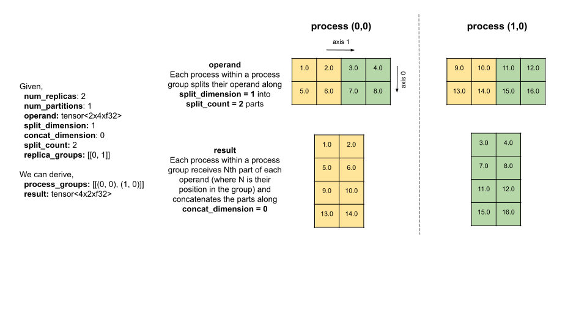
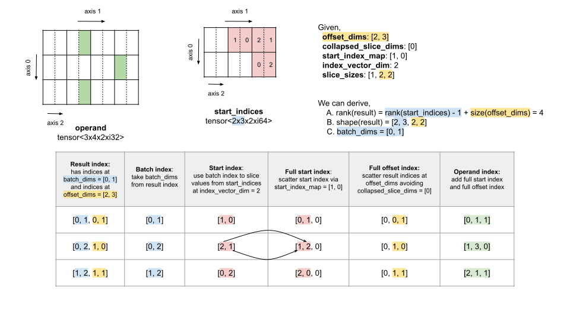

# StableHLO Specification Draft

## Types

Following are the supported element types in StableHLO:

  * **Integer types**
    * Signed integer with two’s complement representation. Referred to in the
    document as `si<N>`, where the bit-width N ∊ {4, 8, 16, 32, 64}.
    * Unsigned integer referred to in the document as `ui<N>`, where the
    bit-width N ∊ {4, 8, 16, 32, 64}.
  * **Boolean type** referred to in the document as `i1`. Exact
  representation of boolean types (e.g. 1 byte per boolean vs 1 bit per boolean)
  is implementation-defined.
  * **Floating-point types**
    * Single precision `f32`, double precision `f64` and half precision `f16`
    floating-points complying with [IEEE 754-2019
    format](https://ieeexplore.ieee.org/document/8766229).
    * Bfloat16 `bf16` floating-point complying with [BFloat16 format](https://cloud.google.com/blog/products/ai-machine-learning/bfloat16-the-secret-to-high-performance-on-cloud-tpus).
    Provides the same number of exponent bits as `f32`, so that it matches its
    dynamic range, but with greatly reduced precision. This also ensures
    identical behavior for underflows, overflows, and NaNs. However, `bf16`
    handles denormals differently from `f32`: it flushes them to zero.
  * **Complex types** represent a pair of floating-point types. Supported ones
    are `complex<f32>` (represents a par of `f32`) and `complex<f64>`
    (represents a pair of `f64`). Exact representation of complex types
    (e.g. whether the real part or the imaginary part comes first in memory)
    is implementation-defined.

**Tensor types** are the cornerstone of the StableHLO type system. They model
immutable n-dimensional arrays and are referred to in the document as
`tensor<SxE>` where:

  * **Shape** `S` represented as `(d0)x(d1)x...x(dR-1)` is a 1-dimensional array
  of **dimension sizes** `di`, in the increasing order of the corresponding
  **dimensions** (which are also called **axes**) 0, 1, ..., R-1.
  The size `R` of this array is called **rank**. Dimension sizes have type
  `si64` and are non-negative (dimension sizes equal to zero are allowed,
  and their meaning is described below). Ranks equal to zero are also allowed,
  and their meaning is also described below.
  * **Element type** `E` is any one of the supported element types mentioned
  above.

For example, `tensor<2x3xf32>` is a tensor type with shape `2x3` and element
type `f32`. It has two dimensions (or, in other words, two axes) whose sizes
are 2 and 3. Its rank is 2.

At the logical level, a `tensor<SxE>` maps a 1-dimensional array of **indices**
`{i0, i1, ..., iR-1}` on **elements** of type `E`. If a tensor `t` maps an index
`i` on an element `e`, we say that `t[i0, i1, ..., iR-1] = e`.

Individual indices have type `si64` and are within the range `[0, di)` defined
by the corresponding dimension. The size of the index array is equal to `R`.
At the moment, StableHLO only supports dense tensors, so each tensor has
`1*(d0)*(d1)*...*(dR-1)` elements whose indices are drawn from an
**index space** which is a Cartesian product of its dimensions. For example:
  * `tensor<2x3xf32>` has 6 elements whose indices are
    `{0, 0}`, `{0, 1}`, `{0, 2}`, `{1, 0}`, `{1, 1}` and `{1, 2}`.
  * Tensors of rank zero, e.g `tensor<f32>`, have 1 element. Such tensors are
    allowed and are useful to model scalars.
  * Tensors with dimensions of size zero, e.g. `tensor<2x0xf32>`, have
    0 elements. Such tensors are allowed and are useful in rare cases, e.g.
    to model empty slices.

**Canonical representation** of a tensor is a 1-dimensional array of elements
which correspond to indices ordered lexicographically. For example, for a
`tensor<2x3xf32>` with the following mapping from indices to elements:
`{0, 0} => 1`, `{0, 1} => 2`, `{0, 2} => 3`, `{1, 0} => 4`, `{1, 1} => 5`,
`{1, 2} => 6` - the canonical representation would be: `[1, 2, 3, 4, 5, 6]`.

Exact representation of tensors is implementation-defined. This specification
does not define in which order tensor elements are laid out in memory (e.g.
whether/when they follow the canonical order) and how individual tensor elements
in a particular order are packed together into a tensor (e.g. how these elements
are aligned, whether they are stored contiguously, etc).

**Token type** Values of this type are used for imposing order on execution of
side-effecting operations using data dependencies.

**Tuple types** model heterogeneous lists and are referred to in the document
using: 1) the full form: `tuple<T0, ... TN-1>`, 2) the short form: `tuple`,
where:
  * `N` is the tuple size.
  * `Ti` are types of tuple elements.
  * Element types are one of `tensor`, `token` or `tuple`.

Tuple types are inherited from HLO where they are used to model variadic inputs
and outputs. In StableHLO, variadic inputs and outputs are supported natively,
so the only use of tuple types in StableHLO is in `custom_call` where tuple
types are used to model HLO-compatible ABI of custom calls.

**Function types** model functions and are referred to in the document using: 1)
the full form: `(I1, ..., IN) -> (O1, ..., OM)`, or 2) the short form:
`function`, where:
  * `Ii` are types of inputs of the corresponding function.
  * `Oj` are types of outputs of the corresponding function.
  * Neither input nor output types can be function types themselves.

Function types are not first class, i.e. StableHLO doesn't support values of
function types. Some StableHLO ops can take functions as inputs, but they are
never produced as outputs.

## Programs

**StableHLO programs** consist of **StableHLO functions**. Each function has
inputs and outputs of supported types and a list of ops in static
single-assignment (SSA) form which is terminated by a `return` op which produces
the outputs of the function.

Here is an example of a program that consists of a function `@main` which takes
three inputs (`%image`, `%weights` and `%bias`) and produces one output (`%4`).
Below we describe how this program can be executed.

```mlir
stablehlo.func @main(
  %image: tensor<28x28xf32>,
  %weights: tensor<784x10xf32>,
  %bias: tensor<1x10xf32>
) -> tensor<1x10xf32> {
  %0 = "stablehlo.reshape"(%image) : (tensor<28x28xf32>) -> tensor<1x784xf32>
  %1 = "stablehlo.dot"(%0, %weights) : (tensor<1x784xf32>, tensor<784x10xf32>) -> tensor<1x10xf32>
  %2 = "stablehlo.add"(%1, %bias) : (tensor<1x10xf32>, tensor<1x10xf32>) -> tensor<1x10xf32>
  %3 = "stablehlo.constant"() { value = dense<0.0> : tensor<1x10xf32> } : () -> tensor<1x10xf32>
  %4 = "stablehlo.maximum"(%2, %3) : (tensor<1x10xf32>, tensor<1x10xf32>) -> tensor<1x10xf32>
  "stablehlo.return"(%4): (tensor<1x10xf32>) -> ()
}
```

## Execution

### Sequential execution

A StableHLO program is executed by providing input values to the `main` function
and computing output values. Output values of a function are computed by
executing the graph of ops rooted in the corresponding `return` op.

The execution order is implementation-defined, as long as ops are executed
before their uses. Possible execution orders of the example program above are
`%0` → `%1` → `%2` → `%3` → `%4` → `return` or `%3` → `%0` → `%1` → `%2` → `%4`
→ `return`.

More formally, a **StableHLO process** is a combination of:
1) a StableHLO program, 2) operation statuses (not executed yet,
already executed), and 3) intermediate values that the process is working on.
The process starts with input values to the `main` function, progresses through
the graph of ops updating operation statuses and intermediate values and
finishes with output values. Further formalization is TBD.

### Parallel execution

StableHLO programs can be executed in parallel, organized into a 2D grid of
`num_replicas` by `num_partitions` which both have type `ui32`.

In the **StableHLO grid**, `num_replicas * num_partitions` of StableHLO
processes are executing at the same time. Each process has a unique
`process_id = (replica_id, partition_id)`, where
`replica_id ∊ replica_ids = [0, ..., num_replicas-1]` and
`partition_id ∊ partition_ids = [0, ..., num_partitions-1]` which both have
type `ui32`.

The size of the grid is known statically for every program, and the position
within the grid is known statically for every process. Each process has access
to its position within the grid via the `replica_id` and `partition_id` ops.

Within the grid, the programs can all be the same (in the "Single Program,
Multiple Data" style), can all be different (in the "Multiple Program, Multiple
Data" style) or something in between.

Within the grid, the processes are mostly independent from each other - they
have separate operation statuses, separate input/intermediate/output values and
most of the ops are executed separately between processes, with the exception of
a small number of collective ops described below.

Given that execution of most of the ops is only using values from the same
process, it is usually unambiguous to refer to these values by their names.
However, when describing semantics of collective ops, that is insufficient, and
we use the notation `name@process_id` to refer to the value `name` within a
particular process. (From that perspective, unqualified `name` can be viewed as
a shorthand for `name@(replica_id(), partition_id())`).

The execution order across processes is implementation-defined, except for the
synchronization introduced by collective ops as described below.

### Collective ops

There are five collective ops in StableHLO: `all_gather`, `all_reduce`,
`all_to_all`, `collective_permute` and `reduce_scatter`. All these ops split
the processes in the StableHLO grid into **StableHLO process groups** and
execute a joint computation within each process group, independently from other
process groups.

Within each process group, collective ops may introduce a synchronization
barrier. Further formalization, e.g. elaborating on when exactly this
synchronization happens, how exactly the processes arrive at this barrier,
and what happens if they don't, is TBD.

If the process group involves cross-partition communication, i.e. there are
processes in the process group whose partition ids are different, then execution
of the collective op needs a **StableHLO channel**, and the collective op must
provide a positive `channel_id` of type `si64`. Further formalization, e.g.
where these channel ids are coming from and how they are synchronized between
programs, is TBD. Cross-replica communication doesn't need channels.

The computations performed by the collective ops are specific to individual ops
and are described in individual op sections below. However, the strategies by
which the grid is split into process groups are shared between these ops and are
described in this section. More formally, StableHLO supports the following
four strategies.

#### cross_replica

Only cross-replica communications happen within each process group. This
strategy takes `replica_groups` - a list of lists of replica ids - and computes
a Cartesian product of `replica_groups` by `partition_ids`. `replica_groups`
must have unique elements and cover all `replica_ids`. More formally:

```Python
def cross_replica(replica_groups: List[List[ReplicaId]]) -> List[List[ProcessId]]:
  for replica_group in replica_groups:
    for partition_id in partition_ids:
      process_group = []
      for replica_id in replica_group:
        process_group.append((replica_id, partition_id))
      yield process_group
```

For example, for `replica_groups = [[0, 1], [2, 3]]` and `num_partitions = 2`,
`cross_replica` will produce
`[[(0, 0), (1, 0)], [(0, 1), (1, 1)], [(2, 0), (3, 0)], [(2, 1), (3, 1)]]`.

#### cross_partition

Only cross-partition communications happen within each process group. This
strategy takes `partition_groups` - a list of lists of partition ids - and
computes a Cartesian product of `partition_groups` by `replica_ids`.
`partition_groups` must have unique elements and cover all `partition_ids`.
More formally:

```Python
def cross_partition(partition_groups: List[List[PartitionId]]) -> List[List[ProcessId]]:
  for partition_group in partition_groups:
    for replica_id in replica_ids:
      process_group = []
      for partition_id in partition_group:
        process_group.append((replica_id, partition_id))
      yield process_group
```

For example, for `partition_groups = [[0, 1]]` and `num_replicas = 4`,
`cross_partition` will produce
`[[(0, 0), (0, 1)], [(1, 0), (1, 1)], [(2, 0), (2, 1)], [(3, 0), (3, 1)]]`.

#### cross_replica_and_partition

Both cross-replica and cross-partition communications may happen within each
process group. This strategy takes `replica_groups` - a list of lists of
replica ids - and computes Cartesian products of each `replica_group` by
`partition_ids`. `replica_groups` must have unique elements and cover all
`replica_ids`. More formally:

```Python
def cross_replica_and_partition(replica_groups: List[List[ReplicaId]]) -> List[List[ProcessId]]:
  for replica_group in replica_groups:
    process_group = []
    for partition_id in partition_ids:
      for replica_id in replica_group:
        process_group.append((replica_id, partition_id))
    yield process_group
```

For example, for `replica_groups = [[0, 1], [2, 3]]` and `num_partitions = 2`,
`cross_replica_and_partition` will produce
`[[(0, 0), (1, 0), (0, 1), (1, 1)], [(2, 0), (3, 0), (2, 1), (3, 1)]]`.

#### flattened_ids

This strategy takes `flattened_id_groups` - a list of lists of "flattened"
process ids in the form of `replica_id * num_partitions + partition_id` - and
turns them into process ids. `flattened_id_groups` must have unique elements
and cover all `process_ids`. More formally:

```Python
def flattened_ids(flattened_id_groups: List[List[ui32]]) -> List[List[ProcessId]]:
  for flattened_id_group in flattened_id_groups:
    process_group = []
    for flattened_id in flattened_id_group:
      replica_id = flattened_id // num_partitions
      partition_id = flattened_id % num_partitions
      process_group.append((replica_id, partition_id))
    yield process_group
```

For example, for `flattened_id_groups = [[0, 1, 2, 3], [4, 5, 6, 7]]`,
`num_replicas = 4` and `num_partitions = 2`, `flattened_ids` will produce
`[[(0, 0), (0, 1), (1, 0), (1, 1)], [(2, 0), (2, 1), (3, 0), (3, 1)]]`.

## Errors

StableHLO programs are validated through an extensive set of constraints for
individual ops, which rules out many classes of errors prior to run time.
However, error conditions are still possible, e.g. through integer overflows,
out-of-bounds accesses, etc. Unless explicitly called out, all these errors
result in implementation-defined behavior.

As an exception to this rule, floating-point exceptions in StableHLO programs
have well-defined behavior. Operations which result in exceptions defined by the
IEEE-754 standard (invalid operation, division-by-zero, overflow, underflow, or
inexact exceptions) produce default results (as defined in the standard) and
continue execution without raising the corresponding status flag; similar to
`raiseNoFlag` exception handling from the standard. Exceptions for nonstandard
operations (e.g. complex arithmetic and certain transcendental functions) are
implementation-defined.

## Constants

The section describes the constants supported in StableHLO along with their
syntax.

  * **Integer constants** use decimal notation, e.g. `123`, or hexadecimal
  notation, e.g. `ff`. Negative numbers can be used with signed integer types,
  but not with unsigned integer types.
  * **Boolean constants** `true` and `false` are both valid constants of the
  `pred` type.
  * **Floating-point constants** use decimal notation, e.g. `123.421`,
  exponential notation, e.g. `1.23421e+2`, or a more precise hexadecimal
  notation, e.g. `0x42f6d78d`.
  * **Complex constants** Complex constants are represented as a pair of
  floating-point constants of `f32` or `f64` types, e.g. `(12.34, 56.78)`,
  where the first constant is the real part, and the second constant is the
  imaginary part.
  * **Tensor constants** use NumPy notation. For example,
  `[[1, 2, 3], [4, 5, 6]]` is a constant of type `tensor<2x3xf32>` with the
  following mapping from indices to elements: `{0, 0} => 1`, `{0, 1} => 2`,
  `{0, 2} => 3`, `{1, 0} => 4`, `{1, 1} => 5`, `{1, 2} => 6`.

## Index of Ops
   * [abs](#stablehloabs)
   * [add](#stablehloadd)
   * [after_all](#stablehloafter_all)
   * [all_gather](#stablehloall_gather)
   * [all_to_all](#stablehloall_to_all)
   * [and](#stablehloand)
   * [atan2](#stablehloatan2)
   * [batch_norm_grad](#stablehlobatch_norm_grad)
   * [batch_norm_inference](#stablehlobatch_norm_inference)
   * [batch_norm_training](#stablehlobatch_norm_training)
   * [bitcast_convert](#stablehlobitcast_convert)
   * [broadcast_in_dim](#stablehlobroadcast_in_dim)
   * [case](#stablehlocase)
   * [cbrt](#stablehlocbrt)
   * [ceil](#stablehloceil)
   * [cholesky](#stablehlocholesky)
   * [clamp](#stablehloclamp)
   * [compare](#stablehlocompare)
   * [complex](#stablehlocomplex)
   * [concatenate](#stablehloconcatenate)
   * [constant](#stablehloconstant)
   * [cosine](#stablehlocosine)
   * [count_leading_zeros](#stablehlocount_leading_zeros)
   * [divide](#stablehlodivide)
   * [dynamic_slice](#stablehlodynamic_slice)
   * [dynamic_update_slice](#stablehlodynamic_update_slice)
   * [exponential](#stablehloexponential)
   * [exponential_minus_one](#stablehloexponential_minus_one)
   * [fft](#stablehlofft)
   * [floor](#stablehlofloor)
   * [gather](#stablehlogather)
   * [get_tuple_element](#stablehloget_tuple_element)
   * [if](#stablehloif)
   * [imag](#stablehloimag)
   * [iota](#stablehloiota)
   * [is_finite](#stablehlois_finite)
   * [log](#stablehlolog)
   * [log_plus_one](#stablehlolog_plus_one)
   * [logistic](#stablehlologistic)
   * [map](#stablehlomap)
   * [maximum](#stablehlomaximum)
   * [minimum](#stablehlominimum)
   * [multiply](#stablehlomultiply)
   * [negate](#stablehlonegate)
   * [not](#stablehlonot)
   * [optimization_barrier](#stablehlooptimization_barrier)
   * [or](#stablehloor)
   * [pad](#stablehlopad)
   * [popcnt](#stablehlopopcnt)
   * [power](#stablehlopower)
   * [real](#stablehloreal)
   * [reduce](#stablehloreduce)
   * [remainder](#stablehloremainder)
   * [replica_id](#stablehloreplica_id)
   * [reshape](#stablehloreshape)
   * [reverse](#stablehloreverse)
   * [rng](#stablehlorng)
   * [rng_bit_generator](#stablehlorng_bit_generator)
   * [round_nearest_afz](#stablehloround_nearest_afz)
   * [round_nearest_even](#stablehloround_nearest_even)
   * [rsqrt](#stablehlorsqrt)
   * [scatter](#stablehloscatter)
   * [select](#stablehloselect)
   * [shift_left](#stablehloshift_left)
   * [shift_right_arithmetic](#stablehloshift_right_arithmetic)
   * [shift_right_logical](#stablehloshift_right_logical)
   * [sign](#stablehlosign)
   * [sine](#stablehlosine)
   * [slice](#stablehloslice)
   * [sort](#stablehlosort)
   * [sqrt](#stablehlosqrt)
   * [subtract](#stablehlosubtract)
   * [tanh](#stablehlotanh)
   * [transpose](#stablehlotranspose)
   * [triangular_solve](#stablehlotriangular_solve)
   * [tuple](#stablehlotuple)
   * [while](#stablehlowhile)
   * [xor](#stablehloxor)

## stablehlo.abs

### Semantics

Performs element-wise absolute value of `operand` tensor and produces a `result`
tensor. For floating-point element types, it implements the `abs` operation from
the IEEE-754 specification.

For n-bit signed integer, the absolute value of $-2^{n-1}$ is implementation-
defined and one of the following:

  * Saturation to $2^{n-1}-1$
  * $-2^{n-1}$

### Inputs

| Name      | Type                                                      |
|-----------|-----------------------------------------------------------|
| `operand` | tensor of signed integer, floating-point, or complex type |

### Outputs

| Name     | Type                                                      |
|----------|-----------------------------------------------------------|
| `result` | tensor of signed integer, floating-point, or complex type |

### Constraints

  * (C1)  `operand` and `result` have the same shape.
  * (C2)  `operand` and `result` have the same element type, except when the
  element type of the `operand` is complex type, in which case the element type
  of the `result` is the element type of the complex type (e.g. the element type
  of the `result` is `f64` for operand type `complex<f64>`).

### Examples

```mlir
// %operand: [-2, 0, 2]
%result = "stablehlo.abs"(%operand) : (tensor<3xi32>) -> tensor<3xi32>
// %result: [2, 0, 2]
```

[Back to Ops](#index-of-ops)

## stablehlo.add

### Semantics

Performs element-wise addition of two tensors `lhs` and `rhs` and produces a
`result` tensor. For integer element types, if the element-wise sum has an
unsigned/signed overflow, the result is implementation-defined and one
of the following:

  * mathematical result modulo $2^n$, where n is the bit width of the result,
  for unsigned overflow. For signed integer overflow, wraps the result around
  the representable range $[-2^{n-1},\ 2^{n-1} - 1]$.
  * saturation to $2^{n-1} - 1$ (or $-2^{n-1}$) for signed overflow and
  saturation to $2^n - 1$ (or $0$) for unsigned overflow.

For floating-point element types, it implements the `addition` operation from
the IEEE-754 specification. For boolean element type, the behavior is same as
[stablehlo.or](#stablehloor).

### Inputs

| Name  | Type                         |
|-------|------------------------------|
| `lhs` | tensor of any supported type |
| `rhs` | tensor of any supported type |

### Outputs

| Name     | Type                         |
|----------|------------------------------|
| `result` | tensor of any supported type |

### Constraints

  * (C1) `lhs`, `rhs` and `result` have the same type.

### Examples

```mlir
// %lhs: [[1, 2], [3, 4]]
// %rhs: [[5, 6], [7, 8]]
%result = "stablehlo.add"(%lhs, %rhs) : (tensor<2x2xi32>, tensor<2x2xi32>) -> tensor<2x2xi32>
// %result: [[6, 8], [10, 12]]
```

&nbsp;[More Examples](../stablehlo/tests/interpret_add.mlir)

[Back to Ops](#index-of-ops)

# stablehlo.after_all

### Semantics

Ensures that the operations producing the `inputs` are executed before any
operations that depend on `result`. Execution of this operation does nothing,
it only exists to establish data dependencies from `result` to `inputs`.

### Inputs

| Name     | Type                       |
|----------|----------------------------|
| `inputs` | variadic number of `token` |

### Outputs

| Name     | Type    |
|----------|---------|
| `result` | `token` |

### Examples

```mlir
%result = "stablehlo.after_all"(%input0, %input1) : (!stablehlo.token, !stablehlo.token) -> !stablehlo.token
```

[Back to Ops](#index-of-ops)

## stablehlo.all_gather

### Semantics

Within each process group in the StableHLO grid, concatenates the values of the
`operand` tensor from each process along `all_gather_dim` and produces a
`result` tensor.

The operation splits the StableHLO grid into `process_groups` as follows:
  * `channel_id <= 0` and `use_global_device_ids = false`,
    `cross_replica(replica_groups)`.
  * `channel_id > 0` and `use_global_device_ids = false`,
    `cross_replica_and_partition(replica_groups)`.
  * `channel_id > 0` and `use_global_device_ids = true`,
    `flattened_ids(replica_groups)`.

Afterwards, within each `process_group`:
  * `operands@receiver = [operand@sender for sender in process_group]` for all
    `receiver` in `process_group`.
  * `result@process = concatenate(operands@process, all_gather_dim)` for all
    `process` in `process_group`.

### Inputs

| Name                    | Type                                         |
|-------------------------|----------------------------------------------|
| `operand`               | tensor of any supported type                 |
| `all_gather_dim`        | constant of type `si64`                      |
| `replica_groups`        | 2-dimensional tensor constant of type `si64` |
| `channel_id`            | constant of type `si64`                      |
| `use_global_device_ids` | constant of type `boolean`                   |

### Outputs

| Name     | Type                         |
|----------|------------------------------|
| `result` | tensor of any supported type |

### Constraints

  * (C1) `all_gather_dim` $\in$ [0, rank(`operand`)).
  * (C2) All values in `replica_groups` are unique.
  * (C3) `size(replica_groups)` depends on the process grouping strategy:
    * If `cross_replica`, `num_replicas`.
    * If `cross_replica_and_partition`, `num_replicas`.
    * If `flattened_ids`, `num_processes`.
  * (C4) $0 \le$ `replica_groups`[i] $\lt$ size(`replica_groups`) $\forall i$
         from `indices(replica_groups)`.
  * (C5) If `use_global_device_ids = true`, then `channel_id > 0`. [todo](https://github.com/openxla/stablehlo/issues/654)
  * (C6)`type(result) = type(operand)` except that
    * `dim(result, all_gather_dim)` = `dim(operand, all_gather_dim) * dim(process_groups, 1)`.

### Examples

```mlir
// num_replicas: 2
// num_partitions: 1
// %operand@(0, 0): [[1.0, 2.0], [3.0, 4.0]]
// %operand@(1, 0): [[5.0, 6.0], [7.0, 8.0]]
%result = "stablehlo.all_gather"(%operand) {
  all_gather_dim = 1 : i64,
  replica_groups = dense<[[0, 1]]> : tensor<1x2xi64>
  // use_global_device_ids = false
} : (tensor<2x2xf32>) -> tensor<2x4xf32>
// %result@(0, 0): [[1.0, 2.0, 5.0, 6.0], [3.0, 4.0, 7.0, 8.0]]
// %result@(1, 0): [[1.0, 2.0, 5.0, 6.0], [3.0, 4.0, 7.0, 8.0]]
```

[Back to Ops](#index-of-ops)

## stablehlo.all_to_all

### Semantics



Within each process group in the StableHLO grid, splits the values of the
`operand` tensor along `split_dimension` into parts, scatters the split parts
between the processes, concatenates the scattered parts along `concat_dimension`
and produces a `result` tensor.

The operation splits the StableHLO grid into process groups using the
`cross_replica(replica_groups)` strategy.

Afterwards, within each `process_group`:
  * ```
    split_parts@sender = [
        slice(
          operand=operand@sender,
          start_indices=[s0, s1, ..., sR-1],
            # where
            #  - sj = 0 if j != split_dimension
            #  - sj = i * dim(operand) // split_count, if j == split_dimension
            #  - R = rank(operand)
          limit_indices=[l0, l1, ..., lR-1],
            # where
            #   - lj = dim(operand, j) if j != split_dimension
            #   - lj = (i + 1) * dim(operand, split_dimension) // split_count, if j == split_dimension
          strides=[1, ..., 1]
        ) for i in range(split_count)
     ]
     ``` for all `sender` in `process_group`.
  * `scattered_parts@receiver = [split_parts@sender[receiver_index] for sender in process_group]`
    where `receiver_index = index_of(receiver, process_group)`.
  * `result@process = concatenate(scattered_parts@process, concat_dimension)`.

### Inputs

| Name               | Type                                         |
|--------------------|----------------------------------------------|
| `operand`          | tensor of any supported type                 |
| `split_dimension`  | constant of type `si64`                      |
| `concat_dimension` | constant of type `si64`                      |
| `split_count`      | constant of type `si64`                      |
| `replica_groups`   | 2-dimensional tensor constant of type `si64` |

### Outputs

| Name     | Type                         |
|----------|------------------------------|
| `result` | tensor of any supported type |

### Constraints

  * (C1) `split_dimension` $\in$ [0, rank(`operand`)).
  * (C2) dim(`operand`, `split_dimension`) % `split_count` $=$ 0.
  * (C3) `concat_dimension` $\in$ [0, rank(`operand`)).
  * (C4) `split_count` $\gt$ 0.
  * (C5) All values in `replica_groups` are unique.
  * (C6) `size(replica_groups)` = `num_replicas`.
  * (C7) $0 \le$ `replica_groups`[i] $\lt$ size(`replica_groups`) $\forall i$
         from `indices(replica_groups)`.
  * (C8) `type(result) = type(operand)` except that
    * `dim(result, split_dimension) = dim(operand, split_dimension) / split_count`.
    * `dim(result, concat_dimension) = dim(operand, concat_dimension) * split_count`.

### Examples

```mlir
// num_replicas: 2
// num_partitions: 1
// %operand@(0, 0): [
//                   [1.0, 2.0, 3.0, 4.0],
//                   [5.0, 6.0, 7.0, 8.0]
//                  ]
// %operand@(1, 0): [
//                   [9.0, 10.0, 11.0, 12.0],
//                   [13.0, 14.0, 15.0, 16.0]
//                  ]
%result = "stablehlo.all_to_all"(%operand) {
  split_dimension = 1 : i64,
  concat_dimension = 0 : i64,
  split_count = 2 : i64,
  replica_groups = dense<[[0, 1]]> : tensor<1x2xi64>
} : (tensor<2x4xf32>) -> tensor<4x2xf32>
// %result@(0, 0): [
//                  [1.0, 2.0],
//                  [5.0, 6.0],
//                  [9.0, 10.0],
//                  [13.0, 14.0]
//                 ]
// %result@(1, 0): [
//                  [3.0, 4.0],
//                  [7.0, 8.0],
//                  [11.0, 12.0],
//                  [15.0, 16.0]
//                 ]
```

[Back to Ops](#index-of-ops)

## stablehlo.and

### Semantics

Performs element-wise bitwise or logical AND of two tensors `lhs` and `rhs` and
produces a `result` tensor. For integer tensors, computes the bitwise operation.
For boolean tensors, computes the logical operation.

### Inputs

| Name  | Type                              |
|-------|-----------------------------------|
| `lhs` | tensor of integer or boolean type |
| `rhs` | tensor of integer or boolean type |

### Outputs

| Name     | Type                              |
|----------|-----------------------------------|
| `result` | tensor of integer or boolean type |

### Constraints

  * (C1) `lhs`, `rhs` and `result` have the same type.

### Examples

```mlir
// %lhs: [[1, 2], [3, 4]]
// %rhs: [[5, 6], [7, 8]]
%result = "stablehlo.and"(%lhs, %rhs) : (tensor<2x2xi32>, tensor<2x2xi32>) -> tensor<2x2xi32>
// %result: [[1, 2], [3, 0]]
```

[Back to Ops](#index-of-ops)

## stablehlo.atan2

### Semantics

Performs element-wise atan2 operation on `lhs` and `rhs` tensor and produces a
`result` tensor, implementing the `atan2` operation from the IEEE-754
specification. For complex element types, it computes a complex atan2 function
with corner cases TBD. Numeric precision is implementation-defined.

### Inputs

| Name  | Type                                     |
|-------|------------------------------------------|
| `lhs` | tensor of floating-point or complex type |
| `rhs` | tensor of floating-point or complex type |

### Outputs

| Name     | Type                                     |
|----------|------------------------------------------|
| `result` | tensor of floating-point or complex type |

### Constraints

  * (C1) `lhs`, `rhs`, and `result` have the same type.

### Examples

```mlir
// %lhs: [0.0, 1.0, -1.0]
// %rhs: [0.0, 0.0, 0.0]
%result = "stablehlo.atan2"(%lhs, %rhs) : (tensor<3xf32>, tensor<3xf32>) -> tensor<3xf32>
// %result: [0.0, 1.57079637, -1.57079637] // [0.0, pi/2, -pi/2]
```

[Back to Ops](#index-of-ops)

## stablehlo.batch_norm_grad

### Semantics

Computes gradients of several inputs of
[batch_norm_training](#stablehlobatch_norm_training) backpropagating from
`grad_output`, and produces `grad_operand`, `grad_scale` and `grad_offset`
tensors. More formally, this operation can be expressed as a decomposition to
existing StableHLO operations using Python-like syntax as follows:

```python
def compute_sum(operand, feature_index):
  (sum,) = reduce(
      inputs=[operand],
      init_values=[0.0],
      dimensions=[i for i in range(rank(operand)) if i != feature_index],
      body=lambda x, y: add(x, y))
  return sum

def compute_mean(operand, feature_index):
  sum = compute_sum(operand, feature_index)
  divisor = constant(num_elements(operand) / dim(operand, feature_index))
  divisor_bcast = broadcast_in_dim(divisor, [], shape(sum))
  return divide(sum, divisor_bcast)

def batch_norm_grad(operand, scale, mean, variance, grad_output, epsilon, feature_index):
  # Broadcast inputs to shape(operand)
  scale_bcast = broadcast_in_dim(scale, [feature_index], shape(operand))
  mean_bcast = broadcast_in_dim(mean, [feature_index], shape(operand))
  variance_bcast = broadcast_in_dim(variance, [feature_index], shape(operand))
  epsilon_bcast = broadcast_in_dim(constant(epsilon), [], shape(operand))

  # Perform normalization using the provided `mean` and `variance`
  # Intermediate values will be useful for computing gradients
  centered_operand = subtract(operand, mean_bcast)
  stddev = sqrt(add(variance_bcast, epsilon_bcast))
  normalized_operand = divide(centered_operand, stddev)

  # Use the implementation from batchnorm_expander.cc in XLA
  # Temporary variables have exactly the same names as in the C++ code
  elements_per_feature = constant(
    divide(size(operand), dim(operand, feature_index)))
  i1 = multiply(
    grad_output,
    broadcast_in_dim(elements_per_feature, [], shape(operand)))
  i2 = broadcast_in_dim(
    compute_sum(grad_output, feature_index),
    [feature_index], shape(operand))
  i3 = broadcast_in_dim(
    compute_sum(multiply(grad_output, centered_operand)),
    [feature_index], shape(operand))
  i4 = multiply(i3, centered_operand)
  i5 = divide(i4, add(variance_bcast, epsilon_bcast))
  grad_operand = multiply(
    divide(divide(scale_bcast, stddev), elements_per_feature),
    subtract(subtract(i1, i2), i5))
  grad_scale = compute_sum(
    multiply(grad_output, normalized_operand), feature_index)
  grad_offset = compute_sum(grad_output, feature_index)
  return grad_operand, grad_scale, grad_offset
```

### Inputs

| Name            | Type                                        |
|-----------------|---------------------------------------------|
| `operand`       | tensor of floating-point type               |
| `scale`         | 1-dimensional tensor of floating-point type |
| `mean`          | 1-dimensional tensor of floating-point type |
| `variance`      | 1-dimensional tensor of floating-point type |
| `grad_output`   | tensor of floating-point type               |
| `epsilon`       | constant of type `f32`                      |
| `feature_index` | constant of type `si64`                     |

### Outputs

| Name           | Type                                        |
|----------------|---------------------------------------------|
| `grad_operand` | tensor of floating-point type               |
| `grad_scale`   | 1-dimensional tensor of floating-point type |
| `grad_offset`  | 1-dimensional tensor of floating-point type |

### Constraints

  * (C1) 0 $\le$ `feature_index` $\lt$ rank(`operand`).
  * (C2) `operand`, `scale`, `mean`, `variance`, `grad_output`, `grad_operand`
         `grad_scale` and `grad_offset` have the same element type.
  * (C3) `operand`, `grad_output` and `grad_operand` have the same shape.
  * (C4) `scale`, `mean`, `variance`, `grad_scale` and `grad_offset` have the
         same shape.
  * (C5) size(`scale`) $=$ `dim(operand, feature_index)`.

### Examples

```mlir
// %operand: [
//            [[1.0, 2.0], [3.0, 4.0]],
//            [[3.0, 4.0], [1.0, 2.0]]
//           ]
// %scale: [1.0, 1.0]
// %mean: [2.0, 3.0]
// %variance: [1.0, 1.0]
// %grad_output: [
//                [[0.1, 0.1], [0.1, 0.1]],
//                [[0.1, 0.1], [0.1, 0.1]]
//               ]
%grad_operand, %grad_scale, %grad_offset =
"stablehlo.batch_norm_grad"(%operand, %scale, %mean, %variance, %grad_output) {
  epsilon = 0.0 : f32,
  feature_index = 2 : i64
} : (tensor<2x2x2xf32>, tensor<2xf32>, tensor<2xf32>, tensor<2xf32>,
     tensor<2x2x2xf32>) -> (tensor<2x2x2xf32>, tensor<2xf32>, tensor<2xf32>)
// %grad_operand: [
//                 [[0.0, 0.0], [0.0, 0.0]],
//                 [[0.0, 0.0], [0.0, 0.0]]
//                ]
// %grad_scale:  [0.0, 0.0]
// %grad_offset: [0.4, 0.4]
```

[Back to Ops](#index-of-ops)

## stablehlo.batch_norm_inference

### Semantics

Normalizes the `operand` tensor across all dimensions except for the
`feature_index` dimension and produces a `result` tensor. More formally, this
operation can be expressed as a decomposition to existing StableHLO operations
using Python-like syntax as follows:

```python
def batch_norm_inference(operand, scale, offset, mean, variance, epsilon, feature_index):
  # Broadcast inputs to shape(operand)
  scale_bcast = broadcast_in_dim(scale, [feature_index], shape(operand))
  offset_bcast = broadcast_in_dim(offset, [feature_index], shape(operand))
  mean_bcast = broadcast_in_dim(mean, [feature_index], shape(operand))
  variance_bcast = broadcast_in_dim(variance, [feature_index], shape(operand))
  epsilon_bcast = broadcast_in_dim(constant(epsilon), [], shape(operand))

  # Perform normalization using the provided `mean` and `variance` instead of
  # computing them like `batch_norm_training` does.
  centered_operand = subtract(operand, mean_bcast)
  stddev = sqrt(add(variance_bcast, epsilon_bcast))
  normalized_operand = divide(centered_operand, stddev)
  return add(multiply(scale_bcast, normalized_operand), offset_bcast)
```

Numeric precision is implementation-defined.

### Inputs

| Name            | Type                                        |
|-----------------|---------------------------------------------|
| `operand`       | tensor of floating-point type               |
| `scale`         | 1-dimensional tensor of floating-point type |
| `offset`        | 1-dimensional tensor of floating-point type |
| `mean`          | 1-dimensional tensor of floating-point type |
| `variance`      | 1-dimensional tensor of floating-point type |
| `epsilon`       | constant of type `f32`                      |
| `feature_index` | constant of type `si64`                     |

### Outputs

| Name     | Type                          |
|----------|-------------------------------|
| `result` | tensor of floating-point type |

### Constraints

  * (C1) 0 $\le$ `feature_index` $\lt$ rank(`operand`).
  * (C2) `operand`, `scale`, `offset`, `mean`, `variance` and `result` have the
    same element type.
  * (C3) size(`scale`) $=$ `dim(operand, feature_index)`.
  * (C4) size(`offset`) $=$ `dim(operand, feature_index)`.
  * (C5) size(`mean`) $=$ `dim(operand, feature_index)`.
  * (C6) size(`variance`) $=$ `dim(operand, feature_index)`.
  * (C7) `operand` and `result` have the same type.

### Examples

```mlir
// %operand: [
//            [[1.0, 2.0], [3.0, 4.0]],
//            [[3.0, 4.0], [1.0, 2.0]]
//           ]
// %scale: [1.0, 1.0]
// %offset: [1.0, 1.0]
// %mean: [2.0, 3.0]
// %variance: [1.0, 1.0]
%result = "stablehlo.batch_norm_inference"(%operand, %scale, %offset, %mean, %variance) {
  epsilon = 0.0 : f32,
  feature_index = 2 : i64
} : (tensor<2x2x2xf32>, tensor<2xf32>, tensor<2xf32>, tensor<2xf32>, tensor<2xf32>) -> tensor<2x2x2xf32>
// %result: [
//           [[0.0, 0.0], [2.0, 2.0]],
//           [[2.0, 2.0], [0.0, 0.0]]
//          ]
```

[Back to Ops](#index-of-ops)

## stablehlo.batch_norm_training

### Semantics

Computes mean and variance across all dimensions except for the `feature_index`
dimension and normalizes the `operand` tensor producing `output`, `batch_mean`
and `batch_var` tensors. More formally, this operation can be expressed as a
decomposition to existing StableHLO operations using Python-like syntax as
follows:

```python
def compute_mean(operand, feature_index):
  (sum,) = reduce(
      inputs=[operand],
      init_values=[0.0],
      dimensions=[i for i in range(rank(operand)) if i != feature_index],
      body=lambda x, y: add(x, y))
  divisor = constant(num_elements(operand) / dim(operand, feature_index))
  divisor_bcast = broadcast_in_dim(divisor, [], shape(sum))
  return divide(sum, divisor_bcast)

def compute_variance(operand, feature_index):
  mean = compute_mean(operand, feature_index)
  mean_bcast = broadcast_in_dim(mean, [feature_index], shape(operand))
  centered_operand = subtract(operand, mean_bcast)
  return compute_mean(mul(centered_operand, centered_operand), feature_index)

def batch_norm_training(operand, scale, offset, epsilon, feature_index):
  mean = compute_mean(operand, feature_index)
  variance = compute_variance(operand, feature_index)
  return batch_norm_inference(operand, scale, offset, mean,
                              variance, epsilon, feature_index)
```

Numeric precision is implementation-defined.

### Inputs

| Name            | Type                                        |
|-----------------|---------------------------------------------|
| `operand`       | tensor of floating-point type               |
| `scale`         | 1-dimensional tensor of floating-point type |
| `offset`        | 1-dimensional tensor of floating-point type |
| `epsilon`       | constant of type `f32`                      |
| `feature_index` | constant of type `si64`                     |

### Outputs

| Name         | Type                                        |
|--------------|---------------------------------------------|
| `output`     | tensor of floating-point type               |
| `batch_mean` | 1-dimensional tensor of floating-point type |
| `batch_var`  | 1-dimensional tensor of floating-point type |

### Constraints

  * (C1) 0 $\le$ `feature_index` $\lt$ rank(`operand`).
  * (C2) `operand`, `scale`, `offset`, `result`, `batch_mean` and `batch_var`
         have the same element type.
  * (C3) size(`scale`) $=$ `dim(operand, feature_index)`.
  * (C4) size(`offset`) $=$ `dim(operand, feature_index)`.
  * (C5) size(`batch_mean`) $=$ `dim(operand, feature_index)`.
  * (C6) size(`batch_var`) $=$ `dim(operand, feature_index)`.
  * (C7) `operand` and `output` have the same type.

### Examples

```mlir
// %operand: [
//            [[1.0, 2.0], [3.0, 4.0]],
//            [[3.0, 4.0], [1.0, 2.0]]
//           ]
// %scale: [1.0, 1.0]
// %offset: [1.0, 1.0]
%output, %batch_mean, %batch_var = "stablehlo.batch_norm_training"(%operand, %scale, %offset) {
  epsilon = 0.0 : f32,
  feature_index = 2 : i64
} : (tensor<2x2x2xf32>, tensor<2xf32>, tensor<2xf32>) -> (tensor<2x2x2xf32>, tensor<2xf32>, tensor<2xf32>)
// %output: [
//           [[0.0, 0.0], [2.0, 2.0]],
//           [[2.0, 2.0], [0.0, 0.0]]
//          ]
// %batch_mean: [2.0, 3.0]
// %batch_var: [1.0, 1.0]
```

[Back to Ops](#index-of-ops)

## stablehlo.bitcast_convert

### Semantics

Performs a bitcast operation on `operand` tensor and produces a `result` tensor
where the bits of the entire `operand` tensor are reinterpreted using the
type of the `result` tensor.

Let `E` and `E'` be the `operand` and `result` element type respectively, and
`R = rank(operand)`:
  * If `num_bits(E')` $=$ `num_bits(E)`,
    `bits(result[i0, ..., iR-1]) = bits(operand[i0, ..., iR-1])`.
  * If `num_bits(E')` $\lt$ `num_bits(E)`,
    `bits(result[i0, ..., iR-1, :]) = bits(operand[i0, ..., iR-1])`.
  * If `num_bits(E')` $\gt$ `num_bits(E)`,
    `bits(result[i0, ..., iR-2]) = bits(operand[i0, ..., iR-2, :])`.

The behavior of `bits` is implementation-defined because the exact
representation of tensors is implementation-defined, and the exact
representation of element types is implementation-defined as well.

### Inputs

| Name      | Type                         |
|-----------|------------------------------|
| `operand` | tensor of any supported type |

### Outputs

| Name     | Type                         |
|----------|------------------------------|
| `result` | tensor of any supported type |

### Constraints

  * (C1) Let `E` and `E'` be the `operand` and `result` element type,
    respectively and `R = rank(operand)`:
    * If `num_bits(E')` $=$ `num_bits(E)`, shape(`result`) $=$ shape(`operand`).
    * If `num_bits(E')` $\lt$ `num_bits(E)`:
      * `rank(result) = R+1`.
      * dim(`result`, `i`) $=$ dim(`operand`, `i`) for all `i` $\in$ [0, `R`-1].
      * `dim(result, R) = num_bits(E)/num_bits(E')`.
    * If `num_bits(E')` $\gt$ `num_bits(E)`:
      * `rank(result) = R-1`.
      * dim(`result`, `i`) $=$ dim(`operand`, `i`) for all `i` $\in$ [0, `R`-1).
      * `dim(operand, R-1) = num_bits(E')/num_bits(E)`.
  * (C2) Conversion between complex and non-complex types is not permitted.

### Examples

```mlir
// %operand: [0.0, 1.0]
%result = "stablehlo.bitcast_convert"(%operand) : (tensor<2xf32>) -> tensor<2x4xi8>
// %result: [
//           [0, 0, 0, 0],
//           [0, 0, -128, 63] // little-endian representation of 1.0
//          ]
```

[Back to Ops](#index-of-ops)

## stablehlo.broadcast_in_dim

### Semantics

Expands the dimensions and/or rank of an input tensor by duplicating the data
in the `operand` tensor and produces a `result` tensor. Formally,
`result[i0, i1, ..., iR-1]` $=$ `operand[j0, j1, ..., jR'-1]` such that
`jk` $=$ `dim(operand, k) == 1 ? 0 : i[broadcast_dimensions[k]]` for all
dimensions `k` in `operand`.

### Inputs

| Name                   | Type                                         |
|------------------------|----------------------------------------------|
| `operand`              | tensor of any supported type                 |
| `broadcast_dimensions` | 1-dimensional tensor constant of type `si64` |

### Outputs

| Name     | Type                         |
|----------|------------------------------|
| `result` | tensor of any supported type |

### Constraints

  * (C1) `operand` and `result` have the same element type.
  * (C2) size(`broadcast_dimensions`) $=$ rank(`operand`).
  * (C3) $0 \le$ `broadcast_dimensions[i]` $\lt$ rank(`result`) for all
         dimensions i in `operand`.
  * (C4) All dimensions in `broadcast_dimensions` are unique.
  * (C5) For all dimensions `j` in `operand`:
    * `dim(operand, j) = 1` or
    * `dim(operand, j) = dim(result, i)` where `i = broadcast_dimensions[j]`.

### Examples

```mlir
// %operand: [
//            [1, 2, 3]
//           ]
%result = "stablehlo.broadcast_in_dim"(%operand) {
  broadcast_dimensions = dense<[2, 1]>: tensor<2xi64>
} : (tensor<1x3xi32>) -> tensor<2x3x2xi32>
// %result: [
//            [
//             [1, 1],
//             [2, 2],
//             [3, 3]
//            ],
//            [
//             [1, 1],
//             [2, 2],
//             [3, 3]
//            ]
//          ]
```

[Back to Ops](#index-of-ops)

## stablehlo.case

### Semantics

Produces the output from executing exactly one function from `branches`
depending on the value of `index`. Formally, if $0 \le$ `index` $\lt$ `N-1`,
output of `branches[index]` is returned, else, output of `branches[N-1]` is
returned.

### Inputs

| Name       | Type                                         |
|------------|----------------------------------------------|
| `index`    | 1-dimensional tensor constant of type `si32` |
| `branches` | variadic number of `function`                |

### Outputs

| Name      | Type                                                       |
|-----------|------------------------------------------------------------|
| `results` | variadic number of tensors of any supported type or tokens |

### Constraints

  * (C1) `branches` have at least one function.
  * (C2) All functions in `branches` have 0 inputs.
  * (C3) All functions in `branches` have the same output types.
  * (C4) For all `i`, `type(results[i]) = type(branches[0]).outputs[i]`.

### Examples

```mlir
// %result_branch0: 10
// %result_branch1: 11
// %index: 1
%result = "stablehlo.case"(%index) ({
  "stablehlo.return"(%result_branch0) : (tensor<i32>) -> ()
}, {
  "stablehlo.return"(%result_branch1) : (tensor<i32>) -> ()
}) : (tensor<i32>) -> tensor<i32>
// %result: 11
```

[Back to Ops](#index-of-ops)

## stablehlo.cbrt

### Semantics

Performs element-wise cubic root operation on `operand` tensor and produces a
`result` tensor, implementing the `rootn(x, 3)` operation from the IEEE-754
specification. For complex element types, it computes a complex cubic root, with
corner cases TBD. Numeric precision is implementation-defined.

### Inputs

| Name      | Type                                     |
|-----------|------------------------------------------|
| `operand` | tensor of floating-point or complex type |

### Outputs

| Name     | Type                                     |
|----------|------------------------------------------|
| `result` | tensor of floating-point or complex type |

### Constraints

  * (C1) `operand` and `result` have the same type.

### Examples

```mlir
// %operand: [0.0, 1.0, 8.0, 27.0]
%result = "stablehlo.cbrt"(%operand) : (tensor<4xf32>) -> tensor<4xf32>
// %result: [0.0, 1.0, 2.0, 3.0]
```

[Back to Ops](#index-of-ops)

## stablehlo.ceil

### Semantics

Performs element-wise ceil of `operand` tensor and produces a `result` tensor.
Implements the `roundToIntegralTowardPositive` operation from the IEEE-754
specification.

### Inputs

| Name      | Type                          |
|-----------|-------------------------------|
| `operand` | tensor of floating-point type |

### Outputs

| Name     | Type                          |
|----------|-------------------------------|
| `result` | tensor of floating-point type |

### Constraints

  * (C1) `operand` and `result` have the same type.

### Examples

```mlir
// %operand: [-0.8166, -0.2530, 0.2530, 0.8166, 2.0]
%result = "stablehlo.ceil"(%operand) : (tensor<5xf32>) -> tensor<5xf32>
// %result: [-0.0, -0.0, 1.0, 1.0, 2.0]
```

&nbsp;[More Examples](../stablehlo/tests/interpret_ceil.mlir)

[Back to Ops](#index-of-ops)

## stablehlo.cholesky

### Semantics

Computes the Cholesky decomposition of a batch of matrices.

More formally, for all `i`, `result[i0, ..., iR-3, :, :]` is a Cholesky
decomposition of `a[i0, ..., iR-3, :, :]`, in the form of either of a
lower-triangular (if `lower` is `true`) or upper-triangular (if `lower` is
`false`) matrix. The output values in the opposite triangle, i.e. the strict
upper triangle or strict lower triangle correspondingly, are
implementation-defined.

If there exists `i` where the input matrix is not an Hermitian positive-definite
matrix, then the behavior is undefined.

### Inputs

| Name    | Type                                       |
|---------|--------------------------------------------|
| `a`     | tensor of floating-point or complex type   |
| `lower` | 0-dimensional tensor constant of type `i1` |

### Outputs

| Name     | Type                                     |
|----------|------------------------------------------|
| `result` | tensor of floating-point or complex type |

### Constraints

  * (C1) `a` and `result` have the same type.
  * (C2) rank(`a`) >= 2.
  * (C3) dim(`a`, -2) = dim(`a`, -1).

### Examples

```mlir
// %a: [
//      [1.0, 2.0, 3.0],
//      [2.0, 20.0, 26.0],
//      [3.0, 26.0, 70.0]
//     ]
%result = "stablehlo.cholesky"(%a) {
  lower = true
} : (tensor<3x3xf32>) -> tensor<3x3xf32>
// %result: [
//           [1.0, 0.0, 0.0],
//           [2.0, 4.0, 0.0],
//           [3.0, 5.0, 6.0]
//          ]
```

[Back to Ops](#index-of-ops)

## stablehlo.clamp

### Semantics

Clamps every element of the `operand` tensor between a minimum and maximum
value and produces a `result` tensor. More formally, `result[i0, ..., iR-1]` =
`minimum(maximum(operand[i0, ..., iR-1], min_val), max_val)`,
where `min_val = rank(min) == 0 ? min : min[i0, ..., iR-1]`,
`max_val = rank(max) == 0 ? max : max[i0, ..., iR-1]`, `minimum` and `maximum`
operations correspond to [stablehlo.minimum](#stablehlominimum) and
[stablehlo.maximum](#stablehlomaximum).

### Inputs

| Name      | Type                         |
|-----------|------------------------------|
| `min`     | tensor of any supported type |
| `operand` | tensor of any supported type |
| `max`     | tensor of any supported type |

### Outputs

| Name     | Type                         |
|----------|------------------------------|
| `result` | tensor of any supported type |

### Constraints

  * (C1) Either `rank(min)` $=$ `0` or `shape(min)` $=$ `shape(operand)`.
  * (C2) Either `rank(max)` $=$ `0` or `shape(max)` $=$ `shape(operand)`.
  * (C3) `min`, `operand`, and `max` have the same element type.
  * (C4) `operand` and `result` have the same type.

### Examples

```mlir
// %min: [5, 10, 15]
// %operand: [3, 13, 23]
// %max: [10, 15, 20]
%result = "stablehlo.clamp"(%min, %operand, %max) : (tensor<3xi32>, tensor<3xi32>, tensor<3xi32>) -> tensor<3xi32>
// %result: [5, 13, 20]
```

[Back to Ops](#index-of-ops)

## stablehlo.compare

### Semantics

Performs element-wise comparison of `lhs` and `rhs` tensors according to
`comparison_direction` and `compare_type`, and produces a `result` tensor.

The values of `comparison_direction` and `compare_type` have the following
semantics:

For integer and boolean element types:
  * `EQ`: `lhs` $=$ `rhs`.
  * `NE`: `lhs` $\ne$ `rhs`.
  * `GE`: `lhs` $\ge$ `rhs`.
  * `GT`: `lhs` $\gt$ `rhs`.
  * `LE`: `lhs` $\le$ `rhs`.
  * `LT`: `lhs` $\lt$ `rhs`.

For floating-point element types and `compare_type = FLOAT`, the op implements
the following IEEE-754 operations:
  * `EQ`: `compareQuietEqual`.
  * `NE`: `compareQuietNotEqual`.
  * `GE`: `compareQuietGreaterEqual`.
  * `GT`: `compareQuietGreater`.
  * `LE`: `compareQuietLessEqual`.
  * `LT`: `compareQuietLess`.

For floating-point element types and `compare_type = TOTALORDER`, the op
uses the combination of `totalOrder` and `compareQuietEqual` operations from
IEEE-754.

For complex element types, lexicographic comparison of `(real, imag)` pairs is
performed using the provided `comparison_direction` and `compare_type`.

### Inputs

| Name                   | Type                                                    |
|------------------------|---------------------------------------------------------|
| `lhs`                  | tensor of any supported type                            |
| `rhs`                  | tensor of any supported type                            |
| `comparison_direction` | enum of `EQ`, `NE`, `GE`, `GT`, `LE`, and `LT`          |
| `compare_type`         | enum of `FLOAT`, `TOTALORDER`, `SIGNED`, and `UNSIGNED` |

### Outputs

| Name     | Type                   |
|----------|------------------------|
| `result` | tensor of boolean type |

### Constraints

  * (C1) `lhs` and `rhs` have the same element type.
  * (C2) `lhs`, `rhs`, and `result` have the same shape.
  * (C3) Given `E` is the `lhs` element type, the following are legal values of
         `compare_type`:
    * If `E` is signed integer type, `compare_type` = `SIGNED`.
    * If `E` is unsigned integer or boolean type, `compare_type` = `UNSIGNED`.
    * If `E` is floating-point type,
      `compare_type` $\in$ {`FLOAT`, `TOTALORDER`}.
    * If `E` is complex type, `compare_type` = `FLOAT`.

### Examples

```mlir
// %lhs: [1.0, 3.0]
// %rhs: [1.1, 2.9]
%result = "stablehlo.compare"(%lhs, %rhs) {
  comparison_direction = #stablehlo<comparison_direction LT>,
  compare_type = #stablehlo<comparison_type FLOAT>
} : (tensor<2xf32>, tensor<2xf32>) -> tensor<2xi1>
// %result: [true, false]
```

[Back to Ops](#index-of-ops)

## stablehlo.complex

### Semantics

Performs element-wise conversion to a complex value from a pair of real and
imaginary values, `lhs` and `rhs`, and produces a `result` tensor.

### Inputs

| Name  | Type                          |
|-------|-------------------------------|
| `lhs` | tensor of type `f32` or `f64` |
| `rhs` | tensor of type `f32` or `f64` |

### Outputs

| Name     | Type                   |
|----------|------------------------|
| `result` | tensor of complex type |

### Constraints

  * (C1) `lhs` and `rhs` have the same type.
  * (C2) shape(`result`) $=$ shape(`lhs`).
  * (C3) element_type(`result`) = complex_type(element_type(`lhs`)).

### Examples

```mlir
// %lhs: [1.0, 3.0]
// %rhs: [2.0, 4.0]
%result = "stablehlo.complex"(%lhs, %rhs) : (tensor<2xf32>, tensor<2xf32>) -> tensor<2xcomplex<f32>>
// %result: [(1.0, 2.0), (3.0, 4.0)]
```

[Back to Ops](#index-of-ops)

## stablehlo.concatenate

### Semantics

Concatenates a variadic number of tensors in `inputs` along `dimension`
dimension in the same order as the given arguments and produces a `result`
tensor. More formally,
`result[i0, ..., id, ..., iR-1] = inputs[k][i0, ..., kd, ..., iR-1]`, where:
  1. `id = d0 + ... + dk-1 + kd`.
  1. `d` is equal to `dimension`, and `d0`, ... are `d`th dimension sizes
     of `inputs`.

### Inputs

| Name        | Type                                             |
|-------------|--------------------------------------------------|
| `inputs`    | variadic number of tensors of any supported type |
| `dimension` | constant of type `si64`                          |

### Outputs

| Name     | Type                         |
|----------|------------------------------|
| `result` | tensor of any supported type |

### Constraints

  * (C1) All tensors in `inputs` have the same element type.
  * (C2) All tensors in `inputs` have the same shape except for the size of the
  `dimension`th dimension.
  * (C3) `inputs` have N tensors where N >= 1.
  * (C4) 0 $\le$ `dimension` $\lt$ rank of `inputs[0]`.
  * (C5) `result` has the same element type as the tensors in `inputs`.
  * (C6) `result` has the same shape as the tensors in `inputs` except for the
  size of the `dimension`th dimension, which is calculated as a sum of the size
  of `inputs[k][dimension]` for all `k` in `inputs`.

### Examples

```mlir
// %input0: [[1, 2], [3, 4], [5, 6]]
// %input1: [[7, 8]]
%result = "stablehlo.concatenate"(%input0, %input1) {
  dimension = 0 : i64
} : (tensor<3x2xi32>, tensor<1x2xi32>) -> tensor<4x2xi32>
// %result: [[1, 2], [3, 4], [5, 6], [7, 8]]
```

[Back to Ops](#index-of-ops)

## stablehlo.constant

### Semantics

Produces an `output` tensor from a constant `value`.

### Inputs

| Name    | Type                           |
|---------|--------------------------------|
| `value` | constant of any supported type |

### Outputs

| Name     | Type                         |
|----------|------------------------------|
| `output` | tensor of any supported type |

### Constraints

  * (C1) `value` and `output` have the same type.

### Examples

```mlir
%output = "stablehlo.constant"() {
  value = dense<[[0.0, 1.0], [2.0, 3.0]]> : tensor<2x2xf32>
} : () -> tensor<2x2xf32>
// %output: [[0.0, 1.0], [2.0, 3.0]]
```

&nbsp;[More Examples](../stablehlo/tests/interpret_constant.mlir)

[Back to Ops](#index-of-ops)

## stablehlo.cosine

### Semantics

Performs element-wise cosine operation on `operand` tensor and produces a
`result` tensor, implementing the `cos` operation from the IEEE-754
specification. Numeric precision is implementation-defined.

### Inputs

| Name      | Type                                     |
|-----------|------------------------------------------|
| `operand` | tensor of floating-point or complex type |

### Outputs

| Name     | Type                                     |
|----------|------------------------------------------|
| `result` | tensor of floating-point or complex type |

### Constraints

  * (C1) `operand` and `result` have the same type.

### Examples

```mlir
// %operand: [
//            [0.0, 1.57079632],       // [0, pi/2]
//            [3.14159265, 4.71238898] // [pi, 3pi/2]
//           ]
%result = "stablehlo.cosine"(%operand) : (tensor<2x2xf32>) -> tensor<2x2xf32>
// %result: [[1.0, 0.0], [-1.0, 0.0]]
```

&nbsp;[More Examples](../stablehlo/tests/interpret_cosine.mlir)

[Back to Ops](#index-of-ops)

## stablehlo.count_leading_zeros

### Semantics

Performs element-wise count of the number of leading zero bits in the `operand`
tensor and produces a `result` tensor.

### Inputs

| Name      | Type                   |
|-----------|------------------------|
| `operand` | tensor of integer type |

### Outputs

| Name     | Type                   |
|----------|------------------------|
| `result` | tensor of integer type |

### Constraints

  * (C1) `operand` and `result` have the same type.

### Examples

```mlir
// %operand: [[0, 1], [127, -1]]
%result = "stablehlo.count_leading_zeros"(%operand) : (tensor<2x2xi8>) -> tensor<2x2xi8>
// %result: [[8, 7], [1, 0]]
```

[Back to Ops](#index-of-ops)

## stablehlo.divide

### Semantics

Performs element-wise division of dividend `lhs` and divisor `rhs` tensors and
produces a `result` tensor. For floating-point element types, it implements the
`division` operation from IEEE-754 specification. For integer element types, it
implements integer division truncating any fractional part. For n-bit integer
types, division overflow (division by zero or division of $-2^{n-1}$ with $-1$)
produces an implementation-defined value.

### Inputs

| Name  | Type                                              |
|-------|---------------------------------------------------|
| `lhs` | tensor of integer, floating-point or complex type |
| `rhs` | tensor of integer, floating-point or complex type |

### Outputs

| Name     | Type                                              |
|----------|---------------------------------------------------|
| `result` | tensor of integer, floating-point or complex type |

### Constraints

  * (C1) `lhs`, `rhs` and `result` have the same type.

### Examples

```mlir
// %lhs: [17.1, -17.1, 17.1, -17.1]
// %rhs: [3.0, 3.0, -3.0, -3.0]
%result = "stablehlo.divide"(%lhs, %rhs) : (tensor<4xf32>, tensor<4xf32>) -> tensor<4xf32>
// %result: [5.66666651, -5.66666651, -5.66666651, 5.66666651]

// %lhs: [17, -17, 17, -17]
// %rhs: [3, 3, -3, -3]
%result = "stablehlo.divide"(%lhs, %rhs) : (tensor<4xi32>, tensor<4xi32>) -> tensor<4xi32>
// %result: [5, -5, -5, 5]
```

[Back to Ops](#index-of-ops)

## stablehlo.dynamic_slice

### Semantics

Extracts a slice from the `operand` using dynamically-computed starting indices
and produces a `result` tensor. `start_indices` contain the starting indices of
the slice for each dimension subject to potential adjustment, and `slice_sizes`
contain the sizes of the slice for each dimension.

More formally, `result[i0, ..., iR-1] = operand[j0, ..., jR-1]` where:
  * `jd = adjusted_start_indices[d][] + id`.
  * `adjusted_start_indices = clamp(0, start_indices, shape(operand) - `
    `slice_sizes)`.

### Inputs

| Name            | Type                                                     |
|-----------------|----------------------------------------------------------|
| `operand`       | tensor of any supported type                             |
| `start_indices` | variadic number of 0-dimensional tensors of integer type |
| `slice_sizes`   | 1-dimensional tensor constant of type `si64`             |

### Outputs

| Name     | Type                         |
|----------|------------------------------|
| `result` | tensor of any supported type |

### Constraints

  * (C1) `operand` and `result` have the same element type.
  * (C2) size(`start_indices`) $=$ size(`slice_sizes`) $=$ rank(`operand`).
  * (C3) All `start_indices` have the same type.
  * (C4) `slice_sizes[k]` $\in$ [0, dim(`operand`, `k`)) for all `k` $\in$ [0,
    rank(`operand`)).
  * (C5) shape(`result`) $=$ `slice_sizes`.

### Examples

```mlir
// %operand: [
//            [0, 0, 1, 1],
//            [0, 0, 1, 1],
//            [0, 0, 0, 0],
//            [0, 0, 0, 0]
//           ]
// %start_indices0: -1
// %start_indices1: 3
%result = "stablehlo.dynamic_slice"(%operand, %start_indices0, %start_indices1) {
  slice_sizes = dense<[2, 2]> : tensor<2xi64>
} : (tensor<4x4xi32>, tensor<i64>, tensor<i64>) -> tensor<2x2xi32>
// %result: [
//           [1, 1],
//           [1, 1]
//          ]
```

[Back to Ops](#index-of-ops)

## stablehlo.dynamic_update_slice

### Semantics

Produces a `result` tensor which is equal to the `operand` tensor except that
the slice starting at `start_indices` is updated with the values in `update`.

More formally, `result[i0, ..., iR-1]` is defined as:
  * `update[j0, ..., jR-1]` if `jd = adjusted_start_indices[d][] + id` where
    `adjusted_start_indices = clamp(0, start_indices, shape(operand) - update)`.
  * `operand[i0, ..., iR-1]` otherwise.

### Inputs

| Name            | Type                                                     |
|-----------------|----------------------------------------------------------|
| `operand`       | tensor of any supported type                             |
| `update`        | tensor of any supported type                             |
| `start_indices` | variadic number of 0-dimensional tensors of integer type |

### Outputs

| Name     | Type                         |
|----------|------------------------------|
| `result` | tensor of any supported type |

### Constraints

  * (C1) `operand` and `result` have the same type.
  * (C2) element_type(`update`) $=$ element_type(`operand`).
  * (C3) rank(`update`) $=$ rank(`operand`).
  * (C4) size(`start_indices`) $=$ rank(`operand`).
  * (C5) All `start_indices` have the same type.
  * (C6) dim(`update`, `k`) $\in$ [0, dim(`operand`, `k`)) for all `k` $\in$
    [0, rank(`operand`)).


### Examples

```mlir
// %operand: [
//            [1, 1, 0, 0],
//            [1, 1, 0, 0],
//            [1, 1, 1, 1],
//            [1, 1, 1, 1]
//           ]
// %update: [
//           [1, 1],
//           [1, 1]
//          ]
// %start_indices0: -1
// %start_indices1: 3
%result = "stablehlo.dynamic_update_slice"(%operand, %update, %start_indices0, %start_indices1)
  : (tensor<4x4xi32>, tensor<2x2xi32>, tensor<i64>, tensor<i64>) -> tensor<4x4xi32>
// %result: [
//           [1, 1, 1, 1],
//           [1, 1, 1, 1],
//           [1, 1, 1, 1],
//           [1, 1, 1, 1]
//          ]
```

[Back to Ops](#index-of-ops)

## stablehlo.exponential

### Semantics

Performs element-wise exponential operation on `operand` tensor and produces a
`result` tensor. For floating-point element types, it implements the `exp`
operation from the IEEE-754 specification. For complex element types, it
computes a complex exponential, with corner cases TBD. Numeric precision is
implementation-defined.

### Inputs

| Name      | Type                                     |
|-----------|------------------------------------------|
| `operand` | tensor of floating-point or complex type |

### Outputs

| Name     | Type                                     |
|----------|------------------------------------------|
| `result` | tensor of floating-point or complex type |

### Constraints

  * (C1) `operand` and `result` have the same type.

### Examples

```mlir
// %operand: [[0.0, 1.0], [2.0, 3.0]]
%result = "stablehlo.exponential"(%operand) : (tensor<2x2xf32>) -> tensor<2x2xf32>
// %result: [[1.0, 2.71828183], [7.38905610, 20.08553692]]

// %operand: (1.0, 2.0)
%result = "stablehlo.exponential"(%operand) : (tensor<complex<f32>>) -> tensor<complex<f32>>
// %result: (-1.13120438, 2.47172667)
```

[Back to Ops](#index-of-ops)

## stablehlo.exponential_minus_one

### Semantics

Performs element-wise exponential minus one operation on `operand` tensor and
produces a `result` tensor. For floating-point element types, it implements the
`expm1` operation from the IEEE-754 specification. For complex element types, it
computes a complex exponential minus one, with corner cases TBD. Numeric
precision is implementation-defined.

### Inputs

| Name      | Type                                     |
|-----------|------------------------------------------|
| `operand` | tensor of floating-point or complex type |

### Outputs

| Name     | Type                                     |
|----------|------------------------------------------|
| `result` | tensor of floating-point or complex type |

### Constraints

  * (C1) `operand` and `result` have the same type.

### Examples

```mlir
// %operand: [0.0, 1.0]
%result = "stablehlo.exponential_minus_one"(%operand) : (tensor<2xf32>) -> tensor<2xf32>
// %result: [0.0, 1.71828187]
```

[Back to Ops](#index-of-ops)

## stablehlo.fft

### Semantics

Performs the forward and inverse Fourier transforms for real and complex
inputs/outputs.

`fft_type` is one of the following:
  * `FFT`: Forward complex-to-complex FFT.
  * `IFFT`: Inverse complex-to-complex FFT.
  * `RFFT`: Forward real-to-complex FFT.
  * `IRFFT`: Inverse real-to-complex FFT (i.e. takes complex, returns real).

More formally, given the function `fft` which takes 1-dimensional tensors of
complex types as input, produces 1-dimensional tensors of same types as
output and computes the discrete Fourier transform:

For `fft_type = FFT`, `result` is defined as the final result of a series of L
computations where `L = size(fft_length)`. For example, for `L = 3`:
  * `result1[i0, ..., :]` = `fft(operand[i0, ..., :])` for all `i`.
  * `result2[i0, ..., :, iR-1]` = `fft(result1[i0, ..., :, iR-1])` for all `i`.
  * `result[i0, ..., :, iR-2, iR-1]` = `fft(result2[i0, ..., :, iR-2, iR-1])`
    for all `i`.

Furthermore, given the function `ifft` which has the same type signature and
computes the inverse of `fft`:

For `fft_type = IFFT`, `result` is defined as the inverse of the computations
for `fft_type = FFT`. For example, for `L = 3`:
  * `result1[i0, ..., :, iR-2, iR-1]` = `ifft(operand[i0, ..., :, iR-2, iR-1])`
    for all `i`.
  * `result2[i0, ..., :, iR-1]` = `ifft(result1[i0, ..., :, iR-1])` for all `i`.
  * `result[i0, ..., :]` = `ifft(result2[i0, ..., :])` for all `i`.

Furthermore, given the function `rfft` which takes 1-dimensional tensors of
floating-point types, produces 1-dimensional tensors of complex types of the
same floating-point semantics and works as follows:
  * `rfft(real_operand) = truncated_result` where
  * `complex_operand[i] = (real_operand, 0)` for all `i`.
  * `complex_result = fft(complex_operand)`.
  * `truncated_result = complex_result[:(rank(complex_result) / 2 + 1)]`.

(When the discrete Fourier transform is computed for real operands, the first
`N/2 + 1` elements of the result unambiguously define the rest of the result,
so the result of `rfft` is truncated to avoid computing redundant elements).

For `fft_type = RFFT`, `result` is defined as the final result of a series of L
computations where `L = size(fft_length)`. For example, for `L = 3`:
  * `result1[i0, ..., :]` = `rfft(operand[i0, ..., :])` for all `i`.
  * `result2[i0, ..., :, iR-1]` = `fft(result1[i0, ..., :, iR-1])` for all `i`.
  * `result[i0, ..., :, iR-2, iR-1]` = `fft(result2[i0, ..., :, iR-2, iR-1])`
    for all `i`.

Finally, given the function `irfft` which has the same type signature and
computes the inverse of `rfft`:

For `fft_type = IRFFT`, `result` is defined as the inverse of the computations
for `fft_type = RFFT`. For example, for `L = 3`:
  * `result1[i0, ..., :, iR-2, iR-1]` = `ifft(operand[i0, ..., :, iR-2, iR-1])`
    for all `i`.
  * `result2[i0, ..., :, iR-1]` = `ifft(result1[i0, ..., :, iR-1])` for all `i`.
  * `result[i0, ..., :]` = `irfft(result2[i0, ..., :])` for all `i`.

### Inputs

| Name         | Type                                         |
|--------------|----------------------------------------------|
| `operand`    | tensor of floating-point or complex type     |
| `fft_type`   | enum of `FFT`, `IFFT`, `RFFT`, and `IRFFT`   |
| `fft_length` | 1-dimensional tensor constant of type `si64` |

### Outputs

| Name     | Type                                     |
|----------|------------------------------------------|
| `result` | tensor of floating-point or complex type |

### Constraints

  * (C1) `rank(operand)` $\ge$ `size(fft_length)`.
  * (C2) The relationship between `operand` and `result` element types varies:
    * If `fft_type = FFT`, `element_type(operand)` and `element_type(result)`
      have the same complex type.
    * If `fft_type = IFFT`, `element_type(operand)` and `element_type(result)`
      have the same complex type.
    * If `fft_type = RFFT`, `element_type(operand)` is a floating-point type and
      `element_type(result)` is a complex type of the same floating-point
      semantics.
    * If `fft_type = IRFFT`, `element_type(operand)` is a complex type and
      `element_type(result)` is a floating-point type of the same floating-point
      semantics.
  * (C3) 1 $\le$ `size(fft_length)` $\le$ 3.
  * (C4) If among `operand` and `result`, there is a tensor `real` of a
  floating-type type, then `dims(real)[-size(fft_length):] = fft_length`.
  * (C5) `dim(result, d) = dim(operand, d)` for all `d`, except for:
    * If `fft_type = RFFT`,
      `dim(result, -1) = dim(operand, -1) == 0 ? 0 : dim(operand, -1) / 2 + 1`.
    * If `fft_type = IRFFT`,
      `dim(operand, -1) = dim(result, -1) == 0 ? 0 : dim(result, -1) / 2 + 1`.

### Examples

```mlir
// %operand: [(1.0, 0.0), (0.0, 0.0), (0.0, 0.0), (0.0, 0.0)]
%result = "stablehlo.fft"(%operand) {
  fft_type = #stablehlo<fft_type FFT>,
  fft_length = dense<4> : tensor<1xi64>
} : (tensor<4xcomplex<f32>>) -> tensor<4xcomplex<f32>>
// %result: [(1.0, 0.0), (1.0, 0.0), (1.0, 0.0), (1.0, 0.0)]
```

[Back to Ops](#index-of-ops)

## stablehlo.floor

### Semantics

Performs element-wise floor of `operand` tensor and produces a `result` tensor.
Implements the `roundToIntegralTowardNegative` operation from the IEEE-754
specification.

### Inputs

| Name      | Type                          |
|-----------|-------------------------------|
| `operand` | tensor of floating-point type |

### Outputs

| Name     | Type                          |
|----------|-------------------------------|
| `result` | tensor of floating-point type |

### Constraints

  * (C1) `operand` and `result` have the same type.

### Examples

```mlir
// %operand: [-0.8166, -0.2530, 0.2530, 0.8166, 2.0]
%result = "stablehlo.floor"(%operand) : (tensor<5xf32>) -> tensor<5xf32>
// %result: [-1.0, -1.0, 0.0, 0.0, 2.0]
```

&nbsp;[More Examples](../stablehlo/tests/interpret_floor.mlir)

[Back to Ops](#index-of-ops)

## stablehlo.gather

### Semantics

Gathers slices from `operand` tensor from offsets specified in `start_indices`
and produces a `result` tensor.

The following diagram shows how elements in `result` map on elements in
`operand` using a concrete example. The diagram picks a few example `result`
indices and explains in detail which `operand` indices they correspond to.



More formally, `result[result_index] = operand[operand_index]` where:
  * `batch_dims` = [`d` for `d` in `axes(result)` and `d` not in `offset_dims`].
  * `batch_index` = [`result_index[d]` for `d` in `batch_dims`].
  * `start_index` =
      * `start_indices[bi0, ..., :, ..., biN]` where `bi` are individual
        elements in `batch_index` and `:` is inserted at the `index_vector_dim`
        index, if `index_vector_dim` < `rank(start_indices)`.
      * `[start_indices[batch_index]]` otherwise.
  * For `do` in `axes(operand)`,
      * `full_start_index[do]` = `start_index[ds]` if `do = start_index_map[ds]`.
      * `full_start_index[do]` = `0` otherwise.
  * `offset_index` = [`result_index[d]` for `d` in `offset_dims`].
  * `full_offset_index` = `[oi0, ..., 0, ..., oiN]` where `oi` are individual
    elements in `offset_index`, and `0` is inserted at indices from
    `collapsed_slice_dims`.
  * `operand_index` = `add(full_start_index, full_offset_index)`.
    If `operand_index` is out of bounds for `operand`, then the behavior is
    implementation-defined.

If `indices_are_sorted` is `true` then the implementation can assume that
`start_indices` are sorted with respect to `start_index_map`, otherwise the
behavior is undefined. More formally, for all `id < jd` from `indices(result)`,
`full_start_index(id)` <= `full_start_index(jd)`.

### Inputs

| Name                   | Type                                         | Constraints                      |
|------------------------|----------------------------------------------|----------------------------------|
| `operand`              | tensor of any supported type                 | (C1), (C10), (C11), (C12), (C15) |
| `start_indices`        | tensor of any supported integer type         | (C2), (C3), (C13)                |
| `offset_dims`          | 1-dimensional tensor constant of type `si64` | (C1), (C4), (C5),                |
| `collapsed_slice_dims` | 1-dimensional tensor constant of type `si64` | (C1), (C6), (C7), (C8), (C13)    |
| `start_index_map`      | 1-dimensional tensor constant of type `si64` | (C3), (C9), (C10)                |
| `index_vector_dim`     | constant of type `si64`                      | (C2), (C3), (C13)                |
| `slice_sizes`          | 1-dimensional tensor constant of type `si64` | (C7), (C8), (C11), (C12), (C13)  |
| `indices_are_sorted`   | constant of type `i1`                        |                                  |

### Outputs

| Name     | Type                         |
|----------|------------------------------|
| `result` | tensor of any supported type |

### Constraints

  * (C1) rank(`operand`) $=$ size(`offset_dims`) $+$
         size(`collapsed_slice_dims`).
  * (C2) $0 \le$ `index_vector_dim` $\le$ rank(`start_indices`).
  * (C3) size(`start_index_map`) $=$
         `index_vector_dim` $\lt$ rank(`start_indices`) ?
         dim(`start_indices`, `index_vector_dim`) : 1.
  * (C4) All dimensions in `offset_dims` are unique and sorted in ascending
         order.
  * (C5) $0 \le$ `offset_dims`[i] $\lt$ rank(`result`) $\forall i$
         such that $0 \le$ i $\lt$ size(`offset_dims`).
  * (C6) All dimensions in `collapsed_slice_dims` are unique and sorted in
         ascending order.
  * (C7) $0 \le$ `collapsed_slice_dims`[i] $\lt$ size(`slice_sizes`)
          $\forall i$ such that $0 \le$ i $\lt$ size(`collapsed_slice_dims`).
  * (C8) `slice_sizes`[i] $\le$ 1 $\forall i \in$ `collapsed_slice_dims`.
  * (C9) All dimensions in `start_index_map` are unique.
  * (C10) $0 \le$ `start_index_map`[i] $\lt$ rank(`operand`) $\forall i$
         such that $0 \le$ i $\lt$ size(`start_index_map`).
  * (C11) size(`slice_sizes`) $=$ rank(`operand`).
  * (C12) $0 \le$ `slice_sizes`[i] $\le$ dim(`operand`, i) $\forall i$
          such that $0 \le$ i $\lt$ size(`slice_sizes`).
  * (C13) `shape(result)` $=$ `combine(batch_dim_sizes, offset_dim_sizes)`
          where:
    * `batch_dim_sizes` = `shape(start_indices)` except that the dimension size
      of `start_indices` corresponding to `index_vector_dim` is not included.
    * `offset_dim_sizes` = `shape(slice_sizes)` except that the dimension sizes
      in `slice_sizes` corresponding to `collapsed_slice_dims` are not included.
    * `combine` puts `batch_dim_sizes` at axes corresponding to `batch_dims` and
     `offset_dim_sizes` at axes corresponding to `offset_dims`.
  * (C15) `operand` and `result` have the same element type.

### Examples

```mlir
// %operand: [
//            [[1, 2], [3, 4], [5, 6], [7, 8]],
//            [[9, 10],[11, 12], [13, 14], [15, 16]],
//            [[17, 18], [19, 20], [21, 22], [23, 24]]
//           ]
// %start_indices: [
//                  [[0, 0], [1, 0], [2, 1]],
//                  [[0, 1], [1, 1], [0, 2]]
//                 ]
%result = "stablehlo.gather"(%operand, %start_indices) {
  dimension_numbers = #stablehlo.gather<
    offset_dims = [2, 3],
    collapsed_slice_dims = [0],
    start_index_map = [1, 0],
    index_vector_dim = 2>,
  slice_sizes = dense<[1, 2, 2]> : tensor<3xi64>,
  indices_are_sorted = false
} : (tensor<3x4x2xi32>, tensor<2x3x2xi64>) -> tensor<2x3x2x2xi32>
// %result: [
//            [
//              [[1, 2], [3, 4]],
//              [[3, 4], [5, 6]],
//              [[13, 14], [15, 16]]
//            ],
//            [
//              [[9, 10], [11, 12]],
//              [[11, 12], [13, 14]],
//              [[17, 18], [19, 20]]
//            ]
//          ]
```

[Back to Ops](#index-of-ops)

## stablehlo.get_tuple_element

### Semantics

Extracts element at `index` position of the `operand` tuple and produces a
`result`.

### Inputs

| Name      | Type                    |
|-----------|-------------------------|
| `operand` | `tuple`                 |
| `index`   | constant of type `si32` |

### Outputs

| Name     | Type               |
|----------|--------------------|
| `result` | any supported type |

### Constraints

  * (C1) 0 $\le$ `index` $\lt$ size(`operand`).
  * (C2) type(`operand[index]`) $=$ type(`result`).

### Examples

```mlir
// %operand: ([1.0, 2.0], (3))
%result = "stablehlo.get_tuple_element"(%operand) {
  index = 0 : i32
} : (tuple<tensor<2xf32>, tuple<tensor<i32>>>) -> tensor<2xf32>
// %result: [1.0, 2.0]
```

[Back to Ops](#index-of-ops)

## stablehlo.if

### Semantics

Produces the output from executing exactly one function from `true_branch` or
`false_branch` depending on the value of `pred`. Formally, if `pred` is `true`,
output of `true_branch` is returned, else if pred is `false`, output of
`false_branch` is returned.

### Inputs

| Name           | Type                                       |
|----------------|--------------------------------------------|
| `pred`         | 1-dimensional tensor constant of type `i1` |
| `true_branch`  | `function`                                 |
| `false_branch` | `function`                                 |

### Outputs

| Name      | Type                                                       |
|-----------|------------------------------------------------------------|
| `results` | variadic number of tensors of any supported type or tokens |

### Constraints

  * (C1) `true_branch` and `false_branch` have 0 inputs.
  * (C2) `true_branch` and `false_branch` have the same output types.
  * (C3) For all `i`, `type(results[i]) = type(true_branch).outputs[i]`.

### Examples

```mlir
// %result_true_branch: 10
// %result_false_branch: 11
// %pred: true
%result = "stablehlo.if"(%pred) ({
  "stablehlo.return"(%result_true_branch) : (tensor<i32>) -> ()
}, {
  "stablehlo.return"(%result_false_branch) : (tensor<i32>) -> ()
}) : (tensor<i1>) -> tensor<i32>
// %result: 10
```

[Back to Ops](#index-of-ops)

## stablehlo.imag

### Semantics

Extracts the imaginary part, element-wise, from the `operand` and produces a
`result` tensor.

More formally, for each element `x`: `imag(x) = is_complex(x) ? x.imag : 0.0`.

### Inputs

| Name      | Type                                     |
|-----------|------------------------------------------|
| `operand` | tensor of floating-point or complex type |

### Outputs

| Name     | Type                          |
|----------|-------------------------------|
| `result` | tensor of floating-point type |

### Constraints

  * (C1) shape(`result`) = shape(`operand`).
  * (C2) element_type(`result`) $=$
    * element_type(`operand`) if it's a floating-point type.
    * real_type(element_type(`operand`)) otherwise.

### Examples

```mlir
// %operand: [(1.0, 2.0), (3.0, 4.0)]
%result = "stablehlo.imag"(%operand) : (tensor<2xcomplex<f32>>) -> tensor<2xf32>
// %result: [2.0, 4.0]
```

[Back to Ops](#index-of-ops)

## stablehlo.iota

### Semantics
Fills an `output` tensor with values in increasing order starting from zero
along the `iota_dimension` dimension. More formally,
`output[i0, ..., id, ..., iR-1] = id`, where `d` is equal to `iota_dimension`.

For integers, if the dimension size is larger than what the element type's
maximum value can hold, an overflow occurs and the behavior is implementation-
defined and one of the following:

  * mathematical result modulo $2^n$, where n is the bit width of the result,
  for unsigned overflow. For signed integer overflow, wraps the result around
  the representable range $[-2^{n-1},\ 2^{n-1} - 1]$.
  * saturation to $2^{n-1} - 1$ for signed overflow and saturation to $2^n - 1$
  for unsigned overflow.

### Inputs

| Name             | Type   |
|------------------|--------|
| `iota_dimension` | `si64` |

### Outputs

| Name     | Type                                              |
|----------|---------------------------------------------------|
| `output` | tensor of integer, floating-point or complex type |

### Constraints

  * (C1) 0 $\le$ `iota_dimension` $\lt$ `R`, where `R` is the rank of the
  `output`.

### Examples

```mlir
%output = "stablehlo.iota"() {
  iota_dimension = 0 : i64
} : () -> tensor<4x5xi32>
// %output: [
//           [0, 0, 0, 0, 0],
//           [1, 1, 1, 1, 1],
//           [2, 2, 2, 2, 2],
//           [3, 3, 3, 3, 3]
//          ]

%output = "stablehlo.iota"() {
  iota_dimension = 1 : i64
} : () -> tensor<4x5xi32>
// %output: [
//           [0, 1, 2, 3, 4],
//           [0, 1, 2, 3, 4],
//           [0, 1, 2, 3, 4],
//           [0, 1, 2, 3, 4]
//          ]
```

&nbsp;[More Examples](../stablehlo/tests/interpret_iota.mlir)

[Back to Ops](#index-of-ops)

## stablehlo.is_finite

### Semantics

Performs element-wise check whether the value in `x` is finite (i.e. is neither
+Inf, -Inf, nor NaN) and produces a `y` tensor. Implements the `isFinite`
operation from the IEEE-754 specification.

### Inputs

| Name | Type                          |
|------|-------------------------------|
| `x`  | tensor of floating-point type |

### Outputs

| Name | Type                   |
|------|------------------------|
| `y`  | tensor of boolean type |

### Constraints

  * (C1) `x` and `y` have the same shape.

### Examples

```mlir
// Logical values: -Inf, +Inf, NaN, ...
// %x: [0xFF800000, 0x7F800000, 0x7FFFFFFF, -10.0, -0.0, 0.0, 10.0]
%y = "stablehlo.is_finite"(%x) : (tensor<7xf32>) -> tensor<7xi1>
// %y: [false, false, false, true, true, true, true]
```

[Back to Ops](#index-of-ops)

## stablehlo.log

### Semantics

Performs element-wise logarithm operation on `operand` tensor and produces a
`result` tensor. For floating-point element types, it implements the `log`
operation from the IEEE-754 specification. For complex element types, it
computes a complex logarithm, with corner cases TBD. Numeric precision is
implementation-defined.

### Inputs

| Name      | Type                                     |
|-----------|------------------------------------------|
| `operand` | tensor of floating-point or complex type |

### Outputs

| Name     | Type                                     |
|----------|------------------------------------------|
| `result` | tensor of floating-point or complex type |

### Constraints

  * (C1) `operand` and `result` have the same type.

### Examples

```mlir
// %operand: [[1.0, 2.0], [3.0, 4.0]]
%result = "stablehlo.log"(%operand) : (tensor<2x2xf32>) -> tensor<2x2xf32>
// %result: [[0.0, 0.69314718], [1.09861229, 1.38629436]]

// %operand: (1.0, 2.0)
%result = "stablehlo.log"(%operand) : (tensor<complex<f32>>) -> tensor<complex<f32>>
// %result: (0.80471896, 1.10714871)
```

[Back to Ops](#index-of-ops)

## stablehlo.log_plus_one

### Semantics

Performs element-wise log plus one operation on `operand` tensor and produces a
`result` tensor. For floating-point element types, it implements the `logp1`
operation from the IEEE-754 specification. For complex element types, it
computes a complex log plus one, with corner cases TBD. Numeric precision is
implementation-defined.

### Inputs

| Name      | Type                                     |
|-----------|------------------------------------------|
| `operand` | tensor of floating-point or complex type |

### Outputs

| Name     | Type                                     |
|----------|------------------------------------------|
| `result` | tensor of floating-point or complex type |

### Constraints

  * (C1) `operand` and `result` have the same type.

### Examples

```mlir
// %operand: [-2.0, -0.0, -0.999, 7.0, 6.38905621, 15.0]
%result = "stablehlo.log_plus_one"(%operand) : (tensor<6xf32>) -> tensor<6xf32>
// %result: [-nan, 0.0, -6.90776825, 2.07944155, 2.0, 2.77258873]
```

[Back to Ops](#index-of-ops)

## stablehlo.logistic

### Semantics

Performs element-wise logistic (sigmoid) function on `operand` tensor and
produces a `result` tensor. For floating-point element types, it implements:
$$logistic(x) = division(1, addition(1, exp(-x)))$$
where `addition`, `division`, and `exp` are operations from IEEE-754
specification. For complex element types, it computes a complex logistic
function, with corner cases TBD. Numeric precision is implementation-defined.

### Inputs

| Name      | Type                                     |
|-----------|------------------------------------------|
| `operand` | tensor of floating-point or complex type |

### Outputs

| Name     | Type                                     |
|----------|------------------------------------------|
| `result` | tensor of floating-point or complex type |

### Constraints

  * (C1) `operand` and `result` have the same type.

### Examples

```mlir
// %operand: [[0.0, 1.0], [2.0, 3.0]]
%result = "stablehlo.logistic"(%operand) : (tensor<2x2xf32>) -> tensor<2x2xf32>
// %result: [[0.5, 0.73105858], [0.88079708, 0.95257413]]

// %operand: (1.0, 2.0)
%result = "stablehlo.logistic"(%operand) : (tensor<complex<f32>>) -> tensor<complex<f32>>
// %result: (1.02141536, 0.40343871)
```

[Back to Ops](#index-of-ops)

## stablehlo.maximum

### Semantics

Performs element-wise max operation on tensors `lhs` and `rhs` and produces a
`result` tensor. For floating-point element types, it implements the `maximum`
operation from the IEEE-754 specification. For complex element types, it performs
lexicographic comparison on the (real, imaginary) pairs with corner cases TBD.
For boolean element type, the behavior is same as [stablehlo.or](#stablehloor).

### Inputs

| Name  | Type                         |
|-------|------------------------------|
| `lhs` | tensor of any supported type |
| `rhs` | tensor of any supported type |

### Outputs

| Name     | Type                         |
|----------|------------------------------|
| `result` | tensor of any supported type |

### Constraints

  * (C1) `lhs`, `rhs` and `result` have the same type.

### Examples

```mlir
// %lhs: [[1, 2], [7, 8]]
// %rhs: [[5, 6], [3, 4]]
%result = "stablehlo.maximum"(%lhs, %rhs) : (tensor<2x2xi32>, tensor<2x2xi32>) -> tensor<2x2xi32>
// %result: [[5, 6], [7, 8]]
```

&nbsp;[More Examples](../stablehlo/tests/interpret_maximum.mlir)

[Back to Ops](#index-of-ops)

## stablehlo.map

### Semantics

Applies a map function `computation` to `inputs` along the `dimensions` and
produces a `result` tensor.

More formally, `result[i0, ..., iR-1] = computation(inputs[0][i0, ..., iR-1], `
`..., inputs[N-1][i0, ..., iR-1])`.

### Inputs

| Name          | Type                                             |
|---------------|--------------------------------------------------|
| `inputs`      | variadic number of tensors of any supported type |
| `dimensions`  | 1-dimensional tensor constant of type `si64`     |
| `computation` | `function`                                       |

### Outputs

| Name     | Type                         |
|----------|------------------------------|
| `result` | tensor of any supported type |

### Constraints

  * (C1) All `inputs` and `result` have the same shape.
  * (C2) size(`inputs`) $=$ N $\ge$ 1.
  * (C3) `dimensions = [0, ..., R-1]`, where `R` $=$ rank(`inputs[0]`).
  * (C4) `computation` has type `(tensor<E0>, ..., tensor<EN-1>) -> tensor<E'>`
    where `Ek` $=$ element_type(`inputs[k]`) and `E'` $=$
    element_type(`result`).

### Examples

```mlir
// %input0: [[0, 1], [2, 3]]
// %input1: [[4, 5], [6, 7]]
%result = "stablehlo.map"(%input0, %input1) ({
  ^bb0(%arg0: tensor<i32>, %arg1: tensor<i32>):
    %0 = stablehlo.multiply %arg0, %arg1 : tensor<i32>
    stablehlo.return %0 : tensor<i32>
}) {
  dimensions = dense<[0, 1]> : tensor<2xi64>
} : (tensor<2x2xi32>, tensor<2x2xi32>) -> tensor<2x2xi32>
// %result: [[0, 5], [12, 21]]
```

[Back to Ops](#index-of-ops)

## stablehlo.minimum

### Semantics

Performs element-wise min operation on tensors `lhs` and `rhs` and produces a
`result` tensor. For floating-point element types, it implements the `minimum`
operation from the IEEE-754 specification. For complex element types, it performs
lexicographic comparison on the (real, imaginary) pairs with corner cases TBD.
For boolean element type, the behavior is same as
[stablehlo.and](#stablehloand).

### Inputs

| Name  | Type                         |
|-------|------------------------------|
| `lhs` | tensor of any supported type |
| `rhs` | tensor of any supported type |

### Outputs

| Name     | Type                         |
|----------|------------------------------|
| `result` | tensor of any supported type |

### Constraints

  * (C1) `lhs`, `rhs` and `result` have the same type.

### Examples

```mlir
// %lhs: [[1, 2], [7, 8]]
// %rhs: [[5, 6], [3, 4]]
%result = "stablehlo.minimum"(%lhs, %rhs) : (tensor<2x2xi32>, tensor<2x2xi32>) -> tensor<2x2xi32>
// %result: [[1, 2], [3, 4]]
```

&nbsp;[More Examples](../stablehlo/tests/interpret_minimum.mlir)

[Back to Ops](#index-of-ops)

## stablehlo.multiply

### Semantics

Performs element-wise product of two tensors `lhs` and `rhs` and produces a
`result` tensor. For integer element types, if the element-wise product has an
unsigned/signed overflow, the result is implementation-defined and one
of the following:

  * mathematical result modulo $2^n$, where n is the bit width of the result,
  for unsigned overflow. For signed integer overflow, wraps the result around
  the representable range $[-2^{n-1},\ \ 2^{n-1} - 1]$.
  * saturation to $2^{n-1} - 1$ (or $-2^{n-1}$) for signed overflow and
  saturation to $2^n - 1$ (or $0$) for unsigned overflow.

For floating-point element types, it implements the `multiplication` operation
from the IEEE-754 specification.

For complex element types, it computes a complex multiplication, with corner
cases TBD.

For boolean element type, the behavior is same as
[stablehlo.and](#stablehloand).

### Inputs

| Name  | Type                         |
|-------|------------------------------|
| `lhs` | tensor of any supported type |
| `rhs` | tensor of any supported type |

### Outputs

| Name     | Type                         |
|----------|------------------------------|
| `result` | tensor of any supported type |

### Constraints

  * (C1) `lhs`, `rhs` and `result` have the same type.

### Examples

```mlir
// %lhs: [[1, 2], [3, 4]]
// %rhs: [[5, 6], [7, 8]]
%result = "stablehlo.multiply"(%lhs, %rhs) : (tensor<2x2xi32>, tensor<2x2xi32>) -> tensor<2x2xi32>
// %result: [[5, 12], [21, 32]]
```

&nbsp;[More Examples](../stablehlo/tests/interpret_multiply.mlir)

[Back to Ops](#index-of-ops)

## stablehlo.negate

### Semantics

Performs element-wise negation of `operand` tensor and produces a `result`
tensor. For floating-point element types, it implements the `negate` operation
from the IEEE-754 specification. For signed integer types, it performs the
regular negation operation where the negation of $-2^{n-1}$ is implementation-
defined and one of the following:

  * Saturation to $2^{n-1}-1$
  * $-2^{n-1}$

For unsigned integer types, it bitcasts to the corresponding signed integer type,
performs the regular negation operation and bitcasts back to the original
unsigned integer type.

### Inputs

| Name      | Type                                               |
|-----------|----------------------------------------------------|
| `operand` | tensor of integer, floating-point, or complex type |

### Outputs

| Name     | Type                                               |
|----------|----------------------------------------------------|
| `result` | tensor of integer, floating-point, or complex type |

### Constraints

  * (C1) `operand` and `result` have the same type.

### Examples

```mlir
// Negation operation with integer Tensors
// %operand: [0, -2]
%result = "stablehlo.negate"(%operand) : (tensor<2xi32>) -> tensor<2xi32>
// %result: [0, 2]

// Negation operation with with complex tensors
// %operand: (2.5, 0.0)
%result = "stablehlo.negate"(%operand) : (tensor<1xcomplex<f32>>) -> tensor<1xcomplex<f32>>
// %result: [-2.5, -0.0]
```

&nbsp;[More Examples](../stablehlo/tests/interpret_negate.mlir)

[Back to Ops](#index-of-ops)

## stablehlo.not

### Semantics

Performs element-wise bitwise NOT of tensor `operand` of type integer and
produces a `result` tensor. For boolean tensors, it computes the logical NOT.

### Arguments

| Name      | Type                              |
|-----------|-----------------------------------|
| `operand` | tensor of integer or boolean type |

### Outputs

| Name     | Type                              |
|----------|-----------------------------------|
| `result` | tensor of integer or boolean type |

### Constraints

  * (C1) `operand` and `result` have the same type.

### Examples

```mlir
// Bitwise operation with with integer tensors
// %operand: [[1, 2], [3, 4]]
%result = "stablehlo.not"(%operand) : (tensor<2x2xi32>) -> tensor<2x2xi32>
// %result: [[-2, -3], [-4, -5]]

// Bitwise operation with with boolean tensors
// %operand: [true, false]
%result = "stablehlo.not"(%operand) : (tensor<2xi1>) -> tensor<2xi1>
// %result: [false, true]
```

[Back to Ops](#index-of-ops)


## stablehlo.optimization_barrier

### Semantics

Ensures that the operations that produce the `operand` are executed before any
operations that depend on the `result` and prevents compiler transformations
from moving operations across the barrier. Other than that, the operation is
an identity, i.e. `result` = `operand`.

### Arguments

| Name      | Type                                                       |
|-----------|------------------------------------------------------------|
| `operand` | variadic number of tensors of any supported type or tokens |

### Outputs

| Name     | Type                                                       |
|----------|------------------------------------------------------------|
| `result` | variadic number of tensors of any supported type or tokens |

### Constraints

  * (C1) size(`operand`) $=$ size(`result`).
  * (C2) type(`operand[i]`) $=$ type(`result[i]`) for all i.

### Examples

```mlir
// %operand0: 0.0
// %operand1: 1.0
%result0, %result1 = "stablehlo.optimization_barrier"(%operand0, %operand1) : (tensor<f32>, tensor<f32>) -> (tensor<f32>, tensor<f32>)
// %result0: 0.0
// %result1: 1.0
```

[Back to Ops](#index-of-ops)

## stablehlo.or

### Semantics

Performs element-wise bitwise OR of two tensors `lhs` and `rhs` of integer types
and produces a `result` tensor. For boolean tensors, it computes the logical
operation.

### Inputs

| Name  | Type                              |
|-------|-----------------------------------|
| `lhs` | tensor of integer or boolean type |
| `rhs` | tensor of integer or boolean type |

### Outputs

| Name     | Type                              |
|----------|-----------------------------------|
| `result` | tensor of integer or boolean type |

### Constraints

  * (C1) `operand` and `result` have the same type.

### Examples

```mlir
// Bitwise operation with with integer tensors
// %lhs: [[1, 2], [3, 4]]
// %rhs: [[5, 6], [7, 8]]
%result = "stablehlo.or"(%lhs, %rhs) : (tensor<2x2xi32>, tensor<2x2xi32>) -> tensor<2x2xi32>
// %result: [[5, 6], [7, 12]]

// Logical operation with with boolean tensors
// %lhs: [[false, false], [true, true]]
// %rhs: [[false, true], [false, true]]
%result = "stablehlo.or"(%lhs, %rhs) : (tensor<2x2xi1>, tensor<2x2xi1>) -> tensor<2x2xi1>
// %result: [[false, true], [true, true]]
```

[Back to Ops](#index-of-ops)

## stablehlo.pad

### Semantics

Expands `operand` by padding around the tensor as well as between the elements
of the tensor with the given `padding_value`.

`edge_padding_low` and `edge_padding_high` specify the amount of padding added
at the low-end (next to index 0) and the high-end (next to the highest index) of
each dimension respectively. The amount of padding can be negative, where the
absolute value of negative padding indicates the number of elements to remove
from the specified dimension.

`interior_padding` specifies the amount of padding added between any two
elements in each dimension which may not be negative. Interior padding occurs
before edge padding such that negative edge padding will remove elements from
the interior-padded operand.

More formally, `result[i0, ..., iR-1]` is equal to:
  * `operand[j0, ..., jR-1]` if `id = edge_padding_low[d] + jd * (interior_padding[d] + 1)`.
  * `padding_value[]` otherwise.

### Inputs

| Name                | Type                                         |
|---------------------|----------------------------------------------|
| `operand`           | tensor of any supported type                 |
| `padding_value`     | 0-dimensional tensor of any supported type   |
| `edge_padding_low`  | 1-dimensional tensor constant of type `si64` |
| `edge_padding_high` | 1-dimensional tensor constant of type `si64` |
| `interior_padding`  | 1-dimensional tensor constant of type `si64` |

### Outputs

| Name     | Type                         |
|----------|------------------------------|
| `result` | tensor of any supported type |

### Constraints

  * (C1) `operand`, `padding_value`, `result` have the same element type.
  * (C2) `edge_padding_low`, `edge_padding_high`, `interior_padding` have the
  size equal to `operand`'s rank.
  * (C3) 0 $\le$ `interior_padding[i]` for all `i` values in `interior_padding`.
  * (C4) 0 $\le$ `dim(result, i)` for all `i`th dimension of `operand`, where
  `dim(result, i) = di + max(di - 1, 0) * interior_padding[i] + edge_padding_low[i] + edge_padding_high[i]`
  and `di = dim(operand, i)`.

### Examples

```mlir
// %operand: [
//            [1, 2, 3],
//            [4, 5, 6]
//           ]
// %padding_value: 0
%result = "stablehlo.pad"(%operand, %padding_value) {
  edge_padding_low = dense<[0, 1]> : tensor<2xi64>,
  edge_padding_high = dense<[2, 1]> : tensor<2xi64>,
  interior_padding = dense<[1, 2]> : tensor<2xi64>
} : (tensor<2x3xi32>, tensor<i32>) -> tensor<5x9xi32>
// %result: [
//           [0, 1, 0, 0, 2, 0, 0, 3, 0],
//           [0, 0, 0, 0, 0, 0, 0, 0, 0],
//           [0, 4, 0, 0, 5, 0, 0, 6, 0],
//           [0, 0, 0, 0, 0, 0, 0, 0, 0],
//           [0, 0, 0, 0, 0, 0, 0, 0, 0]
//          ]
```

[Back to Ops](#index-of-ops)

## stablehlo.popcnt

### Semantics

Performs element-wise count of the number of bits set in the `operand` tensor
and produces a `result` tensor.

### Inputs

| Name      | Type                   |
|-----------|------------------------|
| `operand` | tensor of integer type |

### Outputs

| Name     | Type                   |
|----------|------------------------|
| `result` | tensor of integer type |

### Constraints

  * (C1) `operand` and `result` have the same type.

### Examples

```mlir
// %operand: [0, 1, 2, 127]
%result = "stablehlo.popcnt"(%operand) : (tensor<4xi8>) -> tensor<4xi8>
// %result: [0, 1, 1, 7]
```

[Back to Ops](#index-of-ops)

## stablehlo.power

### Semantics

Performs element-wise exponentiation of `lhs` tensor by `rhs` tensor and
produces a `result` tensor.

For integer element types, if the exponentiation has an unsigned/signed
overflow, the result is implementation-defined and one of the following:

  * mathematical result modulo $2^n$, where n is the bit width of the result,
  for unsigned overflow. For signed integer overflow, wraps the result around
  the representable range $[-2^{n-1},\ 2^{n-1} - 1]$.
  * saturation to $2^{n-1} - 1$ (or $-2^{n-1}$) for signed overflow and
  saturation to $2^n - 1$ (or $0$) for unsigned overflow.

For an integer, `x`, raised to a negative power, `y`, the behaviour is as
follows:
  * If `abs(x)` $\gt$ 1, then result is 0.
  * If `abs(x)` $=$ 1, then result is equivalent to `x^abs(y)`.
  * If `abs(x)` $=$ 0, then behaviour is implementation-defined.

For floating-point element types, it implements the `pow` operation from the
IEEE-754 specification. For complex element types, it computes complex
exponentiation, with corner cases TBD. Numeric precision is
implementation-defined.

### Inputs

| Name  | Type                                               |
|-------|----------------------------------------------------|
| `lhs` | tensor of integer, floating-point, or complex type |
| `rhs` | tensor of integer, floating-point, or complex type |

### Outputs

| Name     | Type                                               |
|----------|----------------------------------------------------|
| `result` | tensor of integer, floating-point, or complex type |

### Constraints

  * (C1) `lhs`, `rhs`, and `result` have the same type.

### Examples

```mlir
// %lhs: [-2.0, -0.0, -36.0, 5.0, 3.0, 10000.0]
// %rhs: [2.0, 2.0, 1.1, 2.0, -1.0, 10.0]
%result = "stablehlo.power"(%lhs, %rhs) : (tensor<6xf32>, tensor<6xf32>) -> tensor<6xf32>
// %result: [4.0, 0.0, -nan, 25.0, 0.333333343, inf]
```

[Back to Ops](#index-of-ops)

## stablehlo.real

### Semantics

Extracts the real part, element-wise, from the `operand` and produces a `result`
tensor.

More formally, for each element `x`: `real(x) = is_complex(x) ? x.real : x`.

### Inputs

| Name      | Type                                     |
|-----------|------------------------------------------|
| `operand` | tensor of floating-point or complex type |

### Outputs

| Name     | Type                          |
|----------|-------------------------------|
| `result` | tensor of floating-point type |

### Constraints

  * (C1) shape(`result`) = shape(`operand`).
  * (C2) element_type(`result`) $=$
    * element_type(`operand`) if it's a floating-point type.
    * real_type(element_type(`operand`)) otherwise.

### Examples

```mlir
// %operand: [(1.0, 2.0), (3.0, 4.0)]
%result = "stablehlo.real"(%operand) : (tensor<2xcomplex<f32>>) -> tensor<2xf32>
// %result: [1.0, 3.0]
```

[Back to Ops](#index-of-ops)

## stablehlo.reduce

### Semantics

Applies a reduction function `body` to `inputs` and `init_values` along the
`dimensions` and produces a `result` tensor.

The order of reductions is implementation-defined, which means that `body` and
`init_values` must form a monoid to guarantee that the operation produces the
same results for all inputs on all implementations.

However, this condition doesn't hold for many popular reductions. E.g.
floating-point addition for `body` and zero for `init_values` don't actually
form a monoid because floating-point addition is not associative. What this
means for numeric precision is implementation-defined.

More formally, `results[:][result_index] = reduce(input_slices)` where:
  * `input_slices` = `inputs[:][ri0, ..., :, ..., riR-1]`, where `ri` are
    individual elements in `result_index` and `:` are inserted at `dimensions`.
  * `reduce(input_slices)` = `exec(schedule)` for some binary tree `schedule`
    where:
    * `exec(node)` = `body(exec(node.left), exec(node.right))`.
    * `exec(leaf)` = `leaf.value`.
  * `schedule` is an implementation-defined full binary tree whose in-order
    traversal consists of:
    * `input_slices[:][index]` values, for all `index` in the index space
      of `input_slices`, in the ascending lexicographic order of `index`.
    * Interspersed with an implementation-defined amount of `init_values`
      at implementation-defined positions.

### Inputs

| Name          | Type                                                           |
|---------------|----------------------------------------------------------------|
| `inputs`      | variadic number of tensors of any supported type               |
| `init_values` | variadic number of 0-dimensional tensors of any supported type |
| `dimensions`  | 1-dimensional tensor constant of type `si64`                   |
| `body`        | `function`                                                     |

### Outputs

| Name      | Type                                             |
|-----------|--------------------------------------------------|
| `results` | variadic number of tensors of any supported type |

### Constraints

  * (C1) All `inputs` have the same shape.
  * (C2) element_type(`inputs[k]`) $=$ element_type(`init_values[k]`) $=$
  element_type(`results[k]`) for all `k` $\in$ [0, N).
  * (C3) size(`inputs`) $=$ size(`init_values`) $=$ size(`results`) $=$ N where
  N >= 1.
  * (C4) 0 $\le$ `dimensions[d]` $\lt$ rank(`inputs[0][d]`) for all dimension
  `d`.
  * (C5) All dimensions in `dimensions` are unique.
  * (C6) `body` has type `(tensor<E0>, ..., tensor<EN-1>, tensor<E0>, ...,`
  `tensor<EN-1>) -> (tensor<E0>, ..., tensor<EN-1>)` where
  `Ek = element_type(inputs[k])`.
  * (C7) shape(`results[k]`) $=$ shape(`inputs[k]`) except that the dimension
  sizes of `inputs[k]` corresponding to `dimensions` are not included.

### Examples

```mlir
// %input = [[0, 1, 2, 3, 4, 5]]
// %init_value = 0
%result = "stablehlo.reduce"(%input, %init_value) ({
  ^bb0(%arg0: tensor<i32>, %arg1: tensor<i32>):
    %0 = "stablehlo.add"(%arg0, %arg1) : (tensor<i32>, tensor<i32>) -> tensor<i32>
    "stablehlo.return"(%0) : (tensor<i32>) -> ()
}) {
  dimensions = dense<1> : tensor<1xi64>
} : (tensor<1x6xi32>, tensor<i32>) -> tensor<1xi32>
// %result = [15]
```

[Back to Ops](#index-of-ops)

## stablehlo.remainder

### Semantics

Performs element-wise remainder of dividend `lhs` and divisor `rhs` tensors and
produces a `result` tensor. The sign of the result is taken from the dividend,
and the absolute value of the result is always less than the divisor's absolute
value. The remainder is calculated as `lhs - d * rhs`, where
`d = stablehlo.divide`. For floating-point element types, this is in contrast
with the `remainder` operation from IEEE-754 specification where `d` is an
integral value nearest to the exact value of `lhs/rhs` with ties to even. For
floating-point types, the corner cases are TBD. For n-bit integer, division
overflow (remainder by zero or remainder of $-2^{n-1}$ with $-1$) produces an
implementation-defined value.

### Inputs

| Name  | Type                                              |
|-------|---------------------------------------------------|
| `lhs` | tensor of integer, floating-point or complex type |
| `rhs` | tensor of integer, floating-point or complex type |

### Outputs

| Name     | Type                                              |
|----------|---------------------------------------------------|
| `result` | tensor of integer, floating-point or complex type |

### Constraints

  * (C1) `lhs`, `rhs` and `result` have the same type.

### Examples

```mlir
// %lhs: [17.1, -17.1, 17.1, -17.1]
// %rhs: [3.0, 3.0, -3.0, -3.0]
%result = "stablehlo.remainder"(%lhs, %rhs) : (tensor<4xf32>, tensor<4xf32>) -> tensor<4xf32>
// %result: [2.1, -2.1, 2.1, -2.1]

// %lhs: [17, -17, 17, -17]
// %rhs: [3, 3, -3, -3]
%result = "stablehlo.remainder"(%lhs, %rhs) : (tensor<4xi32>, tensor<4xi32>) -> tensor<4xi32>
// %result: [2, -2, 2, -2]
```

[Back to Ops](#index-of-ops)

## stablehlo.replica_id

### Semantics

Produces `replica_id` of the current process.

### Outputs

| Name     | Type                                |
|----------|-------------------------------------|
| `result` | 0-dimensional tensor of type `ui32` |

### Examples

```mlir
%result = "stablehlo.replica_id"() : () -> tensor<ui32>
```

[Back to Ops](#index-of-ops)

## stablehlo.reshape

### Semantics

Performs reshape of `operand` tensor to a `result` tensor. Conceptually, it
amounts to keeping the same canonical representation but potentially changing
the shape, e.g. from `tensor<2x3xf32>` to `tensor<3x2xf32>` or `tensor<6xf32>`.

More formally, `result[i0, ..., iR-1] = operand[j0, ..., jR'-1]` where
`i` and `j` have the same position in the lexicographic ordering of the index
spaces of `result` and `operand`.

### Inputs

| Name      | Type                         |
|-----------|------------------------------|
| `operand` | tensor of any supported type |

### Outputs

| Name     | Type                         |
|----------|------------------------------|
| `result` | tensor of any supported type |

### Constraints

  * (C1) `operand` and `result` have the same element type.
  * (C2) `operand` and `result` have the same number of elements.

### Examples

```mlir
// %operand: [[1, 2, 3], [4, 5, 6]]]
%result = "stablehlo.reshape"(%operand) : (tensor<2x3xi32>) -> tensor<3x2xi32>
// %result: [[1, 2], [3, 4], [5, 6]]
```

&nbsp;[More Examples](../stablehlo/tests/interpret_reshape.mlir)

[Back to Ops](#index-of-ops)

## stablehlo.reverse

### Semantics
Reverses the order of elements in the `operand` along the specified `dimensions`
and produces a `result` tensor. More formally,
`result[i0, ..., ik,..., iR-1] = operand[i0, ..., ik',..., iR-1]` where
`ik + ik' = dk - 1` for all dimensions `k` in `dimensions`.

### Inputs

| Name         | Type                                         |
|--------------|----------------------------------------------|
| `operand`    | tensor of any supported type                 |
| `dimensions` | 1-dimensional tensor constant of type `si64` |

### Outputs

| Name     | Type                         |
|----------|------------------------------|
| `result` | tensor of any supported type |

### Constraints

  * (C1) `operand` and `result` have the same type.
  * (C2) All dimensions in `dimensions` are unique.
  * (C3) For all dimensions `k` in `dimensions`, 0 $\le$ `dimensions[k]` $\lt$
  `R`, where `R` is the rank of the `result`.

### Examples

```mlir
// Reverse along dimension 0

// %operand = [[1, 2], [3, 4], [5, 6]]
%result = "stablehlo.reverse"(%operand) {
  dimensions = dense<0> : tensor<i64>
} : (tensor<3x2xi32>) -> tensor<3x2xi32>
// %result: [[5, 6], [3, 4], [1, 2]]

// Reverse along dimension 1

// %operand = [[1, 2], [3, 4], [5, 6]]
%result = "stablehlo.reverse"(%operand) {
  dimensions = dense<1> : tensor<i64>
} : (tensor<3x2xi32>) -> tensor<3x2xi32>
// %result: [[2, 1], [4, 3], [6, 5]]
```

[Back to Ops](#index-of-ops)

## stablehlo.rng

### Semantics

Generates random numbers using the `rng_distribution` algorithm and produces a
`result` tensor of a given shape `shape`.

If `rng_distribution` $=$ `UNIFORM`, then the random numbers are generated
following the uniform distribution over the interval [`a`, `b`). If `a` $\ge$
`b`, the behavior is undefined.

If `rng_distribution` $=$ `NORMAL`, then the random numbers are generated
following the normal distribution with mean = `a` and standard deviation = `b`.
If `b` $\lt$ 0, the behavior is undefined.

The exact way how random numbers are generated is implementation-defined. For
example, they may or may not be deterministic, and they may or may not use
hidden state.

### Inputs

| Name               | Type                                                             |
|--------------------|------------------------------------------------------------------|
| `a`                | 0-dimensional tensor of integer, boolean, or floating-point type |
| `b`                | 0-dimensional tensor of integer, boolean, or floating-point type |
| `shape`            | 1-dimensional tensor constant of type `si64`                     |
| `rng_distribution` | enum of `UNIFORM` and `NORMAL`                                   |

### Outputs

| Name     | Type                                               |
|----------|----------------------------------------------------|
| `result` | tensor of integer, boolean, or floating-point type |

### Constraints

  * (C1) `a`, `b`, and `result` have the same element type.
  * (C2) If `rng_distribution = NORMAL`, `a`, `b`, and `result` have the same
    floating-point element type.
  * (C3) shape(`result`) = `shape`.

### Examples

```mlir
// %a = 0
// %b = 2
// %shape = [3, 3]
%result = "stablehlo.rng"(%a, %b, %shape) {
  rng_distribution = #stablehlo<rng_distribution UNIFORM>
} : (tensor<i32>, tensor<i32>, tensor<2xi64>) -> tensor<3x3xi32>
// %result: [
//           [1, 0, 1],
//           [1, 1, 1],
//           [0, 0, 0]
//          ]
```

[Back to Ops](#index-of-ops)

## stablehlo.rng_bit_generator

### Semantics

Returns an `output` filled with uniform random bits and an updated output state
`output_state` given an initial state `initial_state` using the pseudorandom
number generator algorithm `rng_algorithm`. The output is guaranteed to be
deterministic function of `initial_state`, but it is not guaranteed to be
deterministic between implementations.

`rng_algorithm` is one of the following:
  * `DEFAULT`: Implementation-defined algorithm.
  * `THREE_FRY`: Implementation-defined variant of the Threefry algorithm.*
  * `PHILOX`: Implementation-defined variant of the Philox algorithm.*

\* See: [Salmon et al. SC 2011. Parallel random numbers: as easy as 1, 2, 3.
](http://www.thesalmons.org/john/random123/papers/random123sc11.pdf)

### Inputs

| Name            | Type                                         |
|-----------------|----------------------------------------------|
| `initial_state` | 1-dimensional tensor of type `ui64`          |
| `rng_algorithm` | enum of `DEFAULT`, `THREE_FRY`, and `PHILOX` |

### Outputs

| Name           | Type                                     |
|----------------|------------------------------------------|
| `output_state` | 1-dimensional tensor of type `ui64`      |
| `output`       | tensor of integer or floating-point type |

### Constraints

  * (C1) type(`initial_state`) $=$ type(`output_state`).
  * (C2) size(`initial_state`) depends on `rng_algorithm`:
    * `DEFAULT`: implementation-defined.
    * `THREE_FRY`: `2`.
    * `PHILOX`: `2` or `3`.

### Examples

```mlir
// %initial_state: [1, 2]
%output_state, %output = "stablehlo.rng_bit_generator"(%initial_state) {
  rng_algorithm = #stablehlo<rng_algorithm THREE_FRY>
} : (tensor<2xui64>) -> (tensor<2xui64>, tensor<2x2xui64>)
// %output_state: [1, 6]
// %output: [
//           [9236835810183407956, 16087790271692313299],
//           [18212823393184779219, 2658481902456610144]
//          ]
```

[Back to Ops](#index-of-ops)

## stablehlo.round_nearest_afz

### Semantics

Performs element-wise rounding towards the nearest integer, breaking ties away
from zero, on the `operand` tensor and produces a `result` tensor. Implements
the `roundToIntegralTiesToAway` operation from the IEEE-754 specification.

### Inputs

| Name      | Type                          |
|-----------|-------------------------------|
| `operand` | tensor of floating-point type |

### Outputs

| Name     | Type                          |
|----------|-------------------------------|
| `result` | tensor of floating-point type |

### Constraints

  * (C1) `operand` and `result` have the same type.

### Examples

```mlir
// %operand = [-2.5, 0.4, 0.5, 0.6, 2.5]
%result = "stablehlo.round_nearest_afz"(%operand) : (tensor<5xf32>) -> tensor<5xf32>
// %result: [-3.0, 0.0, 1.0, 1.0, 3.0]
```

[Back to Ops](#index-of-ops)

## stablehlo.round_nearest_even

### Semantics

Performs element-wise rounding towards the nearest integer, breaking ties
towards the even integer, on the `operand` tensor and produces a `result`
tensor. Implements the `roundToIntegralTiesToEven` operation from the IEEE-754
specification.

### Inputs

| Name      | Type                          |
|-----------|-------------------------------|
| `operand` | tensor of floating-point type |

### Outputs

| Name     | Type                          |
|----------|-------------------------------|
| `result` | tensor of floating-point type |

### Constraints

  * (C1) `operand` and `result` have the same type.

### Examples

```mlir
// %operand = [-2.5, 0.4, 0.5, 0.6, 2.5]
%result = "stablehlo.round_nearest_even"(%operand) : (tensor<5xf32>) -> tensor<5xf32>
// %result: [-2.0, 0.0, 0.0, 1.0, 2.0]
```

[Back to Ops](#index-of-ops)

## stablehlo.rsqrt

### Semantics

Performs element-wise reciprocal square root operation on `operand` tensor and
produces a `result` tensor, implementing the `rSqrt` operation from the IEEE-754
specification. Numeric precision is implementation-defined.

### Inputs

| Name      | Type                                     |
|-----------|------------------------------------------|
| `operand` | tensor of floating-point or complex type |

### Outputs

| Name     | Type                                     |
|----------|------------------------------------------|
| `result` | tensor of floating-point or complex type |

### Constraints

  * (C1) `operand` and `result` have the same type.

### Examples

```mlir
// %operand: [[1.0, 4.0], [9.0, 25.0]]
%result = "stablehlo.rsqrt"(%operand) : (tensor<2x2xf32>) -> tensor<2x2xf32>
// %result: [[1.0, 0.5], [0.33333343, 0.2]]

// %operand: [(1.0, 2.0)]
%result = "stablehlo.rsqrt"(%operand) : (tensor<complex<f32>>) -> tensor<complex<f32>>
// %result: [(0.56886448, -0.35157758)]
```

[Back to Ops](#index-of-ops)

## stablehlo.scatter

### Semantics

Produces `results` tensors which are equal to `inputs` tensors except that
several slices specified by `scatter_indices` are updated with the values
`updates` using `update_computation`.

The following diagram shows how elements in `updates[k]` map on elements in
`results[k]` using a concrete example. The diagram picks a few example
`updates[k]` indices and explains in detail which `results[k]` indices they
correspond to.


More formally, for all `update_index` from the index space of `updates[0]`,
  * `update_scatter_dims` = [`d` for `d` in `axes(updates[0])` and `d` not in
    `update_window_dims`].
  * `update_scatter_index` = [`update_index[d]` for `d` in
    `update_scatter_dims`].
  * `start_index` =
      * `scatter_indices[si0, ..., :, ..., siN]` where `si` are individual
        elements in `update_scatter_index` and `:` is inserted at the
        `index_vector_dim` index, if `index_vector_dim` <
        `rank(scatter_indices)`.
      * `[scatter_indices[update_scatter_index]]` otherwise.
  * For `do` in `axes(inputs[0])`,
      * `full_start_index[do]` = `start_index[ds]` if
        `do = scatter_dims_to_operand_dims[ds]`.
      * `full_start_index[do]` = `0` otherwise.
  * `update_window_index` = [`update_index[d]` for `d` in `update_window_dims`].
  * `full_window_index` = `[oi0, ..., 0, ..., oiN]` where `oi` are individual
    elements in `update_window_index`, and `0` is inserted at indices from
    `inserted_window_dims`.
  * `result_index` = `add(full_start_index, full_window_index)`.

Using this mapping between `update_index` and `result_index`, we define
`results = exec(schedule, inputs)`, where:
  * `schedule` is an implementation-defined permutation of the index space
    of `updates[0]`.
  * `exec([update_index, ...], results) = exec([...], updated_results)` where:
    * `updated_values = update_computation(results[:][result_index], updates[:][update_index])`.
    * `updated_results` is a copy of `results` with `results[:][result_index]`
      set to `updated_values[:]`.
    * If `result_index` is out of bounds for `shape(results[:])`, the behavior
      is implementation-defined.
  * `exec([], results) = results`.

If `indices_are_sorted` is `true` then the implementation can assume that
`scatter_indices` are sorted with respect to `scatter_dims_to_operand_dims`,
otherwise the behavior is undefined. More formally, for all `id < jd` from
`indices(result)`, `full_start_index(id)` <= `full_start_index(jd)`.

If `unique_indices` is `true` then the implementation can assume that all
`result_index` indices being scattered to are unique. If `unique_indices`
is `true` but the indices being scattered to are not unique then the behavior
is undefined.

### Inputs

| Name                           | Type                                              | Constraints                                              |
|--------------------------------|---------------------------------------------------|----------------------------------------------------------|
| `inputs`                       | variadic number of tensors of any supported types | (C1), (C2), (C4), (C5), (C6), (C10), (C13), (C15), (C16) |
| `scatter_indices`              | tensor of any supported integer type              | (C4), (C11), (C14)                                       |
| `updates`                      | variadic number of tensors of any supported types | (C3), (C4), (C5), (C6), (C8)                             |
| `update_window_dims`           | 1-dimensional tensor constant of type `si64`      | (C2), (C4), (C7), (C8)                                   |
| `inserted_window_dims`         | 1-dimensional tensor constant of type `si64`      | (C2), (C4), (C9), (C10)                                  |
| `scatter_dims_to_operand_dims` | 1-dimensional tensor constant of type `si64`      | (C11),(C12), (C13)                                       |
| `index_vector_dim`             | constant of type `si64`                           | (C4), (C11), (C14)                                       |
| `indices_are_sorted`           | constant of type `i1`                             |                                                          |
| `unique_indices`               | constant of type `i1`                             |                                                          |
| `update_computation`           | `function`                                        | (C15)                                                    |

### Outputs

| Name      | Type                                              |
|-----------|---------------------------------------------------|
| `results` | variadic number of tensors of any supported types |

### Constraints

  * (C1) All `inputs` have the same shape.
  * (C2) rank(`inputs`[0]) = size(`update_window_dims`) +
         size(`inserted_window_dims`).
  * (C3) All `updates` have the same shape.
  * (C4) `shape(updates[0])` $=$
          `combine(update_scatter_dim_sizes, update_window_dim_sizes)` where:
    * `update_scatter_dim_sizes` = `shape(scatter_indices)` except that
      the dimension size of `scatter_indices` corresponding to
      `index_vector_dim` is not included.
    * `update_window_dim_sizes` $\le$ `shape(inputs[0])` except that
      the dimension sizes in `inputs[0]` corresponding to `inserted_window_dims`
      are not included.
    * `combine` puts `update_scatter_dim_sizes` at axes corresponding to
     `update_scatter_dims` and `update_window_dim_sizes` at axes corresponding
     to `update_window_dims`.
  * (C5) N $=$ size(`inputs`) = size(`updates`) and N $\ge$ 1.
  * (C6) `element_type(updates[k]) = element_type(inputs[k])` for any k $\in$
         [0, N).
  * (C7) All dimensions in `update_window_dims` are unique and sorted.
  * (C8) For all i $\in$ [0, size(`update_window_dims`)), $0 \le$
    `update_window_dims`[i] $\lt$ rank(`updates`[0]).
  * (C9) All dimensions in `inserted_window_dims` are unique and sorted.
  * (C10) For all i $\in$ [0, size(`inserted_window_dims`)), $0 \le$
    `inserted_window_dims`[i] $\lt$ rank(`inputs`[0]).
  * (C11) size(`scatter_dims_to_operand_dims`) $=$
         `index_vector_dim` $\lt$ rank(`scatter_indices`) ?
         dim(`scatter_indices`, `index_vector_dim`) : 1.
  * (C12) All dimensions in `scatter_dims_to_operand_dims` are unique.
  * (C13) For all i $\in$ [0, size(`scatter_dims_to_operand_dims`)), $0 \le$
        `scatter_dims_to_operand_dims`[i] $\lt$ rank(`inputs`[0]).
  * (C14) $0 \le$ `index_vector_dim` $\le$ rank(`scatter_indices`).
  * (C15) `update_computation` has type `(tensor<E0>, ..., tensor<EN-1>, tensor<E0>, ..., tensor<EN-1>) -> (tensor<E0>, ..., tensor<EN-1>)`
          where `Ek = element_type(inputs[k])` for any k $\in$ [0, N).
  * (C16) `inputs[k]` and `result[k]` have the same type for any k $\in$ [0, N).

### Examples

```mlir
// %input: [
//          [[1, 2], [3, 4], [5, 6], [7, 8]],
//          [[9, 10], [11, 12], [13, 14], [15, 16]],
//          [[17, 18], [19, 20], [21, 22], [23, 24]]
//         ]
// %scatter_indices: [[[0, 2], [1, 0], [2, 1]], [[0, 1], [1, 0], [2, 0]]]
// %update: [
//           [[[1, 1], [1, 1]], [[1, 1], [1, 1]], [[1, 1], [1, 1]]],
//           [[[1, 1], [1, 1]], [[1, 1], [1, 1]], [[1, 1], [1, 1]]]
//          ]
%result = "stablehlo.scatter"(%input, %scatter_indices, %update) ({
  ^bb0(%arg0: tensor<i32>, %arg1: tensor<i32>):
    %0 = "stablehlo.add"(%arg0, %arg1) : (tensor<i32>, tensor<i32>) -> tensor<i32>
    "stablehlo.return"(%0) : (tensor<i32>) -> ()
}) {
  scatter_dimension_numbers = #stablehlo.scatter<
    update_window_dims = [2,3],
    inserted_window_dims = [0],
    scatter_dims_to_operand_dims = [1, 0],
    index_vector_dim = 2>,
  indices_are_sorted = false,
  unique_indices = false
} : (tensor<3x4x2xi32>, tensor<2x3x2xi64>, tensor<2x3x2x2xi32>) -> tensor<3x4x2xi32>
// %result: [
//           [[1, 2], [5, 6], [8, 9], [8, 9]],
//           [[10, 11], [12, 13], [14, 15], [16, 17]],
//           [[18, 19], [20, 21], [21, 22], [23, 24]]
//          ]
```

[Back to Ops](#index-of-ops)

## stablehlo.select

### Semantics

Produces a `result` tensor where each element is selected from `on_true` or
`on_false` tensor based on the value of the corresponding element of `pred`.
More formally,
`result[i0, ..., iR-1] = pred_val ? on_true[i0, ..., iR-1] : on_false[i0, ..., iR-1]`,
where `pred_val = rank(pred) == 0 ? pred : pred[i0, ..., iR-1]`.

### Inputs

| Name       | Type                         |
|------------|------------------------------|
| `pred`     | tensor of type `i1`          |
| `on_true`  | tensor of any supported type |
| `on_false` | tensor of any supported type |

### Outputs

| Name     | Type                         |
|----------|------------------------------|
| `result` | tensor of any supported type |

### Constraints

  * (C1) Either `rank(pred)` $=$ `0` or `shape(pred)` $=$ `shape(on_true)`.
  * (C2) `on_true`, `on_false` and `result` have same type.

### Examples

```mlir
// %pred: [[false, true], [true, false]]
// %on_true: [[1, 2], [3, 4]]
// %on_false: [[5, 6], [7, 8]]
%result = "stablehlo.select"(%pred, %on_true, %on_false) : (tensor<2x2xi1>, tensor<2x2xi32>, tensor<2x2xi32>) -> tensor<2x2xi32>
// %result: [[5, 2], [3, 8]]
```

[Back to Ops](#index-of-ops)

## stablehlo.shift_left

### Semantics

Performs element-wise left-shift operation on the `lhs` tensor by `rhs` number
of bits and produces a `result` tensor.

### Inputs

| Name  | Type                   |
|-------|------------------------|
| `lhs` | tensor of integer type |
| `rhs` | tensor of integer type |

### Outputs

| Name     | Type                   |
|----------|------------------------|
| `result` | tensor of integer type |

### Constraints

  * (C1) `lhs`, `rhs`, and `result` have the same type.

### Examples

```mlir
// %lhs: [-1, -2, 3, 4, 7, 7]
// %rhs: [1, 2, 3, 6, 7, 8]
%result = "stablehlo.shift_left"(%lhs, %rhs): (tensor<6xi8>, tensor<6xi8>) -> tensor<6xi8>
// %result: [-2, -8, 24, 0, -128, 0]
```

[Back to Ops](#index-of-ops)

## stablehlo.shift_right_arithmetic

### Semantics

Performs element-wise arithmetic right-shift operation on the `lhs` tensor by
`rhs` number of bits and produces a `result` tensor.

### Inputs

| Name  | Type                   |
|-------|------------------------|
| `lhs` | tensor of integer type |
| `rhs` | tensor of integer type |

### Outputs

| Name     | Type                   |
|----------|------------------------|
| `result` | tensor of integer type |

### Constraints

  * (C1) `lhs`, `rhs`, and `result` have the same type.

### Examples

```mlir
// %lhs: [-1, -128, -36, 5, 3, 7]
// %rhs: [1, 2, 3, 2, 1, 3]
%result = "stablehlo.shift_right_arithmetic"(%lhs, %rhs): (tensor<6xi8>, tensor<6xi8>) -> tensor<6xi8>
// %result: [-1, -32, -5, 1, 1, 0]
```

[Back to Ops](#index-of-ops)

## stablehlo.shift_right_logical

### Semantics

Performs element-wise logical right-shift operation on the `lhs` tensor by `rhs`
number of bits and produces a `result` tensor.

### Inputs

| Name  | Type                   |
|-------|------------------------|
| `lhs` | tensor of integer type |
| `rhs` | tensor of integer type |

### Outputs

| Name     | Type                   |
|----------|------------------------|
| `result` | tensor of integer type |

### Constraints

  * (C1) `lhs`, `rhs`, and `result` have the same type.

### Examples

```mlir
// %lhs: [-1, -128, -36, 5, 3, 7]
// %rhs: [1, 2, 3, 2, 1, 3]
%result = "stablehlo.shift_right_logical"(%lhs, %rhs): (tensor<6xi8>, tensor<6xi8>) -> tensor<6xi8>
// %result: [127, 32, 27, 1, 1, 0]
```

[Back to Ops](#index-of-ops)

## stablehlo.sign

### Semantics

Returns the sign of the `operand` element-wise and produces a `result` tensor.
More formally, for each element `x`, the semantics can be expressed using
Python-like syntax as follows:
```python
def sign(x):
  if is_integer(x):
    if compare(x, 0, LT, SIGNED): return -1
    if compare(x, 0, EQ, SIGNED): return 0
    if compare(x, 0, GT, SIGNED): return 1
  elif is_float(x):
    if x is NaN:
      return NaN
    else:
      if compare(x, 0.0, LT, FLOAT): return -1.0
      if compare(x, -0.0, EQ, FLOAT): return -0.0
      if compare(x, +0.0, EQ, FLOAT): return +0.0
      if compare(x, 0.0, GT, FLOAT): return 1.0
  elif is_complex(x):
    if x.real is NaN or x.imag is NaN:
      return NaN
    else:
      return divide(x, abs(x))
```

### Inputs

| Name      | Type                                                      |
|-----------|-----------------------------------------------------------|
| `operand` | tensor of signed integer, floating-point, or complex type |

### Outputs

| Name     | Type                                                      |
|----------|-----------------------------------------------------------|
| `result` | tensor of signed integer, floating-point, or complex type |

### Constraints

  * (C1) `operand` and `result` have the same type.

### Examples

```mlir
// Logical values: -Inf, +Inf, NaN, ...
// %operand: [0xFF800000, 0x7F800000, 0x7FFFFFFF, -10.0, -0.0, 0.0, 10.0]
%result = "stablehlo.sign"(%operand) : (tensor<7xf32>) -> tensor<7xf32>
// %result: [-1.0, 1.0, 0x7FFFFFFF, -1.0, -0.0, 0.0, 1.0]
```

[Back to Ops](#index-of-ops)

## stablehlo.sine

### Semantics

Performs element-wise sine operation on `operand` tensor and produces a `result`
tensor, implementing the `sin` operation from the IEEE-754 specification.
Numeric precision is implementation-defined.

### Inputs

| Name      | Type                                     |
|-----------|------------------------------------------|
| `operand` | tensor of floating-point or complex type |

### Outputs

| Name     | Type                                     |
|----------|------------------------------------------|
| `result` | tensor of floating-point or complex type |

### Constraints

  * (C1) `operand` and `result` have the same type.

### Examples

```mlir
// %operand: [
//            [0.0, 1.57079632],       // [0, pi/2]
//            [3.14159265, 4.71238898] // [pi, 3pi/2]
//           ]
%result = "stablehlo.sine"(%operand) : (tensor<2x2xf32>) -> tensor<2x2xf32>
// %result: [[0.0, 1.0], [0.0, -1.0]]
```

&nbsp;[More Examples](../stablehlo/tests/interpret_sine.mlir)

[Back to Ops](#index-of-ops)

## stablehlo.slice

### Semantics

Extracts a slice from the `operand` using statically-computed starting indices
and produces a `result` tensor. `start_indices` contain the starting indices of
the slice for each dimension, `limit_indices` contain the ending indices
(exclusive) for the slice for each dimension, and `strides` contain the strides
for each dimension.

More formally, `result[i0, ..., iR-1] = operand[j0, ..., jR-1]` where
`jd = start_indices[d] + id * strides[d]`.

### Inputs

| Name            | Type                          |
|-----------------|-------------------------------|
| `operand`       | tensor of any supported type  |
| `start_indices` | 1-dimensional array of `si64` |
| `limit_indices` | 1-dimensional array of `si64` |
| `strides`       | 1-dimensional array of `si64` |

### Outputs

| Name     | Type                         |
|----------|------------------------------|
| `result` | tensor of any supported type |

### Constraints

  * (C1) `operand` and `result` have the same element type.
  * (C2) size(`start_indices`) = size(`limit_indices`) = size(`strides`) =
  rank(`operand`).
  * (C3) 0 $\le$ `start_indices[d]` $\le$ `limit_indices[d]` $\le$
  `dim(operand, d)` for all dimension `d`.
  * (C4) 0 $\lt$ `strides[d]` for all dimension `d`.
  * (C5) `dim(result, d)` =
  $\lceil$`(limit_indices[d]-start_indices[d])/stride[d]`$\rceil$ for all
  dimension `d` in `operand`.

### Examples

```mlir
// 1-dimensional slice

// %operand: [0, 1, 2, 3, 4]
%result = "stablehlo.slice"(%operand) {
  start_indices = dense<2> : tensor<1xi64>,
  limit_indices = dense<4> : tensor<1xi64>,
  strides = dense<1> : tensor<1xi64>
} : (tensor<5xi64>) -> tensor<2xi64>
// %result: [2, 3]

// 2-dimensional slice

// %operand: [
//            [0, 0, 0, 0],
//            [0, 0, 1, 1],
//            [0, 0, 1, 1]
//           ]
%result = "stablehlo.slice"(%operand) {
  start_indices = dense<[1, 2]> : tensor<2xi64>,
  limit_indices = dense<[3, 4]> : tensor<2xi64>,
  strides = dense<1> : tensor<2xi64>
} : (tensor<3x4xi64>) -> tensor<2x2xi64>
// % result: [
//            [1, 1],
//            [1, 1]
//           ]
```

[Back to Ops](#index-of-ops)

## stablehlo.sort

### Semantics

Sorts a variadic number of tensors in `inputs` together, according to a custom
`comparator`, along the given `dimension` and produces a variadic number of
tensors as `results`. If `is_stable` is true, then the sorting is stable, that
is, relative order of elements considered to be equal by the comparator is
preserved. Two elements `e1` and `e2` are considered to be equal by the
comparator if and only if `comparator(e1, e2) = comparator(e2, e1) = false`.

More formally, for all `0 <= id < jd < dim(inputs[0], d)`, either
`compare_i_j = compare_j_i = false` or `compare_i_j = true`, where:
  1. `compare_i_j` $=$ `comparator(inputs[0][i], inputs[0][j], inputs[1][i], inputs[1][j], ...)`.
  1. For all indices `i = [i0, ..., iR-1]` and `j = [j0, ..., jR-1]`.
  1. Where `i` $=$ `j` everywhere except for the `d`th dimension.
  1. Where `d` $=$ `dimension >= 0 ? dimension : rank(inputs[0]) + dimension`.

### Inputs

| Name         | Type                                             |
|--------------|--------------------------------------------------|
| `inputs`     | variadic number of tensors of any supported type |
| `dimension`  | constant of type `si64`                          |
| `is_stable`  | constant of type `i1`                            |
| `comparator` | `function`                                       |

### Outputs

| Name      | Type                                             |
|-----------|--------------------------------------------------|
| `results` | variadic number of tensors of any supported type |

### Constraints

  * (C1) `inputs` have at least 1 tensor.
  * (C2) For all `i`, `type(inputs[i])` = `type(results[i])`.
  * (C3) All tensors in `inputs` and `results` have the same shape.
  * (C4) `-R` $\le$ `dimension` $\lt$ `R`, where `R` is rank of `inputs[0]`.
  * (C5) `comparator` has type
         `(tensor<E1>, tensor<E1>, ..., tensor<EN-1>, tensor<EN-1>) -> tensor<i1>`,
         where `Ei` is element type of `inputs[i]`.

### Examples

```mlir
// Sort along dimension 0

// %input0 = [[1, 2, 3], [3, 2, 1]]
// %input1 = [[3, 2, 1], [1, 2, 3]]
%result0, %result1 = "stablehlo.sort"(%input0, %input1) ({
  ^bb0(%arg0: tensor<i32>, %arg1: tensor<i32>, %arg2: tensor<i32>, %arg3: tensor<i32>):
    %predicate = "stablehlo.compare"(%arg0, %arg1) {
      comparison_direction = #stablehlo<comparison_direction GT>
    } : (tensor<i32>, tensor<i32>) -> tensor<i1>
    "stablehlo.return"(%predicate) : (tensor<i1>) -> ()
}) {
  dimension = 0 : i64,
  is_stable = true
} : (tensor<2x3xi32>, tensor<2x3xi32>) -> (tensor<2x3xi32>, tensor<2x3xi32>)
// %result0 = [[3, 2, 3], [1, 2, 1]]
// %result1 = [[1, 2, 1], [3, 2, 3]]


// Sort along dimension 1

// %input0 = [[1, 2, 3], [3, 2, 1]]
// %input1 = [[3, 2, 1], [1, 2, 3]]
%result0, %result1 = "stablehlo.sort"(%input0, %input1) ({
  ^bb0(%arg0: tensor<i32>, %arg1: tensor<i32>, %arg2: tensor<i32>, %arg3: tensor<i32>):
    %predicate = "stablehlo.compare"(%arg0, %arg1) {
      comparison_direction = #stablehlo<comparison_direction GT>
    } : (tensor<i32>, tensor<i32>) -> tensor<i1>
    "stablehlo.return"(%predicate) : (tensor<i1>) -> ()
}) {
  dimension = 1 : i64,
  is_stable = true
} : (tensor<2x3xi32>, tensor<2x3xi32>) -> (tensor<2x3xi32>, tensor<2x3xi32>)
// %result0 = [[3, 2, 1], [3, 2, 1]]
// %result1 = [[1, 2, 3], [1, 2, 3]]
```

[Back to Ops](#index-of-ops)

## stablehlo.sqrt

### Semantics

Performs element-wise square root operation on `operand` tensor and produces a
`result` tensor, implementing the `squareRoot` operation from the IEEE-754
specification.

### Inputs

| Name      | Type                                     |
|-----------|------------------------------------------|
| `operand` | tensor of floating-point or complex type |

### Outputs

| Name     | Type                                     |
|----------|------------------------------------------|
| `result` | tensor of floating-point or complex type |

### Constraints

  * (C1) `operand` and `result` have the same type.

### Examples

```mlir
// %operand: [[0.0, 1.0], [4.0, 9.0]]
%result = "stablehlo.sqrt"(%operand) : (tensor<2x2xf32>) -> tensor<2x2xf32>
// %result: [[0.0, 1.0], [2.0, 3.0]]

// %operand: [(1.0, 2.0)]
%result = "stablehlo.sqrt"(%operand) : (tensor<complex<f32>>) -> tensor<complex<f32>>
// %result: [(1.27201965, 0.78615138)]
```

[Back to Ops](#index-of-ops)

## stablehlo.subtract

### Semantics

Performs element-wise subtraction of two tensors `lhs` and `rhs` and produces a
`result` tensor. For integer element types, if the element-wise difference has
an unsigned/signed overflow, the result is implementation-defined and one of the
following:

  * mathematical result modulo $2^n$, where n is the bit width of the result,
  for unsigned overflow. For signed integer overflow, wraps the result around
  the representable range $[-2^{n-1},\ 2^{n-1} - 1]$.
  * saturation to $2^{n-1} - 1$ (or $-2^{n-1}$) for signed overflow and
  saturation to $2^n - 1$ (or $0$) for unsigned overflow.

For floating-point element types, it implements the `subtraction` operation from
the IEEE-754 specification.

### Inputs

| Name  | Type                                               |
|-------|----------------------------------------------------|
| `lhs` | tensor of integer, floating-point, or complex type |
| `rhs` | tensor of integer, floating-point, or complex type |

### Outputs

| Name     | Type                                               |
|----------|----------------------------------------------------|
| `result` | tensor of integer, floating-point, or complex type |

### Constraints

  * (C1) `lhs`, `rhs` and `result` have the same type.

### Examples

```mlir
// %lhs: [[6, 8], [10, 12]]
// %rhs: [[5, 6], [7, 8]]
%result = "stablehlo.subtract"(%lhs, %rhs) : (tensor<2x2xf32>, tensor<2x2xf32>) -> (tensor<2x2xf32>)
// %result: [[1, 2], [3, 4]]
```

&nbsp;[More Examples](../stablehlo/tests/interpret_subtract.mlir)

[Back to Ops](#index-of-ops)

## stablehlo.tanh

### Semantics

Performs element-wise tanh operation on `operand` tensor and produces a `result`
tensor, implementing the `tanh` operation from the IEEE-754 specification.
Numeric precision is implementation-defined.

### Inputs

| Name      | Type                                     |
|-----------|------------------------------------------|
| `operand` | tensor of floating-point or complex type |

### Outputs

| Name     | Type                                     |
|----------|------------------------------------------|
| `result` | tensor of floating-point or complex type |

### Constraints

  * (C1) `operand` and `result` have the same type.

### Examples

```mlir
// %operand: [-1.0, 0.0, 1.0]
%result = "stablehlo.tanh"(%operand) : (tensor<3xf32>) -> tensor<3xf32>
// %result: [-0.76159416, 0.0, 0.76159416]
```

&nbsp;[More Examples](../stablehlo/tests/interpret_tanh.mlir)

[Back to Ops](#index-of-ops)

## stablehlo.transpose

### Semantics

Permutes the dimensions of `operand` tensor using `permutation` and produces a
`result` tensor. More formally, `result[i0, ..., iR-1] = operand[j0, ..., jR-1]`
where `i[d] = j[permutation[d]]`.

### Inputs

| Name          | Type                                         |
|---------------|----------------------------------------------|
| `operand`     | tensor of any supported type                 |
| `permutation` | 1-dimensional tensor constant of type `si64` |

### Outputs

| Name     | Type                         |
|----------|------------------------------|
| `result` | tensor of any supported type |

### Constraints

  * (C1) `operand` and `result` have the same element type.
  * (C2) `permutation` is a permutation of `[0, 1, ..., R-1]` where `R` is the
  rank of `operand`.
  * (C3) For all dimensions `i` in `operand`, `dim(operand, i) = dim(result, j)`
  where `j = permutation[i]`.

### Examples

```mlir
// %operand: [
//            [[1,2], [3,4], [5,6]],
//            [[7,8], [9,10], [11,12]]
//           ]
%result = "stablehlo.transpose"(%operand) {
  permutation = dense<[2, 1, 0]> : tensor<3xi64>
} : (tensor<2x3x2xi32>) -> tensor<2x3x2xi32>
// %result: [
//           [[1,7], [3,9], [5,11]],
//           [[2,8], [4,10], [6,12]]
//          ]
```

&nbsp;[More Examples](../stablehlo/tests/interpret_transpose.mlir)

[Back to Ops](#index-of-ops)

## stablehlo.triangular_solve

### Semantics

Solves batches of systems of linear equations with lower or upper triangular
coefficient matrices.

More formally, given `a` and `b`, `result[i0, ..., iR-3, :, :]` is the solution
to `op(a[i0, ..., iR-3, :, :]) * x = b[i0, ..., iR-3, :, :]` when `left_side` is
`true` or `x * op(a[i0, ..., iR-3, :, :]) = b[i0, ..., iR-3, :, :]` when
`left_side` is `false`, solving for the variable `x` where `op(a)` is determined
by `transpose_a`, which can be one of the following:
  * `NO_TRANSPOSE`: Perform operation using `a` as-is.
  * `TRANSPOSE`: Perform operation on transpose of `a`.
  * `ADJOINT`: Perform operation on conjugate transpose of `a`.

Input data is read only from the lower triangle of `a`, if `lower` is `true` or
upper triangle of `a`, otherwise. Output data is returned in the same triangle;
the values in the other triangle are implementation-defined.

If `unit_diagonal` is true, then the implementation can assume that the diagonal
elements of `a` are equal to 1, otherwise the behavior is undefined.

### Inputs

| Name            | Type                                               |
|-----------------|----------------------------------------------------|
| `a`             | tensor of floating-point or complex type           |
| `b`             | tensor of floating-point or complex type           |
| `left_side`     | constant of type `i1`                              |
| `lower`         | constant of type `i1`                              |
| `unit_diagonal` | constant of type `i1`                              |
| `transpose_a`   | enum of `NO_TRANSPOSE`, `TRANSPOSE`, and `ADJOINT` |

### Outputs

| Name     | Type                                     |
|----------|------------------------------------------|
| `result` | tensor of floating-point or complex type |

### Constraints

  * (C1) `a` and `b` have the same element type
  * (C2) rank(`a`) $=$ rank(`b`) $\ge$ 2.
  * (C3) The relationship between shape(`a`) and shape(`b`) is as follows:
    * For all `i` $\in$ [0, R-3], dim(`a`, `i`) $=$ dim(`b`, `i`).
    * `dim(a, R-2)` $=$ `dim(a, R-1)` $=$ `dim(b, left_side ? R-2 : R-1)`.
  * (C4) `b` and `result` have the same type.

### Examples

```mlir
// %a = [
//       [1.0, 0.0, 0.0],
//       [2.0, 4.0, 0.0],
//       [3.0, 5.0, 6.0]
//      ]
// %b = [
//       [2.0, 0.0, 0.0],
//       [4.0, 8.0, 0.0],
//       [6.0, 10.0, 12.0]
//      ]
%result = "stablehlo.triangular_solve"(%a, %b) {
  left_side = true,
  lower = true,
  unit_diagonal = false,
  transpose_a = #stablehlo<transpose NO_TRANSPOSE>
} : (tensor<3x3xf32>, tensor<3x3xf32>) -> tensor<3x3xf32>
// %result: [
//           [2.0, 0.0, 0.0],
//           [0.0, 2.0, 0.0],
//           [0.0, 0.0, 2.0]
//          ]
```

[Back to Ops](#index-of-ops)

## stablehlo.tuple

### Semantics

Produces a `result` tuple from values `val`.

### Inputs

| Name  | Type                                            |
|-------|-------------------------------------------------|
| `val` | variadic number of values of any supported type |

### Outputs

| Name     | Type    |
|----------|---------|
| `result` | `tuple` |

### Constraints

  * (C1) size(`val`) $=$ size(`result`) $=$ N.
  * (C2) `type(val[i])` $=$ `type(result[i])`, for all `i` $\in$ range [0, N).

### Examples

```mlir
// %val0: [1.0, 2.0]
// %val1: (3)
%result = "stablehlo.tuple"(%val0, %val1) : (tensor<2xf32>, tuple<tensor<i32>>) -> tuple<tensor<2xf32>, tuple<tensor<i32>>>
// %result: ([1.0, 2.0], (3))
```

[Back to Ops](#index-of-ops)

## stablehlo.while

### Semantics

Produces the output from executing `body` function 0 or more times while the
`cond` function outputs `true`. More formally, the semantics can be expressed
using Python-like syntax as follows:

```python
internal_state = operands
while cond(internal_state) == True:
  internal_state = body(internal_state)
results = internal_state
```

The behavior of an infinite loop is TBD.

### Inputs

| Name       | Type                                                       |
|------------|------------------------------------------------------------|
| `operands` | variadic number of tensors of any supported type or tokens |
| `cond`     | `function`                                                 |
| `body`     | `function`                                                 |

### Outputs

| Name      | Type                                                       |
|-----------|------------------------------------------------------------|
| `results` | variadic number of tensors of any supported type or tokens |

### Constraints

  * (C1) `cond` has type `(T0, ..., TN-1) -> tensor<i1>`, where
         `Ti` = `type(operands[i])`.
  * (C2) `body` has type `(T0, ..., TN-1) -> (T0, ..., TN-1)`, where
         `Ti` = `type(operands[i])`.
  * (C3) For all `i`, `type(results[i])` = `type(operands[i])`.

### Examples

```mlir
// %constant0: 1
// %input0: 0
// %input1: 10
%results:2 = "stablehlo.while"(%input0, %input1) ({
  ^bb0(%arg0: tensor<i32>, %arg1: tensor<i32>):
    %0 = "stablehlo.compare"(%arg0, %arg1) {
      comparison_direction = #stablehlo<comparison_direction LT>
    } : (tensor<i32>, tensor<i32>) -> tensor<i1>
    "stablehlo.return"(%0) : (tensor<i1>) -> ()
}, {
  ^bb0(%arg0: tensor<i32>, %arg1: tensor<i32>):
    %0 = "stablehlo.add"(%arg0, %constant0) : (tensor<i32>, tensor<i32>) -> tensor<i32>
    "stablehlo.return"(%0, %arg1) : (tensor<i32>, tensor<i32>) -> ()
}) : (tensor<i32>, tensor<i32>) -> (tensor<i32>, tensor<i32>)
// %results#0: 10
// %results#1: 10
```

[Back to Ops](#index-of-ops)

## stablehlo.xor

### Semantics

Performs element-wise bitwise XOR of two tensors `lhs` and `rhs` of integer
types and produces a `result` tensor. For boolean tensors, it computes the
logical operation.

### Inputs

| Name  | Type                              |
|-------|-----------------------------------|
| `lhs` | tensor of integer or boolean type |
| `rhs` | tensor of integer or boolean type |

### Outputs

| Name     | Type                              |
|----------|-----------------------------------|
| `result` | tensor of integer or boolean type |

### Constraints

  * (C1) `lhs`, `rhs` and `result` have the same type.

### Examples

```mlir
// Bitwise operation with with integer tensors
// %lhs: [[1, 2], [3, 4]]
// %rhs: [[5, 6], [7, 8]]
%result = "stablehlo.xor"(%lhs, %rhs) : (tensor<2x2xi32>, tensor<2x2xi32>) -> tensor<2x2xi32>
// %result: [[4, 4], [4, 12]]

// Logical operation with with boolean tensors
// %lhs: [[false, false], [true, true]]
// %rhs: [[false, true], [false, true]]
%result = "stablehlo.xor"(%lhs, %rhs) : (tensor<2x2xi1>, tensor<2x2xi1>) -> tensor<2x2xi1>
// %result: [[false, true], [true, false]]
```

[Back to Ops](#index-of-ops)
