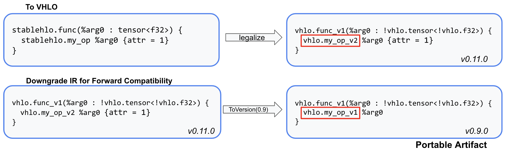
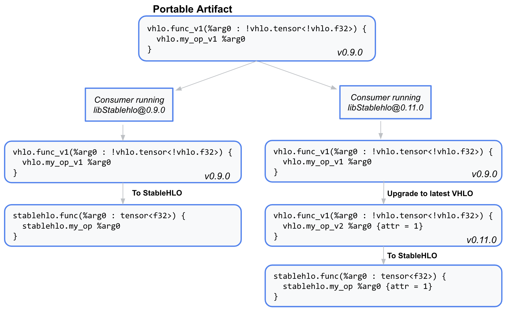

# The VHLO Dialect

## What is the VHLO Dialect?

The VHLO (Versioned StableHLO) Dialect is used for serialization and stability.
It provides a snapshot of the StableHLO dialect at a given point in time by
versioning individual program elements.

VHLO is an **add-only dialect** with **versioned ops, types, and attributes**,
which means that once a feature is added to the dialect, it cannot be modified
in any way that impact the semantics.

Any changes to an op, type, or attribute require a new version to be added to
the dialect. For example, if a hypothetical `my_op` was added to StableHLO in
0.9.0, but was changed in 0.11.0, we would have the following in VHLO:

```tablegen
// This represents the StableHLO version of the op from 0.9.0 -> 0.10.0
// Both the lower and the upper bound of versions are inclusive
def VHLO_MyOpV1 : VHLO_Op<"my_op_v1", "0.9.0", "0.10.0"> {
  let arguments = (ins
    VHLO_AnyType:$operand
  );
  let results = (outs VHLO_AnyType:$result);
}

// This represents the StableHLO version of the op from 0.11.0 -> current
def VHLO_MyOpV2 : VHLO_Op<"my_op_v2", "0.11.0", "current"> {
  let arguments = (ins
    VHLO_AnyType:$operand,
    VHLO_AnyAttr:$attr  // New attribute added to StableHLO in 0.11.0
  );
  let results = (outs VHLO_AnyType:$result);
}
```

The StableHLO dialect only has the latest version of the ops. In the running
example, the StableHLO dialect at v0.11.0 would only have the `StableHLO_MyOp`
that has `operand` and `attr`, while VHLO captures each phase of the op's
evolution.

## Why is VHLO useful?

Having a versioned dialect allows us to target previous versions of the
StableHLO opset. This encapsulates forward and backward compatibility in
conversions between ops in the VHLO dialect.

**Forward compatibility:** Forward compatibility is provided by converting
to VHLO and downgrading ops to a target version. If every op/type/attr in a
VHLO program can be downgraded to the target version, it is guaranteed to be
deserializable and convertable to StableHLO on a consumer running a version
greater than or equal to the target version, since VHLO has a snapshot of the
opset at that time.



This downgrade conversion will fail if ops or features that do not exist in the
previous version of the opset are used. This means that forward compatibility
is discovered on the producer, rather than at runtime.

**Backward compatibility:** Backward compatibility is provided by upgrading
VHLO ops to their latest version (if needed), then converting an op back to
StableHLO. All VHLO programs within the compatibility window are upgradable
to StableHLO, meaning different versions of consumers can deserialize the same
VHLO payload from a previous version.



More importantly, VHLO is abstracted behind serialization. This means that ML
frameworks (producers) only need to target StableHLO ops, and compiler
backends (consumers) only need to support the latest version, which is the
StableHLO op set. Conversions to and from VHLO are taken care of with machinery
maintained in the StableHLO repo.

## MLIR Bytecode Format Versions

In order to maintain forward compatibility, StableHLO versions have an
associated MLIR Bytecode Format version. Additionally, the latest version of
StableHLO will use the latest version of the MLIR Bytecode Format. When the
MLIR Bytecode Format version is incremented, the next release of StableHLO will
increment the minor version and update [Version.cpp](https://github.com/openxla/stablehlo/blob/main/stablehlo/dialect/Version.cpp#:~:text=getBytecodeVersion)
to use the latest MLIR Bytecode Format version.

For details on MLIR Bytecode Format and the rationale for using it in StableHLO,
see [bytecode.md](https://github.com/openxla/stablehlo/blob/main/docs/bytecode.md).

## Contributing Incompatible Changes

All changes with compatibility implications must go through the RFC process.
This includes adding, deprecating, or renaming a feature. Once the RFC is
approved, here are some contribution guidelines:

### Bump the Version Number in Version.h

Prior to updating VHLO ops, attribute, types, or conversions, increment the
minor version number in [Version.h](https://github.com/openxla/stablehlo/blob/main/stablehlo/dialect/Version.h).
Any new VHLO features added would use this bumped version, for example after
bumping `0.10.0 --> 0.11.0`, a new op in [VhloOps.td](https://github.com/openxla/stablehlo/blob/main/stablehlo/dialect/VhloOps.td)
would use:

```tablegen
VHLO_Op<"abs_v2", "0.11.0", "current">
```

### Add Required VHLO Implementation and Conversions

The exact code needed to integrate a new feature will vary, but for the most
part the following will need to change:

* For all changes:
  * Update the version log in [VhloDialect.td](https://github.com/openxla/stablehlo/blob/main/stablehlo/dialect/VhloDialect.td#L29)
* For new ops:
  * Add the op in [VhloOps.td](https://github.com/openxla/stablehlo/blob/main/stablehlo/dialect/VhloOps.td)
  * Add StableHLO → VHLO conversion in [StablehloLegalizeToVhlo.cpp](https://github.com/openxla/stablehlo/blob/main/stablehlo/transforms/StablehloLegalizeToVhlo.cpp)
  * Add VHLO → StableHLO conversion in [VhloLegalizeToStablehlo.cpp](https://github.com/openxla/stablehlo/blob/main/stablehlo/transforms/VhloLegalizeToStablehlo.cpp)
* For new versions of existing ops:
  * Add the op in [VhloOps.td](https://github.com/openxla/stablehlo/blob/main/stablehlo/dialect/VhloOps.td)
  * Update StableHLO to VHLO mapping in [MapStablehloToVhlo.h](https://github.com/openxla/stablehlo/blob/main/stablehlo/transforms/MapStablehloToVhlo.h)
  * Add a conversion between new and old op versions in [VhloToVersion.cpp](https://github.com/openxla/stablehlo/blob/main/stablehlo/transforms/VhloToVersion.cpp)
* For new types or attributes:
  * Add the type in [VhloTypes.td](https://github.com/openxla/stablehlo/blob/main/stablehlo/dialect/VhloTypes.td)
  or the attribute in [VhloAttrs.td](https://github.com/openxla/stablehlo/blob/main/stablehlo/dialect/VhloAttrs.td)
  * Add StableHLO → VHLO conversion in [StablehloLegalizeToVhlo.cpp](https://github.com/openxla/stablehlo/blob/main/stablehlo/transforms/StablehloLegalizeToVhlo.cpp)
  * Add VHLO → StableHLO conversion in [VhloLegalizeToStablehlo.cpp](https://github.com/openxla/stablehlo/blob/main/stablehlo/transforms/VhloLegalizeToStablehlo.cpp)

A recent example of a compatibility related submission was the addition of two
FP8 types, as well as their implementation in VHLO in [#1379](https://github.com/openxla/stablehlo/pull/1379).

### Add / Update Unit Tests

The contributor of an incompatible change is responsible for both positive and
negative unit tests of the feature, as well as compatibility unit tests.

Compatibility unit testing involves updating [stablehlo_legalize_to_vhlo.mlir](https://github.com/openxla/stablehlo/blob/main/stablehlo/tests/stablehlo_legalize_to_vhlo.mlir)
to ensure that StableHLO round trips with the latest version of VHLO, as well
as any additional forward or backward compatibility tests required.

A few examples:

* Backward compatibility, positive tests: [vhlo_to_version_upgrade.mlir](https://github.com/openxla/stablehlo/blob/6886b59f6cd4369674e7e3beff61301c145176e2/stablehlo/tests/vhlo_to_version_upgrade.mlir#L2)
* Forward compatibility, positive tests: [vhlo_to_version_downgrade.mlir](https://github.com/openxla/stablehlo/blob/6886b59f6cd4369674e7e3beff61301c145176e2/stablehlo/tests/vhlo_to_version_downgrade.mlir#L1)
* Forward compatibility, negative tests: [vhlo_to_version_downgrade_invalid.0_9_0.mlir](https://github.com/openxla/stablehlo/blob/main/stablehlo/tests/vhlo_to_version_downgrade_invalid.0_9_0.mlir)

### Add Versioned Serialization Test

After adding a test point to `stablehlo_legalize_to_vhlo.mlir`, create a
versioned copy of the file named `stablehlo_legalize_to_vhlo.0_X_0.mlir` as
follows, along with a bytecode version of said file with a `.0_X_0.mlir.bc`
extension. Add [proper FileCheck lines](https://github.com/openxla/stablehlo/blob/main/stablehlo/tests/stablehlo_legalize_to_vhlo.0_9_0.mlir#L1-L3)
for forward and backward compatibility testing.

```bash
$ export TARGET_VERSION=0_X_0
$ cp stablehlo/tests/stablehlo_legalize_to_vhlo.mlir stablehlo/tests/stablehlo_legalize_to_vhlo.$TARGET_VERSION.mlir
$ build/bin/stablehlo-translate --serialize stablehlo/tests/stablehlo_legalize_to_vhlo.$TARGET_VERSION.mlir --target=current --strip-debuginfo > stablehlo/tests/stablehlo_legalize_to_vhlo.$TARGET_VERSION.mlir.bc

# Replace RUN commands in stablehlo/tests/stablehlo_legalize_to_vhlo.0_X_0.mlir with the following for 0.X.0:
// RUN: stablehlo-opt --mlir-print-op-generic %s.bc | FileCheck %s
// RUN: stablehlo-translate --deserialize %s.bc | stablehlo-translate --serialize --target=0.X.0 | stablehlo-opt --mlir-print-op-generic | FileCheck %s
// RUN: diff <(stablehlo-translate --deserialize %s.bc | stablehlo-opt) <(stablehlo-opt --strip-debuginfo %s)
// RUN: diff %s.bc <(stablehlo-translate --serialize --target=0.X.0 --strip-debuginfo %s)
```

_Example of versioned test in [#1430](https://github.com/openxla/stablehlo/pull/1430)._
