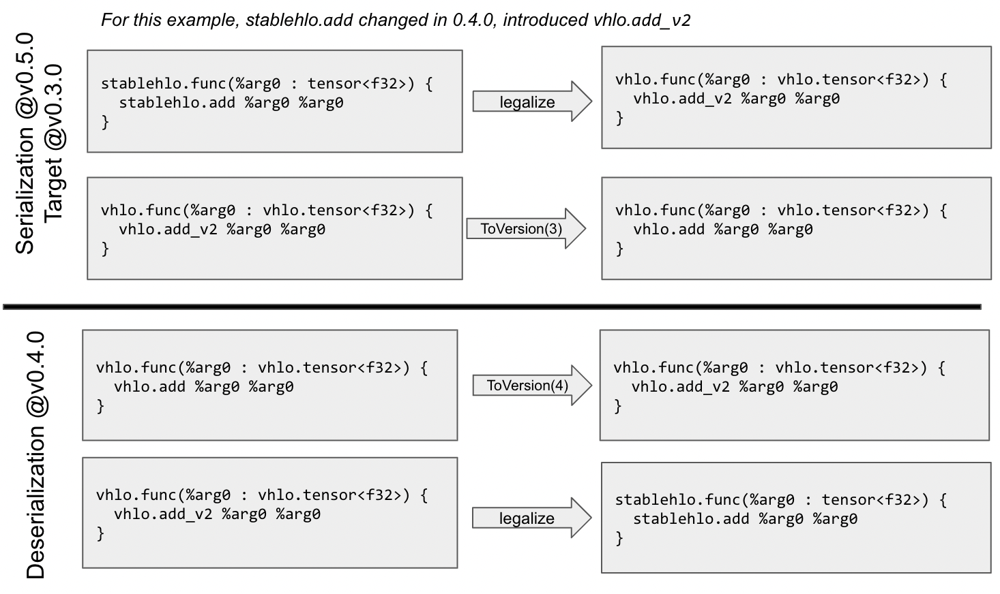

# StableHLO Compatibility RFC

Status: Approved 
Initial version: 9/12/2022 
Last updated: 12/13/2022

Based on discussions held over the past two months, and new use cases and
feedback left in comments on the first revision of this RFC, we propose the
following path forward for compatibility guarantees for StableHLO programs:

* Proposal 1: Add StableHLO forks of modularity ops, as well as builtin/quant
  types and attributes. Maintain conversion patterns to their upstream
  equivalents.
* Proposal 2: Use _Major.Minor.Patch_ versioning for StableHLO releases.
* Proposal 3: Provide forward / backward compatibility within a major release,
  with major releases spaced at least 5 years apart. Additionally provide
  backward compatibility for serialized artifacts across 1 major release.
* Proposal 4: Maintain a shallow versioned copy of StableHLO (VHLO) which is
  used for serialization/deserialization, and upgrade/downgrades. Keep the
  StableHLO opset at the latest version of VHLO.

## StableHLO Programs

For the purposes of compatibility guarantees, we define StableHLO programs as
programs that only include ops, attributes, and types from the StableHLO opset.
There will be several additions to the StableHLO opset to accomplish this goal
of providing a self-contained opset that satisfies current use cases.

These include:

* Modularity ops: `ModuleOp`, `FuncOp`, `CallOp`.
* Forks of types / attributes from Builtin and Quant dialect.
* Additional new ops, attributes and types may be proposed and added by the
  Dynamism RFC, Sparsity RFC or other RFCs in the future.

For all ops, attributes and types that are introduced in StableHLO but are not
present in MHLO, a legalization to/from upstream dialects will be maintained.
If incompatible changes are made upstream, legalization may fail, and the
mismatch will need to be handled separately by the user (i.e. the producer will
want to find a way to represent the upstream op in a different way using
existing StableHLO ops, and the consumer will want to handle the StableHLO op
directly).

**Proposal 1:** Add StableHLO forks of modularity ops, as well as builtin/quant
types and attributes. Maintain conversion patterns to their upstream
equivalents.

## StableHLO Versioning

StableHLO (opset, libStablehlo and serialization format) will version in
compliance with [semver](https://semver.org/) (Semantic Versioning 2.0.0), with
additions and modifications described in this section. Serialization format
will be described in a future Serialization RFC in Q4 2022.

**Major Version Bumps:** Backward incompatible changes will cause the major
version to be bumped. This includes removing ops, and other semantic changes
that prevent IR upgrades.

**Minor Version Bumps:** Backward compatible changes will bump the minor version
number. These changes may be forward compatible, depending on whether new
semantics are introduced. This includes feature additions and feature
renaming.

**Patch Version Bumps:** All other changes will bump the patch version. This
includes error message improvements, changing crashes into an error, doc
improvements that occur between releases, prettyprint enhancements, and
feature additions not related to the StableHLO opset such as new legalization
passes or tooling improvements.

**StableHLO Releases:** Commits will be tagged with a release number at least
once a week, and only after tests which verify compatibility have passed.
Users are only guaranteed compatibility if using a tagged commit. If a commit
is found to be broken, it will be flagged as invalid, and a patch release
will be tagged as soon as possible.

**Forward compatibility** will be provided at the serialization layer by
allowing clients to target previous releases when a program only uses
features compatible with a previous release. For example, if a program uses
features (ops, attributes and/or types) compatible with `v0.9.0+`, `v1.1.0+`
and `v1.2.0+`, then `v1.2.0` is the minimal version that the program is
compatible with.

**Proposal 2:** Use _Major.Minor.Patch_ versioning for StableHLO releases.

## Compatibility Guarantees

**(G1) Backward compatibility:** StableHLO provides backward compatibility
within major releases, i.e. StableHLO programs serialized by an old version
of libStablehlo have the same semantics* when deserialized by new versions of
libStablehlo within a major release. Additionally, any program serialized in
major version `N` can be deserialized in major version `N+1`. The same is not
true of serialization, as deprecated features in version `N+1` may prevent
the serialization of a program.

**(G2) Forward compatibility:** StableHLO provides forward compatibility within
major releases when possible, and an additional 1 month between major
releases, i.e. StableHLO programs serialized by a new version of libStablehlo
have the same semantics when deserialized by old versions of libStablehlo
within a major release, unless they are using new features introduced since
the old version.

**(G3) Source compatibility** for C, C++ and Python APIs within libStablehlo is
an aspirational goal. At the moment, we don't offer source compatibility
guarantees, but please let us know if this is an important use case for you,
and we can have a discussion about supporting it.

**(G4) Version 0.x.x:** There will be some stability guarantees while in major
version 0. There is not stability guaranteed within the major version, but we
will provide 1 month of forward and backward compatibility between minor
versions. This approach is chosen to allow dialect evolution and cleanup in
the early days, as well as refine compatibility procedures while meeting the
requirements of early adopters. Stability within major version will begin
with version `1.x.x` and will happen in 2023.

_\*StableHLO semantics is defined by the StableHLO specification and can be
tested using the StableHLO interpreter. Refer to the
[StableHLO Specification](https://github.com/openxla/stablehlo/blob/main/docs/spec.md)
for reference semantics._

**Proposal 3:** Provide forward / backward compatibility within a major release,
with major releases happening at least 5 years apart. Additionally provide
backward compatibility for serialized artifacts across 1 major release.

## What's not covered?

**Bugs:** We may make backward incompatible changes if the current
implementation is clearly broken, that is, if it contradicts the Operation's
spec.

**Unspecced features:** We may make backward incompatible changes to features
which haven't been specced (see
[StableHLO Specification](https://github.com/openxla/stablehlo/blob/main/docs/spec.md)).

**Numerical accuracy:** StableHLO has multiple ops that have
implementation-defined accuracy across consumers and even within the same
consumer across versions. As a result, StableHLO doesn't aim to make any
guarantees about numerical accuracy, although this may change in a future
RFC.

## Compatibility Implementation

### Upgrades and Downgrades

To improve the experience of producers and consumers, we will keep the StableHLO
dialect at the latest version of the opset, so that the dialect doesn't get
polluted with compatibility constructs, e.g. `FooV2Op` ops. Backward and
forward compatibility guarantees will be maintained via upgrade and downgrade
hooks correspondingly, which will be run during serialization and
deserialization as described below. Use cases requiring sending artifacts will
be able specify a target version for serialization, so that artifacts can be
shared and used on various versions of libStablehlo.

### The Versioned Dialect

The versioned dialect is a shallow versioned copy of the StableHLO dialect which
is used for upgrades, downgrades, and serialization/deserialization. Operations
in this dialect use versioned attributes and types, equivalent to the op they
are forked from, but do not have traits, custom verifiers, or prettyprinters,
and they are unchanged after addition to the dialect. Upgrades and downgrades
will be defined as conversion patterns on the versioned dialect. Serialization
and deserialization of StableHLO dialect will involve legalization to and from
the versioned dialect. Only the most recent version of an op is able to be
legalized to the StableHLO dialect.

The following demonstrates serialization on a `v0.5.0` producer that targets the
`v0.3.0` opset, and is deserialized on a `v0.4.0` consumer:

A new op is added to the versioned dialect at every bump in minor version number
to reflect the backward compatible change made. Additionally, if an attribute
or type used by an op is changed and requires a version bump, the op using it
will also require a new version. The process of upgrading/downgrading versioned
IR and legalizing to/from StableHLO must always succeed if compatibility
guarantees are applicable.

**Proposal 4:** Maintain a shallow versioned copy of StableHLO (VHLO) which is
used for serialization/deserialization, and upgrade/downgrades. Keep the
StableHLO opset at the latest version of VHLO.
