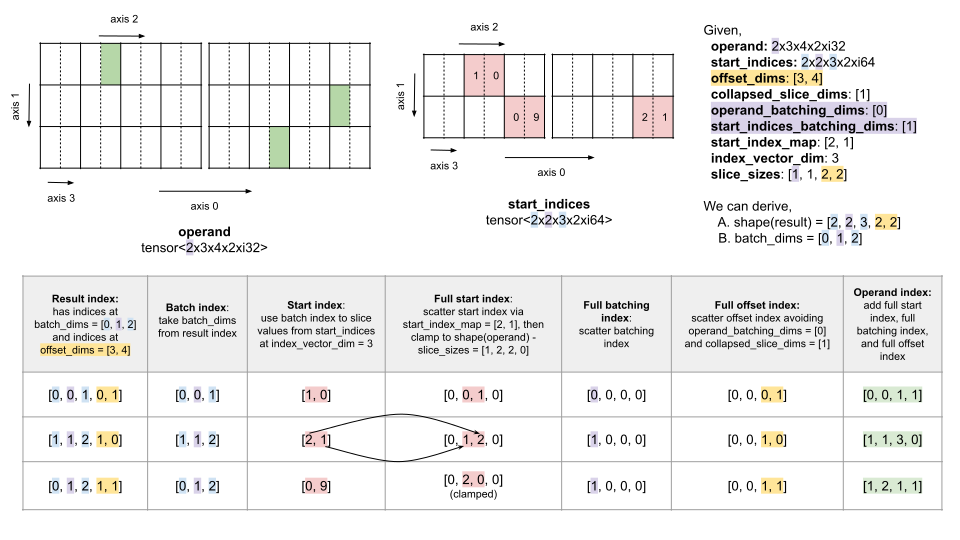
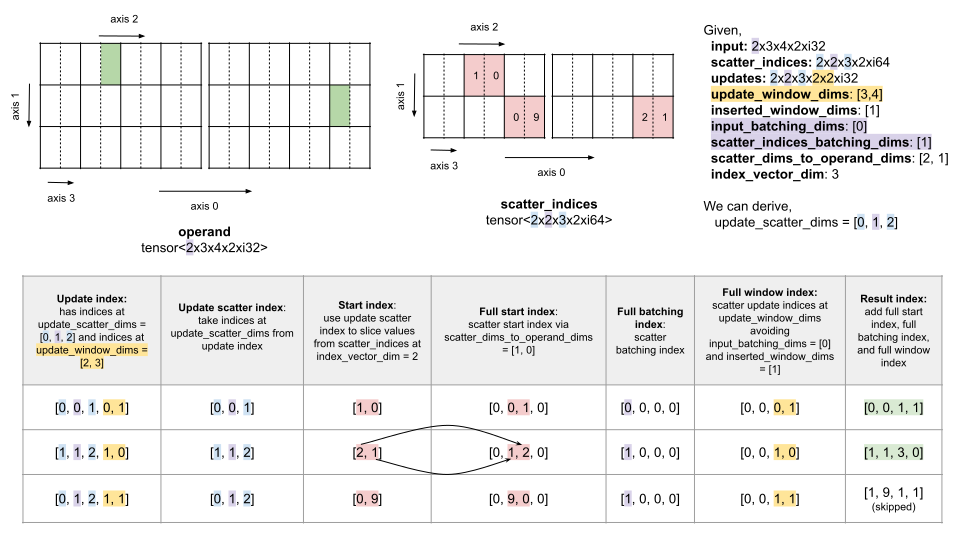

# [RFC] Add batching dims to `stablehlo.gather` and `stable.scatter` specification

Status: Approved<br/>
Initial version: 03/11/2024<br/>
Last updated: 03/11/2024<br/>
Discussion thread: TBD

## Overview

This RFC proposes adding `operand_batching_dims` and
`start_indices_batching_dims` attributes to `stablehlo.gather`.
`operand_batching_dims` refers to the dimensions of the `operand` that are
treated as batch. `start_indices_batching_dims` refers to the dimensions of the
`start_indices` that are treated as batch. The corresponding dimension sizes
must be equal. The semantics is equivalent to concatenating the outputs of the
gather with each slices of `operand` and `start_indices`.

Similarly, this RFC proposes adding `input_batching_dims` and
`scatter_indices_batching_dims` attributes to `stablehlo.scatter`.
`input_batching_dims` refers to the dimensions of each tensor in `inputs` that
are treated as batch. `scatter_indices_batching_dims` refers to the dimensions
of the `scatter_indices` that are treated as batch.

## Motivation

StableHLO gather and scatter ops currently have no way of specifying batch
dimensions that correspond between all operands and result, only the indices
tensor can have implicit batch dimensions that only exist in the
result/update tensor (`batch_dims` in specification).

This is important when the user wants a batched/vectorized version of
gather/scatter across all operands and result (e.g., when using [jax.vmap](https://jax.readthedocs.io/en/latest/_autosummary/jax.vmap.html)).

The current workaround is to use the implicit batch dimensions in the indices
tensor (all dimensions but `index_vector_dim`) with `stablehlo.concatenate` and
`stablehlo.iota` (and other ops like `stablehlo.clamp`) to mimic batch
dimensions in the operand.

This isn't ideal as it hides the fact that those are batch dimensions that
correspond between the operands and result tensors. This information is crucial
when doing sharding propagation between the operands and result tensors of the
gather/scatter op, where partitioning batch dimensions across tensors is
trivial, as they can be sharded in the same way with no communication needed.
The above workaround requires pattern matching to identify those batch
dimensions, which can be error prone and hard to maintain.

This proposal is inspired by `lhs_batching_dims` and `rhs_batching_dims` of
`stablehlo.dot_general`, which serve the same purpose.

## Compatibility

The new `stablehlo.gather` and `stablehlo.scatter` can be decomposed to the old
ops by applying the workaround above. For `stablehlo.gather` this would mean
making the `operand_batching_dims` as `collapsed_slice_dims` and
`start_indices_batching_dims` as implicit batch dimensions in `start_indices`,
by incrementing `index_vector_dim` by the size of `operand_batching_dims` (and
updating `start_index_map` accordingly), and concatenating an iota for each
batch dimension to the original `start_indices`.

In the backward compatibility window (assuming 6 months), the old ops being
loaded will automatically get an empty tensor for these added attributes.

## Alternatives considered

We could do the workaround above (using concatenated iota for the indices
tensor), but in addition mark the batch dimension in each tensor using an
unregistered attribute, so that the information won't be lost and partitioning
systems can use it to partition and propagate through these batch dimensions.
However, unregistered attributes can be discarded at any time and are harder to
maintain (e.g. if the iota is replaced by another op, who is responsible for
updating the unregistered attributes).

Another option is to start with `stablehlo.dynamic_slice` and
`stablehlo.dynamic_update_slice`, which are simpler ops that would suffice for a
lot of the use cases (but not all) that we've encountered. Currently
`stablehlo.gather` and `stable.scatter` are used to get a vectorized version of
`stablehlo.dynamic_slice` and `stablehlo.dynamic_update_slice` respectively.
However, for the same reason that they can be expressed by gather/scatter, we
propose to go with the more general solution, that would address all use cases.

## Naming

As indicated above, the proposed naming of the new attributes is inspired by
`lhs_batching_dims` and `rhs_batching_dims` of `stablehlo.dot_general`. Note
that the gather op specification already uses the term `batch_dims`
(`update_scatter_dims` for scatter op), to refer to all dimensions in the result
tensor that aren't offset dimensions, which have corresponding dimensions in the
start-indices tensor. The difference is that the proposed dimensions are
explicit batching dimensions that exist in all operands and result, whereas the
existing `batch_dims` are implicit batch dimensions (as they are derived by the
offset dimensions) that exist only in the start-indices and result tensors.

## Proposed Specification

### gather

#### Semantics

Gathers slices from `operand` tensor from offsets specified in `start_indices`
and produces a `result` tensor.

The following diagram shows how elements in `result` map on elements in
`operand` using a concrete example. The diagram picks a few example `result`
indices and explains in detail which `operand` indices they correspond to.



More formally, `result[result_index] = operand[operand_index]` where:

<!-- markdownlint-disable line-length -->
* `batch_dims = [d for d in axes(result) and d not in offset_dims]`.
* `batch_index = result_index[batch_dims...]`.
* `start_index` is defined as:
  * `start_indices[bi0, ..., :, ..., biN]` where `bi` are individual elements in
    `batch_index` and `:` is inserted at the `index_vector_dim` index, if
    `index_vector_dim` < `rank(start_indices)`.
  * `[start_indices[batch_index]]` otherwise.
* For `d_operand` in `axes(operand)`,
  * `full_start_index[d_operand] = clamp(start_index[d_start], 0,
    dim(operand, d_operand) - slice_sizes[d_operand])`
    if `d_operand = start_index_map[d_start]`.
  * `full_start_index[d_operand] = 0` otherwise.
* For `d_operand` in `axes(operand)`,
  * `full_batching_index[d_operand] =
    batch_index[d_start - (d_start < index_vector_dim ? 0 : 1)]`
    if `d_operand = operand_batching_dims[i_batching]` and
    `d_start = start_indices_batching_dims[i_batching]`.
  * `full_batching_index[d_operand] = 0` otherwise.
* `offset_index = result_index[offset_dims...]`.
* `full_offset_index = [oi0, ..., 0, ..., oiN]` where `oi` are individual
  elements in `offset_index`, and `0` is inserted at indices from
  `collapsed_slice_dims` and `operand_batching_dims`.
* `operand_index = full_start_index + full_batching_index + full_offset_index`.
<!-- markdownlint-enable line-length -->

If `indices_are_sorted` is `true` then the implementation can assume that
`start_indices` are sorted with respect to `start_index_map`, otherwise the
behavior is undefined. More formally, for all `i1 < i2` from `indices(result)`,
`full_start_index(i1) <= full_start_index(i2)`.

#### Inputs

| Label | Name                          | Type                                         | Constraints                                |
|-------|-------------------------------|----------------------------------------------|--------------------------------------------|
| (I1)  | `operand`                     | tensor or per-tensor quantized tensor        | (C1), (C8), (C11), (C17), (C19-C21), (C23) |
| (I2)  | `start_indices`               | tensor of integer type                       | (C2-C3), (C14), (C17), (C22)               |
| (I3)  | `offset_dims`                 | 1-dimensional tensor constant of type `si64` | (C1), (C4-C5), (C22)                       |
| (I4)  | `collapsed_slice_dims`        | 1-dimensional tensor constant of type `si64` | (C1), (C6-C9), (C22)                       |
| (I5)  | `operand_batching_dims`       | 1-dimensional tensor constant of type `si64` | (C1), (C6), (C10-C12), (C16-C18), (C22)    |
| (I6)  | `start_indices_batching_dims` | 1-dimensional tensor constant of type `si64` | (C13-C17)                                  |
| (I7)  | `start_index_map`             | 1-dimensional tensor constant of type `si64` | (C3), (C18-C19)                            |
| (I8)  | `index_vector_dim`            | constant of type `si64`                      | (C2-C3), (C15), (C22)                      |
| (I9)  | `slice_sizes`                 | 1-dimensional tensor constant of type `si64` | (C9), (C12), (C20-C22)                     |
| (I10) | `indices_are_sorted`          | constant of type `i1`                        |                                            |

#### Outputs

| Name     | Type                                  | Constraints     |
|----------|---------------------------------------|-----------------|
| `result` | tensor or per-tensor quantized tensor | (C5), (C22-C23) |

#### Constraints

* (C1) `rank(operand) = size(offset_dims) + size(collapsed_slice_dims) +
       size(operand_batching_dims)`.
* (C2) `0 <= index_vector_dim <= rank(start_indices)`.
* (C3) `size(start_index_map) =
       index_vector_dim < rank(start_indices) ?
       dim(start_indices, index_vector_dim) : 1`.
* (C4) `is_unique(offset_dims) and is_sorted(offset_dims)`.
* (C5) `0 <= offset_dims < rank(result)`.
* (C6) `is_unique(concatenate(collapsed_slice_dims, operand_batching_dims))`
* (C7) `is_sorted(collapsed_slice_dims)`.
* (C8) `0 <= collapsed_slice_dims < rank(operand)`.
* (C9) `slice_sizes[collapsed_slice_dims...] <= 1`.
* (C10) `is_sorted(operand_batching_dims)`.
* (C11) `0 <= operand_batching_dims < rank(operand)`.
* (C12) `slice_sizes[operand_batching_dims...] <= 1`.
* (C13) `is_unique(start_indices_batching_dims)`.
* (C14) `0 <= start_indices_batching_dims < rank(start_indices)`.
* (C15) `index_vector_dim not in start_indices_batching_dims`.
* (C16) `size(operand_batching_dims) == size(start_indices_batching_dims)`.
* (C17) `dim(operand, operand_batching_dims...) =
        dim(start_indices, start_indices_batching_dims...)`.
* (C18) `is_unique(concatenate(start_index_map, operand_batching_dims))`.
* (C19) `0 <= start_index_map < rank(operand)`.
* (C20) `size(slice_sizes) = rank(operand)`.
* (C21) `0 <= slice_sizes <= shape(operand)`.
* (C22) `shape(result) = combine(batch_dim_sizes, offset_dim_sizes)` where:
  * `batch_dim_sizes = shape(start_indices)` except that the dimension size
    of `start_indices` corresponding to `index_vector_dim` is not included.
  * `offset_dim_sizes = slice_sizes` except that the dimension sizes in
    `slice_sizes` corresponding to `collapsed_slice_dims` and
    `operand_batching_dims` are not included.
  * `combine` puts `batch_dim_sizes` at axes corresponding to `batch_dims` and
   `offset_dim_sizes` at axes corresponding to `offset_dims`.
* (C23) `element_type(operand) = element_type(result)`.

#### Examples

```mlir
// %operand: [
//            [
//             [[1, 2], [3, 4], [5, 6], [7, 8]],
//             [[9, 10],[11, 12], [13, 14], [15, 16]],
//             [[17, 18], [19, 20], [21, 22], [23, 24]]
//            ],
//            [
//             [[25, 26], [27, 28], [29, 30], [31, 32]],
//             [[33, 34], [35, 36], [37, 38], [39, 40]],
//             [[41, 42], [43, 44], [45, 46], [47, 48]]
//            ]
//           ]
// %start_indices: [
//                  [
//                   [[0, 0], [1, 0], [2, 1]],
//                   [[0, 1], [1, 1], [0, 9]]
//                  ],
//                  [
//                   [[0, 0], [2, 1], [2, 2]],
//                   [[1, 2], [0, 1], [1, 0]]
//                  ]
//                 ]
%result = "stablehlo.gather"(%operand, %start_indices) {
  dimension_numbers = #stablehlo.gather<
    offset_dims = [3, 4],
    collapsed_slice_dims = [1],
    operand_batching_dims = [0],
    start_indices_batching_dims = [1],
    start_index_map = [2, 1],
    index_vector_dim = 3>,
  slice_sizes = array<i64: 1, 1, 2, 2>,
  indices_are_sorted = false
} : (tensor<2x3x4x2xi32>, tensor<2x2x3x2xi64>) -> tensor<2x2x3x2x2xi32>
// %result: [
//           [
//            [
//             [[1, 2], [3, 4]],
//             [[3, 4], [5, 6]],
//             [[13, 14], [15, 16]]
//            ],
//            [
//             [[33, 34], [35, 36]],
//             [[35, 36], [37, 38]],
//             [[41, 42], [43, 44]]
//            ]
//           ],
//           [
//            [
//             [[1, 2], [3, 4]],
//             [[13, 14], [15, 16]],
//             [[21, 22], [23, 24]]
//            ],
//            [
//             [[43, 44], [45, 46]],
//             [[33, 34], [35, 36]],
//             [[27, 28], [29, 30]]
//            ]
//           ]
//          ]
```

&nbsp;[More Examples](../stablehlo/tests/interpret/gather.mlir)

### scatter

#### Semantics

Produces `results` tensors which are equal to `inputs` tensors except that
several slices specified by `scatter_indices` are updated with the values
`updates` using `update_computation`.

The following diagram shows how elements in `updates...` map on elements in
`results...` using a concrete example. The diagram picks a few example
`updates...` indices and explains in detail which `results...` indices they
correspond to.



More formally, for all `update_index` in `index_space(updates[0])`:

* `update_scatter_dims = [d for d in axes(updates[0]) and d not in
  update_window_dims]`.
* `update_scatter_index = update_index[update_scatter_dims...]`.
* `start_index` is defined as:
  * `scatter_indices[si0, ..., :, ..., siN]` where `si` are individual
      elements in `update_scatter_index` and `:` is inserted at the
      `index_vector_dim` index, if `index_vector_dim` <
      `rank(scatter_indices)`.
  * `[scatter_indices[update_scatter_index]]` otherwise.
* For `d_input` in `axes(inputs[0])`,
  * `full_start_index[d_input] = start_index[d_start]` if
    `d_input = scatter_dims_to_operand_dims[d_start]`.
  * `full_start_index[d_input] = 0` otherwise.
* For `d_input` in `axes(inputs[0])`,
  * `full_batching_index[d_input] =
    update_scatter_index[d_start - (d_start < index_vector_dim ? 0 : 1)]`
    if `d_input = input_batching_dims[i_batching]` and
    `d_start = scatter_indices_batching_dims[i_batching]`.
  * `full_batching_index[d_input] = 0` otherwise.
* `update_window_index = update_index[update_window_dims...]`.
* `full_window_index = [wi0, ..., 0, ..., wiN]` where `wi` are individual
  elements in `update_window_index`, and `0` is inserted at indices from
  `inserted_window_dims` and `input_batching_dims`.
* `result_index = full_start_index + full_batching_index + full_window_index`.

Given that, `results = exec(schedule, inputs)`, where:

* `schedule` is an implementation-defined permutation of
  `index_space(updates[0])`.
* `exec([update_index, ...], results) = exec([...], updated_results)` where:
  * If `result_index` is in bounds for `shape(results...)`
    * `updates_converted = to_destination_type(
      updates...[update_index], type(func_inputs(update_computation)
      [len(func_inputs(update_computation))//2:])... )`
    * `updated_values = update_computation(results...[result_index],
      updates_converted)`
    * `updated_results` is a copy of `results` with `results...[result_index]`
      set to `updated_values...`.
  * Otherwise
    * `updated_results = results`.
* `exec([], results) = results`.

If `indices_are_sorted` is `true` then the implementation can assume that
`scatter_indices` are sorted with respect to `scatter_dims_to_operand_dims`,
otherwise the behavior is undefined. More formally, for all `i1 < i2` from
`indices(result)`, `full_start_index(i1)` <= `full_start_index(i2)`.

If `unique_indices` is `true` then the implementation can assume that all
`result_index` indices being scattered to are unique. If `unique_indices` is
`true` but the indices being scattered to are not unique then the behavior is
undefined.

#### Inputs

| Label | Name                                  | Type                                                       | Constraints                                                |
|-------|---------------------------------------|------------------------------------------------------------|------------------------------------------------------------|
| (I1)  | `inputs`                              | variadic number of tensors or per-tensor quantized tensors | (C1), (C2), (C4-C6), (C11), (C13), (C18), (C21), (C23-C24) |
| (I2)  | `scatter_indices`                     | tensor of integer type                                     | (C4), (C15), (C19), (C22)                                  |
| (I3)  | `updates`                             | variadic number of tensors or per-tensor quantized tensors | (C3-C6), (C8)                                              |
| (I4)  | `update_window_dims`                  | 1-dimensional tensor constant of type `si64`               | (C2), (C4), (C7-C8)                                        |
| (I5)  | `inserted_window_dims`                | 1-dimensional tensor constant of type `si64`               | (C2), (C4), (C9-C11)                                       |
| (I6)  | `input_batching_dims`                 | 1-dimensional tensor constant of type `si64`               | (C2), (C4), (C9), (C12-13), (C17-18), (C20)                |
| (I7)  | `scatter_indices_batching_dims`       | 1-dimensional tensor constant of type `si64`               | (C14-C18)                                                  |
| (I8)  | `scatter_dims_to_operand_dims`        | 1-dimensional tensor constant of type `si64`               | (C19-C21)                                                  |
| (I9)  | `index_vector_dim`                    | constant of type `si64`                                    | (C4), (C16), (C19), (C22)                                  |
| (I10) | `indices_are_sorted`                  | constant of type `i1`                                      |                                                            |
| (I11) | `unique_indices`                      | constant of type `i1`                                      |                                                            |
| (I12) | `update_computation`                  | function                                                   | (C23)                                                      |

#### Outputs

| Name      | Type                                                       | Constraints |
|-----------|------------------------------------------------------------|-------------|
| `results` | variadic number of tensors or per-tensor quantized tensors | (C24-C25)   |

#### Constraints

* (C1) `same(shape(inputs...))`.
* (C2) `rank(inputs[0]) = size(update_window_dims) + size(inserted_window_dims)
       + size(input_batching_dims)`.
* (C3) `same(shape(updates...))`.
* (C4) `shape(updates[0]) = combine(update_scatter_dim_sizes,
       update_window_dim_sizes)` where:
  * `update_scatter_dim_sizes = shape(scatter_indices)` except that
    the dimension size of `scatter_indices` corresponding to
    `index_vector_dim` is not included.
  * `update_window_dim_sizes <= shape(inputs[0])` except that
    the dimension sizes in `inputs[0]` corresponding to `inserted_window_dims`
    and `input_batching_dims` are not included.
  * `combine` puts `update_scatter_dim_sizes` at axes corresponding to
   `update_scatter_dims` and `update_window_dim_sizes` at axes corresponding
   to `update_window_dims`.
* (C5) `0 < size(inputs) = size(updates) = N`.
* (C6) `element_type(updates...) = element_type(inputs...)`.
* (C7) `is_unique(update_window_dims) and is_sorted(update_window_dims)`.
* (C8) `0 <= update_window_dims < rank(updates[0])`.
* (C9) `is_unique(concatenate(inserted_window_dims, input_batching_dims))`
* (C10) `is_sorted(inserted_window_dims)`.
* (C11) `0 <= inserted_window_dims < rank(inputs[0])`.
* (C12) `is_sorted(input_batching_dims)`.
* (C13) `0 <= input_batching_dims < rank(inputs[0]))`.
* (C14) `is_unique(scatter_indices_batching_dims)`.
* (C15) `0 <= scatter_indices_batching_dims < rank(scatter_indices)`.
* (C16) `index_vector_dim not in scatter_indices_batching_dims`.
* (C17) `size(input_batching_dims) == size(scatter_indices_batching_dims)`.
* (C18) `dim(inputs[0], input_batching_dims...) =
        dim(scatter_indices, scatter_indices_batching_dims...)`.
* (C19) `size(scatter_dims_to_operand_dims) =
        index_vector_dim < rank(scatter_indices) ?
        dim(scatter_indices, index_vector_dim) : 1`.
* (C20) `is_unique(concatenate(scatter_dims_to_operand_dims,
        input_batching_dims))`.
* (C21) `0 <= scatter_dims_to_operand_dims < rank(inputs[0])`.
* (C22) `0 <= index_vector_dim <= rank(scatter_indices)`.
* (C23) `update_computation` has type `(tensor<E0>, ..., tensor<EN-1>,
  tensor<E0>, ..., tensor<EN-1>) -> (tensor<E0>, ..., tensor<EN-1>)`,
  where `is_promotable(element_type(inputs[i]), Ei)`.
* (C24) `shape(inputs...) = shape(results...)`.
* (C25) `element_type(results[i]) = Ei` for all `i` in `[0,N)`.

#### Examples

```mlir
// %input: [
//          [
//           [[1, 2], [3, 4], [5, 6], [7, 8]],
//           [[9, 10],[11, 12], [13, 14], [15, 16]],
//           [[17, 18], [19, 20], [21, 22], [23, 24]]
//          ],
//          [
//           [[25, 26], [27, 28], [29, 30], [31, 32]],
//           [[33, 34], [35, 36], [37, 38], [39, 40]],
//           [[41, 42], [43, 44], [45, 46], [47, 48]]
//          ]
//         ]
// %scatter_indices: [
//                    [
//                     [[0, 0], [1, 0], [2, 1]],
//                     [[0, 1], [1, 1], [0, 9]]
//                    ],
//                    [
//                     [[0, 0], [2, 1], [2, 2]],
//                     [[1, 2], [0, 1], [1, 0]]
//                    ]
//                   ]
// %update: [
//           [
//            [[1, 1], [1, 1], [1, 1]],
//            [[1, 1], [1, 1], [1, 1]]
//           ],
//           [
//            [[1, 1], [1, 1], [1, 1]],
//            [[1, 1], [1, 1], [1, 1]]
//           ]
//          ]
%result = "stablehlo.scatter"(%input, %scatter_indices, %update) ({
  ^bb0(%arg0: tensor<i64>, %arg1: tensor<i64>):
    %0 = "stablehlo.add"(%arg0, %arg1) : (tensor<i64>, tensor<i64>) -> tensor<i64>
    "stablehlo.return"(%0) : (tensor<i64>) -> ()
}) {
  scatter_dimension_numbers = #stablehlo.scatter<
    update_window_dims = [3, 4],
    inserted_window_dims = [1],
    input_batching_dims = [0],
    scatter_indices_batching_dims = [1],
    scatter_dims_to_operand_dims = [2, 1],
    index_vector_dim = 3>,
  indices_are_sorted = false,
  unique_indices = false
} : (tensor<2x3x4x2xi64>, tensor<2x2x3x2xi64>, tensor<2x2x3x2x2xi64>) -> tensor<2x3x4x2xi64>
// %result: [
//           [
//            [[3, 4], [6, 7], [6, 7], [7, 8]],
//            [[9, 10],[11, 12], [15, 16], [17, 18]],
//            [[17, 18], [19, 20], [22, 23], [24, 25]]
//           ],
//           [
//            [[25, 26], [28, 29], [30, 31], [31, 32]],
//            [[35, 36], [38, 39], [38, 39], [39, 40]],
//            [[41, 42], [44, 45], [46, 47], [47, 48]]
//           ]
//          ]
```

&nbsp;[More Examples](../stablehlo/tests/interpret/scatter.mlir)
